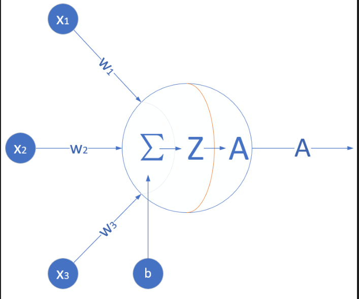

# step1

[TOC]

## 神经网络
 X输入：$(x_1,x_2,x_3)$ 是外界输入信号，一般是一个训练数据样本的多个属性

 W权重：$(w_1,w_2,w_3)$ 是每个输入信号的权重值

 B偏移：从生物学上解释，在脑神经细胞中，一定是输入信号的电平/电流大于某个临界值时，神经元细胞才会处于兴奋状态，这个 $b$ 实际就是那个临界值。
  

## 反向传播
 反向传播把损失值反向传给神经网络的每一层，让每一层都根据损失值反向调整权重
### 线性反向传播
从结果一层层往前寻找合适的输入和权重（求偏导），可固定一个求另一个。

## 梯度下降
 梯度下降是在损失函数基础上向着损失最小的点靠近而指引了网络权重调整的方向：

$$\theta_{n+1} = \theta_{n} - \eta \cdot \nabla J(\theta) \tag{1}$$

其中：

- $\theta_{n+1}$：下一个值；
- $\theta_n$：当前值；
- $-$：减号，梯度的反向；
- $\eta$：学习率或步长，控制每一步走的距离，不要太快以免错过了最佳景点，不要太慢以免时间太长；
- $\nabla$：梯度，函数当前位置的最快上升点；
- $J(\theta)$：函数。
  
## 损失函数
计算神经网络每次迭代的前向计算结果与真实的差距，从而指导下一次训练向正确的方向进行。
