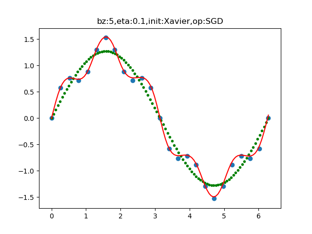
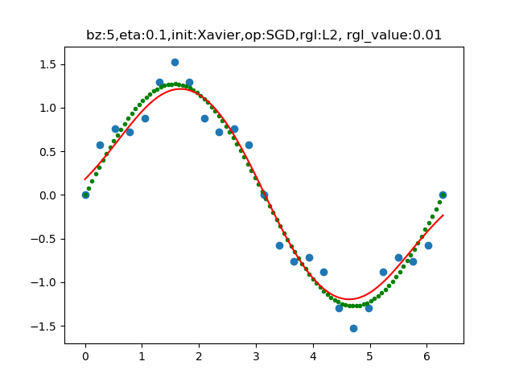
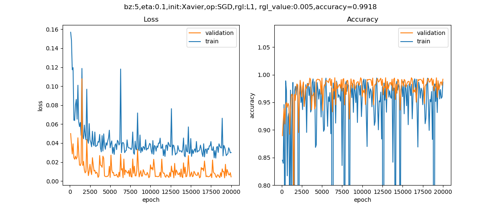
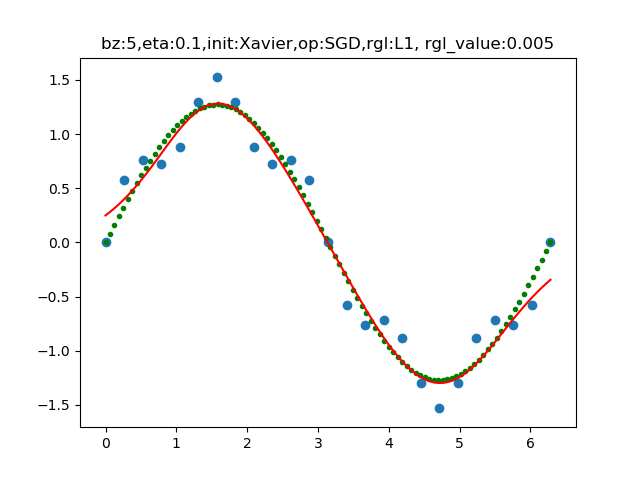

# # 人工智能第四次作业
## 学号：201809035   姓名：胡厚淮
### 一、 正则化
#### 1.1、过拟合
上图是回归任务中的三种情况，依次为：欠拟合、正确的拟合、过拟合。


上图是分类任务中的三种情况，依次为：分类欠妥、正确的分类、分类过度。由于分类可以看作是对分类边界的拟合，所以我们经常也统称其为拟合。

出现过拟合的原因：

1. 训练集的数量和模型的复杂度不匹配，样本数量级小于模型的参数
2. 训练集和测试集的特征分布不一致
3. 样本噪音大，使得神经网络学习到了噪音，正常样本的行为被抑制
4. 迭代次数过多，过分拟合了训练数据，包括噪音部分和一些非重要特征
#### 1.2、过拟合的例子一
MiniFramework搭建起下面这个模型：


这个模型的复杂度要比训练样本级大很多，所以可以重现过拟合的现象，当然还需要设置好合适的参数，代码片段如下：

```Python
def SetParameters():
    num_hidden = 16s
    max_epoch = 20000
    batch_size = 5
    learning_rate = 0.1
    eps = 1e-6
    
    hp = HyperParameters41(
        learning_rate, max_epoch, batch_size, eps,        
        net_type=NetType.Fitting,
        init_method=InitialMethod.Xavier, 
        optimizer_name=OptimizerName.SGD)

    return hp, num_hidden
```
损失函数值和精度值的变化曲线：


拟合情况：



#### 1.3、过拟合的例子二
这个网络有5个全连接层，前4个全连接层后接ReLU激活函数层，最后一个全连接层接Softmax分类函数做10分类。
如下代码所示：

```Python
def Net(dateReader, num_input, num_hidden, num_output, params):
    net = NeuralNet(params)

    fc1 = FcLayer(num_input, num_hidden, params)
    net.add_layer(fc1, "fc1")
    relu1 = ActivatorLayer(Relu())
    net.add_layer(relu1, "relu1")

    fc2 = FcLayer(num_hidden, num_hidden, params)
    net.add_layer(fc2, "fc2")
    relu2 = ActivatorLayer(Relu())
    net.add_layer(relu2, "relu2")

    fc3 = FcLayer(num_hidden, num_hidden, params)
    net.add_layer(fc3, "fc3")
    relu3 = ActivatorLayer(Relu())
    net.add_layer(relu3, "relu3")

    fc4 = FcLayer(num_hidden, num_hidden, params)
    net.add_layer(fc4, "fc4")
    relu4 = ActivatorLayer(Relu())
    net.add_layer(relu4, "relu4")

    fc5 = FcLayer(num_hidden, num_output, params)
    net.add_layer(fc5, "fc5")
    softmax = ActivatorLayer(Softmax())
    net.add_layer(softmax, "softmax")

    net.train(dataReader, checkpoint=1)
    
    net.ShowLossHistory()
```
在main过程中，设置一些超参数，然后调用刚才建立的Net进行训练：

```Python
if __name__ == '__main__':

    dataReader = LoadData()
    num_feature = dataReader.num_feature
    num_example = dataReader.num_example
    num_input = num_feature
    num_hidden = 30
    num_output = 10
    max_epoch = 200
    batch_size = 100
    learning_rate = 0.1
    eps = 1e-5

    params = CParameters(
      learning_rate, max_epoch, batch_size, eps,
      LossFunctionName.CrossEntropy3, 
      InitialMethod.Xavier, 
      OptimizerName.SGD)

    Net(dataReader, num_input, num_hidden, num_hidden, num_hidden, num_hidden, num_output, params)
```
运行结果：


结果说明：

1. 第199个epoch上（从0开始计数，所以实际是第200个epoch），训练集的损失为0.0015，准确率为100%。测试集损失值0.9956，准确率86%。过拟合线性很严重。
2. total weights abs sum = 1722.4706，实际上是把所有全连接层的权重值先取绝对值，再求和。这个值和下面三个值在后面会有比较说明。
3. total weights = 26520，一共26520个权重值，偏移值不算在内。
4. little weights = 2815，一共2815个权重值小于0.01。
5. zero weights = 27，是权重值中接近于0的数量（小于0.0001）。
6. 测试准确率为84.23%
   
### 二、 偏差与方差
#### 2.1、偏差-方差分解

|符号|含义|
|---|---|
|$x$|测试样本|
|$D$|数据集|
|$y$|x的真实标记|
|$y_D$|x在数据集中标记(可能有误差)|
|$f$|从数据集D学习的模型|
|$f_{x;D}$|从数据集D学习的模型对x的预测输出|
|$f_x$|模型f对x的期望预测输出|

学习算法期望的预测：
$$f_x=E[f_{x;D}] \tag{1}$$
不同的训练集/验证集产生的预测方差：
$$var(x)=E[(f_{x;D}-f_x)^2] \tag{2}$$
噪声：
$$\epsilon^2=E[(y_D-y)^2] \tag{3}$$
期望输出与真实标记的偏差：
$$bias^2(x)=(f_x-y)^2 \tag{4}$$
算法的期望泛化误差：
$$
\begin{aligned}
E(f;D)&=E[(f_{x;D}-y_D)^2] \\
&=E[(f_{x;D}-f_x+f_x-y_D)^2] \\
&=E[(f_{x;D}-f_x)^2]+E[(f_x-y_D)^2] \\
&+E[2(f_{x;D}-f_x)(f_x-y_D)](从公式1，此项为0) \\
&=E[(f_{x;D}-f_x)^2]+E[(f_x-y_D)^2] \\
&=E[(f_{x;D}-f_x)^2]+E[(f_x-y+y-y_D)^2] \\
&=E[(f_{x;D}-f_x)^2]+E[(f_x-y)^2]+E(y-y_D)^2] \\
&+E[2(f_x-y)(y-y_D)](噪声期望为0，所以此项为0)\\
&=E[(f_{x;D}-f_x)^2]+(f_x-y)^2+E[(y-y_D)^2] \\
&=var(x) + bias^2(x) + \epsilon^2
\end{aligned}
$$


在上图中，随着训练程度的增加，偏差（蓝色实线）一路下降，但是方差（蓝色虚线）一路上升，整体误差（红色实线，偏差+方差+噪音误差）呈U形，最佳平衡点就是U形的最低点。

#### 2.2、没有免费午餐定理

没有免费午餐定理（No Free Lunch Theorem，NFL）是由Wolpert和Macerday在最优化理论中提出的。没有免费午餐定理证明：对于基于迭代的最优化算法，不存在某种算法对所有问题（有限的搜索空间内）都有效。如果一个算法对某些问题有效，那么它一定在另外一些问题上比纯随机搜索算法更差。

还可以理解为在所有可能的数据生成分布上平均之后，每一个分类算法在未事先观测的点上都有相同的错误率。也就是说，不能脱离具体问题来谈论算法的优劣，任何算法都有局限性。必须要“具体问题具体分析”。
 
### 三、L2正则
#### 3.1、基本数学知识
#### 范数
范数的基本概念：

$$L_p = \lVert x \rVert_p = ({\sum^n_{i=1}\lvert x_i \rvert^p})^{1/p} \tag{1}$$

范数包含向量范数和矩阵范数，我们只关心向量范数。我们用具体的数值来理解范数。假设有一个向量a：

$$a=[1,-2,0,-4]$$

$$L_0=3 \tag{非0元素数}$$
$$L_1 = \sum^3_{i=0}\lvert x_i \rvert = 1+2+0+4=7 \tag{绝对值求和}$$
$$L_2 = \sqrt[2]{\sum^3_{i=0}\lvert x_i \rvert^2} =\sqrt[2]{21}=4.5826 \tag{平方和求方根}$$
$$L_{\infty}=4 \tag{最大值的绝对值}$$

注意p可以是小数，比如0.5：

$$L_{0.5}=19.7052$$

一个经典的关于P范数的变化图如下：


我们只关心L1和L2范数：
- L1范数是个菱形体，在平面上是一个菱形
- L2范数是个球体，在平面上是一个圆

#### 高斯分布

$$
f(x)={1 \over \sigma\sqrt{2 \pi}} exp{- {(x-\mu)^2} \over 2\sigma^2} \tag{2}
$$

#### 2、 L2正则化
假设：
- W参数服从高斯分布，即：$w_j \sim N(0,\tau^2)$
- Y服从高斯分布，即：$y_i \sim N(w^Tx_i,\sigma^2)$

贝叶斯最大后验估计：

$$
argmax_wL(w) = ln \prod_i^n {1 \over \sigma\sqrt{2 \pi}}exp(-(\frac{y_i-w^Tx_i}{\sigma})^2/2) \cdot \prod_j^m{\frac{1}{\tau\sqrt{2\pi}}exp(-(\frac{w_j}{\tau})^2/2)}
$$

$$
=-\frac{1}{2\sigma^2}\sum_i^n(y_i-w^Tx_i)^2-\frac{1}{2\tau^2}\sum_j^m{w_j^2}-n\ln\sigma\sqrt{2\pi}-m\ln \tau\sqrt{2\pi} \tag{3}
$$

因为$\sigma、b、n、\pi、m$等都是常数，所以损失函数J(w)的最小值可以简化为：

$$
argmin_wJ(w) = \sum_i^n(y_i-w^Tx_i)^2+\lambda\sum_j^m{w_j^2} \tag{4}
$$


#### 关于bias偏置项的正则

上面的L2正则化没有约束偏置（biases）项。当然，通过修改正则化过程来正则化偏置会很容易，但根据经验，这样做往往不能较明显地改变结果，所以是否正则化偏置项仅仅是一个习惯问题。

#### 3、损失函数的变化
在NeuralNet.py中的代码片段如下，计算公式5或公式6的第二项：

```Python
for i in range(self.layer_count-1,-1,-1):
    layer = self.layer_list[i]
    if isinstance(layer, FcLayer):
        if regularName == RegularMethod.L2:
            regular_cost += np.sum(np.square(layer.weights.W))

return regular_cost * self.params.lambd
```
如果是FC层，则取出W值的平方，再求和，最后乘以$\lambda$系数返回。

在计算Loss值时，用上面函数的返回值再除以样本数m，即下面代码中的train_y.shape[0]，附加到原始的loss值之后即可。下述代码就是对公式5或6的实现。

```Python
loss_train = self.lossFunc.CheckLoss(train_y, self.output)
loss_train += regular_cost / train_y.shape[0]
```
#### 4、反向传播的变化
FullConnectionLayer.py中的反向传播函数如下：

```Python
    def backward(self, delta_in, idx):
        dZ = delta_in
        m = self.x.shape[1]
        if self.regular == RegularMethod.L2:
            self.weights.dW = (np.dot(dZ, self.x.T) + self.lambd * self.weights.W) / m
        else:
            self.weights.dW = np.dot(dZ, self.x.T) / m
        # end if
        self.weights.dB = np.sum(dZ, axis=1, keepdims=True) / m

        delta_out = np.dot(self.weights.W.T, dZ)

        if len(self.input_shape) > 2:
            return delta_out.reshape(self.input_shape)
        else:
            return delta_out
```
当regular == RegularMethod.L2时，走一个特殊分支，完成正则项的惩罚机制。
#### 5、运行结果

```Python
from Level0_OverFitNet import *

if __name__ == '__main__':
    dr = LoadData()
    hp, num_hidden = SetParameters()
    hp.regular_name = RegularMethod.L2
    hp.regular_value = 0.01
    net = Model(dr, 1, num_hidden, 1, hp)
    ShowResult(net, dr, hp.toString())
```




### 四、L1正则
#### 4.1、基本数学知识
#### 拉普拉斯分布

$$f(x)=\frac{1}{2b}exp(-\frac{|x-\mu|}{b})$$
$$= \frac{1}{2b} \begin{cases} exp(\frac{x-\mu}{b}), & x \lt \mu \\ exp(\frac{\mu-x}{b}), & x \gt \mu \end{cases}$$


#### L0范数与L1范数

L0范数是指向量中非0的元素的个数。如果我们用L0范数来规则化一个参数矩阵W的话，就是希望W的大部分元素都是0，即让参数W是稀疏的。

L1范数是指向量中各个元素绝对值之和，也叫“稀疏规则算子”（Lasso regularization）。为什么L1范数会使权值稀疏？有人可能会这样给你回答“它是L0范数的最优凸近似”。实际上，还存在一个更美的回答：任何的规则化算子，如果他在$w_i=0$的地方不可微，并且可以分解为一个“求和”的形式，那么这个规则化算子就可以实现稀疏。w的L1范数是绝对值，所以$|w|$在$w=0$处是不可微。

#### 4.2、L1正则化
假设：
- W参数服从拉普拉斯分布，即$w_j \sim Laplace(0,b)$
- Y服从高斯分布，即$y_i \sim N(w^Tx_i,\sigma^2)$

贝叶斯最大后验估计：
$$
argmax_wL(w) = ln \prod_i^n {1 \over \sigma\sqrt{2 \pi}}exp(-\frac{1}{2}(\frac{y_i-w^Tx_i}{\sigma})^2) \cdot \prod_j^m{\frac{1}{2b}exp(-\frac{\lvert w_j \rvert}{b})}
$$
$$
=-\frac{1}{2\sigma^2}\sum_i^n(y_i-w^Tx_i)^2-\frac{1}{2b}\sum_j^m{\lvert w_j \rvert}-n\ln\sigma\sqrt{2\pi}-m\ln b\sqrt{2\pi} \tag{1}
$$

因为$\sigma、b、n、\pi、m$等都是常数，所以损失函数J(w)的最小值可以简化为：

$$
argmin_wJ(w) = \sum_i^n(y_i-w^Tx_i)^2+\lambda\sum_j^m{\lvert w_j \rvert} \tag{2}
$$

我们仍以两个参数为例，公式2的后半部分的正则形式为：

$$L_1 = \lvert w_1 \rvert + \lvert w_2 \rvert \tag{3}$$

因为$w_1、w_2$有可能是正数或者负数，我们令$x=|w_1|、y=|w_2|、c=L_1$，则公式3可以拆成以下4个公式的组合：

$$
y=-x+c \quad (当w_1 \gt 0, w_2 \gt 0时)
$$
$$
y=\quad x+c \quad (当w_1 \lt 0, w_2 \gt 0时)
$$
$$
y=\quad x-c \quad (当w_1 \gt 0, w_2 \lt 0时)
$$
$$
y=-x-c \quad (当w_1 \lt 0, w_2 \lt 0时)
$$

所以上述4个公式（4条直线）会组成一个二维平面上的一个菱形。

下图中三个菱形，是因为惩罚因子的数值不同而形成的，越大的话，菱形面积越小，惩罚越厉害。


#### 4.3、损失函数的变化
代码片段如下：

```Python
  regular_cost = 0
  for i in range(self.layer_count-1,-1,-1):
      layer = self.layer_list[i]
      if isinstance(layer, FcLayer):
          if regularName == RegularMethod.L1:
              regular_cost += np.sum(np.abs(layer.weights.W))
          elif regularName == RegularMethod.L2:
              regular_cost += np.sum(np.square(layer.weights.W))
      # end if
  # end for
  return regular_cost * self.params.lambd
```

可以看到L1部分的代码，先求绝对值，再求和。那个分母上的m是在下一段代码中处理的，因为在上一段代码中，没有任何样本数量的信息。

```Python
loss_train = self.lossFunc.CheckLoss(train_y, self.output)
loss_train += regular_cost / train_y.shape[0]
```
#### 4.4、反向传播的变化
我们可以修改FullConnectionLayer.py中的反向传播函数如下：

```Python
def backward(self, delta_in, idx):
    dZ = delta_in
    m = self.x.shape[1]
    if self.regular == RegularMethod.L2:
        self.weights.dW = (np.dot(dZ, self.x.T) + self.lambd * self.weights.W) / m
    elif self.regular == RegularMethod.L1:
        self.weights.dW = (np.dot(dZ, self.x.T) + self.lambd * np.sign(self.weights.W)) / m
    else:
        self.weights.dW = np.dot(dZ, self.x.T) / m
    # end if
    self.weights.dB = np.sum(dZ, axis=1, keepdims=True) / m
    ......
```
符号函数的效果如下：
```Python
>>> a=np.array([1,-1,2,0])
>>> np.sign(a)
>>> array([ 1, -1,  1,  0])
```
当w为正数时，符号为正，值为1，相当于直接乘以w的值；当w为负数时，符号为负，值为-1，相当于乘以(-w)的值。最后的效果就是乘以w的绝对值。
#### 4.5、运行结果

在主过程中，修改超参实例如下：
```Python
from Level0_OverFitNet import *

if __name__ == '__main__':
    dr = LoadData()
    hp, num_hidden = SetParameters()
    hp.regular_name = RegularMethod.L1
    hp.regular_value = 0.005
    net = Model(dr, 1, num_hidden, 1, hp)
    ShowResult(net, dr, hp.toString())
```

设置L1正则方法，系数为0.005。

<

从图上看，无论是损失函数值还是准确率，在训练集上都没有表现得那么夸张了，不会极高（到100%）或者极低（到0.001）。这说明过拟合的情况得到了抑制，而且准确率提高到了99.18%。



从输出结果分析：

1. 权重值的绝对值和等于391.26，远小于过拟合时的1719
2. 较小的权重值（小于0.01）的数量为22935个，远大于过拟合时的2810个
3. 趋近于0的权重值（小于0.0001）的数量为12384个，大于过拟合时的25个。
   
总结：

1. 特征选择(Feature Selection)：

    大家对稀疏规则化趋之若鹜的一个关键原因在于它能实现特征的自动选择。一般来说，x的大部分元素（也就是特征）都是和最终的输出y没有关系或者不提供任何信息的，在最小化目标函数的时候考虑x这些额外的特征，虽然可以获得更小的训练误差，但在预测新的样本时，这些没用的信息反而会被考虑，从而干扰了对正确y的预测。稀疏规则化算子的引入就是为了完成特征自动选择的光荣使命，它会学习地去掉这些没有信息的特征，也就是把这些特征对应的权重置为0。

2. 可解释性(Interpretability)：

    另一个青睐于稀疏的理由是，模型更容易解释。例如患某种病的概率是y，然后我们收集到的数据x是1000维的，也就是我们需要寻找这1000种因素到底是怎么影响患上这种病的概率的。假设我们这个是个回归模型：$y=w1*x1+w2*x2+…+w1000*x1000+b$（当然了，为了让y限定在[0,1]的范围，一般还得加个Logistic函数）。通过学习，如果最后学习到的w就只有很少的非零元素，例如只有5个非零的wi，那么我们就有理由相信，这些对应的特征在患病分析上面提供的信息是巨大的，决策性的。也就是说，患不患这种病只和这5个因素有关，那医生就好分析多了。但如果1000个wi都非0，医生面对这1000种因素,无法采取针对性治疗。
  
#### L1和L2的比较

|比较项|无正则项|L2|L1|
|---|---|---|---|
|代价函数|$J(w,b)$|$J(w,b)+\lambda \Vert w \Vert^2_2$|$J(w,b)+\lambda \Vert w \Vert_1$|
|梯度计算|$dw$|$dw+\lambda \cdot w/m$|$dw+\lambda \cdot sign(w)/m$|
|准确率|0.961|0.982|0.987||
|总参数数量|544|544|544|
|小值参数数量(<1e-2)|7|204|524|
|极小值参数数量(<1e-5)|0|196|492|
|第1层参数Norm1|8.66|6.84|4.09|
|第2层参数Norm1|104.26|34.44|6.38|
|第3层参数Norm1|97.74|18.96|6.73|
|第4层参数Norm1|9.03|4.22|4.41|
|第1层参数Norm2|2.31|1.71|1.71|
|第2层参数Norm2|6.81|2.15|2.23|
|第3层参数Norm2|5.51|2.45|2.81|
|第4层参数Norm2|2.78|2.13|2.59|
#### 五、卷积神经网络
#### 1、卷积神经网络
#### （1）卷积网络的典型结构
一个典型的卷积神经网络的结构如下图所示：


在一个典型的卷积神经网络中，会至少包含以下几个层：
- 卷积层
- 激活函数层
- 池化层
- 全连接分类层
   
#### (2)卷积核的作用
卷积核其实就是一个小矩阵，类似这样：

```
1.1  0.23  -0.45
0.1  -2.1   1.24
0.74 -1.32  0.01
```

这是一个3x3的卷积核，还会有1x1、5x5、7x7、9x9、11x11的卷积核。在卷积层中，我们会用输入数据与卷积核相乘，得到输出数据，就类似全连接层中的Weights一样，所以卷积核里的数值，也是通过反向传播的方法学习到的。

卷积核的具体作用：


上面的九张图，是使用9个不同的卷积核在同一张图上运算后得到的结果，而下面的表格中按顺序列出了9个卷积核的数值和名称，可以一一对应到上面的9张图中：

||1|2|3|
|---|---|---|---|
|1|0,-1, 0<br>-1, 5,-1<br>0,-1, 0|0, 0, 0 <br> -1, 2,-1 <br> 0, 0, 0]|1, 1, 1 <br> 1,-9, 1 <br> 1, 1, 1|
||sharpness|vertical edge|surround|
|2|-1,-2, -1 <br> 0, 0, 0<br>1, 2, 1|0, 0, 0 <br> 0, 1, 0 <br> 0, 0, 0|0,-1, 0 <br> 0, 2, 0 <br> 0,-1, 0|
||sobel y|nothing|horizontal edge|
|3|0.11,0.11,0.11 <br>0.11,0.11,0.11<br>0.11,0.11,0.11|-1, 0, 1 <br> -2, 0, 2 <br> -1, 0, 1|2, 0, 0 <br> 0,-1, 0 <br> 0, 0,-1|
||blur|sobel x|embossing|
9个卷积核的作用：

|序号|名称|说明|
|---|---|---|
|1|锐化|如果一个像素点比周围像素点亮，则此算子会令其更亮|
|2|检测竖边|检测出了十字线中的竖线，由于是左侧和右侧分别检查一次，所以得到两条颜色不一样的竖线|
|3|周边|把周边增强，把同色的区域变弱，形成大色块|
|4|Sobel-Y|纵向亮度差分可以检测出横边，与横边检测不同的是，它可以使得两条横线具有相同的颜色，具有分割线的效果|
|5|Identity|中心为1四周为0的过滤器，卷积后与原图相同|
|6|横边检测|检测出了十字线中的横线，由于是上侧和下侧分别检查一次，所以得到两条颜色不一样的横线|
|7|模糊|通过把周围的点做平均值计算而"杀富济贫"造成模糊效果|
|8|Sobel-X|横向亮度差分可以检测出竖边，与竖边检测不同的是，它可以使得两条竖线具有相同的颜色，具有分割线的效果|
|9|浮雕|形成大理石浮雕般的效果|
#### (3)卷积后续的运算
下图中的四个子图，依次展示了：
1. 原图
2. 卷积结果
3. 激活结果
4. 池化结果


1. 注意图一是原始图片，用cv2读取出来的图片，其顺序是反向的，即：
- 第一维是高度
- 第二维是宽度
- 第三维是彩色通道数，但是其顺序为BGR，而不是常用的RGB
2. 我们对原始图片使用了一个3x1x3x3的卷积核，因为原始图片为彩色图片，所以第一个维度是3，对应RGB三个彩色通道；我们希望只输出一张feature map，以便于说明，所以第二维是1；我们使用了3x3的卷积核，用的是sobel x算子。所以图二是卷积后的结果。
3. 图三做了一层Relu激活计算，把小于0的值都去掉了，只留下了一些边的特征。
4. 图四是图三的四分之一大小，虽然图片缩小了，但是特征都没有丢失，反而因为图像尺寸变小而变得密集，亮点的密度要比图三大而粗。

### 六、卷积的前向计算
#### 1、卷积的前向计算原理
#### （1）单入多出的升维卷积

原始输入是一维的图片，但是我们可以用多个卷积核分别对其计算，从而得到多个特征输出。如下图所示：


一张4x4的图片，用两个卷积核并行地处理，输出为2个2x2的图片。在训练过程中，这两个卷积核会完成不同的特征学习。

#### （2）多入单出的降维卷积

一张图片，通常是彩色的，具有红绿蓝三个通道。我们可以有两个选择来处理：


1. 变成灰度的，每个像素只剩下一个值，就可以用二维卷积
2. 对于三个通道，每个通道都使用一个卷积核，分别处理红绿蓝三种颜色的信息

显然第2种方法可以从图中学习到更多的特征，于是出现了三维卷积，即有三个卷积核分别对应书的三个通道，三个子核的尺寸是一样的，比如都是2x2，这样的话，这三个卷积核就是一个3x2x2的立体核，称为过滤器Filter，所以称为三维卷积。


在上图中，每一个卷积核对应着左侧相同颜色的输入通道，三个过滤器的值并不一定相同。对三个通道各自做卷积后，得到右侧的三张特征图，然后在按照原始值不加权地相加在一起，得到最右侧的黑色特征图，这张图里面已经把三种颜色的特征混在一起了，所以画成了黑色。

虽然输入图片是多个通道的，或者说是三维的，但是在相同数量的过滤器的计算后，相加在一起的结果是一个通道，即2维数据，所以称为降维。这当然简化了对多通道数据的计算难度，但同时也会损失多通道数据自带的颜色信息。

#### （3）多入多出的同维卷积

在上面的例子中，是一个过滤器Filter内含三个卷积核Kernal。我们假设有一个彩色图片为3x3的，如果有两组3x2x2的卷积核的话，会做什么样的卷积计算？看下图：


第一个过滤器Filter-1为棕色所示，它有三卷积核(Kernal)，命名为Kernal-1，Keanrl-2，Kernal-3，分别在红绿蓝三个输入通道上进行卷积操作，生成三个2x2的输出Feature-1,n。然后三个Feature-1,n相加，并再加上b1偏移值，形成最后的棕色输出Result-1。

对于灰色的过滤器Filter-2也是一样，先生成三个Feature-2,n，然后相加再加b2，最后得到Result-2。

之所以Feature-m,n还用红绿蓝三色表示，是因为在此时，它们还保留着红绿蓝三种色彩的各自的信息，一旦相加后得到Result，这种信息就丢失了。
#### （4）步长 stride

前面的例子中，每次计算后，卷积核会向右或者向下移动一个单元，即步长stride = 1。而在下面这个卷积操作中，卷积核每次向右或向下移动两个单元，即stride = 2。


在后续的步骤中，由于每次移动两格，所以最终得到一个2x2的图片。

#### （5）填充 padding

如果原始图为4x4，用3x3的卷积核进行卷积后，目标图片变成了2x2。如果我们想保持目标图片和原始图片为同样大小，该怎么办呢？一般我们会向原始图片周围填充一圈0，然后再做卷积。如下图：


#### （6） 输出结果

综合以上所有情况，可以得到卷积后的输出图片的大小的公式：

$$
H_{Output}= {H_{Input} - H_{Kernal} + 2Padding \over Stride} + 1
$$

$$
W_{Output}= {W_{Input} - W_{Kernal} + 2Padding \over Stride} + 1
$$
###  七、卷积前向计算代码实现
#### 1、卷积核的实现

```Python
class ConvWeightsBias(WeightsBias_2_1):
    def __init__(self, output_c, input_c, filter_h, filter_w, init_method, optimizer_name, eta):
        self.FilterCount = output_c
        self.KernalCount = input_c
        self.KernalHeight = filter_h
        self.KernalWidth = filter_w
        ...

    def Initialize(self, folder, name, create_new):
        self.WBShape = (self.FilterCount, self.KernalCount, self.KernalHeight, self.KernalWidth)        
        ...

    def CreateNew(self):
        self.W = ConvWeightsBias.InitialConvParameters(self.WBShape, self.init_method)
        self.B = np.zeros((self.FilterCount, 1))
...
```


#### 2、 前向前向运算实现的3种方法
 - 方法1
  ```Python
class ConvLayer(CLayer):
    def forward(self, x, train=True):
        self.x = x
        self.batch_size = self.x.shape[0]
        # 如果有必要的话，先对输入矩阵做padding
        if self.padding > 0:
            self.padded = np.pad(...)
        else:
            self.padded = self.x
        #end if
        self.z = conv_4d(...)
        return self.z
```
- 方法2
```Python
    # dry run
    output2 = jit_conv_4d(x, wb.W, wb.B, output_height, output_width, stride)
    # run
    s2 = time.time()
    for i in range(10):
        output2 = jit_conv_4d(x, wb.W, wb.B, output_height, output_width, stride)
    e2 = time.time()
    print("Time used for Numba:", e2 - s2)
```
- 方法3

```Python
    def forward_img2col(self, x, train=True):
        self.x = x
        self.batch_size = self.x.shape[0]
        assert(self.x.shape == (self.batch_size, self.InC, self.InH, self.InW))
        self.col_x = img2col(x, self.FH, self.FW, self.stride, self.padding)
        self.col_w = self.WB.W.reshape(self.OutC, -1).T
        self.col_b = self.WB.B.reshape(-1, self.OutC)
        out1 = np.dot(self.col_x, self.col_w) + self.col_b
        out2 = out1.reshape(batch_size, self.OutH, self.OutW, -1)
        self.z = np.transpose(out2, axes=(0, 3, 1, 2))
        return self.z
```
### 八、卷积的反向传播原理
#### 1、计算反向传播的梯度矩阵

正向公式：

$$Z = W*A+b \tag{0}$$

其中，W是卷积核，*表示卷积（互相关）计算，A为当前层的输入项，b是偏移（未在图中画出），Z为当前层的输出项，但尚未经过激活函数处理。
#### 2、有多个卷积核时的梯度计算

有多个卷积核也就意味着有多个输出通道。


#### 3、有多个输入时的梯度计算

当输入层是多个图层时，每个图层必须对应一个卷积核，如下图：


#### 4、权重（卷积核）梯度计算


要求J对w11的梯度，从正向公式可以看到，w11对所有的z都有贡献，所以：

$$
\frac{\partial J}{\partial w_{11}} = \frac{\partial J}{\partial z_{11}}\frac{\partial z_{11}}{\partial w_{11}} + \frac{\partial J}{\partial z_{12}}\frac{\partial z_{12}}{\partial w_{11}} + \frac{\partial J}{\partial z_{21}}\frac{\partial z_{21}}{\partial w_{11}} + \frac{\partial J}{\partial z_{22}}\frac{\partial z_{22}}{\partial w_{11}}
$$
$$
=\delta_{z11} \cdot a_{11} + \delta_{z12} \cdot a_{12} + \delta_{z21} \cdot a_{21} + \delta_{z22} \cdot a_{22} \tag{9}
$$

对W22也是一样的：

$$
\frac{\partial J}{\partial w_{12}} = \frac{\partial J}{\partial z_{11}}\frac{\partial z_{11}}{\partial w_{12}} + \frac{\partial J}{\partial z_{12}}\frac{\partial z_{12}}{\partial w_{12}} + \frac{\partial J}{\partial z_{21}}\frac{\partial z_{21}}{\partial w_{12}} + \frac{\partial J}{\partial z_{22}}\frac{\partial z_{22}}{\partial w_{12}}
$$
$$
=\delta_{z11} \cdot a_{12} + \delta_{z12} \cdot a_{13} + \delta_{z21} \cdot a_{22} + \delta_{z22} \cdot a_{23} \tag{10}
$$
#### 5、计算卷积核梯度的实例
训练部分的代码实现如下：

```Python
def train(x, w, b, y):
    output = create_zero_array(x, w)
    for i in range(10000):
        # forward
        jit_conv_2d(x, w, b, output)
        # loss
        t1 = (output - y)
        m = t1.shape[0]*t1.shape[1]
        LOSS = np.multiply(t1, t1)
        loss = np.sum(LOSS)/2/m
        print(i,loss)
        if loss < 1e-7:
            break
        # delta
        delta = output - y
        # backward
        dw = np.zeros(w.shape)
        jit_conv_2d(x, delta, b, dw)
        w = w - 0.5 * dw/m
    #end for
    return w
```

一共迭代10000次：
1. 用jit_conv_2d(x,w...)做一次前向计算
2. 计算loss值以便检测停止条件，当loss值小于1e-7时停止迭代
3. 然后计算delta值
4. 再用jit_conv_2d(x,delta)做一次反向计算，得到w的梯度
5. 最后更新卷积核w的值

主过程如下：

```Python
if __name__ == '__main__':
    # 创建样本数据
    x, w_true, y = create_sample_image()
    # 随机初始化卷积核
    w_init = np.random.normal(0, 0.1, w_true.shape)
    # 训练
    w_result = train(x,w_init,0,y)
    # 打印比较真实卷积核值和训练出来的卷积核值
    print("w_true:\n", w_true)
    print("w_result:\n", w_result)
    # 用训练出来的卷积核值对原始图片进行卷积
    y_hat = np.zeros(y.shape)
    jit_conv_2d(x, w_true, 0, y_hat)
    # 与真实的卷积核的卷积结果比较
    show_result(x, w_true, w_result)
    # 比较卷积核值的差异核卷积结果的差异
    print("w allclose:", np.allclose(w_true, w_result, atol=1e-2))
    print("y allclose:", np.allclose(y, y_hat, atol=1e-2))
```

运行结果：

```
......
3458 1.0063169744079507e-07
3459 1.0031151142628902e-07
3460 9.999234418532805e-08
w_true:
 [[ 0 -1  0]
 [ 0  2  0]
 [ 0 -1  0]]
w_result:
 [[-1.86879237e-03 -9.97261724e-01 -1.01212359e-03]
 [ 2.58961697e-03  1.99494606e+00  2.74435794e-03]
 [-8.67754199e-04 -9.97404263e-01 -1.87580756e-03]]
w allclose: True
y allclose: True
```
### 九、卷积反向传播代码实现
- 方法1
```Python
    def backward_numba(self, delta_in, flag):
        # 如果正向计算中的stride不是1，转换成是1的等价误差数组
        dz_stride_1 = expand_delta_map(delta_in, ...)
        # 计算本层的权重矩阵的梯度
        self._calculate_weightsbias_grad(dz_stride_1)
        # 由于输出误差矩阵的尺寸必须与本层的输入数据的尺寸一致，所以必须根据卷积核的尺寸，调整本层的输入误差矩阵的尺寸
        (pad_h, pad_w) = calculate_padding_size(...)
        dz_padded = np.pad(dz_stride_1, ...)
        # 计算本层输出到下一层的误差矩阵
        delta_out = self._calculate_delta_out(dz_padded, flag)
        #return delta_out
        return delta_out, self.WB.dW, self.WB.dB

    # 用输入数据乘以回传入的误差矩阵,得到卷积核的梯度矩阵
    def _calculate_weightsbias_grad(self, dz):
        self.WB.ClearGrads()
        # 先把输入矩阵扩大，周边加0
        (pad_h, pad_w) = calculate_padding_size(...)
        input_padded = np.pad(self.x, ...)
        # 输入矩阵与误差矩阵卷积得到权重梯度矩阵
        (self.WB.dW, self.WB.dB) = calcalate_weights_grad(...)
        self.WB.MeanGrads(self.batch_size)

    # 用输入误差矩阵乘以（旋转180度后的）卷积核
    def _calculate_delta_out(self, dz, layer_idx):
        if layer_idx == 0:
            return None
        # 旋转卷积核180度
        rot_weights = self.WB.Rotate180()
        # 定义输出矩阵形状
        delta_out = np.zeros(self.x.shape)
        # 输入梯度矩阵卷积旋转后的卷积核，得到输出梯度矩阵
        delta_out = calculate_delta_out(dz, ..., delta_out)

        return delta_out
```
- 方法2
```Python
    def backward_col2img(self, delta_in, layer_idx):
        OutC, InC, FH, FW = self.WB.W.shape
        # 误差矩阵变换
        delta_in_2d = np.transpose(delta_in, axes=(0,2,3,1)).reshape(-1, OutC)
        # 计算Bias的梯度
        self.WB.dB = np.sum(delta_in_2d, axis=0, keepdims=True).T / self.batch_size
        # 计算Weights的梯度
        dW = np.dot(self.col_x.T, delta_in_2d) / self.batch_size
        # 转换成卷积核的原始形状
        self.WB.dW = np.transpose(dW, axes=(1, 0)).reshape(OutC, InC, FH, FW)# 计算反向传播误差矩阵
        dcol = np.dot(delta_in_2d, self.col_w.T)
        # 转换成与输入数据x相同的形状
        delta_out = col2img(dcol, self.x.shape, FH, FW, self.stride, self.padding)
        return delta_out, self.WB.dW, self.WB.dB
```
### 十、学习小结
这次课我们学习的是正则化的相关知识，即Regularization，它是用于防止过拟合的。回归任务中的三种情况，依次为：欠拟合、正确的拟合、过拟合，正是由于遇到这些情况，所以需要进行正则化的应用。另外，我们有学习了L2、L1正则化，L2范数是指向量各元素的平方和然后求平方根，L1范数是指向量中各个元素绝对值之和，也叫“稀疏规则算子”（Lasso regularization）。这两个正则化对于解决拟合问题有很大的帮助，通过学习具体原理，我发现理论推导还是来自数学的知识，所以我自己觉得绝大多数算法都有数学知识的支撑，可见数学的重要性。
后面我们学习了卷积的前向计算、卷积的反向传播、池化的前向计算与反向传播，并用代码实现一个卷积网络并训练一些实际数据。另外，我在课下着重了解了CNN在计算机视觉方面的应用，我发现CNN现在在Computer Vision中有着举足轻重的地位。
卷积神经网络（CNN），是深度学习算法应用最成功的领域之一，卷积网络在本质上是一种输入到输出的映射，它能够学习大量的输入与输出之间的映射关系，而不需要任何输入和输出之间的精确的数学表达式，只要用已知的模式对卷积网络加以训练，网络就具有输入输出对之间的映射能力。通过老师讲解及网络查询，我对CNN有了更深更透彻的理解，目前计算机视觉是一个大热点，提前学习相关理论对我今后的发展及提升有很大的帮助。

### 十一、学习体会
学习是一个循序渐进的过程，要重点理解原理通过数学的思维去理解模型的结构和意义。理论要通过实践去强化，对每个知识的学习首先要有自己的理解然后慢慢的向官方思维靠近。