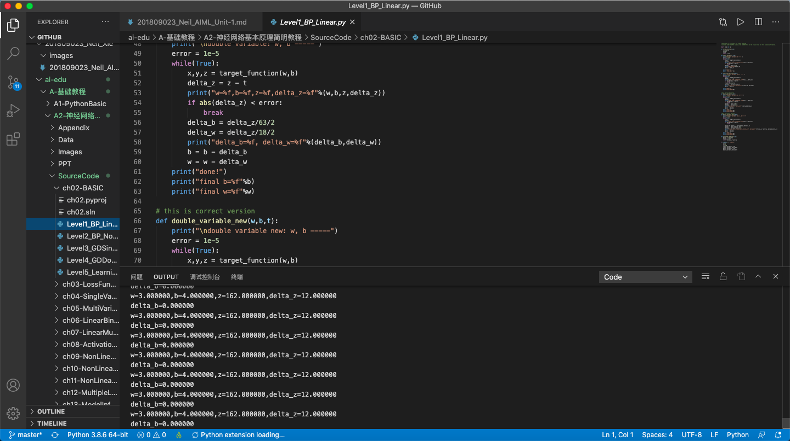
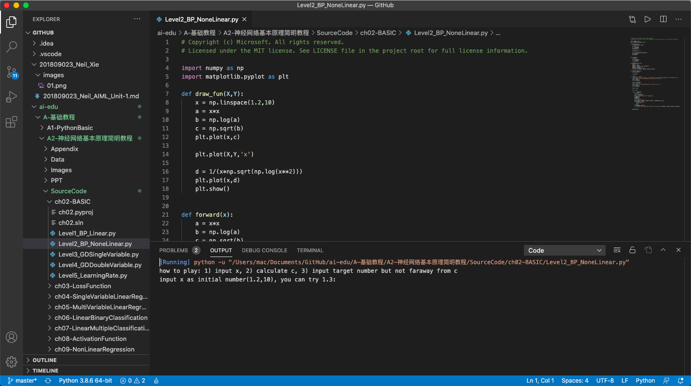
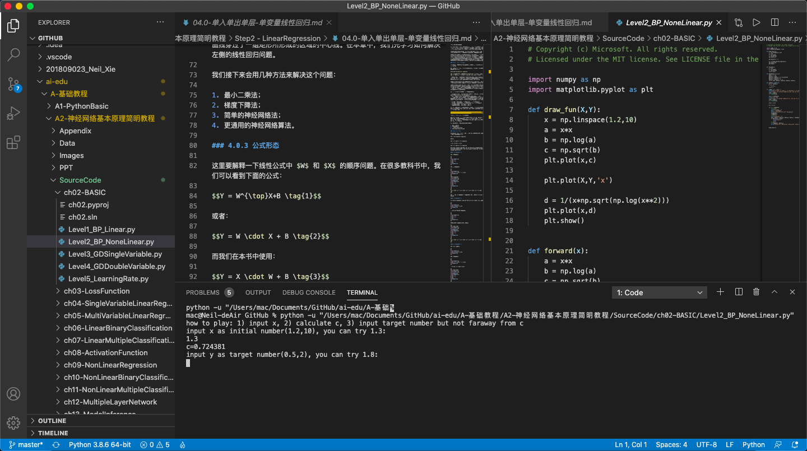
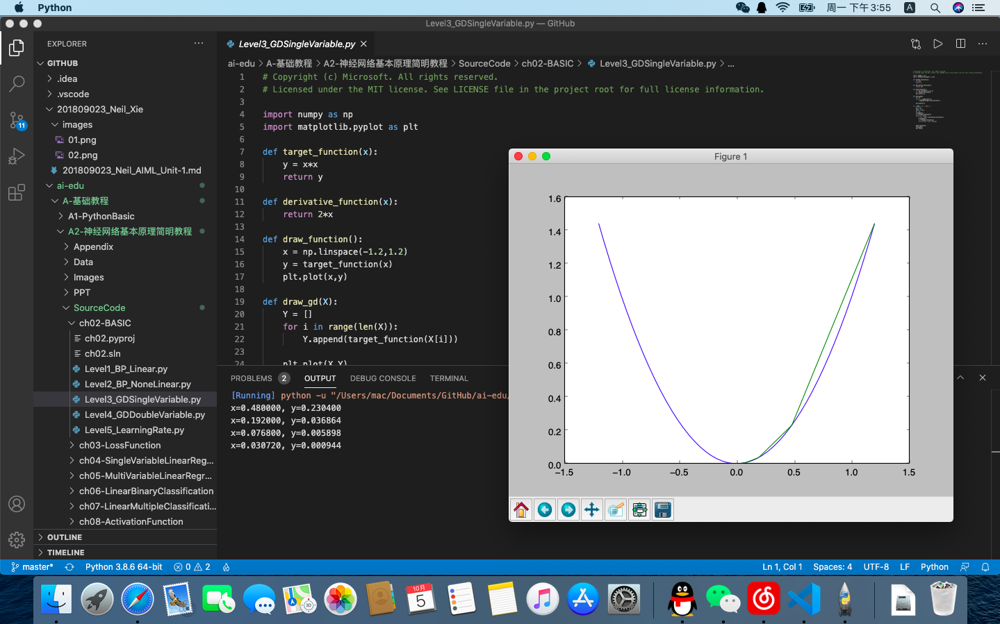
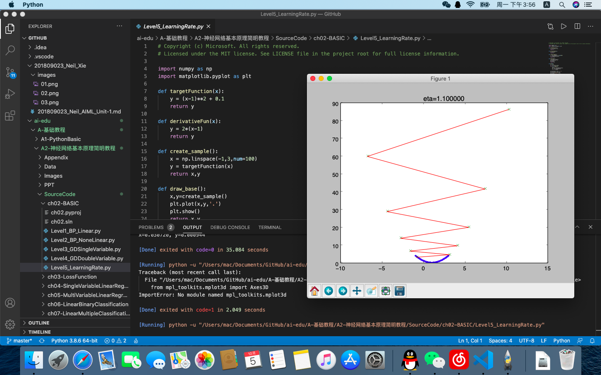
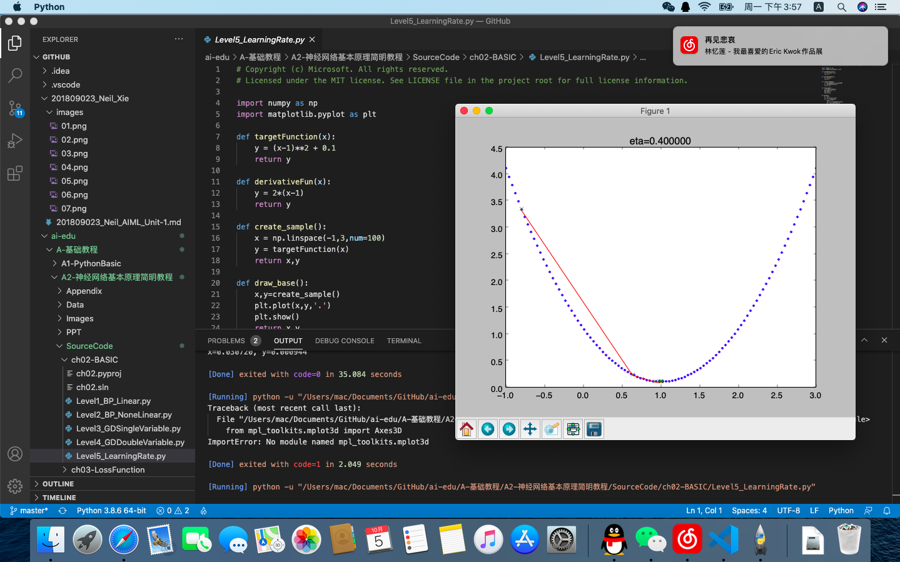
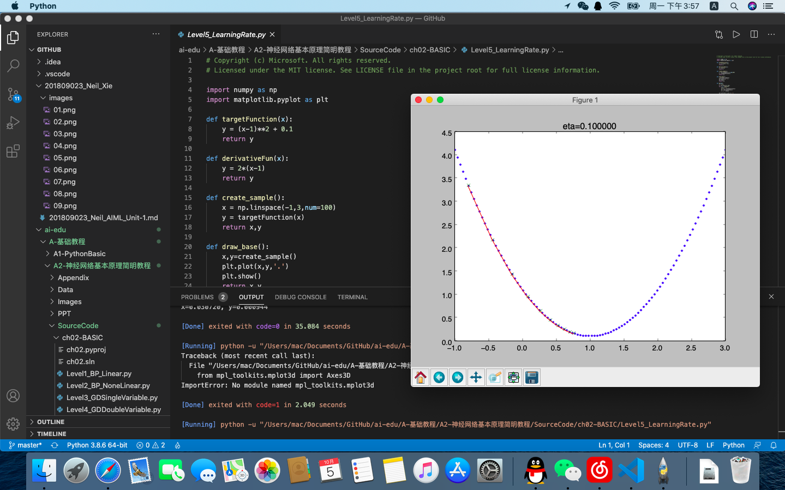

# 第一章学习笔记

### 神经网络的基本工作原理

神经网络由基本的神经元组成，

#### 输入 input

$(x_1,x_2,x_3)$ 是外界输入信号，一般是一个训练数据样本的多个属性。

#### 权重 weights

$(w_1,w_2,w_3)$ 是每个输入信号的权重值。当然权重值相加之后可以不是 $1$。

#### 求和计算 sum

$$
\begin{aligned}
Z &= w_1 \cdot x_1 + w_2 \cdot x_2 + w_3 \cdot x_3 + b \\\\
&= \sum_{i=1}^m(w_i \cdot x_i) + b
\end{aligned}
$$

在上面的例子中 $m=3$。我们把$w_i \cdot x_i$变成矩阵运算的话，就变成了：

$$Z = W \cdot X + b$$

#### 激活函数 activation

求和之后，神经细胞已经处于兴奋状态了，已经决定要向下一个神经元传递信号了，但是要传递多强烈的信号，要由激活函数来确定：

$$A=\sigma{(Z)}$$

如果激活函数是一个阶跃信号的话，会像继电器开合一样咔咔的开启和闭合，在生物体中是不可能有这种装置的，而是一个渐渐变化的过程。所以一般激活函数都是有一个渐变的过程，也就是说是个曲线，如图1-14所示。


图1-14 激活函数图像

至此，一个神经元的工作过程就在电光火石般的一瞬间结束了。

#### 小结

- 一个神经元可以有多个输入。
- 一个神经元只能有一个输出，这个输出可以同时输入给多个神经元。
- 一个神经元的 $w$ 的数量和输入的数量一致。
- 一个神经元只有一个 $b$。
- $w$ 和 $b$ 有人为的初始值，在训练过程中被不断修改。
- $A$ 可以等于 $Z$，即激活函数不是必须有的。
- 一层神经网络中的所有神经元的激活函数必须一致。

#### 神经网络的训练过程

#### 前提条件

 1. 首先是我们已经有了训练数据；
 2. 我们已经根据数据的规模、领域，建立了神经网络的基本结构；
 3. 定义好损失函数来合理地计算误差。

#### 步骤


1. 随机初始化权重矩阵，可以根据正态分布等来初始化。
2. 拿一个或一批数据作为输入，带入权重矩阵中计算，再通过激活函数传入下一层，最终得到预测值。在本例中，我们先用Id-1的数据输入到矩阵中，得到一个 $A$ 值，假设 $A=5$；
3. 拿到Id-1样本的真实值 $Y=3$；
4. 计算损失，假设用均方差函数 $Loss = (A-Y)^2=(5-3)^2=4$；
5. 根据一些神奇的数学公式（反向微分），把 $Loss=4$ 这个值用大喇叭喊话，告诉在前面计算的步骤中，影响 $A=5$ 这个值的每一个权重矩阵，然后对这些权重矩阵中的值做一个微小的修改（当然是向着好的方向修改，这一点可以用数学家的名誉来保证）；
6. 用Id-2样本作为输入再次训练（Go to 2）；
7. 这样不断地迭代下去，直到以下一个或几个条件满足就停止训练：损失函数值非常小；准确度满足了要求；迭代到了指定的次数。

训练完成后，我们会把这个神经网络中的结构和权重矩阵的值导出来，形成一个计算图（就是矩阵运算加上激活函数）模型，然后嵌入到任何可以识别/调用这个模型的应用程序中，根据输入的值进行运算，输出预测值。

### 1.3.3 神经网络中的矩阵运算

图1-17是一个两层的神经网络，包含隐藏层和输出层，输入层不算做一层。


图1-17 神经网络中的各种符号约定

$$
z1_1 = x_1 \cdot w1_{1,1}+ x_2 \cdot w1_{2,1}+b1_1
$$
$$
z1_2 = x_1 \cdot w1_{1,2}+ x_2 \cdot w1_{2,2}+b1_2
$$
$$
z1_3 = x_1 \cdot w1_{1,3}+ x_2 \cdot w1_{2,3}+b1_3
$$

变成矩阵运算：

$$
z1_1=
\begin{pmatrix}
x_1 & x_2
\end{pmatrix}
\begin{pmatrix}
w1_{1,1} \\\\
w1_{2,1}
\end{pmatrix}
+b1_1
$$

$$
z1_2=
\begin{pmatrix}
x_1 & x_2
\end{pmatrix}
\begin{pmatrix}
w1_{1,2} \\\\
w1_{2,2}
\end{pmatrix}
+b1_2
$$

$$
z1_3=
\begin{pmatrix}
x_1 & x_2
\end{pmatrix}
\begin{pmatrix}
w1_{1,3} \\\\
w1_{2,3}
\end{pmatrix}
+b1_3
$$

再变成大矩阵：

$$
Z1 =
\begin{pmatrix}
x_1 & x_2 
\end{pmatrix}
\begin{pmatrix}
w1_{1,1}&w1_{1,2}&w1_{1,3} \\\\
w1_{2,1}&w1_{2,2}&w1_{2,3} \\\\
\end{pmatrix}
+\begin{pmatrix}
b1_1 & b1_2 & b1_3
\end{pmatrix}
$$

最后变成矩阵符号：

$$Z1 = X \cdot W1 + B1$$

然后是激活函数运算：

$$A1=a(Z1)$$

同理可得：

$$Z2 = A1 \cdot W2 + B2$$

注意：损失函数不是前向计算的一部分。


### 神经网络中的三个基本概念

#### 反向传播

##### 正向过程

1. 第1个人，输入层，随机输入第一个 $x$ 值，$x$ 的取值范围 $(1,10]$，假设第一个数是 $2$；
2. 第2个人，第一层网络计算，接收第1个人传入 $x$ 的值，计算：$a=x^2$；
3. 第3个人，第二层网络计算，接收第2个人传入 $a$ 的值，计算：$b=\ln (a)$；
4. 第4个人，第三层网络计算，接收第3个人传入 $b$ 的值，计算：$c=\sqrt{b}$；
5. 第5个人，输出层，接收第4个人传入 $c$ 的值

##### 反向过程

6. 第5个人，计算 $y$ 与 $c$ 的差值：$\Delta c = c - y$，传回给第4个人
7. 第4个人，接收第5个人传回$\Delta c$，计算 $\Delta b = \Delta c \cdot 2\sqrt{b}$
8. 第3个人，接收第4个人传回$\Delta b$，计算 $\Delta a = \Delta b \cdot a$
9. 第2个人，接收第3个人传回$\Delta a$，计算 $\Delta x = \frac{\Delta}{2x}$
10. 第1个人，接收第2个人传回$\Delta x$，更新 $x \leftarrow x - \Delta x$，回到第1步

##### 求 $w$ 的偏导

目前 $z=162$，如果想让 $z$ 变小一些，比如目标是 $z=150$，$w$ 应该如何变化呢？为了简化问题，先只考虑改变 $w$ 的值，而令 $b$ 值固定为 $4$。

如果想解决这个问题，最笨的办法是可以在输入端一点一点的试，把 $w$ 变成 $3.5$ 试试，再变成 $3$ 试试......直到满意为止。现在我们将要学习一个更好的解决办法：反向传播。

从 $z$ 开始一层一层向回看，图中各节点关于变量 $w$ 的偏导计算结果如下：

因为 $$z = x \cdot y$$，其中 $$x = 2w + 3b, y = 2b + 1$$

所以：

$$\frac{\partial{z}}{\partial{w}}=\frac{\partial{z}}{\partial{x}} \cdot \frac{\partial{x}}{\partial{w}}=y \cdot 2=18 \tag{4}$$

其中：

$$\frac{\partial{z}}{\partial{x}}=\frac{\partial{}}{\partial{x}}(x \cdot y)=y=9$$

$$\frac{\partial{x}}{\partial{w}}=\frac{\partial{}}{\partial{w}}(2w+3b)=2$$


图2-6 对 $w$ 的偏导求解过程

图2-6其实就是链式法则的具体表现，$z$ 的误差通过中间的 $x$ 传递到 $w$。如果不是用链式法则，而是直接用 $z$ 的表达式计算对 $w$ 的偏导数，会怎么样呢？我们来试验一下。

根据公式1、2、3，我们有：

$$z=x \cdot y=(2w+3b)(2b+1)=4wb+2w+6b^2+3b \tag{5}$$

对上式求 $w$ 的偏导：

$$
\frac{\partial z}{\partial w}=4b+2=4 \cdot 4 + 2=18 \tag{6}
$$

公式4和公式6的结果完全一致！所以，请大家相信链式法则的科学性。

##### 求 $w$ 的具体变化值

公式4和公式6的含义是：当 $w$ 变化一点点时，$z$ 会产生 $w$ 的变化值18倍的变化。记住我们的目标是让 $z=150$，目前在初始状态时是 $z=162$，所以，问题转化为：当需要 $z$ 从 $162$ 变到 $150$ 时，$w$ 需要变化多少？

既然：

$$
\Delta z = 18 \cdot \Delta w
$$

则：

$$
\Delta w = {\Delta z \over 18}=\frac{162-150}{18}= 0.6667
$$

所以：

$$w = w - 0.6667=2.3333$$
$$x=2w+3b=16.6667$$
$$z=x \cdot y=16.6667 \times 9=150.0003$$

我们一下子就成功地让 $z$ 值变成了 $150.0003$，与 $150$ 的目标非常地接近，这就是偏导数的威力所在。


#### 梯度下降

梯度下降的三要素：
> 1、当前点；

> 2、方向；

> 3、步长； 

梯度下降包含两层含义：
> 1、梯度：函数当前位置的最快上升点；

> 2、下降：与导数相反的方向，用数学语言描述就是那个减号；

### 2.3.3 单变量函数的梯度下降

假设一个单变量函数：

$$J(x) = x ^2$$

我们的目的是找到该函数的最小值，于是计算其微分：

$$J'(x) = 2x$$

假设初始位置为：

$$x_0=1.2$$

假设学习率：

$$\eta = 0.3$$

根据公式(1)，迭代公式：

$$x_{n+1} = x_{n} - \eta \cdot \nabla J(x)= x_{n} - \eta \cdot 2x$$

假设终止条件为 $J(x)<0.01$，迭代过程是：
```
x=0.480000, y=0.230400
x=0.192000, y=0.036864
x=0.076800, y=0.005898
x=0.030720, y=0.000944
```

上面的过程如图2-10所示。


图2-10 使用梯度下降法迭代的过程

### 2.3.4 双变量的梯度下降

假设一个双变量函数：

$$J(x,y) = x^2 + \sin^2(y)$$

我们的目的是找到该函数的最小值，于是计算其微分：

$${\partial{J(x,y)} \over \partial{x}} = 2x$$
$${\partial{J(x,y)} \over \partial{y}} = 2 \sin y \cos y$$

假设初始位置为：

$$(x_0,y_0)=(3,1)$$

假设学习率：

$$\eta = 0.1$$

根据公式(1)，迭代过程是的计算公式：
$$(x_{n+1},y_{n+1}) = (x_n,y_n) - \eta \cdot \nabla J(x,y)$$
$$ = (x_n,y_n) - \eta \cdot (2x,2 \cdot \sin y \cdot \cos y) \tag{1}$$

根据公式(1)，假设终止条件为 $J(x,y)<0.01$，迭代过程如表2-3所示。

表2-3 双变量梯度下降的迭代过程

|迭代次数|x|y|J(x,y)|
|---|---|---|---|
|1|3|1|9.708073|
|2|2.4|0.909070|6.382415|
|...|...|...|...|
|15|0.105553|0.063481|0.015166|
|16|0.084442|0.050819|0.009711|

迭代16次后，$J(x,y)$ 的值为 $0.009711$，满足小于 $0.01$ 的条件，停止迭代。

上面的过程如表2-4所示，由于是双变量，所以需要用三维图来解释。请注意看两张图中间那条隐隐的黑色线，表示梯度下降的过程，从红色的高地一直沿着坡度向下走，直到蓝色的洼地。

表2-4 在三维空间内的梯度下降过程

|观察角度1|观察角度2|
|--|--|
|||

### 2.3.5 学习率η的选择

在公式表达时，学习率被表示为$\eta$。在代码里，我们把学习率定义为`learning_rate`，或者`eta`。针对上面的例子，试验不同的学习率对迭代情况的影响，如表2-5所示。

表2-5 不同学习率对迭代情况的影响

|学习率|迭代路线图|说明|
|---|---|---|
|1.0||学习率太大，迭代的情况很糟糕，在一条水平线上跳来跳去，永远也不能下降。|
|0.8||学习率大，会有这种左右跳跃的情况发生，这不利于神经网络的训练。|
|0.4||学习率合适，损失值会从单侧下降，4步以后基本接近了理想值。|
|0.1||学习率较小，损失值会从单侧下降，但下降速度非常慢，10步了还没有到达理想状态。

#### 损失函数

> 损失函数的概念：在各种材料中经常看到的中英文词汇有：误差，偏差，Error，Cost，Loss，损失，代价......意思都差不多，在本书中，使用“损失函数”和“Loss Function”这两个词汇，具体的损失函数符号用 $J$ 来表示，误差值用 $loss$ 表示。
> “损失”就是所有样本的“误差”的总和，亦即（$m$ 为样本数）：
> $$损失 = \sum^m_{i=1}误差_i$$
> $$J = \sum_{i=1}^m loss_i$$

>损失函数的作用：损失函数的作用，就是计算神经网络每次迭代的前向计算结果与真实值的差距，从而指导下一步的训练向正确的方向进行。

使用损失函数的步骤：

> 1. 用随机值初始化前向计算公式的参数；

> 2. 代入样本，计算输出的预测值；

> 3. 用损失函数计算预测值和标签值（真实值）的误差；

> 4. 根据损失函数的导数，沿梯度最小方向将误差回传，修正前向计算公式中的各个权重值；

> 5. 进入第2步重复, 直到损失函数值达到一个满意的值就停止迭代。

##### 均方差函数

该函数就是最直观的一个损失函数了，计算预测值和真实值之间的欧式距离。预测值和真实值越接近，两者的均方差就越小。

均方差函数常用于线性回归(linear regression)，即函数拟合(function fitting)。公式如下：

$$
loss = {1 \over 2}(z-y)^2 \tag{单样本}
$$

$$
J=\frac{1}{2m} \sum_{i=1}^m (z_i-y_i)^2 \tag{多样本}
$$

均方差函数的工作原理：

要想得到预测值 $a$ 与真实值 $y$ 的差距，最朴素的想法就是用 $Error=a_i-y_i$。

对于单个样本来说，这样做没问题，但是多个样本累计时，$a_i-y_i$ 可能有正有负，误差求和时就会导致相互抵消，从而失去价值。所以有了绝对值差的想法，即 $Error=|a_i-y_i|$ 。这看上去很简单，并且也很理想，那为什么还要引入均方差损失函数呢？两种损失函数的比较如表3-1所示。

表3-1 绝对值损失函数与均方差损失函数的比较

|样本标签值|样本预测值|绝对值损失函数|均方差损失函数|
|------|------|------|------|
|$[1,1,1]$|$[1,2,3]$|$(1-1)+(2-1)+(3-1)=3$|$(1-1)^2+(2-1)^2+(3-1)^2=5$|
|$[1,1,1]$|$[1,3,3]$|$(1-1)+(3-1)+(3-1)=4$|$(1-1)^2+(3-1)^2+(3-1)^2=8$|
|||$4/3=1.33$|$8/5=1.6$|

可以看到5比3已经大了很多，8比4大了一倍，而8比5也放大了某个样本的局部损失对全局带来的影响，用术语说，就是“对某些偏离大的样本比较敏感”，从而引起监督训练过程的足够重视，以便回传误差。

##### 交叉熵损失函数

交叉熵（Cross Entropy）是Shannon信息论中一个重要概念，主要用于度量两个概率分布间的差异性信息。在信息论中，交叉熵是表示两个概率分布 $p,q$ 的差异，其中 $p$ 表示真实分布，$q$ 表示预测分布，那么 $H(p,q)$ 就称为交叉熵：

$$H(p,q)=\sum_i p_i \cdot \ln {1 \over q_i} = - \sum_i p_i \ln q_i \tag{1}$$

交叉熵可在神经网络中作为损失函数，$p$ 表示真实标记的分布，$q$ 则为训练后的模型的预测标记分布，交叉熵损失函数可以衡量 $p$ 与 $q$ 的相似性。

**交叉熵函数常用于逻辑回归(logistic regression)，也就是分类(classification)。**


## 运行代码

### Level1_BP_Linear.py

> 代码运行截图


### Level2_BP_NoneLinear>py

> 代码运行截图

> 代码运行截图

> 代码运行截图


### Level3_GDSingleVariable.py

> 代码运行截图


### Level4_GDDoubleVariable.py

> 代码运行截图


### Level5_LearningRate.py

> 代码运行截图


> 代码运行截图


> 代码运行截图


> 代码运行截图


> 代码运行截图


> 代码运行截图


> 代码运行截图



### 学习心得
通过本步骤的学习，我学到了神经网络的基本概念。对神经网络及其基本运算有了初步的了解。希望在后续的课程中能有更深入、具体的学习内容。
