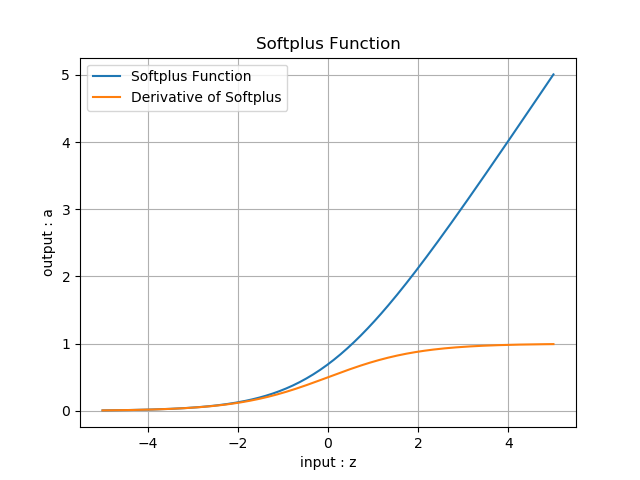
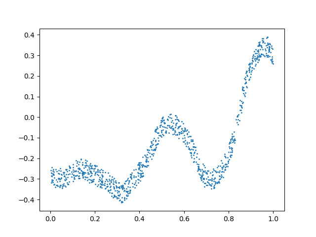

201809058  Wang Yulong  第三次作业

#  
**1.非线性回归**

## 激活函数

神经网络中的一个神经元，假设该神经元有三个输入，分别为$x_1,x_2,x_3$，那么：

$$z=x_1 w_1 + x_2 w_2 + x_3 w_3 +...+x_n w_n+b \tag{1}$$
$$a = \sigma(z) \tag{2}$$

激活函数

激活函数的基本性质：

+ 非线性：线性的激活函数和没有激活函数一样；
+ 可导性：做误差反向传播和梯度下降，必须要保证激活函数的可导性；
+ 单调性：单一的输入会得到单一的输出，较大值的输入得到较大值的输出。

## 何时使用激活函数

神经网络不管有多少层，最后的输出层决定了这个神经网络能干什么。在单层神经网络中，我们学习到了表1所示的内容。

表1 单层的神经网络的参数与功能

|网络|输入|输出|激活函数|分类函数|功能|
|---|---|---|---|---|---|
|单层|单变量|单输出|无|无|线性回归|
|单层|多变量|单输出|无|无|线性回归|
|单层|多变量|单输出|无|二分类函数|二分类|
|单层|多变量|多输出|无|多分类函数|多分类|

从上表可以看到，我们一直没有使用激活函数，而只使用了分类函数。对于多层神经网络也是如此，在最后一层只会用到分类函数来完成二分类或多分类任务，如果是拟合任务，则不需要分类函数。

简言之：

1. 神经网络最后一层不需要激活函数
2. 激活函数只用于连接前后两层神经网络

## 挤压型激活函数

1.定义：当输入值域的绝对值较大的时候，其输出在两端是饱和的，都具有S形的函数曲线以及压缩输入值域的作用的函数。

###  Logistic函数
### 公式

$$Sigmoid(z) = \frac{1}{1 + e^{-z}} \rightarrow a \tag{1}$$

### 导数

$$Sigmoid'(z) = a(1 - a) \tag{2}$$

注意，如果是矩阵运算的话，需要在公式2中使用$\odot$符号表示按元素的矩阵相乘：$a\odot (1-a)$，后面不再强调。

推导过程如下：

令：$u=1,v=1+e^{-z}$ 则：

$$
\begin{aligned}
Sigmoid'(z)&= (\frac{u}{v})'=\frac{u'v-v'u}{v^2} \\\\
&=\frac{0-(1+e^{-z})'}{(1+e^{-z})^2}=\frac{e^{-z}}{(1+e^{-z})^2} \\\\
&=\frac{1+e^{-z}-1}{(1+e^{-z})^2}=\frac{1}{1+e^{-z}}-(\frac{1}{1+e^{-z}})^2 \\\\
&=a-a^2=a(1-a)
\end{aligned}
$$

### 值域

- 输入值域：$(-\infty, \infty)$
- 输出值域：$(0,1)$
- 导数值域：$(0,0.25]$

### 函数图像

数值计算：

1. 求出当前输入的值

$$a=\frac{1}{1 + e^{-z}} = 0.9$$
$$z = \ln{9}$$

2. 求出当前梯度

$$\delta = a \times (1 - a) = 0.9 \times 0.1= 0.09$$

3. 根据梯度更新当前输入值

$$z_{new} = z - \eta \times \delta = \ln{9} - 0.2 \times 0.09 = \ln(9) - 0.018$$

4. 判断当前函数值是否接近0.5

$$a=\frac{1}{1 + e^{-z_{new}}} = 0.898368$$

5. 重复步骤2-3，直到当前函数值接近0.5

如果用一个程序来计算的话，需要迭代67次，才可以从0.9趋近0.5。

### **Tanh函数**

TanHyperbolic，即双曲正切函数

### 公式  
$$Tanh(z) = \frac{e^{z} - e^{-z}}{e^{z} + e^{-z}} = (\frac{2}{1 + e^{-2z}}-1) \rightarrow a \tag{3}$$
即
$$Tanh(z) = 2 \cdot Sigmoid(2z) - 1 \tag{4}$$

### 导数公式

$$Tanh'(z) = (1 + a)(1 - a)$$

利用基本导数公式23，令：$u={e^{z}-e^{-z}}，v=e^{z}+e^{-z}$ 则有：

$$
\begin{aligned}
Tanh'(z)&=\frac{u'v-v'u}{v^2} \\\\
&=\frac{(e^{z}-e^{-z})'(e^{z}+e^{-z})-(e^{z}+e^{-z})'(e^{z}-e^{-z})}{(e^{z}+e^{-z})^2} \\\\
&=\frac{(e^{z}+e^{-z})(e^{z}+e^{-z})-(e^{z}-e^{-z})(e^{z}-e^ {-z})}{(e^{z}+e^{-z})^2} \\\\
&=\frac{(e^{z}+e^{-z})^2-(e^{z}-e^{-z})^2}{(e^{z}+e^{-z})^2} \\\\
&=1-(\frac{(e^{z}-e^{-z}}{e^{z}+e^{-z}})^2=1-a^2
\end{aligned}
$$

### 值域

- 输入值域：$(-\infty,\infty)$
- 输出值域：$(-1,1)$
- 导数值域：$(0,1)$

### 函数图像

## 半线性激活函数
优点：解决梯度消失；加快收敛速度；

ReLU函数 

Rectified Linear Unit，修正线性单元，线性整流函数，斜坡函数。

#### 公式

$$ReLU(z) = max(0,z) = \begin{cases} 
  z, & z \geq 0 \\\\ 
  0, & z < 0 
\end{cases}$$

#### 导数

$$ReLU'(z) = \begin{cases} 1 & z \geq 0 \\\\ 0 & z < 0 \end{cases}$$

#### 值域

- 输入值域：$(-\infty, \infty)$
- 输出值域：$(0,\infty)$
- 导数值域：$（0,1）$

Leaky ReLU函数

LReLU，带泄露的线性整流函数。

#### 公式

$$LReLU(z) = \begin{cases} z & z \geq 0 \\\\ \alpha \cdot z & z < 0 \end{cases}$$

#### 导数

$$LReLU'(z) = \begin{cases} 1 & z \geq 0 \\\\ \alpha & z < 0 \end{cases}$$

#### 值域

输入值域：$(-\infty, \infty)$

输出值域：$(-\infty,\infty)$

导数值域：$({\alpha},1)$

Softplus函数

#### 公式

$$Softplus(z) = \ln (1 + e^z)$$

#### 导数

$$Softplus'(z) = \frac{e^z}{1 + e^z}$$

#### 

输入值域：$(-\infty, \infty)$

输出值域：$(0,\infty)$

导数值域：$(0,1)$

----

#  
**2.非线性回归**

原则上说，如果你有足够的耐心，愿意花很高的时间成本和计算资源，总可以用多项式回归的方式来解决这个问题，但是，在本章，我们将会学习另外一个定理：前馈神经网络的通用近似定理。

上面这条“蛇形”曲线，实际上是由下面这个公式添加噪音后生成的：

$$y=0.4x^2 + 0.3x\sin(15x) + 0.01\cos(50x)-0.3$$

我们特意把数据限制在[0,1]之间，避免做归一化的麻烦。要是觉得这个公式还不够复杂，大家可以用更复杂的公式去自己做试验。

以上问题可以叫做非线性回归，即自变量X和因变量Y之间不是线性关系。常用的传统的处理方法有线性迭代法、分段回归法、迭代最小二乘法等。在神经网络中，解决这类问题的思路非常简单，就是使用带有一个隐层的两层神经网络。

复杂曲线样本数据

|样本|x|y|
|---|---|---|
|1|0.606|-0.113|
|2|0.129|-0.269|
|3|0.582|0.027|
|...|...|...|
|1000|0.199|-0.281|

平均绝对误差

MAE（Mean Abolute Error）。

$$MAE=\frac{1}{m} \sum_{i=1}^m \lvert a_i-y_i \rvert \tag{1}$$

对异常值不如均方差敏感，类似中位数。

绝对平均值率误差

MAPE（Mean Absolute Percentage Error）。

$$MAPE=\frac{100}{m} \sum^m_{i=1} \left\lvert {a_i - y_i \over y_i} \right\rvert \tag{2}$$

和方差

SSE（Sum Squared Error）。

$$SSE=\sum_{i=1}^m (a_i-y_i)^2 \tag{3}$$

均方差

MSE（Mean Squared Error）。

$$MSE = \frac{1}{m} \sum_{i=1}^m (a_i-y_i)^2 \tag{4}$$

上面的几种衡量标准针对不同的模型会有不同的值。比如说预测房价，那么误差单位就是元，比如3000元、11000元等。如果预测身高就可能是0.1、0.2米之类的。也就是说，对于不同的场景，会有不同量纲，因而也会有不同的数值，无法用一句话说得很清楚，必须带一大堆条件才能表达完整。