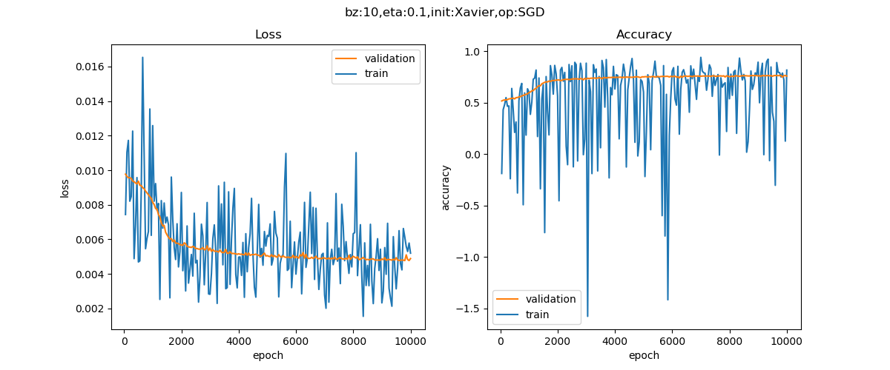
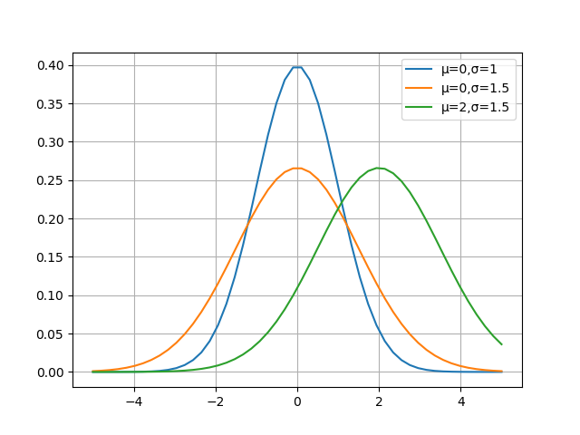
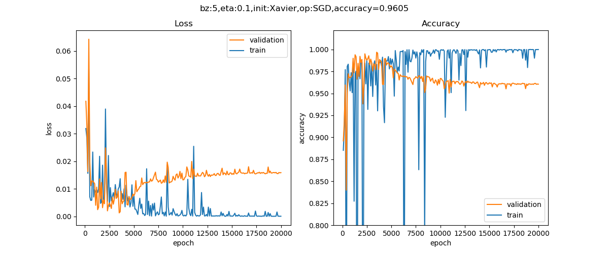
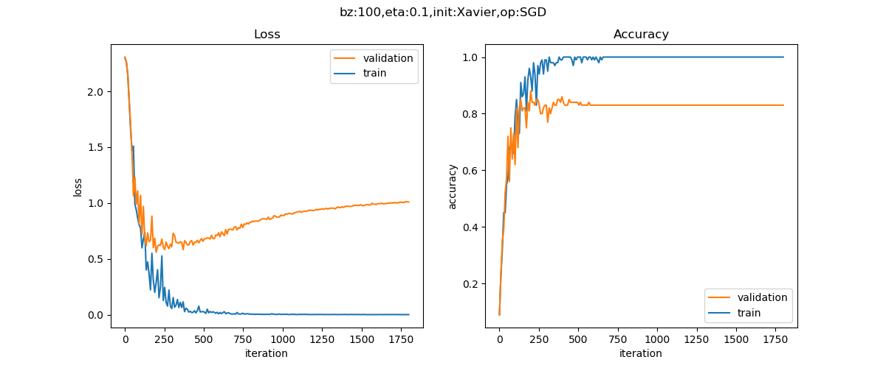
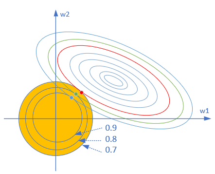
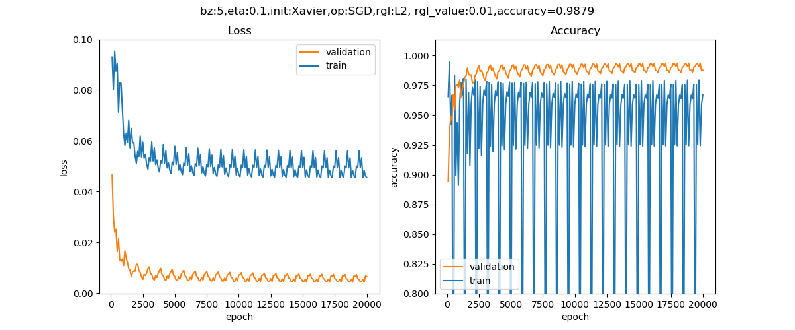
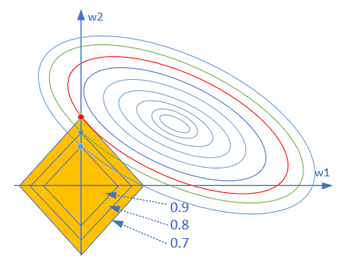

# Step7笔记总结

## 学号：201809009  姓名：王征宇

## 本文将会通过以下四个要求书写笔记

时间：2020年10月12日

要求：

1、必须采用markdown格式，图文并茂，并且务必在github网站上能正确且完整的显示；

2、详细描述ai-edu中Step7的学习过程；重要公式需要亲手推导；

3、必须包含对代码的理解，以及相应分析和测试过程；

4、必须包含学习总结和心得体会。

5、慕课第四章

### 一、第七步  深度神经网络

#### 1、搭建深度神经网络框架

#### （1）搭建深度神经网络框架

①功能/模式分析

```Python
def backward3(dict_Param,cache,X,Y):
    ...
    # layer 3
    dZ3= A3 - Y
    dW3 = np.dot(dZ3, A2.T)#矩阵相乘
    dB3 = np.sum(dZ3, axis=1, keepdims=True)#dB3=dZ3
    # layer 2
    dZ2 = np.dot(W3.T, dZ3) * (1-A2*A2) # tanh
    dW2 = np.dot(dZ2, A1.T)
    dB2 = np.sum(dZ2, axis=1, keepdims=True)
    # layer 1
    dZ1 = np.dot(W2.T, dZ2) * A1 * (1-A1)   #sigmoid
    dW1 = np.dot(dZ1, X.T)
    dB1 = np.sum(dZ1, axis=1, keepdims=True)
    ...
```
因为三层网络比两层网络多了一层，所以会在初始化、前向、反向、更新参数等四个环节有所不同，但却是有规律的。
#### （2）抽象与设计

#### NeuralNet

我们首先需要一个NeuralNet类，来包装基本的神经网络结构和功能：

- Layers - 神经网络各层的容器，按添加顺序维护一个列表
- Parameters - 基本参数，包括普通参数和超参
- Loss Function - 提供计算损失函数值，存储历史记录并最后绘图的功能
- LayerManagement() - 添加神经网络层
- ForwardCalculation() - 调用各层的前向计算方法
- BackPropagation() - 调用各层的反向传播方法
- PreUpdateWeights() - 预更新各层的权重参数
- UpdateWeights() - 更新各层的权重参数
- Train() - 训练
- SaveWeights() - 保存各层的权重参数
- LoadWeights() - 加载各层的权重参数

#### Layer

是一个抽象类，以及更加需要增加的实际类，包括：
- Fully Connected Layer
- Classification Layer
- Activator Layer
- Dropout Layer
- Batch Norm Layer

将来还会包括：
- Convolution Layer
- Max Pool Layer

每个Layer都包括以下基本方法：
 - ForwardCalculation() - 调用本层的前向计算方法
 - BackPropagation() - 调用本层的反向传播方法
 - PreUpdateWeights() - 预更新本层的权重参数
 - UpdateWeights() - 更新本层的权重参数
 - SaveWeights() - 保存本层的权重参数
 - LoadWeights() - 加载本层的权重参数

#### Activator Layer

激活函数和分类函数：

- Identity - 直传函数，即没有激活处理
- Sigmoid
- Tanh
- Relu

#### Classification Layer

分类函数，包括：
- Sigmoid二分类
- Softmax多分类


 #### Parameters

 基本神经网络运行参数：

 - 学习率
 - 最大epoch
 - batch size
 - 损失函数定义
 - 初始化方法
 - 优化器类型
 - 停止条件
 - 正则类型和条件

#### LossFunction

损失函数及帮助方法：

- 均方差函数
- 交叉熵函数二分类
- 交叉熵函数多分类
- 记录损失函数
- 显示损失函数历史记录
- 获得最小函数值时的权重参数

#### Optimizer

优化器：

- SGD
- Momentum
- Nag
- AdaGrad
- AdaDelta
- RMSProp
- Adam

#### WeightsBias

权重矩阵，仅供全连接层使用：

- 初始化 
  - Zero, Normal, MSRA (HE), Xavier
  - 保存初始化值
  - 加载初始化值
- Pre_Update - 预更新
- Update - 更新
- Save - 保存训练结果值
- Load - 加载训练结果值

#### DataReader

样本数据读取器：

- ReadData - 从文件中读取数据
- NormalizeX - 归一化样本值
- NormalizeY - 归一化标签值
- GetBatchSamples - 获得批数据
- ToOneHot - 标签值变成OneHot编码用于多分类
- ToZeorOne - 标签值变成0/1编码用于二分类
- Shuffle - 打乱样本顺序

从中派生出两个数据读取器：
- MnistImageDataReader - 读取MNIST数据
- CifarImageReader - 读取Cifar10数据
- 
#### 2、搭建模型 代码理解


#### 代码构造

```Python
def model():
    #设置初始值
    dataReader = LoadData()
    num_input = 1
    num_hidden1 = 4
    num_output = 1

    max_epoch = 10000
    batch_size = 10
    learning_rate = 0.5

    #超参数
    params = HyperParameters_4_0(
        learning_rate, max_epoch, batch_size,
        net_type=NetType.Fitting,
        init_method=InitialMethod.Xavier,
        stopper=Stopper(StopCondition.StopLoss, 0.001))
    #网络训练
    net = NeuralNet_4_0(params, "Level1_CurveFittingNet")
    fc1 = FcLayer_1_0(num_input, num_hidden1, params)
    net.add_layer(fc1, "fc1")
    sigmoid1 = ActivationLayer(Sigmoid())
    net.add_layer(sigmoid1, "sigmoid1")
    fc2 = FcLayer_1_0(num_hidden1, num_output, params)
    net.add_layer(fc2, "fc2")
    #训练
    net.train(dataReader, checkpoint=100, need_test=True)

    net.ShowLossHistory()
    ShowResult(net, dataReader)
```


#### 代码分析

超参数说明：

1. 输入层1个神经元，因为只有一个x值
2. 隐层4个神经元，对于此问题来说应该是足够了，因为特征很少
3. 输出层1个神经元，因为是拟合任务
4. 学习率=0.5
5. 最大epoch=10000轮
6. 批量样本数=10
7. 拟合网络类型
8. Xavier初始化
9. 绝对损失停止条件=0.001

#### 3、训练测试结果


损失函数值在一段平缓期过后，开始陡降，这种现象在神经网络的训练中是常见的，最有可能的是当时处于一个梯度变化的平缓地带，算法在艰难地寻找下坡路，然后忽然就找到了。这种情况同时也带来一个弊端：我们会经常遇到缓坡，到底要不要还继续训练？是不是再坚持一会儿就能找到出路呢？抑或是模型能力不够，永远找不到出路呢？这个问题没有准确答案，只能靠试验和经验了。


上图左边是拟合的情况，绿色点是测试集数据，红色点是神经网路的推理结果，可以看到除了最左侧开始的部分，其它部分都拟合的不错。注意，这里我们不是在讨论过拟合、欠拟合的问题，我们在这个章节的目的就是更好地拟合一条曲线。

#### 4、神经网络反向传播四大公式
著名的反向传播四大公式是：

  $$\delta^{L} = \nabla_{a}C \odot \sigma_{'}(Z^L) \tag{80}$$
  $$\delta^{l} = ((W^{l + 1})^T\delta^{l+1})\odot\sigma_{'}(Z^l) \tag{81}$$
  $$\frac{\partial{C}}{\partial{b_j^l}} = \delta_j^l \tag{82}$$
  $$\frac{\partial{C}}{\partial{w_{jk}^{l}}} = a_k^{l-1}\delta_j^l \tag{83}$$
  
### 二、二分类任务功能测试

#### （1）二分类试验 - 双弧形非线性二分类

#### 代码理解
Logistic二分类函数来完成二分类任务：


#### 代码

```Python

def model(dataReader):
    num_input = 2
    num_hidden = 3
    num_output = 1

    max_epoch = 1000
    batch_size = 5
    learning_rate = 0.1

    params = HyperParameters_4_0(
        learning_rate, max_epoch, batch_size,
        net_type=NetType.BinaryClassifier,
        init_method=InitialMethod.Xavier,
        stopper=Stopper(StopCondition.StopLoss, 0.02))

    net = NeuralNet_4_0(params, "Arc")

    fc1 = FcLayer_1_0(num_input, num_hidden, params)
    net.add_layer(fc1, "fc1")
    sigmoid1 = ActivationLayer(Sigmoid())
    net.add_layer(sigmoid1, "sigmoid1")
    
    fc2 = FcLayer_1_0(num_hidden, num_output, params)
    net.add_layer(fc2, "fc2")
    logistic = ClassificationLayer(Logistic())
    net.add_layer(logistic, "logistic")

    net.train(dataReader, checkpoint=10, need_test=True)
    return net
```
### 代码分析：

超参数说明：
1. 输入层神经元数为2
2. 隐层的神经元数为3，使用Sigmoid激活函数
3. 由于是二分类任务，所以输出层只有一个神经元，用Logistic做二分类函数
4. 最多训练1000轮
5. 批大小=5
6. 学习率=0.1
7. 绝对误差停止条件=0.02


#### （2）运行测试结果


打印输出结果：
```
......
epoch=419, total_iteration=30239
loss_train=0.010094, accuracy_train=1.000000
loss_valid=0.019141, accuracy_valid=1.000000
time used: 2.149379253387451
testing...
1.0
```
最后的testing...的结果是1.0，表示100%正确，这初步说明mini框架在这个基本case上工作得很好。


### 三、多分类功能测试 

#### （1） 搭建模型一

使用Sigmoid做为激活函数的两层网络：


#### 代码

```Python
def model_sigmoid(num_input, num_hidden, num_output, hp):
    net = NeuralNet_4_0(hp, "chinabank_sigmoid")

    fc1 = FcLayer_1_0(num_input, num_hidden, hp)
    net.add_layer(fc1, "fc1")
    s1 = ActivationLayer(Sigmoid())
    net.add_layer(s1, "Sigmoid1")

    fc2 = FcLayer_1_0(num_hidden, num_output, hp)
    net.add_layer(fc2, "fc2")
    softmax1 = ClassificationLayer(Softmax())
    net.add_layer(softmax1, "softmax1")

    net.train(dataReader, checkpoint=50, need_test=True)
    net.ShowLossHistory()
    
    ShowResult(net, hp.toString())
    ShowData(dataReader)

if __name__ == '__main__':
    dataReader = LoadData()
    num_input = dataReader.num_feature
    num_hidden = 8
    num_output = 3

    max_epoch = 5000
    batch_size = 10
    learning_rate = 0.1

    hp = HyperParameters_4_0(
        learning_rate, max_epoch, batch_size,
        net_type=NetType.MultipleClassifier,
        init_method=InitialMethod.Xavier,
        stopper=Stopper(StopCondition.StopLoss, 0.08))
    model_sigmoid(num_input, num_hidden, num_output, hp) 
```

#### 超参数说明

1. 隐层8个神经元
2. 最大epoch=5000
3. 批大小=10
4. 学习率0.1
5. 绝对误差停止条件=0.08
6. 多分类网络类型
7. 初始化方法为Xavier
8. 
#### (2)运行测试结果

损失函数图和准确度图：


分类效果图：


#### (3)搭建模型二

#### 代码分析
使用Relu做为激活函数的三层网络：


用两层网络也可以实现，但是使用Relu函数时，训练效果不是很稳定，用三层比较保险。

#### 代码

```Python
def model_relu(num_input, num_hidden, num_output, hp):
    net = NeuralNet_4_0(hp, "chinabank_relu")

    fc1 = FcLayer_1_0(num_input, num_hidden, hp)
    net.add_layer(fc1, "fc1")
    r1 = ActivationLayer(Relu())
    net.add_layer(r1, "Relu1")

    fc2 = FcLayer_1_0(num_hidden, num_hidden, hp)
    net.add_layer(fc2, "fc2")
    r2 = ActivationLayer(Relu())
    net.add_layer(r2, "Relu2")

    fc3 = FcLayer_1_0(num_hidden, num_output, hp)
    net.add_layer(fc3, "fc3")
    softmax = ClassificationLayer(Softmax())
    net.add_layer(softmax, "softmax")

    net.train(dataReader, checkpoint=50, need_test=True)
    net.ShowLossHistory()
    
    ShowResult(net, hp.toString())
    ShowData(dataReader)
    
if __name__ == '__main__':
    dataReader = LoadData()
    num_input = dataReader.num_feature
    num_hidden = 8
    num_output = 3

    max_epoch = 5000
    batch_size = 10
    learning_rate = 0.1

    hp = HyperParameters_4_0(
        learning_rate, max_epoch, batch_size,
        net_type=NetType.MultipleClassifier,
        init_method=InitialMethod.Xavier,
        stopper=Stopper(StopCondition.StopLoss, 0.08))
    #model_sigmoid(num_input, num_hidden, num_output, hp)
    hp.init_method = InitialMethod.MSRA
    model_relu(num_input, num_hidden, num_output, hp)
```

#### 超参数说明

1. 隐层8个神经元
2. 最大epoch=5000
3. 批大小=10
4. 学习率0.1
5. 绝对误差停止条件=0.08
6. 多分类网络类型
7. 初始化方法为MSRA


#### (4)运行测试结果

损失函数图和准确度图：


分类效果图：


#### (5)比较

比较一下使用不同的激活函数的分类效果图：

|Sigmoid|Relu|
|---|---|
|||
二者的差别：Relu能直则直，对方形边界适用；Sigmoid能弯则弯，对圆形边界适用。

### 一、网络优化

#### （1）权重矩阵初始化

①零初始化

即把所有层的W值的初始值都设置为0。
$$
W = 0
$$

但是对于多层网络来说，绝对不能用零初始化，否则权重值不能学习到合理的结果。看下面的零值初始化的权重矩阵值打印输出：
```
W= [[-0.82452497 -0.82452497 -0.82452497]]
B= [[-0.01143752 -0.01143752 -0.01143752]]
W= [[-0.68583865]
 [-0.68583865]
 [-0.68583865]]
B= [[0.68359678]]
```

可以看到W1、B1、W2内部3个单元的值都一样，这是因为初始值都是0，所以梯度均匀回传，导致所有w的值都同步更新，没有差别。这样的话，无论多少论，最终的结果也不会正确。

②随机初始化

把W初始化均值为0，方差为1的矩阵：

$$
W \sim G \begin{bmatrix} 0, 1 \end{bmatrix}
$$

当目标问题较为简单时，网络深度不大，所以用随机初始化就可以了。但是当使用深度网络时，会遇到这样的问题：


上图是一个6层的深度网络，使用全连接层+Sigmoid激活函数，图中表示的是各层激活函数的直方图。可以看到各层的激活值严重向两侧[0,1]靠近，从Sigmoid的函数曲线可以知道这些值的导数趋近于0，反向传播时的梯度逐步消失。处于中间地段的值比较少，对参数学习非常不利。

③ Xavier初始化方法

条件：正向传播时，激活值的方差保持不变；反向传播时，关于状态值的梯度的方差保持不变。

$$
W \sim U \begin{bmatrix} -\sqrt{{6 \over n_{input} + n_{output}}}, \sqrt{{6 \over n_{input} + n_{output}}} \end{bmatrix}
$$

假设激活函数关于0对称，且主要针对于全连接神经网络。适用于tanh和softsign。

即权重矩阵参数应该满足在该区间内的均匀分布。其中的W是权重矩阵，U是Uniform分布，即均匀分布。

④MSRA初始化方法

又叫做He方法，因为作者姓何。
条件：正向传播时，状态值的方差保持不变；反向传播时，关于激活值的梯度的方差保持不变。
### 二、梯度下降优化算法

#### （1）随机梯度下降 SGD

梯度搜索轨迹为示意图：


#### 输入和参数

- $\eta$ - 全局学习率

#### 算法

---

计算梯度：$g_t = \nabla_\theta J(\theta_{t-1})$

更新参数：$\theta_t = \theta_{t-1}  - \eta \cdot g_t$

---

随机梯度下降算法，在当前点计算梯度，根据学习率前进到下一点。到中点附近时，由于样本误差或者学习率问题，会发生来回徘徊的现象，很可能会错过最优解。

#### 实际效果

|学习率|损失函数与准确率|
|---|---|
|0.1||
|0.3||

SGD的另外一个缺点就是收敛速度慢，在学习率为0.1时，训练10000个epoch不能收敛到预定损失值；学习率为0.3时，训练5000个epoch可以收敛到预定水平。
#### （2）动量算法 Momentum


#### 输入和参数

- $\eta$ - 全局学习率
- $\alpha$ - 动量参数，一般取值为0.5, 0.9, 0.99
- $v_t$ - 当前时刻的动量，初值为0
  
#### 算法

---

计算梯度：$g_t = \nabla_\theta J(\theta_{t-1})$

计算速度更新：$v_t = \alpha \cdot v_{t-1} + \eta \cdot g_t$ (公式1)
 
更新参数：$\theta_t = \theta_{t-1}  - v_t$ (公式2)

---
#### （3）梯度加速算法 NAG

#### 输入和参数

- $\eta$ - 全局学习率
- $\alpha$ - 动量参数，缺省取值0.9
- v - 动量，初始值为0
  
#### 算法

---

临时更新：$\hat \theta = \theta_{t-1} - \alpha \cdot v_{t-1}$

前向计算：$f(\hat \theta)$

计算梯度：$g_t = \nabla_{\hat\theta} J(\hat \theta)$

计算速度更新：$v_t = \alpha \cdot v_{t-1} + \eta \cdot g_t$

更新参数：$\theta_t = \theta_{t-1}  - v_t$

---
### 三、自适应学习率算法
#### （1）AdaGrad
#### 输入和参数

- $\eta$ - 全局学习率
- $\epsilon$ - 用于数值稳定的小常数，建议缺省值为1e-6
- r = 0 初始值
  
#### 算法

---

计算梯度：$g_t = \nabla_\theta J(\theta_{t-1})$

累计平方梯度：$r_t = r_{t-1} + g_t \odot g_t$

计算梯度更新：$\Delta \theta = {\eta \over \epsilon + \sqrt{r_t}} \odot g_t$

更新参数：$\theta_t=\theta_{t-1} - \Delta \theta$

---
#### （2）AdaDelta
#### 输入和参数

- $\epsilon$ - 用于数值稳定的小常数，建议缺省值为1e-5
- $\alpha \in [0,1)$ - 衰减速率，建议0.9
- s - 累积变量，初始值0
- r - 累积变量变化量，初始为0
 
#### 算法

---

计算梯度：$g_t = \nabla_\theta J(\theta_{t-1})$

累积平方梯度：$s_t = \alpha \cdot s_{t-1} + (1-\alpha) \cdot g_t \odot g_t$

计算梯度更新：$\Delta \theta = \sqrt{r_{t-1} + \epsilon \over s_t + \epsilon} \odot g_t$

更新梯度：$\theta_t = \theta_{t-1} - \Delta \theta$

更新变化量：$r = \alpha \cdot r_{t-1} + (1-\alpha) \cdot \Delta \theta \odot \Delta \theta$

---
#### （3)均方根反向传播 RMSProp
#### 输入和参数

- $\eta$ - 全局学习率，建议设置为0.001
- $\epsilon$ - 用于数值稳定的小常数，建议缺省值为1e-8
- $\alpha$ - 衰减速率，建议缺省取值0.9
- $r$ - 累积变量矩阵，与$\theta$尺寸相同，初始化为0
  
#### 算法

---

计算梯度：$g_t = \nabla_\theta J(\theta_{t-1})$

累计平方梯度：$r = \alpha \cdot r + (1-\alpha)(g_t \odot g_t)$

计算梯度更新：$\Delta \theta = {\eta \over \sqrt{r + \epsilon}} \odot g_t$

更新参数：$\theta_{t}=\theta_{t-1} - \Delta \theta$

---
#### (4)Adam - Adaptive Moment Estimation

#### 输入和参数

- t - 当前迭代次数
- $\eta$ - 全局学习率，建议缺省值为0.001
- $\epsilon$ - 用于数值稳定的小常数，建议缺省值为1e-8
- $\beta_1, \beta_2$ - 矩估计的指数衰减速率，$\in[0,1)$，建议缺省值分别为0.9和0.999

#### 算法

---

计算梯度：$g_t = \nabla_\theta J(\theta_{t-1})$

计数器加一：$t=t+1$

更新有偏一阶矩估计：$m_t = \beta_1 \cdot m_{t-1} + (1-\beta_1) \cdot g_t$

更新有偏二阶矩估计：$v_t = \beta_2 \cdot v_{t-1} + (1-\beta_2)(g_t \odot g_t)$

修正一阶矩的偏差：$\hat m_t = m_t / (1-\beta_1^t)$

修正二阶矩的偏差：$\hat v_t = v_t / (1-\beta_2^t)$

计算梯度更新：$\Delta \theta = \eta \cdot \hat m_t /(\epsilon + \sqrt{\hat v_t})$

更新参数：$\theta_t=\theta_{t-1} - \Delta \theta$

---
### 四、批量归一化的原理
#### （1）正态分布
正态分布，又叫做高斯分布。

若随机变量X，服从一个位置参数为μ、尺度参数为σ的概率分布，且其概率密度函数为：

$$
f(x)={1 \over \sigma\sqrt{2 \pi} } e^{- {(x-\mu)^2} \over 2\sigma^2} \tag{1}
$$

则这个随机变量就称为正态随机变量，正态随机变量服从的分布就称为正态分布，记作：

$$
X \sim N(\mu,\sigma^2) \tag{2}
$$

当μ=0,σ=1时，称为标准正态分布：

$$X \sim N(0,1) \tag{3}$$

此时公式简化为：

$$
f(x)={1 \over \sqrt{2 \pi}} e^{- {x^2} \over 2} \tag{4}
$$

下图就是三种（μ, σ）组合的函数图像：



#### （2）批量归一化
既然可以把原始训练样本做归一化，那么如果在深度神经网络的每一层，都可以有类似的手段，也就是说把层之间传递的数据移到0点附近，那么训练效果就应该会很理想。这就是批归一化BN的想法的来源。

深度神经网络随着网络深度加深，训练起来越困难，收敛越来越慢，这是个在DL领域很接近本质的问题。很多论文都是解决这个问题的，比如ReLU激活函数，再比如Residual Network。BN本质上也是解释并从某个不同的角度来解决这个问题的。

BN就是在深度神经网络训练过程中使得每一层神经网络的输入保持相同的分布，致力于将每一层的输入数据正则化成$N(0,1)$的分布。因次，每次训练的数据必须是mini-batch形式，一般取32，64等数值。

具体的数据处理过程如下图所示：


1. 数据在训练过程中，在网络的某一层会发生Internal Covariate Shift，导致数据处于激活函数的饱和区；
2. 经过均值为0、方差为1的变换后，位移到了0点附近。但是只做到这一步的话，会带来两个问题：
   
   a. 在[-1,1]这个区域，Sigmoid激活函数是近似线性的，造成激活函数失去非线性的作用；
   
   b. 在二分类问题中我们学习过，神经网络把正类样本点推向了右侧，把负类样本点推向了左侧，如果再把它们强行向中间集中的话，那么前面学习到的成果就会被破坏；

3. 经过$\gamma、\beta$的线性变换后，把数据区域拉宽，则激活函数的输出既有线性的部分，也有非线性的部分，这就解决了问题a；而且由于$\gamma、\beta$也是通过网络进行学习的，所以以前学到的成果也会保持，这就解决了问题b。

在实际的工程中，我们把BN当作一个层来看待，一般架设在全连接层（或卷积层）与激活函数层之间。
#### （3）前向计算
#### 计算图（示意）

下图是一张示意的计算图，用于帮助我们搞清楚正向和反向的过程：


$X1,X2,X3$表示三个样本（实际上一般用32，64这样的批大小），我们假设每个样本只有一个特征值（否则X将会是一个样本数乘以特征值数量的矩阵）。
1. 先从一堆X中计算出$\mu_B$；
2. 再用X和$\mu_B$计算出$\sigma_B$；
3. 再用X和$\mu_B$、$\sigma_B$计算出$n_i$，每个x对应一个n；
4. 最后用$\gamma 和 \beta$，把n转换成z，每个z对应一个n。
#### （4）批量归一化的优点

1. 可以选择比较大的初始学习率，让你的训练速度提高。
   
    以前还需要慢慢调整学习率，甚至在网络训练到一定程度时，还需要想着学习率进一步调小的比例选择多少比较合适，现在我们可以采用初始很大的学习率，因为这个算法收敛很快。当然这个算法即使你选择了较小的学习率，也比以前的收敛速度快，因为它具有快速训练收敛的特性；

2. 减少对初始化的依赖
   
    一个不太幸运的初始化，可能会造成网络训练实际很长，甚至不收敛。

3. 减少对正则的依赖
   
   在第16章中，我们将会学习正则化知识，以增强网络的泛化能力。采用BN算法后，我们会逐步减少对正则的依赖，比如令人头疼的dropout、L2正则项参数的选择问题，或者可以选择更小的L2正则约束参数了，因为BN具有提高网络泛化能力的特性；

#### (5)批量归一化的实现

#### 代码实现

#### 初始化类

```Python
class BnLayer(CLayer):
    def __init__(self, input_size, momentum=0.9):
        self.gamma = np.ones((1, input_size))
        self.beta = np.zeros((1, input_size))
        self.eps = 1e-5
        self.input_size = input_size
        self.output_size = input_size
        self.momentum = momentum
        self.running_mean = np.zeros((1,input_size))
        self.running_var = np.zeros((1,input_size))
```

#### 代码分析
后面三个变量，momentum、running_mean、running_var，是为了计算/记录历史方差均差的。

#### 正向计算

```Python
    def forward(self, input, train=True):
        assert(input.ndim == 2 or input.ndim == 4)  # fc or cv
        self.x = input

        if train:
            # 公式6
            self.mu = np.mean(self.x, axis=0, keepdims=True)
            # 公式7
            self.x_mu  = self.x - self.mu
            self.var = np.mean(self.x_mu**2, axis=0, keepdims=True) + self.eps
            # 公式8
            self.std = np.sqrt(self.var)
            self.norm_x = self.x_mu / self.std
            # 公式9
            self.z = self.gamma * self.norm_x + self.beta
            # mean and var history, for test/inference
            self.running_mean = self.momentum * self.running_mean + (1.0 - self.momentum) * self.mu
            self.running_var = self.momentum * self.running_var + (1.0 - self.momentum) * self.var
        else:
            self.mu = self.running_mean
            self.var = self.running_var
            self.norm_x = (self.x - self.mu) / np.sqrt(self.var + self.eps)
            self.z = self.gamma * self.norm_x + self.beta
        # end if
        return self.z
```

#### 代码分析
前向计算完全按照上一节中的公式6到公式9实现。要注意在训练/测试阶段的不同算法，用train是否为True来做分支判断。

#### 反向传播

```Python
    def backward(self, delta_in, flag):
        assert(delta_in.ndim == 2 or delta_in.ndim == 4)  # fc or cv
        m = self.x.shape[0]
        # calculate d_beta, b_gamma
        # 公式11
        self.d_gamma = np.sum(delta_in * self.norm_x, axis=0, keepdims=True)
        # 公式12
        self.d_beta = np.sum(delta_in, axis=0, keepdims=True)

        # calculate delta_out
        # 公式14
        d_norm_x = self.gamma * delta_in 
        # 公式16
        d_var = -0.5 * np.sum(d_norm_x * self.x_mu, axis=0, keepdims=True) / (self.var * self.std) # == self.var ** (-1.5)
        # 公式18
        d_mu = -np.sum(d_norm_x / self.std, axis=0, keepdims=True) - 2 / m * d_var * np.sum(self.x_mu, axis=0, keepdims=True)
        # 公式13
        delta_out = d_norm_x / self.std + d_var * 2 * self.x_mu / m + d_mu / m
        #return delta_out, self.d_gamma, self.d_beta
        return delta_out
```
#### 主程序代码

```Python
if __name__ == '__main__':

    dataReader = LoadData()
    num_feature = dataReader.num_feature
    num_example = dataReader.num_example
    num_input = num_feature
    num_hidden1 = 128
    num_hidden2 = 64
    num_hidden3 = 32
    num_hidden4 = 16
    num_output = 10
    max_epoch = 30
    batch_size = 64
    learning_rate = 0.1

    params = HyperParameters_4_1(
        learning_rate, max_epoch, batch_size,
        net_type=NetType.MultipleClassifier,
        init_method=InitialMethod.MSRA,
        stopper=Stopper(StopCondition.StopLoss, 0.12))

    net = NeuralNet_4_1(params, "MNIST")

    fc1 = FcLayer_1_1(num_input, num_hidden1, params)
    net.add_layer(fc1, "fc1")
    bn1 = BnLayer(num_hidden1)
    net.add_layer(bn1, "bn1")
    r1 = ActivationLayer(Relu())
    net.add_layer(r1, "r1")
    
    fc2 = FcLayer_1_1(num_hidden1, num_hidden2, params)
    net.add_layer(fc2, "fc2")
    bn2 = BnLayer(num_hidden2)
    net.add_layer(bn2, "bn2")
    r2 = ActivationLayer(Relu())
    net.add_layer(r2, "r2")

    fc3 = FcLayer_1_1(num_hidden2, num_hidden3, params)
    net.add_layer(fc3, "fc3")
    bn3 = BnLayer(num_hidden3)
    net.add_layer(bn3, "bn3")
    r3 = ActivationLayer(Relu())
    net.add_layer(r3, "r3")
    
    fc4 = FcLayer_1_1(num_hidden3, num_hidden4, params)
    net.add_layer(fc4, "fc4")
    bn4 = BnLayer(num_hidden4)
    net.add_layer(bn4, "bn4")
    r4 = ActivationLayer(Relu())
    net.add_layer(r4, "r4")

    fc5 = FcLayer_1_1(num_hidden4, num_output, params)
    net.add_layer(fc5, "fc5")
    softmax = ClassificationLayer(Softmax())
    net.add_layer(softmax, "softmax")

    net.train(dataReader, checkpoint=0.05, need_test=True)
    net.ShowLossHistory(xcoord=XCoordinate.Iteration)
```

#### 运行测试结果


### 一、 正则化
#### 1、过拟合
上图是回归任务中的三种情况，依次为：欠拟合、正确的拟合、过拟合。


上图是分类任务中的三种情况，依次为：分类欠妥、正确的分类、分类过度。由于分类可以看作是对分类边界的拟合，所以我们经常也统称其为拟合。

出现过拟合的原因：

1. 训练集的数量和模型的复杂度不匹配，样本数量级小于模型的参数
2. 训练集和测试集的特征分布不一致
3. 样本噪音大，使得神经网络学习到了噪音，正常样本的行为被抑制
4. 迭代次数过多，过分拟合了训练数据，包括噪音部分和一些非重要特征
#### 2、过拟合的例子一

#### 代码分析
MiniFramework搭建起下面这个模型：


这个模型的复杂度要比训练样本级大很多，所以可以重现过拟合的现象，当然还需要设置好合适的参数，代码片段如下：

```Python
def SetParameters():
    num_hidden = 16
    max_epoch = 20000
    batch_size = 5
    learning_rate = 0.1
    eps = 1e-6
    
    hp = HyperParameters41(
        learning_rate, max_epoch, batch_size, eps,        
        net_type=NetType.Fitting,
        init_method=InitialMethod.Xavier, 
        optimizer_name=OptimizerName.SGD)

    return hp, num_hidden
```
损失函数值和精度值的变化曲线：



拟合情况：


#### 2、过拟合的例子二
这个网络有5个全连接层，前4个全连接层后接ReLU激活函数层，最后一个全连接层接Softmax分类函数做10分类。
如下代码所示：

```Python
def Net(dateReader, num_input, num_hidden, num_output, params):
    net = NeuralNet(params)

    fc1 = FcLayer(num_input, num_hidden, params)
    net.add_layer(fc1, "fc1")
    relu1 = ActivatorLayer(Relu())
    net.add_layer(relu1, "relu1")

    fc2 = FcLayer(num_hidden, num_hidden, params)
    net.add_layer(fc2, "fc2")
    relu2 = ActivatorLayer(Relu())
    net.add_layer(relu2, "relu2")

    fc3 = FcLayer(num_hidden, num_hidden, params)
    net.add_layer(fc3, "fc3")
    relu3 = ActivatorLayer(Relu())
    net.add_layer(relu3, "relu3")

    fc4 = FcLayer(num_hidden, num_hidden, params)
    net.add_layer(fc4, "fc4")
    relu4 = ActivatorLayer(Relu())
    net.add_layer(relu4, "relu4")

    fc5 = FcLayer(num_hidden, num_output, params)
    net.add_layer(fc5, "fc5")
    softmax = ActivatorLayer(Softmax())
    net.add_layer(softmax, "softmax")

    net.train(dataReader, checkpoint=1)
    
    net.ShowLossHistory()
```
在main过程中，设置一些超参数，然后调用刚才建立的Net进行训练：

```Python
if __name__ == '__main__':

    dataReader = LoadData()
    num_feature = dataReader.num_feature
    num_example = dataReader.num_example
    num_input = num_feature
    num_hidden = 30
    num_output = 10
    max_epoch = 200
    batch_size = 100
    learning_rate = 0.1
    eps = 1e-5

    params = CParameters(
      learning_rate, max_epoch, batch_size, eps,
      LossFunctionName.CrossEntropy3, 
      InitialMethod.Xavier, 
      OptimizerName.SGD)

    Net(dataReader, num_input, num_hidden, num_hidden, num_hidden, num_hidden, num_output, params)
```

#### 运行测试结果：



#### 代码结果分析说明：

1. 第199个epoch上（从0开始计数，所以实际是第200个epoch），训练集的损失为0.0015，准确率为100%。测试集损失值0.9956，准确率86%。过拟合线性很严重。
2. total weights abs sum = 1722.4706，实际上是把所有全连接层的权重值先取绝对值，再求和。这个值和下面三个值在后面会有比较说明。
3. total weights = 26520，一共26520个权重值，偏移值不算在内。
4. little weights = 2815，一共2815个权重值小于0.01。
5. zero weights = 27，是权重值中接近于0的数量（小于0.0001）。
6. 测试准确率为84.23%
   
### 二、 偏差与方差

#### 1、偏差-方差分解


|符号|含义|
|---|---|
|$x$|测试样本|
|$D$|数据集|
|$y$|x的真实标记|
|$y_D$|x在数据集中标记(可能有误差)|
|$f$|从数据集D学习的模型|
|$f_{x;D}$|从数据集D学习的模型对x的预测输出|
|$f_x$|模型f对x的期望预测输出|

#### 公式推导

学习算法期望的预测：
$$f_x=E[f_{x;D}] \tag{1}$$
不同的训练集/验证集产生的预测方差：
$$var(x)=E[(f_{x;D}-f_x)^2] \tag{2}$$
噪声：
$$\epsilon^2=E[(y_D-y)^2] \tag{3}$$
期望输出与真实标记的偏差：
$$bias^2(x)=(f_x-y)^2 \tag{4}$$
算法的期望泛化误差：
$$
\begin{aligned}
E(f;D)&=E[(f_{x;D}-y_D)^2] \\
&=E[(f_{x;D}-f_x+f_x-y_D)^2] \\
&=E[(f_{x;D}-f_x)^2]+E[(f_x-y_D)^2] \\
&+E[2(f_{x;D}-f_x)(f_x-y_D)](从公式1，此项为0) \\
&=E[(f_{x;D}-f_x)^2]+E[(f_x-y_D)^2] \\
&=E[(f_{x;D}-f_x)^2]+E[(f_x-y+y-y_D)^2] \\
&=E[(f_{x;D}-f_x)^2]+E[(f_x-y)^2]+E(y-y_D)^2] \\
&+E[2(f_x-y)(y-y_D)](噪声期望为0，所以此项为0)\\
&=E[(f_{x;D}-f_x)^2]+(f_x-y)^2+E[(y-y_D)^2] \\
&=var(x) + bias^2(x) + \epsilon^2
\end{aligned}
$$


在上图中，随着训练程度的增加，偏差（蓝色实线）一路下降，但是方差（蓝色虚线）一路上升，整体误差（红色实线，偏差+方差+噪音误差）呈U形，最佳平衡点就是U形的最低点。

#### 2、没有免费午餐定理

没有免费午餐定理（No Free Lunch Theorem，NFL）是由Wolpert和Macerday在最优化理论中提出的。没有免费午餐定理证明：对于基于迭代的最优化算法，不存在某种算法对所有问题（有限的搜索空间内）都有效。如果一个算法对某些问题有效，那么它一定在另外一些问题上比纯随机搜索算法更差。

还可以理解为在所有可能的数据生成分布上平均之后，每一个分类算法在未事先观测的点上都有相同的错误率。也就是说，不能脱离具体问题来谈论算法的优劣，任何算法都有局限性。必须要“具体问题具体分析”。
 
### 三、L2正则

#### 1、基本数学知识

#### 范数

范数的基本概念：

$$L_p = \lVert x \rVert_p = ({\sum^n_{i=1}\lvert x_i \rvert^p})^{1/p} \tag{1}$$

范数包含向量范数和矩阵范数，我们只关心向量范数。我们用具体的数值来理解范数。假设有一个向量a：

$$a=[1,-2,0,-4]$$

$$L_0=3 \tag{非0元素数}$$
$$L_1 = \sum^3_{i=0}\lvert x_i \rvert = 1+2+0+4=7 \tag{绝对值求和}$$
$$L_2 = \sqrt[2]{\sum^3_{i=0}\lvert x_i \rvert^2} =\sqrt[2]{21}=4.5826 \tag{平方和求方根}$$
$$L_{\infty}=4 \tag{最大值的绝对值}$$

注意p可以是小数，比如0.5：

$$L_{0.5}=19.7052$$

一个经典的关于P范数的变化图如下：


我们只关心L1和L2范数：
- L1范数是个菱形体，在平面上是一个菱形
- L2范数是个球体，在平面上是一个圆

#### 高斯分布

$$
f(x)={1 \over \sigma\sqrt{2 \pi}} exp{- {(x-\mu)^2} \over 2\sigma^2} \tag{2}
$$

#### 2、 L2正则化

假设：
- W参数服从高斯分布，即：$w_j \sim N(0,\tau^2)$
- Y服从高斯分布，即：$y_i \sim N(w^Tx_i,\sigma^2)$


#### 公式推导

贝叶斯最大后验估计：

$$
argmax_wL(w) = ln \prod_i^n {1 \over \sigma\sqrt{2 \pi}}exp(-(\frac{y_i-w^Tx_i}{\sigma})^2/2) \cdot \prod_j^m{\frac{1}{\tau\sqrt{2\pi}}exp(-(\frac{w_j}{\tau})^2/2)}
$$

$$
=-\frac{1}{2\sigma^2}\sum_i^n(y_i-w^Tx_i)^2-\frac{1}{2\tau^2}\sum_j^m{w_j^2}-n\ln\sigma\sqrt{2\pi}-m\ln \tau\sqrt{2\pi} \tag{3}
$$

因为$\sigma、b、n、\pi、m$等都是常数，所以损失函数J(w)的最小值可以简化为：

$$
argmin_wJ(w) = \sum_i^n(y_i-w^Tx_i)^2+\lambda\sum_j^m{w_j^2} \tag{4}
$$


#### 关于bias偏置项的正则

上面的L2正则化没有约束偏置（biases）项。当然，通过修改正则化过程来正则化偏置会很容易，但根据经验，这样做往往不能较明显地改变结果，所以是否正则化偏置项仅仅是一个习惯问题。

#### 3、损失函数的变化

在NeuralNet.py中的代码片段如下，计算公式5或公式6的第二项：


#### 代码

```Python
for i in range(self.layer_count-1,-1,-1):
    layer = self.layer_list[i]
    if isinstance(layer, FcLayer):
        if regularName == RegularMethod.L2:
            regular_cost += np.sum(np.square(layer.weights.W))

return regular_cost * self.params.lambd
```

#### 代码分析

如果是FC层，则取出W值的平方，再求和，最后乘以$\lambda$系数返回。

在计算Loss值时，用上面函数的返回值再除以样本数m，即下面代码中的train_y.shape[0]，附加到原始的loss值之后即可。下述代码就是对公式5或6的实现。

#### 代码
```Python
loss_train = self.lossFunc.CheckLoss(train_y, self.output)
loss_train += regular_cost / train_y.shape[0]
```

#### 4、反向传播的变化

FullConnectionLayer.py中的反向传播函数如下：

```Python
    def backward(self, delta_in, idx):
        dZ = delta_in
        m = self.x.shape[1]
        if self.regular == RegularMethod.L2:
            self.weights.dW = (np.dot(dZ, self.x.T) + self.lambd * self.weights.W) / m
        else:
            self.weights.dW = np.dot(dZ, self.x.T) / m
        # end if
        self.weights.dB = np.sum(dZ, axis=1, keepdims=True) / m

        delta_out = np.dot(self.weights.W.T, dZ)

        if len(self.input_shape) > 2:
            return delta_out.reshape(self.input_shape)
        else:
            return delta_out
```

#### 代码分析理解：

当regular == RegularMethod.L2时，走一个特殊分支，完成正则项的惩罚机制。

#### 5、运行测试结果

```Python
from Level0_OverFitNet import *

if __name__ == '__main__':
    dr = LoadData()
    hp, num_hidden = SetParameters()
    hp.regular_name = RegularMethod.L2
    hp.regular_value = 0.01
    net = Model(dr, 1, num_hidden, 1, hp)
    ShowResult(net, dr, hp.toString())
```




### 四、L1正则

#### 1、基本数学知识

#### 拉普拉斯分布

$$f(x)=\frac{1}{2b}exp(-\frac{|x-\mu|}{b})$$
$$= \frac{1}{2b} \begin{cases} exp(\frac{x-\mu}{b}), & x \lt \mu \\ exp(\frac{\mu-x}{b}), & x \gt \mu \end{cases}$$


#### L0范数与L1范数

L0范数是指向量中非0的元素的个数。如果我们用L0范数来规则化一个参数矩阵W的话，就是希望W的大部分元素都是0，即让参数W是稀疏的。

L1范数是指向量中各个元素绝对值之和，也叫“稀疏规则算子”（Lasso regularization）。为什么L1范数会使权值稀疏？有人可能会这样给你回答“它是L0范数的最优凸近似”。实际上，还存在一个更美的回答：任何的规则化算子，如果他在$w_i=0$的地方不可微，并且可以分解为一个“求和”的形式，那么这个规则化算子就可以实现稀疏。w的L1范数是绝对值，所以$|w|$在$w=0$处是不可微。

#### 2、L1正则化

#### 公式推导

假设：
- W参数服从拉普拉斯分布，即$w_j \sim Laplace(0,b)$
- 
- Y服从高斯分布，即$y_i \sim N(w^Tx_i,\sigma^2)$

贝叶斯最大后验估计：
$$
argmax_wL(w) = ln \prod_i^n {1 \over \sigma\sqrt{2 \pi}}exp(-\frac{1}{2}(\frac{y_i-w^Tx_i}{\sigma})^2) \cdot \prod_j^m{\frac{1}{2b}exp(-\frac{\lvert w_j \rvert}{b})}
$$
$$
=-\frac{1}{2\sigma^2}\sum_i^n(y_i-w^Tx_i)^2-\frac{1}{2b}\sum_j^m{\lvert w_j \rvert}-n\ln\sigma\sqrt{2\pi}-m\ln b\sqrt{2\pi} \tag{1}
$$

因为$\sigma、b、n、\pi、m$等都是常数，所以损失函数J(w)的最小值可以简化为：

$$
argmin_wJ(w) = \sum_i^n(y_i-w^Tx_i)^2+\lambda\sum_j^m{\lvert w_j \rvert} \tag{2}
$$

我们仍以两个参数为例，公式2的后半部分的正则形式为：

$$L_1 = \lvert w_1 \rvert + \lvert w_2 \rvert \tag{3}$$

因为$w_1、w_2$有可能是正数或者负数，我们令$x=|w_1|、y=|w_2|、c=L_1$，则公式3可以拆成以下4个公式的组合：

$$
y=-x+c \quad (当w_1 \gt 0, w_2 \gt 0时)
$$
$$
y=\quad x+c \quad (当w_1 \lt 0, w_2 \gt 0时)
$$
$$
y=\quad x-c \quad (当w_1 \gt 0, w_2 \lt 0时)
$$
$$
y=-x-c \quad (当w_1 \lt 0, w_2 \lt 0时)
$$

所以上述4个公式（4条直线）会组成一个二维平面上的一个菱形。

下图中三个菱形，是因为惩罚因子的数值不同而形成的，越大的话，菱形面积越小，惩罚越厉害。



#### 3、损失函数的变化
代码片段如下：

```Python
  regular_cost = 0
  for i in range(self.layer_count-1,-1,-1):
      layer = self.layer_list[i]
      if isinstance(layer, FcLayer):
          if regularName == RegularMethod.L1:
              regular_cost += np.sum(np.abs(layer.weights.W))
          elif regularName == RegularMethod.L2:
              regular_cost += np.sum(np.square(layer.weights.W))
      # end if
  # end for
  return regular_cost * self.params.lambd
```

可以看到L1部分的代码，先求绝对值，再求和。那个分母上的m是在下一段代码中处理的，因为在上一段代码中，没有任何样本数量的信息。

```Python
loss_train = self.lossFunc.CheckLoss(train_y, self.output)
loss_train += regular_cost / train_y.shape[0]
```
#### 4、反向传播的变化
我们可以修改FullConnectionLayer.py中的反向传播函数如下：

```Python
def backward(self, delta_in, idx):
    dZ = delta_in
    m = self.x.shape[1]
    if self.regular == RegularMethod.L2:
        self.weights.dW = (np.dot(dZ, self.x.T) + self.lambd * self.weights.W) / m
    elif self.regular == RegularMethod.L1:
        self.weights.dW = (np.dot(dZ, self.x.T) + self.lambd * np.sign(self.weights.W)) / m
    else:
        self.weights.dW = np.dot(dZ, self.x.T) / m
    # end if
    self.weights.dB = np.sum(dZ, axis=1, keepdims=True) / m
    ......
```
符号函数的效果如下：
```Python
>>> a=np.array([1,-1,2,0])
>>> np.sign(a)
>>> array([ 1, -1,  1,  0])
```
当w为正数时，符号为正，值为1，相当于直接乘以w的值；当w为负数时，符号为负，值为-1，相当于乘以(-w)的值。最后的效果就是乘以w的绝对值。
#### 5、运行结果

在主过程中，修改超参实例如下：
```Python
from Level0_OverFitNet import *

if __name__ == '__main__':
    dr = LoadData()
    hp, num_hidden = SetParameters()
    hp.regular_name = RegularMethod.L1
    hp.regular_value = 0.005
    net = Model(dr, 1, num_hidden, 1, hp)
    ShowResult(net, dr, hp.toString())
```

设置L1正则方法，系数为0.005。

<

从图上看，无论是损失函数值还是准确率，在训练集上都没有表现得那么夸张了，不会极高（到100%）或者极低（到0.001）。这说明过拟合的情况得到了抑制，而且准确率提高到了99.18%。


从输出结果分析：

1. 权重值的绝对值和等于391.26，远小于过拟合时的1719
2. 较小的权重值（小于0.01）的数量为22935个，远大于过拟合时的2810个
3. 趋近于0的权重值（小于0.0001）的数量为12384个，大于过拟合时的25个。
   
总结：

1. 特征选择(Feature Selection)：

    大家对稀疏规则化趋之若鹜的一个关键原因在于它能实现特征的自动选择。一般来说，x的大部分元素（也就是特征）都是和最终的输出y没有关系或者不提供任何信息的，在最小化目标函数的时候考虑x这些额外的特征，虽然可以获得更小的训练误差，但在预测新的样本时，这些没用的信息反而会被考虑，从而干扰了对正确y的预测。稀疏规则化算子的引入就是为了完成特征自动选择的光荣使命，它会学习地去掉这些没有信息的特征，也就是把这些特征对应的权重置为0。

2. 可解释性(Interpretability)：

    另一个青睐于稀疏的理由是，模型更容易解释。例如患某种病的概率是y，然后我们收集到的数据x是1000维的，也就是我们需要寻找这1000种因素到底是怎么影响患上这种病的概率的。假设我们这个是个回归模型：$y=w1*x1+w2*x2+…+w1000*x1000+b$（当然了，为了让y限定在[0,1]的范围，一般还得加个Logistic函数）。通过学习，如果最后学习到的w就只有很少的非零元素，例如只有5个非零的wi，那么我们就有理由相信，这些对应的特征在患病分析上面提供的信息是巨大的，决策性的。也就是说，患不患这种病只和这5个因素有关，那医生就好分析多了。但如果1000个wi都非0，医生面对这1000种因素,无法采取针对性治疗。
  
#### L1和L2的比较

|比较项|无正则项|L2|L1|
|---|---|---|---|
|代价函数|$J(w,b)$|$J(w,b)+\lambda \Vert w \Vert^2_2$|$J(w,b)+\lambda \Vert w \Vert_1$|
|梯度计算|$dw$|$dw+\lambda \cdot w/m$|$dw+\lambda \cdot sign(w)/m$|
|准确率|0.961|0.982|0.987||
|总参数数量|544|544|544|
|小值参数数量(<1e-2)|7|204|524|
|极小值参数数量(<1e-5)|0|196|492|
|第1层参数Norm1|8.66|6.84|4.09|
|第2层参数Norm1|104.26|34.44|6.38|
|第3层参数Norm1|97.74|18.96|6.73|
|第4层参数Norm1|9.03|4.22|4.41|
|第1层参数Norm2|2.31|1.71|1.71|
|第2层参数Norm2|6.81|2.15|2.23|
|第3层参数Norm2|5.51|2.45|2.81|
|第4层参数Norm2|2.78|2.13|2.59|

## mooc第四章典型卷积神经网络算法

### 如何使用卷积神经网络别别绘画的创作时期

1、逻辑回归使用keras搭建逻辑回归模型的代码，Input([IMSIZE,IMSIZE,3])声明了传入图像的三个维度，即长、宽、通道数；训练过程，使用model1.compile()传入参数，定义损失函数loss= 'categorical_crossentropy'，为“交叉熵”损失函数，这是分类问题最常用的损失函数。2、AlexNet3、InceptionV3模型

### 常用卷积令人拍手叫绝的操作

卷积层跨层加权处理能否通过可变形卷积层实现？分组卷积+应用1*1卷积核+对通道随机分组+分开考虑区域和通道，可以减少参数量

### 1X1卷积的用途

1.增加非线性.2.特征降维(减少计算量, 减少权重个数)

### VGG19预训练模型在传染病诊断中的应用

在“用于鉴别诊断皮肤病的深度学习系统”中，开发了一种深度学习系统（DLS），以解决初级保健中最常见的皮肤状况。研究结果表明，当提供有关患者病例（图像和元数据）的相同信息时，DLS可以在26种皮肤状况下获得较为准确的判断，与美国董事会认证的皮肤科医生相同。

### X1卷积的用途

1.增加非线性.2.特征降维(减少计算量, 减少权重个数)

### 分析典型卷积网络的结构

通道：辅助学习器，提升输入表征宽度：网络的最大宽度＞输入维度深度：调节网络学习能力的重要维度特征图：改进网络的泛化性能注意力：联系上下网络，改进表征和克服数据计算的计算限制问题空间利用：调整滤波器的大小多路径：改善深度网络的梯队消失或梯度爆炸现象

### 图像分类实验讨论关键问题

1) 加载图像数据（图像的质量和数量都对最后分类结果有影响）(2) 图像数据预处理（可以通过OpenCV对将彩色图像处理成黑白图像） (3) 训练模型(4) 保存模型与模型可视化(5) 训练过程可视化

### 学习总结

经过Step7的学习，我具体学习了以下知识：

- 迷你框架的模块化设计是怎么样的
- 各个模块化分哪些类型
- 回归任务的搭建模型是什么
- 在回归任务-房价预测中，怎么通过回归任务搭建模型
- 怎么通过具体代码实现回归任务
- 二分类任务是什么
- 二分类搭建模型是什么
- 二分类代码是怎么实现的
- 在二分类-收入调查与预测中，怎么通过二分类搭建模型
- 怎么通过具体代码实现二分类
- 多分类任务是什么
- 多分类搭建模型是什么
- 多分类代码是怎么实现的
- 在多分类-MNIST手写体识别中，怎么通过二分类搭建模型
- 怎么通过具体代码实现二分类
- 训练变得越来越困难的因素有哪几个
- 通过深度网络的哪些训练可以改善
- 权重矩阵初始化份哪四种
- 这四种初始化的区别是什么
- 梯度下降优化算法的三种算法是什么
- 动量发和NAG法的比较
- 自适应学习率算法是什么
- 它分为哪四种算法
- 算法在等高线图上的效果比较
- 批量归一化的原理是什么
- 深度神经网络的挑战是什么
- 批量归一化的优点是什么
- 批量归一化的实现的公式推导和代码是什么
- 正则化是什么
- 出现过拟合的原因是什么
- 解决过拟合问题分为那七种
- 偏差与方差怎么解释
- L2正则是什么
- L1正则是什么
- 早停法 Early Stopping是什么
- 丢弃法 Dropout的基本原理是什么
- 怎么进行数据增强
- 集成学习的概念是什么
- 简单的集成学习分为哪两个组件
- Bagging法集成学习的基本流程是什么
- 集成方法选择分为哪三种

### 心得总结

在前面的几步中，我通过简单的案例，逐步学习了众多的知识，使得我可以更轻松地接触深度学习。
从Step7开始，探讨深度学习了的一些细节，如权重矩阵初始化、梯度下降优化算法、批量归一化等高级知识。
由于深度网络的学习能力强的特点，会造成网络对样本数据过分拟合，从而造成泛化能力不足，因此我们通过一些算法来改善网络的泛化能力。如通过一些偏差与方差，L2、L1正则等等来解决
随着网络的加深，训练变得越来越困难，时间越来越长，原因可能是：
- 参数多
- 数据量大
- 梯度消失
- 损失函数坡度平缓
为了解决上面这些问题，科学家们在深入研究网络表现的前提下，发现在下面这些方向上经过一些努力，可以给深度网络的训练带来或多或少的改善：
- 权重矩阵初始化
- 批量归一化
- 梯度下降优化算法
- 自适应学习率算法
在深度神经网络中，遇到的另外一个挑战，网络的泛化问题，通过一些偏差与方差，L2、L1正则等等解决了泛化问题

此次学习我也学习到了:

1. 更加熟练的掌握了markdown的阅读与书写规则
2. 逐渐理解掌握了基于Python代码的神经网络代码
3. 自学了python的进阶
4. 掌握了深度神经网络、网络优化、正则化等等
5. 安装了OPENVIVN软件，注册页面，并运行相关程序
6. 学习了MOOC的第四章典型卷积神经网络算法和机器视觉与边缘计算应用的第一章
