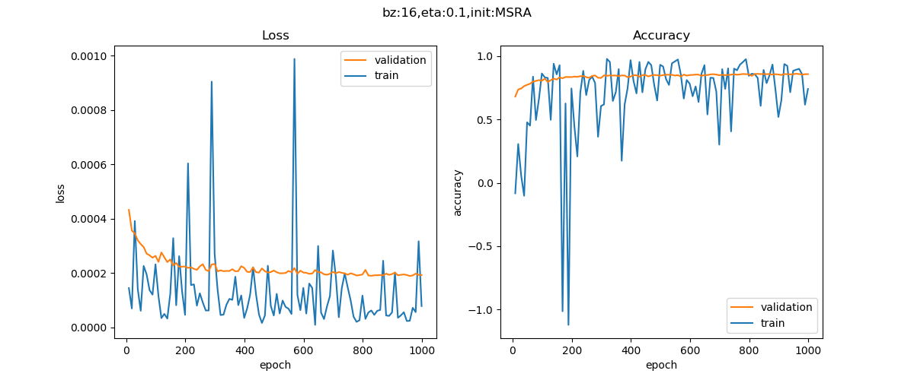
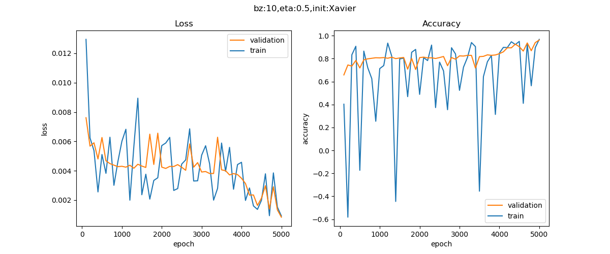
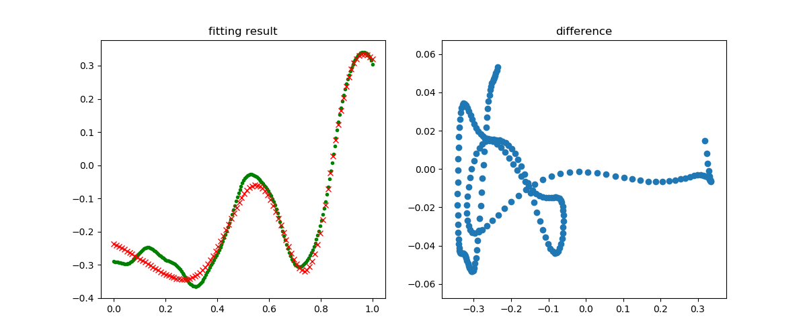
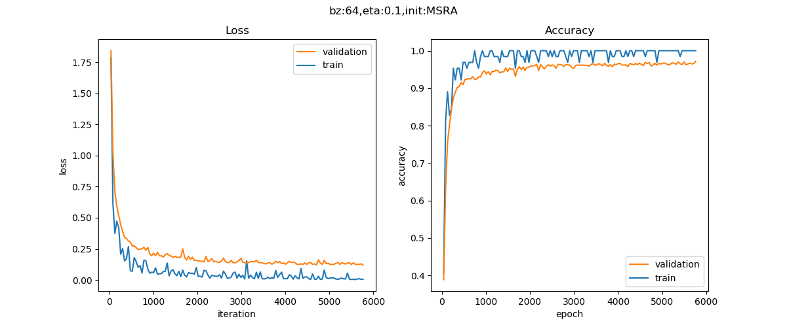

201809057 王世松
第四次作业
# 深度神经网络 


## 1.搭建深度神经网络平台

前向计算：
```Python
def forward3(X, dict_Param):
    ...
    # layer 1
    Z1 = np.dot(W1,X) + B1
    A1 = Sigmoid(Z1)
    # layer 2
    Z2 = np.dot(W2,A1) + B2
    A2 = Tanh(Z2)
    # layer 3
    Z3 = np.dot(W3,A2) + B3
    A3 = Softmax(Z3)
    ...    
```

1，2，3三层的模式完全一样：矩阵运算+激活/分类函数。

再看看反向传播：

```Python
def backward3(dict_Param,cache,X,Y):
    ...
    # layer 3
    dZ3= A3 - Y
    dW3 = np.dot(dZ3, A2.T)
    dB3 = np.sum(dZ3, axis=1, keepdims=True)
    # layer 2
    dZ2 = np.dot(W3.T, dZ3) * (1-A2*A2) # tanh
    dW2 = np.dot(dZ2, A1.T)
    dB2 = np.sum(dZ2, axis=1, keepdims=True)
    # layer 1
    dZ1 = np.dot(W2.T, dZ2) * A1 * (1-A1)   #sigmoid
    dW1 = np.dot(dZ1, X.T)
    dB1 = np.sum(dZ1, axis=1, keepdims=True)
    ...
```
每一层的模式也非常相近：计算本层的`dZ`，再根据`dZ`计算`dW`和`dB`。

因为三层网络比两层网络多了一层，所以会在初始化、前向、反向、更新参数等四个环节有所不同，但却是有规律的。再加上前面章节中，为了实现一些辅助功能，我们已经写了很多类。所以，现在可以动手搭建一个深度学习的迷你框架了。

### 抽象与设计

下图是迷你框架的模块化设计，下面对各个模块做功能点上的解释。


图-迷你框架设计

#### NeuralNet

首先需要一个`NeuralNet`类，来包装基本的神经网络结构和功能：

- `Layers` - 神经网络各层的容器，按添加顺序维护一个列表
- `Parameters` - 基本参数，包括普通参数和超参
- `Loss Function` - 提供计算损失函数值，存储历史记录并最后绘图的功能
- `LayerManagement()` - 添加神经网络层
- `ForwardCalculation()` - 调用各层的前向计算方法
- `BackPropagation()` - 调用各层的反向传播方法
- `PreUpdateWeights()` - 预更新各层的权重参数
- `UpdateWeights()` - 更新各层的权重参数
- `Train()` - 训练
- `SaveWeights()` - 保存各层的权重参数
- `LoadWeights()` - 加载各层的权重参数

#### Layer

是一个抽象类，以及更加需要增加的实际类，包括：

- Fully Connected Layer
- Classification Layer
- Activator Layer
- Dropout Layer
- Batch Norm Layer

将来还会包括：

- Convolution Layer
- Max Pool Layer

每个Layer都包括以下基本方法：
 - `ForwardCalculation()` - 调用本层的前向计算方法
 - `BackPropagation()` - 调用本层的反向传播方法
 - `PreUpdateWeights()` - 预更新本层的权重参数
 - `UpdateWeights()` - 更新本层的权重参数
 - `SaveWeights()` - 保存本层的权重参数
 - `LoadWeights()` - 加载本层的权重参数

#### Activator Layer

激活函数和分类函数：

- `Identity` - 直传函数，即没有激活处理
- `Sigmoid`
- `Tanh`
- `Relu`

#### Classification Layer

分类函数，包括：

- `Sigmoid`二分类
- `Softmax`多分类


 #### Parameters

 基本神经网络运行参数：

 - 学习率
 - 最大`epoch`
 - `batch size`
 - 损失函数定义
 - 初始化方法
 - 优化器类型
 - 停止条件
 - 正则类型和条件

#### LossFunction

损失函数及帮助方法：

- 均方差函数
- 交叉熵函数二分类
- 交叉熵函数多分类
- 记录损失函数
- 显示损失函数历史记录
- 获得最小函数值时的权重参数

#### Optimizer

优化器：

- `SGD`
- `Momentum`
- `Nag`
- `AdaGrad`
- `AdaDelta`
- `RMSProp`
- `Adam`

#### WeightsBias

权重矩阵，仅供全连接层使用：

- 初始化 
  - `Zero`, `Normal`, `MSRA` (`HE`), `Xavier`
  - 保存初始化值
  - 加载初始化值
- `Pre_Update` - 预更新
- `Update` - 更新
- `Save` - 保存训练结果值
- `Load` - 加载训练结果值

#### DataReader

样本数据读取器：

- `ReadData` - 从文件中读取数据
- `NormalizeX` - 归一化样本值
- `NormalizeY` - 归一化标签值
- `GetBatchSamples` - 获得批数据
- `ToOneHot` - 标签值变成OneHot编码用于多分类
- `ToZeroOne` - 标签值变成0/1编码用于二分类
- `Shuffle` - 打乱样本顺序

从中派生出两个数据读取器：

- `MnistImageDataReader` - 读取MNIST数据
- `CifarImageReader` - 读取Cifar10数据


#### 数据处理

原始数据只有一个数据集，所以需要我们自己把它分成训练集和测试集，比例大概为4:1。此数据集为`csv`文件格式，为了方便，我们把它转换成了两个扩展名为`npz`的`numpy`压缩形式：

- `house_Train.npz`，训练数据集
- `house_Test.npz`，测试数据集

#### 加载数据

与上面第一个例子的代码相似，但是房屋数据属性繁杂，所以需要做归一化，房屋价格也是至少6位数，所以也需要做归一化。

这里有个需要注意的地方，即训练集和测试集的数据，需要合并在一起做归一化，然后再分开使用。为什么要先合并呢？假设训练集样本中的房屋面积的范围为150到220，而测试集中的房屋面积有可能是160到230，两者不一致。分别归一化的话，150变成0，160也变成0，这样预测就会产生误差。

最后还需要在训练集中用`GenerateValidaionSet(k=10)`分出一个1:9的验证集。

### 搭建模型

在不知道一个问题的实际复杂度之前，我们不妨把模型设计得复杂一些。如下图所示，这个模型包含了四组全连接层-Relu层的组合，最后是一个单输出做拟合。


图-完成房价预测任务的抽象模型

```Python
def model():
    dr = LoadData()

    num_input = dr.num_feature
    num_hidden1 = 32
    num_hidden2 = 16
    num_hidden3 = 8
    num_hidden4 = 4
    num_output = 1

    max_epoch = 1000
    batch_size = 16
    learning_rate = 0.1

    params = HyperParameters_4_0(
        learning_rate, max_epoch, batch_size,
        net_type=NetType.Fitting,
        init_method=InitialMethod.Xavier,
        stopper=Stopper(StopCondition.StopDiff, 1e-7))

    net = NeuralNet_4_0(params, "HouseSingle")

    fc1 = FcLayer_1_0(num_input, num_hidden1, params)
    net.add_layer(fc1, "fc1")
    r1 = ActivationLayer(Relu())
    net.add_layer(r1, "r1")
    ......
    fc5 = FcLayer_1_0(num_hidden4, num_output, params)
    net.add_layer(fc5, "fc5")

    net.train(dr, checkpoint=10, need_test=True)
    
    output = net.inference(dr.XTest)
    real_output = dr.DeNormalizeY(output)
    mse = np.sum((dr.YTestRaw - real_output)**2)/dr.YTest.shape[0]/10000
    print("mse=", mse)
    
    net.ShowLossHistory()

    ShowResult(net, dr)
```

超参数说明：

1. 学习率=0.1
2. 最大`epoch=1000`
3. 批大小=16
4. 拟合网络
5. 初始化方法Xavier
6. 停止条件为相对误差`1e-7`

net.train()函数是一个阻塞函数，只有当训练完毕后才返回。

在train后面的部分，是用测试集来测试该模型的准确度，使用了数据城堡(Data Castle)的官方评测方法，用均方差除以10000，得到的数字越小越好。一般的模型大概是一个7位数的结果，稍微好一些的是6位数。

###  训练结果



图-训练过程中损失函数值和准确率的变化

由于标签数据也做了归一化，变换为都是0至1间的小数，所以均方差的数值很小，需要观察小数点以后的第4位。从图14-6中可以看到，损失函数值很快就降到了0.0002以下，然后就很缓慢地下降。而精度值在不断的上升，相信更多的迭代次数会带来更高的精度。

再看下面的打印输出部分，用R2_Score法得到的值为0.841，而用数据城堡官方的评测标准，得到的MSE值为2384411，还比较大，说明模型精度还应该有上升的空间。

```
......
epoch=999, total_iteration=972999
loss_train=0.000079, accuracy_train=0.740406
loss_valid=0.000193, accuracy_valid=0.857289
time used: 193.5549156665802
testing...
0.8412989144927305
mse= 2384411.5840510926
```
## 回归功能测试

模型 ====> 一个双层的神经网络，第一层后面接一个Sigmoid激活函数，第二层直接输出拟合数据。


<center>图-拟合任务模型</center>


```Python
def model():
    dataReader = LoadData()
    num_input = 1
    num_hidden1 = 4
    num_output = 1

    max_epoch = 10000
    batch_size = 10
    learning_rate = 0.5

    params = HyperParameters_4_0(
        learning_rate, max_epoch, batch_size,
        net_type=NetType.Fitting,
        init_method=InitialMethod.Xavier,
        stopper=Stopper(StopCondition.StopLoss, 0.001))

    net = NeuralNet_4_0(params, "Level1_CurveFittingNet")
    fc1 = FcLayer_1_0(num_input, num_hidden1, params)
    net.add_layer(fc1, "fc1")
    sigmoid1 = ActivationLayer(Sigmoid())
    net.add_layer(sigmoid1, "sigmoid1")
    fc2 = FcLayer_1_0(num_hidden1, num_output, params)
    net.add_layer(fc2, "fc2")

    net.train(dataReader, checkpoint=100, need_test=True)

    net.ShowLossHistory()
    ShowResult(net, dataReader)
```

超参数说明：

1. 输入层1个神经元，因为只有一个`x`值
2. 隐层4个神经元，对于此问题来说应该是足够了，因为特征很少
3. 输出层1个神经元，因为是拟合任务
4. 学习率=0.5
5. 最大`epoch=10000`轮
6. 批量样本数=10
7. 拟合网络类型
8. Xavier初始化
9. 绝对损失停止条件=0.001

### 训练结果



<center>训练过程中损失函数值和准确率的变化</center>


损失函数值在一段平缓期过后，开始陡降，这种现象在神经网络的训练中是常见的，最有可能的是当时处于一个梯度变化的平缓地带，算法在艰难地寻找下坡路，然后忽然就找到了。这种情况同时也带来一个弊端：我们会经常遇到缓坡，到底要不要还继续训练？是不是再坚持一会儿就能找到出路呢？抑或是模型能力不够，永远找不到出路呢？这个问题没有准确答案，只能靠试验和经验了。


<center>拟合结果</center>

左侧子图是拟合的情况，绿色点是测试集数据，红色点是神经网路的推理结果，可以看到除了最左侧开始的部分，其它部分都拟合的不错。注意，这里我们不是在讨论过拟合、欠拟合的问题，我们在这个章节的目的就是更好地拟合一条曲线。

### 多分类任务实例


<center> 完成MNIST分类任务的抽象模型</center>

主要的参数设置：

```Python
if __name__ == '__main__':
    dataReader = LoadData()
    num_feature = dataReader.num_feature
    num_example = dataReader.num_example
    num_input = num_feature
    num_hidden1 = 128
    num_hidden2 = 64
    num_hidden3 = 32
    num_hidden4 = 16
    num_output = 10
    max_epoch = 10
    batch_size = 64
    learning_rate = 0.1

    params = HyperParameters_4_0(
        learning_rate, max_epoch, batch_size,
        net_type=NetType.MultipleClassifier,
        init_method=InitialMethod.MSRA,
        stopper=Stopper(StopCondition.StopLoss, 0.12))

    net = NeuralNet_4_0(params, "MNIST")

    fc1 = FcLayer_1_0(num_input, num_hidden1, params)
    net.add_layer(fc1, "fc1")
    r1 = ActivationLayer(Relu())
    net.add_layer(r1, "r1")
    ......
    fc5 = FcLayer_1_0(num_hidden4, num_output, params)
    net.add_layer(fc5, "fc5")
    softmax = ClassificationLayer(Softmax())
    net.add_layer(softmax, "softmax")

    net.train(dataReader, checkpoint=0.05, need_test=True)
    net.ShowLossHistory(xcoord=XCoordinate.Iteration)
```

<center>训练过程中损失函数值和准确率的变化</center>


---
# <center> 网络优化 </center>

## 1.权重矩阵初始化
权重矩阵初始化是一个非常重要的环节，是训练神经网络的第一步，选择正确的初始化方法会带了事半功倍的效果。这就好比攀登喜马拉雅山，如果选择从南坡登山，会比从北坡容易很多。而初始化权重矩阵，相当于下山时选择不同的道路，在选择之前并不知道这条路的难易程度，只是知道它可以抵达山下。这种选择是随机的，即使你使用了正确的初始化算法，每次重新初始化时也会给训练结果带来很多影响。

### 1.1 零初始化

即把所有层的`W`值的初始值都设置为0。

$$
W = 0
$$

但是对于多层网络来说，绝对不能用零初始化，否则权重值不能学习到合理的结果。看下面的零值初始化的权重矩阵值打印输出：
```
W1= [[-0.82452497 -0.82452497 -0.82452497]]
B1= [[-0.01143752 -0.01143752 -0.01143752]]
W2= [[-0.68583865]
 [-0.68583865]
 [-0.68583865]]
B2= [[0.68359678]]
```

可以看到`W1`、`B1`、`W2`内部3个单元的值都一样，这是因为初始值都是0，所以梯度均匀回传，导致所有`W`的值都同步更新，没有差别。这样的话，无论多少轮，最终的结果也不会正确。
1.2 标准初始化

标准正态初始化方法保证激活函数的输入均值为0，方差为1。将W按如下公式进行初始化：

$$
W \sim N \begin{bmatrix} 0, 1 \end{bmatrix}
$$

其中的W为权重矩阵，N表示高斯分布，Gaussian Distribution，也叫做正态分布，Normal Distribution，所以有的地方也称这种初始化为Normal初始化。

一般会根据全连接层的输入和输出数量来决定初始化的细节：

$$
W \sim N
\begin{pmatrix} 
0, \frac{1}{\sqrt{n_{in}}}
\end{pmatrix}
$$

$$
W \sim U
\begin{pmatrix} 
-\frac{1}{\sqrt{n_{in}}}, \frac{1}{\sqrt{n_{in}}}
\end{pmatrix}
$$

<center>标准初始化在Sigmoid激活函数上的表现</center>

1.3 Xavier初始化方法

基于上述观察，Xavier Glorot等人研究出了下面的Xavier$^{[1]}$初始化方法。

条件：正向传播时，激活值的方差保持不变；反向传播时，关于状态值的梯度的方差保持不变。

$$
W \sim N
\begin{pmatrix}
0, \sqrt{\frac{2}{n_{in} + n_{out}}} 
\end{pmatrix}
$$

$$
W \sim U 
\begin{pmatrix}
 -\sqrt{\frac{6}{n_{in} + n_{out}}}, \sqrt{\frac{6}{n_{in} + n_{out}}} 
\end{pmatrix}
$$

其中的W为权重矩阵，N表示正态分布（Normal Distribution），U表示均匀分布（Uniform Distribution)。下同。

假设激活函数关于0对称，且主要针对于全连接神经网络。适用于tanh和softsign。

即权重矩阵参数应该满足在该区间内的均匀分布。其中的W是权重矩阵，U是Uniform分布，即均匀分布。

论文摘要：神经网络在2006年之前不能很理想地工作，很大原因在于权重矩阵初始化方法上。Sigmoid函数不太适合于深度学习，因为会导致梯度饱和。基于以上原因，我们提出了一种可以快速收敛的参数初始化方法。

Xavier初始化方法比直接用高斯分布进行初始化W的优势所在： 

一般的神经网络在前向传播时神经元输出值的方差会不断增大，而使用Xavier等方法理论上可以保证每层神经元输入输出方差一致。 

<center>表1 几种初始化方法的应用场景</center>

|ID|网络深度|初始化方法|激活函数|说明|
|---|---|---|---|---|
|1|单层|零初始化|无|可以|
|2|双层|零初始化|Sigmoid|错误，不能进行正确的反向传播|
|3|双层|随机初始化|Sigmoid|可以|
|4|多层|随机初始化|Sigmoid|激活值分布成凹形，不利于反向传播|
|5|多层|Xavier初始化|Tanh|正确|
|6|多层|Xavier初始化|ReLU|激活值分布偏向0，不利于反向传播|
|7|多层|MSRA初始化|ReLU|正确|

## 梯度下降算法

输入和参数

- $\eta$ - 全局学习率

#### 算法

---

计算梯度：$g_t = \nabla_\theta J(\theta_{t-1})$

更新参数：$\theta_t = \theta_{t-1}  - \eta \cdot g_t$

---

随机梯度下降算法，在当前点计算梯度，根据学习率前进到下一点。到中点附近时，由于样本误差或者学习率问题，会发生来回徘徊的现象，很可能会错过最优解。

#### 实际效果

表2 学习率对SGD的影响
|学习率|损失函数与准确率|
|---|---|
|0.1|
|0.3|

SGD的另外一个缺点就是收敛速度慢，见表15-3，在学习率为0.1时，训练10000个epoch不能收敛到预定损失值；学习率为0.3时，训练5000个epoch可以收敛到预定水平。

动量算法 Momentum
<font color=red>
SGD方法的一个缺点是其更新方向完全依赖于当前batch计算出的梯度，因而十分不稳定，因为数据有噪音。</font>

Momentum算法借用了物理中的动量概念，它模拟的是物体运动时的惯性，即更新的时候在一定程度上保留之前更新的方向，同时利用当前batch的梯度微调最终的更新方向。这样一来，可以在一定程度上增加稳定性，从而学习地更快，并且还有一定摆脱局部最优的能力。Momentum算法会观察历史梯度，若当前梯度的方向与历史梯度一致（表明当前样本不太可能为异常点），则会增强这个方向的梯度。若当前梯度与历史梯度方向不一致，则梯度会衰减。


### 输入和参数

- $\eta$ - 全局学习率
- $\alpha$ - 动量参数，一般取值为0.5, 0.9, 0.99
- $v_t$ - 当前时刻的动量，初值为0

### 算法

---

计算梯度：$g_t = \nabla_\theta J(\theta_{t-1})$

计算速度更新：$v_t = \alpha \cdot v_{t-1} + \eta \cdot g_t$ (公式1)
 
更新参数：$\theta_t = \theta_{t-1}  - v_t$ (公式2)

---

但是在花书上的公式是这样的：

---

$v_t = \alpha \cdot v_{t-1} - \eta \cdot g_t (公式3)$
 
$\theta_{t} = \theta_{t-1} + v_t (公式4)$

---

## 3.算法比较
算法在等高线图上的效果比较

### 1 模拟效果比较

为了简化起见，我们先用一个简单的二元二次函数来模拟损失函数的等高线图，测试一下我们在前面实现的各种优化器。但是以下测试结果只是一个示意性质的，可以理解为在绝对理想的条件下（样本无噪音，损失函数平滑等等）的各算法的表现。

$$z = \frac{x^2}{10} + y^2 \tag{1}$$

公式1是模拟均方差函数的形式，它的正向计算和反向计算的`Python`代码如下：

```Python
def f(x, y):
    return x**2 / 10.0 + y**2

def derivative_f(x, y):
    return x / 5.0, 2.0*y
```

我们依次测试4种方法：

- 普通SGD, 学习率0.95
- 动量Momentum, 学习率0.1
- RMPSProp，学习率0.5
- Adam，学习率0.5

每种方法都迭代20次，记录下每次反向过程的(x,y)坐标点，绘制图15-8如下。


图5 不同梯度下降优化算法的模拟比较

- SGD算法，每次迭代完全受当前梯度的控制，所以会以折线方式前进。
- Momentum算法，学习率只有0.1，每次继承上一次的动量方向，所以会以比较平滑的曲线方式前进，不会出现突然的转向。
- RMSProp算法，有历史梯度值参与做指数加权平均，所以可以看到比较平缓，不会波动太大，都后期步长越来越短也是符合学习规律的。
- Adam算法，因为可以被理解为Momentum和RMSProp的组合，所以比Momentum要平缓一些，比RMSProp要平滑一些。

### 2 真实效果比较

下面我们用第四章线性回归的例子来做实际的测试。为什么要用线性回归的例子呢？因为在它只有w, b两个变量需要求解，可以在二维平面或三维空间来表现，这样我们就可以用可视化的方式来解释算法的效果。

下面列出了用`Python`代码实现的前向计算、反向计算、损失函数计算的函数：

```Python
def ForwardCalculationBatch(W,B,batch_x):
    Z = np.dot(W, batch_x) + B
    return Z

def BackPropagationBatch(batch_x, batch_y, batch_z):
    m = batch_x.shape[1]
    dZ = batch_z - batch_y
    dB = dZ.sum(axis=1, keepdims=True)/m
    dW = np.dot(dZ, batch_x.T)/m
    return dW, dB

def CheckLoss(W, B, X, Y):
    m = X.shape[1]
    Z = np.dot(W, X) + B
    LOSS = (Z - Y)**2
    loss = LOSS.sum()/m/2
    return loss
```

损失函数用的是均方差，回忆一下公式：

$$J(w,b) = \frac{1}{2}(Z-Y)^2 \tag{2}$$

如果把公式2展开的话：

$$J = \frac{1}{2} (Z^2 + Y^2 - 2ZY)$$

其形式比公式1多了最后一项，所以画出来的损失函数的等高线是斜向的椭圆。下面是画等高线的代码方法，详情请移步代码库：

```Python
def show_contour(ax, loss_history, optimizer):
```

这里有个`matplotlib`的绘图知识：

1. 确定`x_axis`值的范围：`w = np.arange(1,3,0.01)`，因为`w`的准确值是2
2. 确定`y_axis`值的范围：`b = np.arange(2,4,0.01)`，因为`b`的准确值是3
3. 生成网格数据：`W,B = np.meshgrid(w, b)`
4. 计算每个网点上的损失函数值Z
5. 所以(W,B,Z)形成了一个3D图，最后用`ax.coutour(W,B,Z)`来绘图
6. `levels`参数是控制等高线的精度或密度，`norm`控制颜色的非线性变化

表4 各种算法的效果比较

|||
|---|---|
|||
|SGD当学习率为0.1时，需要很多次迭代才能逐渐向中心靠近|SGD当学习率为0.5时，会比较快速地向中心靠近，但是在中心的附近有较大震荡|
|||
|Momentum由于惯性存在，一下子越过了中心点，但是很快就会得到纠正|Nag是Momentum的改进，有预判方向功能|
|||
|AdaGrad的学习率在开始时可以设置大一些，因为会很快衰减|AdaDelta即使把学习率设置为0，也不会影响，因为有内置的学习率策略|
|||
|RMSProp解决AdaGrad的学习率下降问题，即使学习率设置为0.1，收敛也会快|Adam到达中点的路径比较直接|

在表5中，观察其中4组优化器的训练轨迹：

- SGD：在较远的地方，沿梯度方向下降，越靠近中心的地方，抖动得越多，似乎找不准方向，得到loss值等于0.005迭代了148次。
- Momentum：由于惯性存在，一下子越过了中心点，但是很快就会得到纠正，得到loss值等于0.005迭代了128次。
- RMSProp：与SGD的行为差不多，抖动大，得到loss值等于0.005迭代了130次。
- Adam：与Momentum一样，越过中心点，但后来的收敛很快，得到loss值等于0.005迭代了107次。

为了能看清最后几步的行为，我们放大每张图，如图15-9所示，再看一下。


图6 放大后各优化器的训练轨迹

- SGD：接近中点的过程很曲折，步伐很慢，甚至有反方向的，容易陷入局部最优。
- Momentum：快速接近中点，但中间跳跃较大。
- RMSProp：接近中点很曲折，但是没有反方向的，用的步数比SGD少，跳动较大，有可能摆脱局部最优解的。
- Adam：快速接近中点，难怪很多人喜欢用这个优化器。

---
# 学习心得 

权重矩阵初始化、梯度下降优化算法、批量归一化

随着网络的加深，训练变得越来越困难，时间越来越长，由于深度网络的学习能力强的特点，会造成网络对样本数据过分拟合，从而造成泛化能力不足，因此我们需要一些手段来改善网络的泛化能力。

随着网络的加深，训练变得越来越困难，时间越来越长，原因可能是：
- 参数多
- 数据量大
- 梯度消失
- 损失函数坡度平缓
 

为了解决以上的问题，深入研究网络表现，发现了这些方向上经过一些努力，可以给深度网络的训练带来或多或少的改善：

- 权重矩阵初始化
- 批量归一化
- 梯度下降优化算法
- 自适应学习率算法

