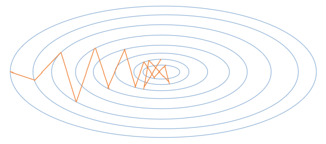
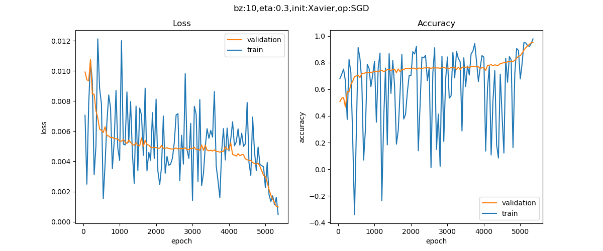
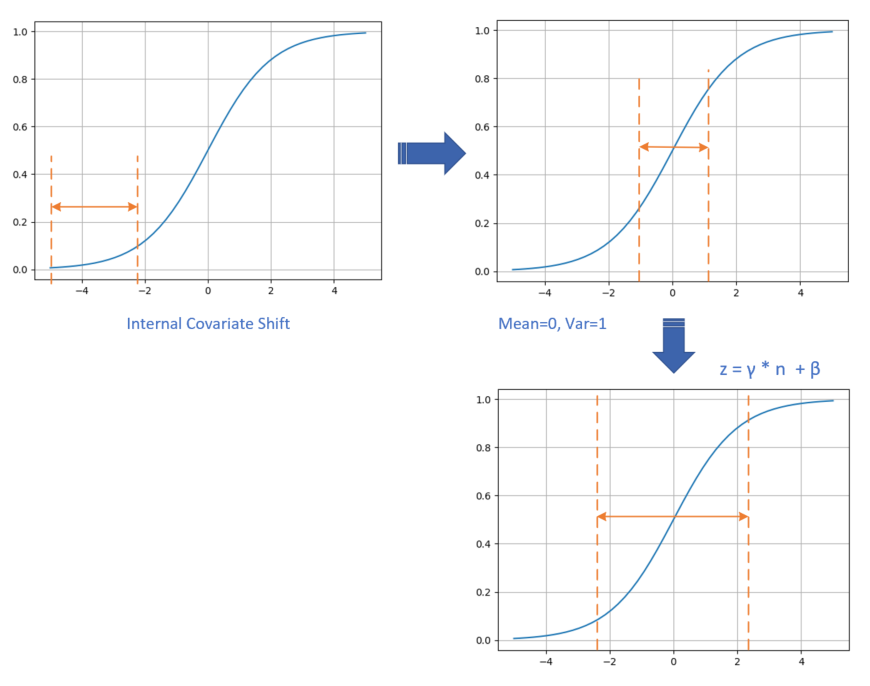
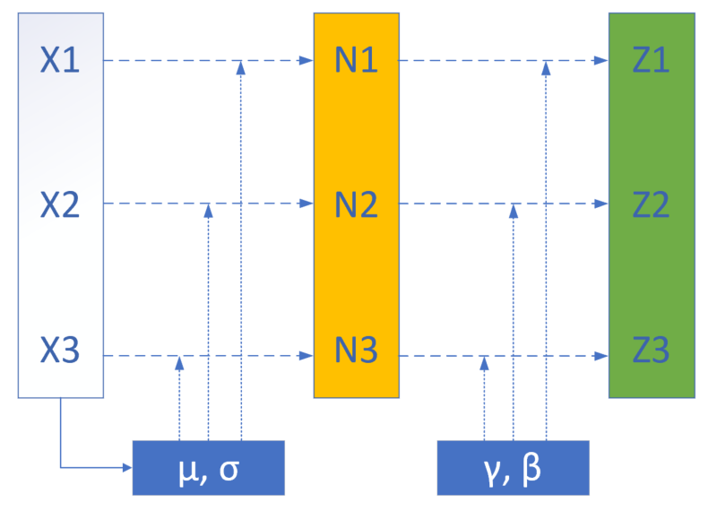
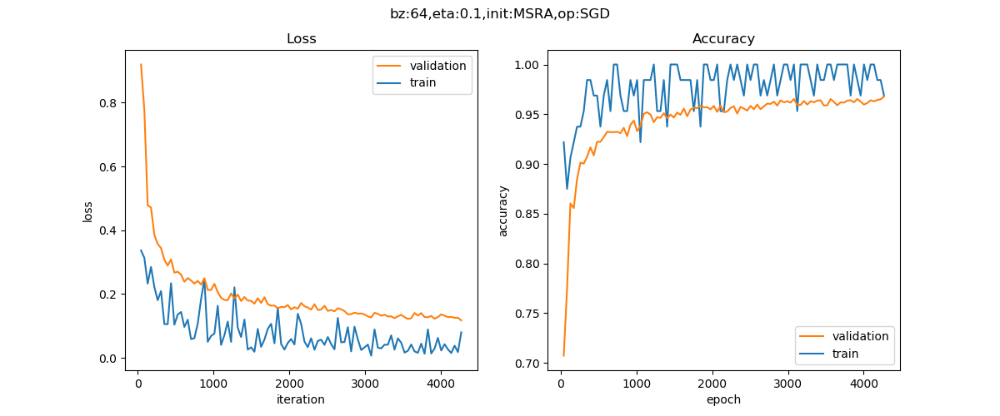

# 20200303第七次作业
## 学号：201702040   姓名：陈少辉
### 一、网络优化
#### （1）权重矩阵初始化
①零初始化

即把所有层的W值的初始值都设置为0。
$$
W = 0
$$

但是对于多层网络来说，绝对不能用零初始化，否则权重值不能学习到合理的结果。看下面的零值初始化的权重矩阵值打印输出：
```
W= [[-0.82452497 -0.82452497 -0.82452497]]
B= [[-0.01143752 -0.01143752 -0.01143752]]
W= [[-0.68583865]
 [-0.68583865]
 [-0.68583865]]
B= [[0.68359678]]
```

可以看到W1、B1、W2内部3个单元的值都一样，这是因为初始值都是0，所以梯度均匀回传，导致所有w的值都同步更新，没有差别。这样的话，无论多少论，最终的结果也不会正确。

②随机初始化

把W初始化均值为0，方差为1的矩阵：

$$
W \sim G \begin{bmatrix} 0, 1 \end{bmatrix}
$$

当目标问题较为简单时，网络深度不大，所以用随机初始化就可以了。但是当使用深度网络时，会遇到这样的问题：


上图是一个6层的深度网络，使用全连接层+Sigmoid激活函数，图中表示的是各层激活函数的直方图。可以看到各层的激活值严重向两侧[0,1]靠近，从Sigmoid的函数曲线可以知道这些值的导数趋近于0，反向传播时的梯度逐步消失。处于中间地段的值比较少，对参数学习非常不利。

③ Xavier初始化方法

条件：正向传播时，激活值的方差保持不变；反向传播时，关于状态值的梯度的方差保持不变。

$$
W \sim U \begin{bmatrix} -\sqrt{{6 \over n_{input} + n_{output}}}, \sqrt{{6 \over n_{input} + n_{output}}} \end{bmatrix}
$$

假设激活函数关于0对称，且主要针对于全连接神经网络。适用于tanh和softsign。

即权重矩阵参数应该满足在该区间内的均匀分布。其中的W是权重矩阵，U是Uniform分布，即均匀分布。

④MSRA初始化方法

又叫做He方法，因为作者姓何。
条件：正向传播时，状态值的方差保持不变；反向传播时，关于激活值的梯度的方差保持不变。
### 二、梯度下降优化算法
#### （1）随机梯度下降 SGD
梯度搜索轨迹为示意图：



#### 输入和参数

- $\eta$ - 全局学习率

#### 算法

---

计算梯度：$g_t = \nabla_\theta J(\theta_{t-1})$

更新参数：$\theta_t = \theta_{t-1}  - \eta \cdot g_t$

---

随机梯度下降算法，在当前点计算梯度，根据学习率前进到下一点。到中点附近时，由于样本误差或者学习率问题，会发生来回徘徊的现象，很可能会错过最优解。

#### 实际效果

|学习率|损失函数与准确率|
|---|---|
|0.1||
|0.3||

SGD的另外一个缺点就是收敛速度慢，在学习率为0.1时，训练10000个epoch不能收敛到预定损失值；学习率为0.3时，训练5000个epoch可以收敛到预定水平。
#### （2）动量算法 Momentum


#### 输入和参数

- $\eta$ - 全局学习率
- $\alpha$ - 动量参数，一般取值为0.5, 0.9, 0.99
- $v_t$ - 当前时刻的动量，初值为0
  
#### 算法

---

计算梯度：$g_t = \nabla_\theta J(\theta_{t-1})$

计算速度更新：$v_t = \alpha \cdot v_{t-1} + \eta \cdot g_t$ (公式1)
 
更新参数：$\theta_t = \theta_{t-1}  - v_t$ (公式2)

---
#### （3）梯度加速算法 NAG

#### 输入和参数

- $\eta$ - 全局学习率
- $\alpha$ - 动量参数，缺省取值0.9
- v - 动量，初始值为0
  
#### 算法

---

临时更新：$\hat \theta = \theta_{t-1} - \alpha \cdot v_{t-1}$

前向计算：$f(\hat \theta)$

计算梯度：$g_t = \nabla_{\hat\theta} J(\hat \theta)$

计算速度更新：$v_t = \alpha \cdot v_{t-1} + \eta \cdot g_t$

更新参数：$\theta_t = \theta_{t-1}  - v_t$

---
### 三、自适应学习率算法
#### （1）AdaGrad
#### 输入和参数

- $\eta$ - 全局学习率
- $\epsilon$ - 用于数值稳定的小常数，建议缺省值为1e-6
- r = 0 初始值
  
#### 算法

---

计算梯度：$g_t = \nabla_\theta J(\theta_{t-1})$

累计平方梯度：$r_t = r_{t-1} + g_t \odot g_t$

计算梯度更新：$\Delta \theta = {\eta \over \epsilon + \sqrt{r_t}} \odot g_t$

更新参数：$\theta_t=\theta_{t-1} - \Delta \theta$

---
#### （2）AdaDelta
#### 输入和参数

- $\epsilon$ - 用于数值稳定的小常数，建议缺省值为1e-5
- $\alpha \in [0,1)$ - 衰减速率，建议0.9
- s - 累积变量，初始值0
- r - 累积变量变化量，初始为0
 
#### 算法

---

计算梯度：$g_t = \nabla_\theta J(\theta_{t-1})$

累积平方梯度：$s_t = \alpha \cdot s_{t-1} + (1-\alpha) \cdot g_t \odot g_t$

计算梯度更新：$\Delta \theta = \sqrt{r_{t-1} + \epsilon \over s_t + \epsilon} \odot g_t$

更新梯度：$\theta_t = \theta_{t-1} - \Delta \theta$

更新变化量：$r = \alpha \cdot r_{t-1} + (1-\alpha) \cdot \Delta \theta \odot \Delta \theta$

---
#### （3)均方根反向传播 RMSProp
#### 输入和参数

- $\eta$ - 全局学习率，建议设置为0.001
- $\epsilon$ - 用于数值稳定的小常数，建议缺省值为1e-8
- $\alpha$ - 衰减速率，建议缺省取值0.9
- $r$ - 累积变量矩阵，与$\theta$尺寸相同，初始化为0
  
#### 算法

---

计算梯度：$g_t = \nabla_\theta J(\theta_{t-1})$

累计平方梯度：$r = \alpha \cdot r + (1-\alpha)(g_t \odot g_t)$

计算梯度更新：$\Delta \theta = {\eta \over \sqrt{r + \epsilon}} \odot g_t$

更新参数：$\theta_{t}=\theta_{t-1} - \Delta \theta$

---
#### (4)Adam - Adaptive Moment Estimation

#### 输入和参数

- t - 当前迭代次数
- $\eta$ - 全局学习率，建议缺省值为0.001
- $\epsilon$ - 用于数值稳定的小常数，建议缺省值为1e-8
- $\beta_1, \beta_2$ - 矩估计的指数衰减速率，$\in[0,1)$，建议缺省值分别为0.9和0.999

#### 算法

---

计算梯度：$g_t = \nabla_\theta J(\theta_{t-1})$

计数器加一：$t=t+1$

更新有偏一阶矩估计：$m_t = \beta_1 \cdot m_{t-1} + (1-\beta_1) \cdot g_t$

更新有偏二阶矩估计：$v_t = \beta_2 \cdot v_{t-1} + (1-\beta_2)(g_t \odot g_t)$

修正一阶矩的偏差：$\hat m_t = m_t / (1-\beta_1^t)$

修正二阶矩的偏差：$\hat v_t = v_t / (1-\beta_2^t)$

计算梯度更新：$\Delta \theta = \eta \cdot \hat m_t /(\epsilon + \sqrt{\hat v_t})$

更新参数：$\theta_t=\theta_{t-1} - \Delta \theta$

---
### 四、批量归一化的原理
#### （1）正态分布
正态分布，又叫做高斯分布。

若随机变量X，服从一个位置参数为μ、尺度参数为σ的概率分布，且其概率密度函数为：

$$
f(x)={1 \over \sigma\sqrt{2 \pi} } e^{- {(x-\mu)^2} \over 2\sigma^2} \tag{1}
$$

则这个随机变量就称为正态随机变量，正态随机变量服从的分布就称为正态分布，记作：

$$
X \sim N(\mu,\sigma^2) \tag{2}
$$

当μ=0,σ=1时，称为标准正态分布：

$$X \sim N(0,1) \tag{3}$$

此时公式简化为：

$$
f(x)={1 \over \sqrt{2 \pi}} e^{- {x^2} \over 2} \tag{4}
$$

下图就是三种（μ, σ）组合的函数图像：


#### （2）批量归一化
既然可以把原始训练样本做归一化，那么如果在深度神经网络的每一层，都可以有类似的手段，也就是说把层之间传递的数据移到0点附近，那么训练效果就应该会很理想。这就是批归一化BN的想法的来源。

深度神经网络随着网络深度加深，训练起来越困难，收敛越来越慢，这是个在DL领域很接近本质的问题。很多论文都是解决这个问题的，比如ReLU激活函数，再比如Residual Network。BN本质上也是解释并从某个不同的角度来解决这个问题的。

BN就是在深度神经网络训练过程中使得每一层神经网络的输入保持相同的分布，致力于将每一层的输入数据正则化成$N(0,1)$的分布。因次，每次训练的数据必须是mini-batch形式，一般取32，64等数值。

具体的数据处理过程如下图所示：



1. 数据在训练过程中，在网络的某一层会发生Internal Covariate Shift，导致数据处于激活函数的饱和区；
2. 经过均值为0、方差为1的变换后，位移到了0点附近。但是只做到这一步的话，会带来两个问题：
   
   a. 在[-1,1]这个区域，Sigmoid激活函数是近似线性的，造成激活函数失去非线性的作用；
   
   b. 在二分类问题中我们学习过，神经网络把正类样本点推向了右侧，把负类样本点推向了左侧，如果再把它们强行向中间集中的话，那么前面学习到的成果就会被破坏；

3. 经过$\gamma、\beta$的线性变换后，把数据区域拉宽，则激活函数的输出既有线性的部分，也有非线性的部分，这就解决了问题a；而且由于$\gamma、\beta$也是通过网络进行学习的，所以以前学到的成果也会保持，这就解决了问题b。

在实际的工程中，我们把BN当作一个层来看待，一般架设在全连接层（或卷积层）与激活函数层之间。
#### （3）前向计算
#### 计算图（示意）

下图是一张示意的计算图，用于帮助我们搞清楚正向和反向的过程：



$X1,X2,X3$表示三个样本（实际上一般用32，64这样的批大小），我们假设每个样本只有一个特征值（否则X将会是一个样本数乘以特征值数量的矩阵）。
1. 先从一堆X中计算出$\mu_B$；
2. 再用X和$\mu_B$计算出$\sigma_B$；
3. 再用X和$\mu_B$、$\sigma_B$计算出$n_i$，每个x对应一个n；
4. 最后用$\gamma 和 \beta$，把n转换成z，每个z对应一个n。
#### （4）批量归一化的优点

1. 可以选择比较大的初始学习率，让你的训练速度提高。
   
    以前还需要慢慢调整学习率，甚至在网络训练到一定程度时，还需要想着学习率进一步调小的比例选择多少比较合适，现在我们可以采用初始很大的学习率，因为这个算法收敛很快。当然这个算法即使你选择了较小的学习率，也比以前的收敛速度快，因为它具有快速训练收敛的特性；

2. 减少对初始化的依赖
   
    一个不太幸运的初始化，可能会造成网络训练实际很长，甚至不收敛。

3. 减少对正则的依赖
   
   在第16章中，我们将会学习正则化知识，以增强网络的泛化能力。采用BN算法后，我们会逐步减少对正则的依赖，比如令人头疼的dropout、L2正则项参数的选择问题，或者可以选择更小的L2正则约束参数了，因为BN具有提高网络泛化能力的特性；
#### (5)批量归一化的实现
#### 代码实现

#### 初始化类

```Python
class BnLayer(CLayer):
    def __init__(self, input_size, momentum=0.9):
        self.gamma = np.ones((1, input_size))
        self.beta = np.zeros((1, input_size))
        self.eps = 1e-5
        self.input_size = input_size
        self.output_size = input_size
        self.momentum = momentum
        self.running_mean = np.zeros((1,input_size))
        self.running_var = np.zeros((1,input_size))
```
后面三个变量，momentum、running_mean、running_var，是为了计算/记录历史方差均差的。

#### 正向计算

```Python
    def forward(self, input, train=True):
        assert(input.ndim == 2 or input.ndim == 4)  # fc or cv
        self.x = input

        if train:
            # 公式6
            self.mu = np.mean(self.x, axis=0, keepdims=True)
            # 公式7
            self.x_mu  = self.x - self.mu
            self.var = np.mean(self.x_mu**2, axis=0, keepdims=True) + self.eps
            # 公式8
            self.std = np.sqrt(self.var)
            self.norm_x = self.x_mu / self.std
            # 公式9
            self.z = self.gamma * self.norm_x + self.beta
            # mean and var history, for test/inference
            self.running_mean = self.momentum * self.running_mean + (1.0 - self.momentum) * self.mu
            self.running_var = self.momentum * self.running_var + (1.0 - self.momentum) * self.var
        else:
            self.mu = self.running_mean
            self.var = self.running_var
            self.norm_x = (self.x - self.mu) / np.sqrt(self.var + self.eps)
            self.z = self.gamma * self.norm_x + self.beta
        # end if
        return self.z
```
前向计算完全按照上一节中的公式6到公式9实现。要注意在训练/测试阶段的不同算法，用train是否为True来做分支判断。

#### 反向传播

```Python
    def backward(self, delta_in, flag):
        assert(delta_in.ndim == 2 or delta_in.ndim == 4)  # fc or cv
        m = self.x.shape[0]
        # calculate d_beta, b_gamma
        # 公式11
        self.d_gamma = np.sum(delta_in * self.norm_x, axis=0, keepdims=True)
        # 公式12
        self.d_beta = np.sum(delta_in, axis=0, keepdims=True)

        # calculate delta_out
        # 公式14
        d_norm_x = self.gamma * delta_in 
        # 公式16
        d_var = -0.5 * np.sum(d_norm_x * self.x_mu, axis=0, keepdims=True) / (self.var * self.std) # == self.var ** (-1.5)
        # 公式18
        d_mu = -np.sum(d_norm_x / self.std, axis=0, keepdims=True) - 2 / m * d_var * np.sum(self.x_mu, axis=0, keepdims=True)
        # 公式13
        delta_out = d_norm_x / self.std + d_var * 2 * self.x_mu / m + d_mu / m
        #return delta_out, self.d_gamma, self.d_beta
        return delta_out
```
#### 主程序代码

```Python
if __name__ == '__main__':

    dataReader = LoadData()
    num_feature = dataReader.num_feature
    num_example = dataReader.num_example
    num_input = num_feature
    num_hidden1 = 128
    num_hidden2 = 64
    num_hidden3 = 32
    num_hidden4 = 16
    num_output = 10
    max_epoch = 30
    batch_size = 64
    learning_rate = 0.1

    params = HyperParameters_4_1(
        learning_rate, max_epoch, batch_size,
        net_type=NetType.MultipleClassifier,
        init_method=InitialMethod.MSRA,
        stopper=Stopper(StopCondition.StopLoss, 0.12))

    net = NeuralNet_4_1(params, "MNIST")

    fc1 = FcLayer_1_1(num_input, num_hidden1, params)
    net.add_layer(fc1, "fc1")
    bn1 = BnLayer(num_hidden1)
    net.add_layer(bn1, "bn1")
    r1 = ActivationLayer(Relu())
    net.add_layer(r1, "r1")
    
    fc2 = FcLayer_1_1(num_hidden1, num_hidden2, params)
    net.add_layer(fc2, "fc2")
    bn2 = BnLayer(num_hidden2)
    net.add_layer(bn2, "bn2")
    r2 = ActivationLayer(Relu())
    net.add_layer(r2, "r2")

    fc3 = FcLayer_1_1(num_hidden2, num_hidden3, params)
    net.add_layer(fc3, "fc3")
    bn3 = BnLayer(num_hidden3)
    net.add_layer(bn3, "bn3")
    r3 = ActivationLayer(Relu())
    net.add_layer(r3, "r3")
    
    fc4 = FcLayer_1_1(num_hidden3, num_hidden4, params)
    net.add_layer(fc4, "fc4")
    bn4 = BnLayer(num_hidden4)
    net.add_layer(bn4, "bn4")
    r4 = ActivationLayer(Relu())
    net.add_layer(r4, "r4")

    fc5 = FcLayer_1_1(num_hidden4, num_output, params)
    net.add_layer(fc5, "fc5")
    softmax = ClassificationLayer(Softmax())
    net.add_layer(softmax, "softmax")

    net.train(dataReader, checkpoint=0.05, need_test=True)
    net.ShowLossHistory(xcoord=XCoordinate.Iteration)
```

#### 运行结果


### 五、、总结
这次的课程让我对网络优化有了一个较为清晰的学习和认识，我在这次课中学习到了很多关于网络优化的具体算法。梯度下降优化算法和自适应学习率算法这两个算法对网络优化有很大的帮助，它们的具体算法涉及到一定的数学公式，所以要学好并具体应用这些算法需要我们认真掌握原理和具备一定的基础知识。学完这两个算法后，我们又学习了批量归一化的原理及其实现这一部分知识，归一化就是在深度神经网络训练过程中使得每一层神经网络的输入保持相同的分布，致力于将每一层的输入数据正则化成$N(0,1)$的分布。批量归一化有如下的优点：1. 可以选择比较大的初始学习率，让你的训练速度提高；2. 减少对初始化的依赖；3. 减少对正则的依赖。所以说归一化在神经网络方面有很大的优点，它能处理一些比较特殊的问题，带来了问题的简化。

这次课我还是学习到了很多的知识，掌握了一些优化算法的原理及其使用，但是在代码运行阶段，我还是难免遇到了一些问题。例如在运行时报一些没有相应的库或函数，但是通过网络查询信息杂乱，需要自己一个一个进行比较。这次我不仅学到了神经网络的具体理论，更加锻炼了我的编程及找BUG的能力，解决相关问题的能力。我也知道神经网络是一个比较前沿的技术热点，但是我相信通过自己的不断学习，我能对神经网络有一个整体的把握。