# 陈子良 Step7总结
## 搭建深度神经网络框架

1. NeuralNet
2. Layer
3. Activator Layer
4. Classification Layer
5. Parameters
6. LossFunction
7. Optimizer
8. WeightsBias
9. DataReader

## 回归试验 - 万能近似定理

>>>>代码运行结果

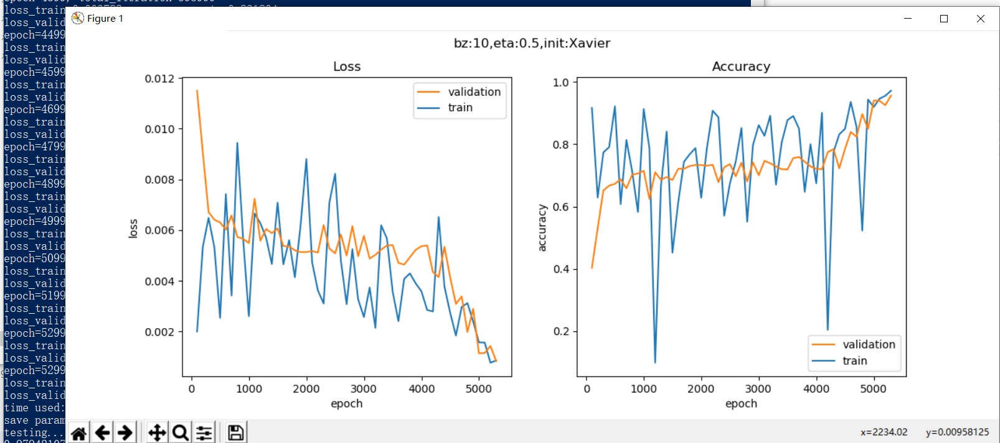
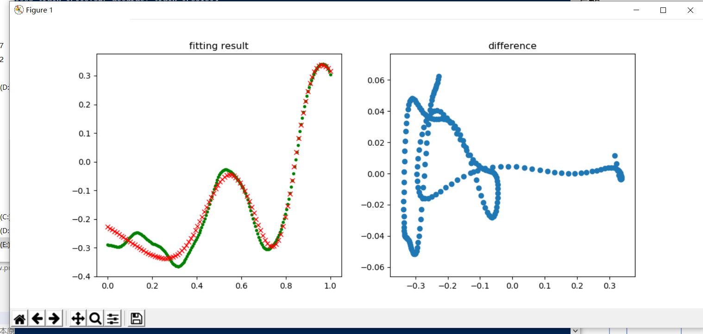

设置了eps=0.001，所以在5000多个epoch时便达到了要求，训练停止。最后用测试集得到的准确率为98.17%，已经非常不错了。如果训练更多的轮，可以得到更好的结果。

## 反向传播四大公式推导
著名的反向传播四大公式是：

  $$\delta^{L} = \nabla_{a}C \odot \sigma_{'}(Z^L) \tag{80}$$
  $$\delta^{l} = ((W^{l + 1})^T\delta^{l+1})\odot\sigma_{'}(Z^l) \tag{81}$$
  $$\frac{\partial{C}}{\partial{b_j^l}} = \delta_j^l \tag{82}$$
  $$\frac{\partial{C}}{\partial{w_{jk}^{l}}} = a_k^{l-1}\delta_j^l \tag{83}$$

### 直观理解反向传播四大公式
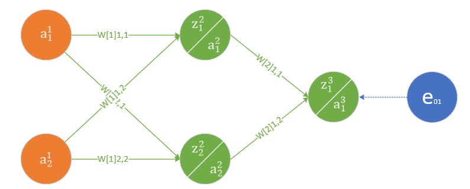

## 回归任务 - 房价预测
>>>>代码运行结果

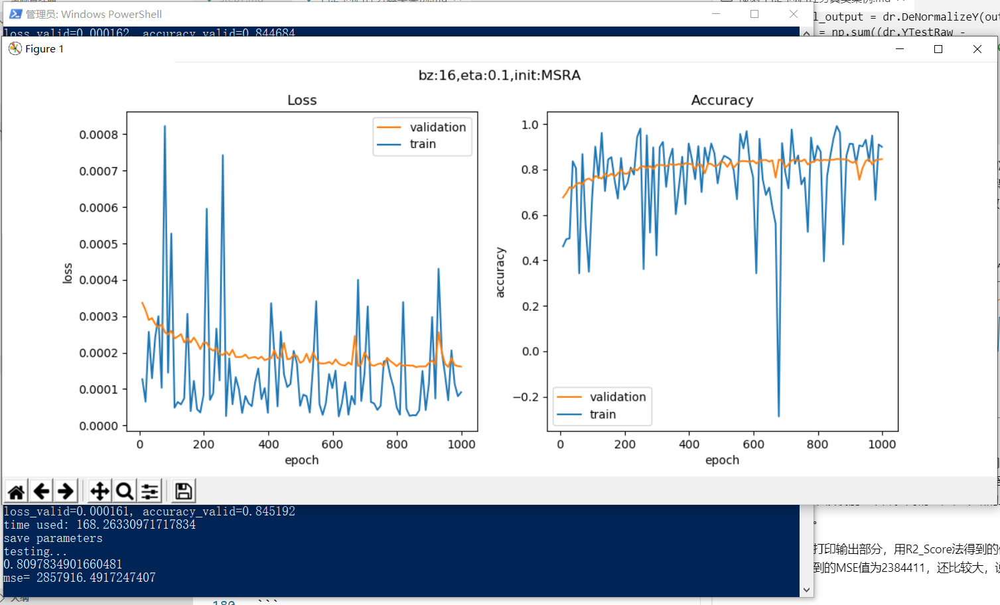
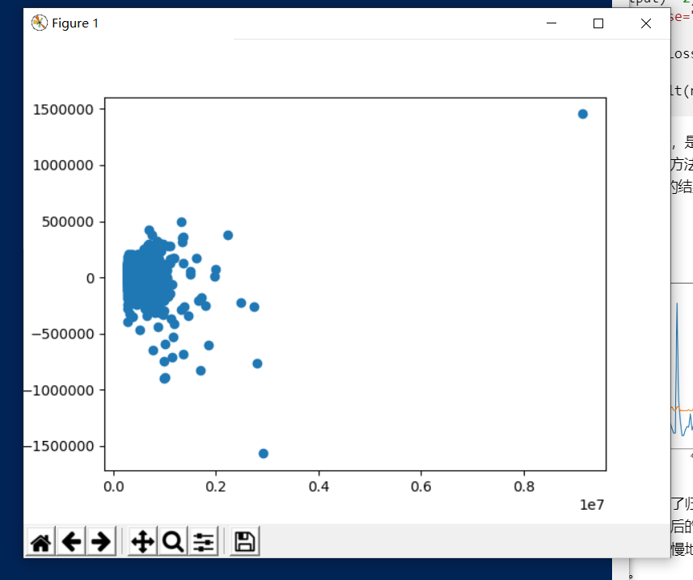

## 网络优化
随着网络的加深，训练变得越来越困难，时间越来越长，原因可能是：
- 参数多
- 数据量大
- 梯度消失
- 损失函数坡度平缓

为了解决上面这些问题，科学家们在深入研究网络表现的前提下，发现在下面这些方向上经过一些努力，可以给深度网络的训练带来或多或少的改善：
- 权重矩阵初始化
- 批量归一化
- 梯度下降优化算法
- 自适应学习率算法

## 权重矩阵初始化

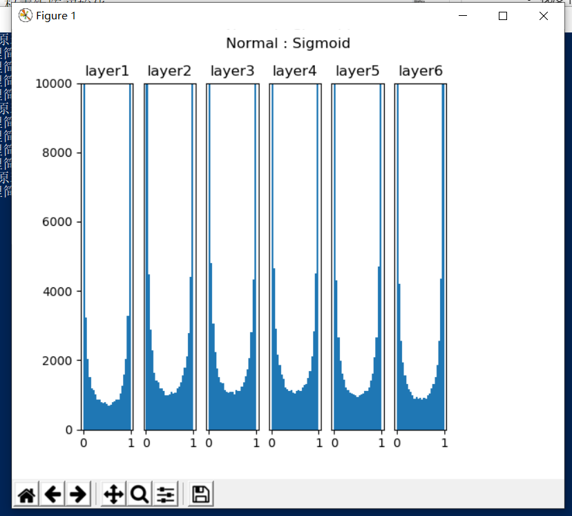
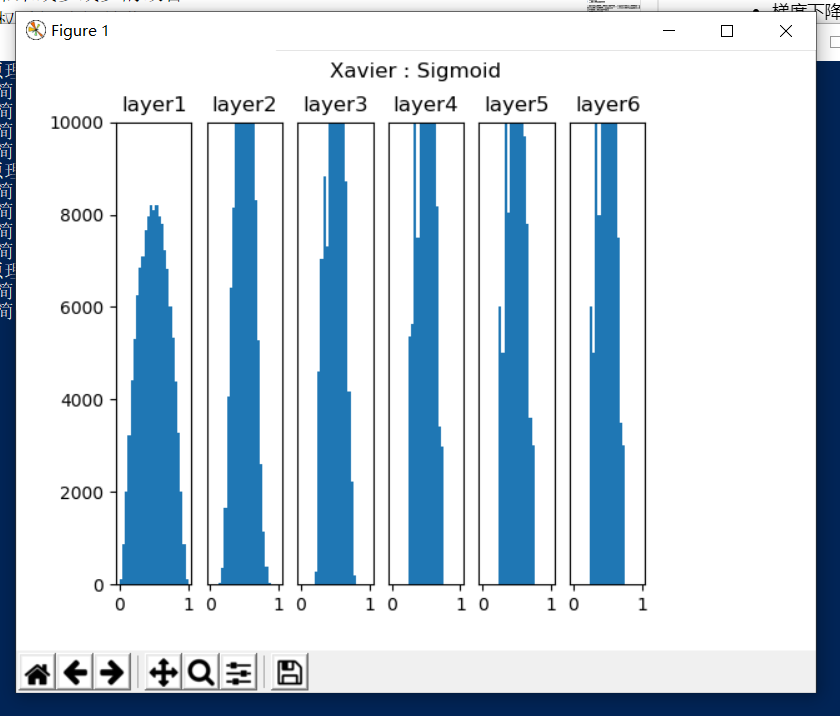

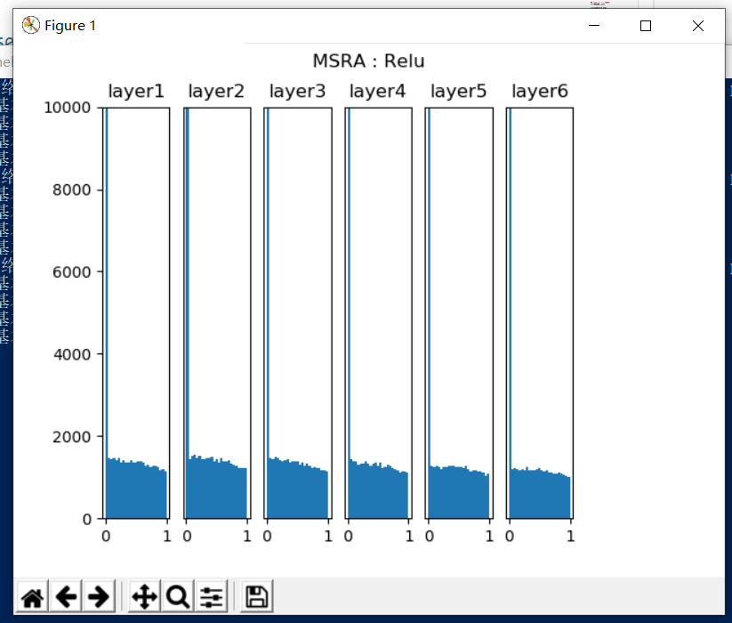
|ID|网络深度|初始化方法|激活函数|说明|
|---|---|---|---|---|
|1|单层|Zero|无|可以|
|2|双层层|Zero|Sigmoid|错误，不能进行正确的反向传播|
|3|双层|Normal|Sigmoid|可以|
|4|多层|Normal|Sigmoid|激活值分布成凹形，不利于反向传播|
|5|多层|Xavier|Sigmoid|正确|
|6|多层|Xavier|Relu|激活值分布偏向0，不利于反向传播|
|7|多层|MSRA|Relu|正确|

## 梯度下降优化算法
>>>>代码运行结果
### 随机梯度下降 SGD

|学习率|损失函数与准确率|
|---|---|
|0.1||
|0.3||
SGD的另外一个缺点就是收敛速度慢，在学习率为0.1时，训练10000个epoch不能收敛到预定损失值；学习率为0.3时，训练5000个epoch可以收敛到预定水平。**从运行时间也可以看出0.1是63.8s，0.3是35.6s**。
### 动量算法 Momentum

|算法|损失函数和准确率|
|---|---|
|SGD||
|Momentum||
从上图的比较可以看到，使用同等的超参数设置，普通梯度下降算法经过epoch=10000次没有到达预定0.001的损失值；动量算法经过2000个epoch迭代结束。
### 梯度加速算法 NAG

|算法|损失函数和准确率|
|---|---|
|Momentum||
|NAG|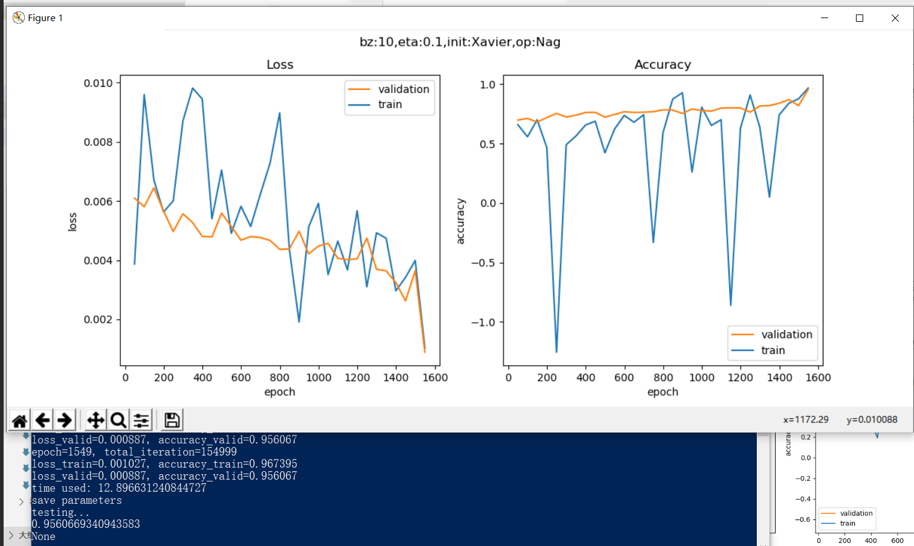|

使用动量算法经过2000个epoch迭代结束，NAG算法是加速的动量法，因此只用1400个epoch迭代结束。

NAG 可以使 RNN 在很多任务上有更好的表现。

## 自适应学习率算法
>>>>代码运行结果
### AdaGrad

|初始学习率|损失函数值变化|
|---|---|
|eta=0.3|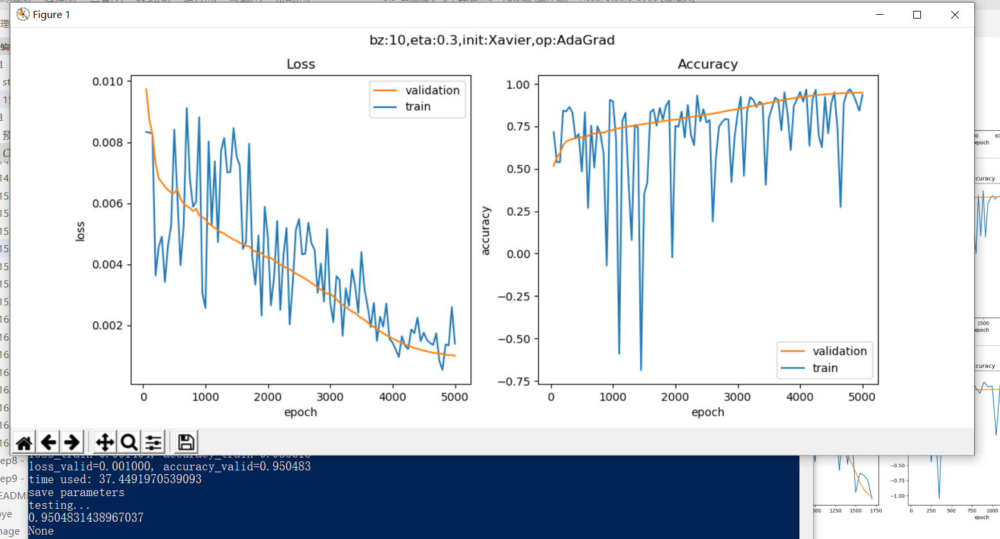|
|eta=0.5||
|eta=0.7|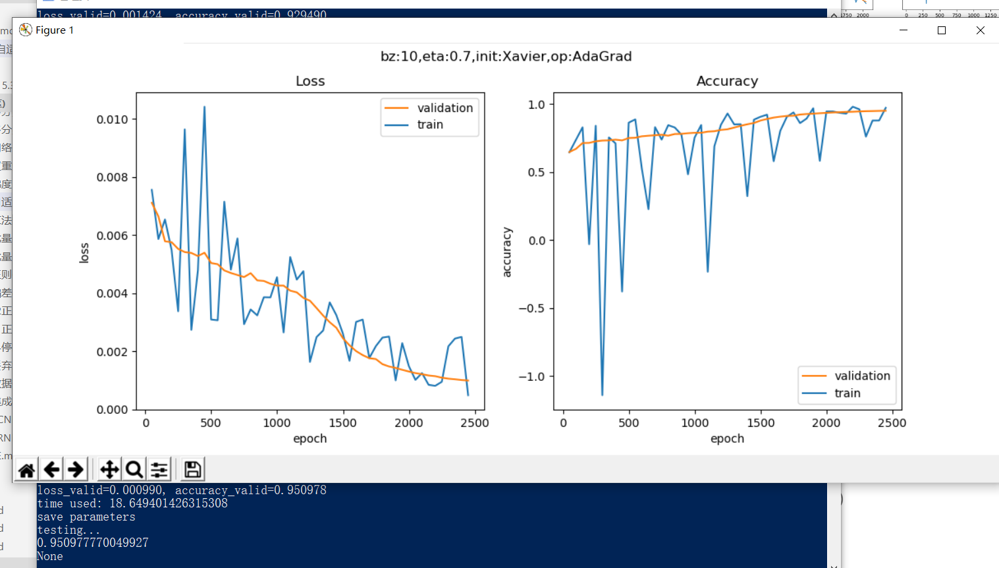|

我们设定不同的初始学习率，分别为0.3、0.5、0.7，可以看到学习率为0.7时，收敛得最快，只用1750个epoch；学习率为0.5时用了3000个epoch；学习率为0.3时用了8000个epoch。所以，对于AdaGrad来说，可以在开始时把学习率的值设置大一些，因为它会衰减得很快。

### AdaDelta
|初始学习率|损失函数值|
|---|---|
|eta=0.1|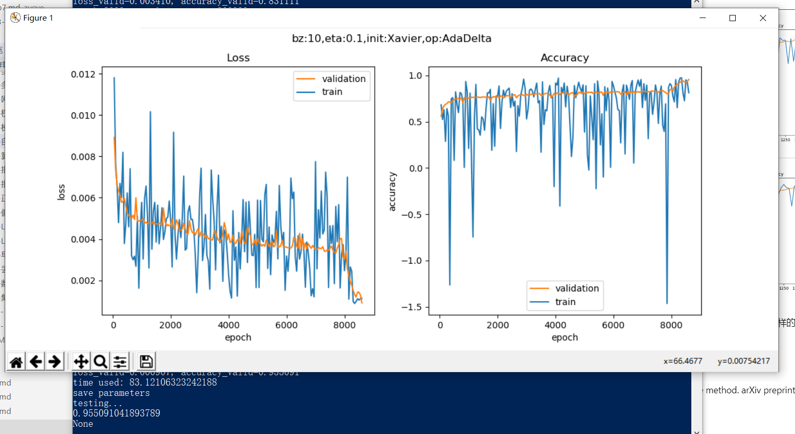|
|eta=0.01||

从上图中可以看到，初始学习率设置为0.1或者0.01，对于本算法来说都是一样的，这是因为算法中用r来代替学习率。

### 均方根反向传播 RMSProp

|初始学习率|损失函数值|
|---|---|
|eta=0.1||
||迭代了10000次，损失值一直在0.005下不来，说明初始学习率太高了，需要给一个小一些的初值|
|eta=0.01|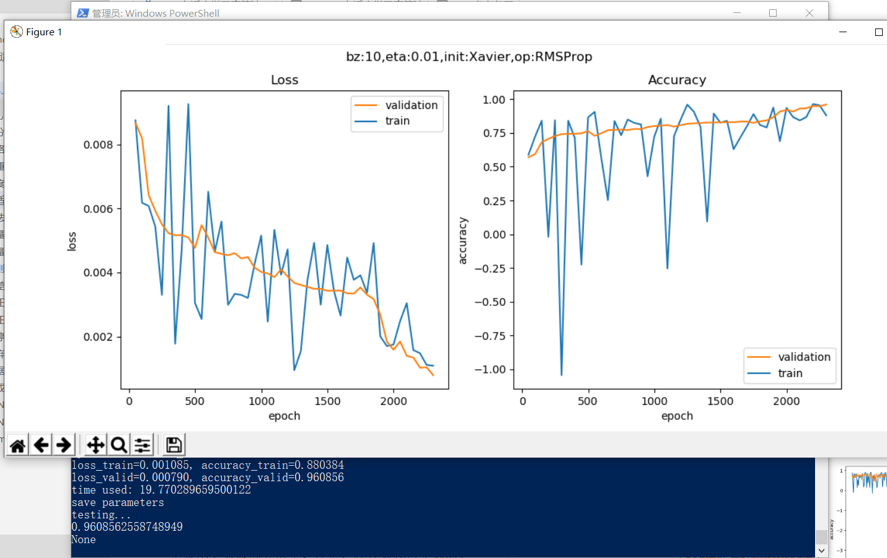|
||合适的学习率初值设置||
|eta=0.005||
||初值稍微小了些，造成迭代次数增加才能到达精度要求||

从上面的试验可以看出，0.01是本示例最好的设置。

### Adam - Adaptive Moment Estimation
|初始学习率|损失函数值|
|---|---|
|eta=0.1|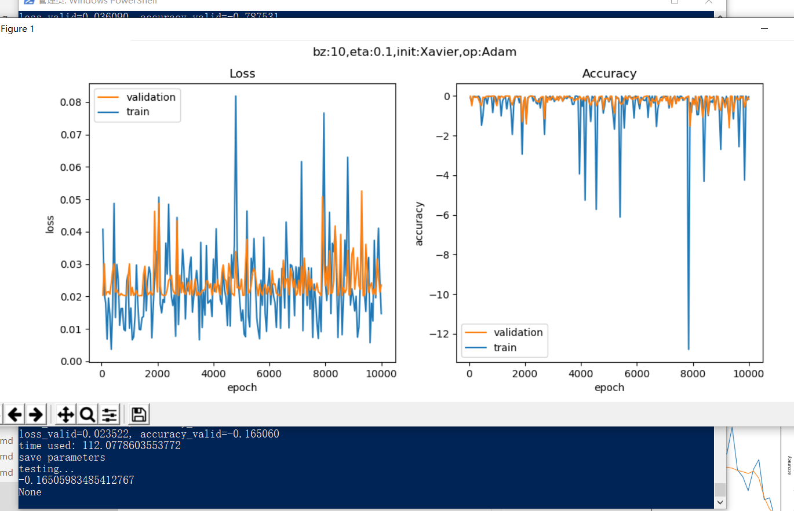|
||迭代了10000次，但是损失值没有降下来，因为初始学习率0.1太高了|
|eta=0.01||
||比较合适的学习率|
|eta=0.005||
||学习率较低|
|eta=0.001||
||初始学习率太低，收敛到目标损失值的速度慢|

由于Adam继承了RMSProp的传统，所以学习率不宜设置太高，从上面的比较可以看到，初始学习率设置为0.01时比较理想。

## 批量归一化
>>>>运行结果

### 归一化得实现
>>>>运行结果

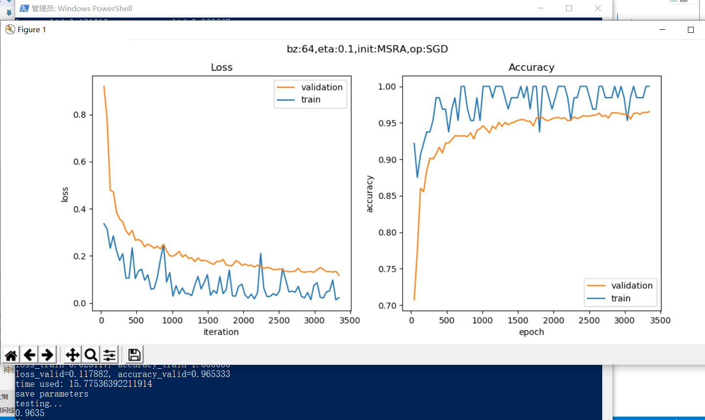

## 正则化
### 过拟合的例子
>>>>代码运行

我们故意把最大epoch次数设置得比较大，以充分展示过拟合效果。训练结束后，首先看损失函数值和精度值的变化曲线：

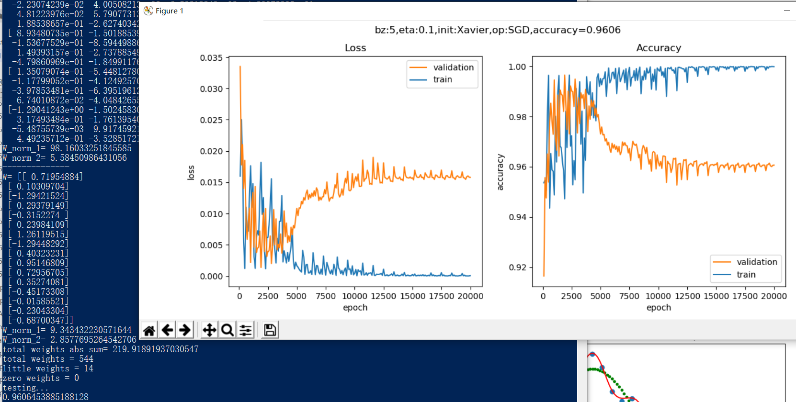

蓝色为训练集，红色为验证集。可以看到，训练集上的损失函数值很快降低到极点，精确度很快升高到极点，而验证集上的表现正好相反。说明网络对训练集很适应，但是越来越不适应验证集数据，出现了严重的过拟合。验证集的精确度为0.9605。

再看下图的拟合情况：

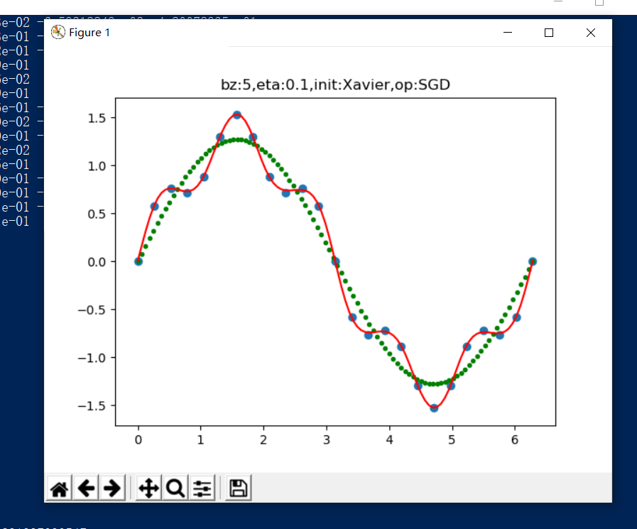

红色拟合曲线严丝合缝地拟合了每一个样本点，也就是说模型学习到了样本的误差。绿色点所组成的曲线，才是我们真正想要的拟合结果。

## 偏差与方差

- 偏差：度量了学习算法的期望与真实结果的偏离程度，即学习算法的拟合能力。
- 方差：训练集与验证集的差异造成的模型表现的差异。
- 噪声：当前数据集上任何算法所能到达的泛化误差的下线，即学习问题本身的难度。

想当然地，我们希望偏差与方差越小越好，但实际并非如此。一般来说，偏差与方差是有冲突的，称为偏差-方差窘境 (bias-variance dilemma)。

## L2正则
>>>>运行结果

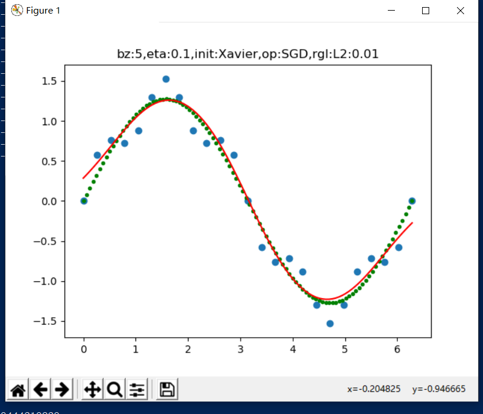
## L1正则
>>>>运行结果

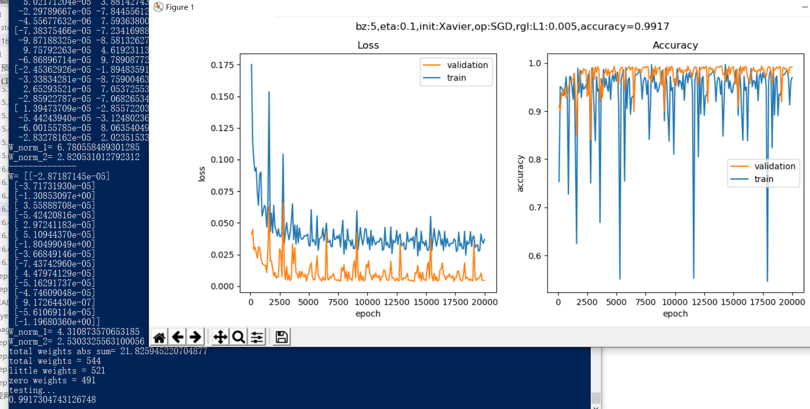

## 早停法
一般的做法是，在训练的过程中，记录到目前为止最好的validation 准确率，当连续N次Epoch（比如N=10或者更多次）没达到最佳准确率时，则可以认为准确率不再提高了。此时便可以停止迭代了（Early Stopping）。这种策略也称为“No-improvement-in-N”，N即Epoch的次数，可以根据实际情况取，如10、20、30……

>>>>运行结果

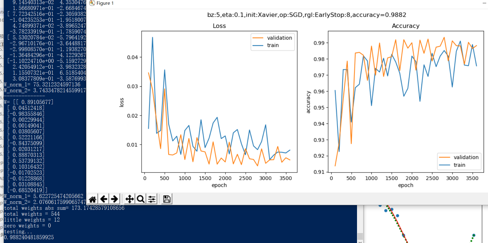

## 丢弃法
Dropout可以作为训练深度神经网络的一种正则方法供选择。在每个训练批次中，通过忽略一部分的神经元（让其隐层节点值为0），可以明显地减少过拟合现象。这种方式可以减少隐层节点间的相互作用，高层的神经元需要低层的神经元的输出才能发挥作用，如果高层神经元过分依赖某个低层神经元，就会有过拟合发生。在一次正向/反向的过程中，通过随机丢弃一些神经元，迫使高层神经元和其它的一些低层神经元协同工作，可以有效地防止神经元因为接收到过多的同类型参数而陷入过拟合的状态，来提高泛化程度。

>>>>运行结果

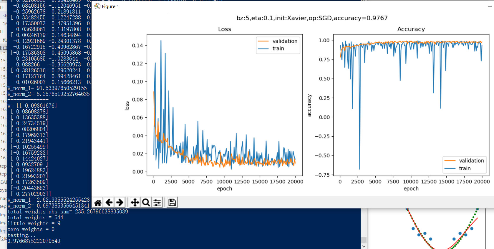
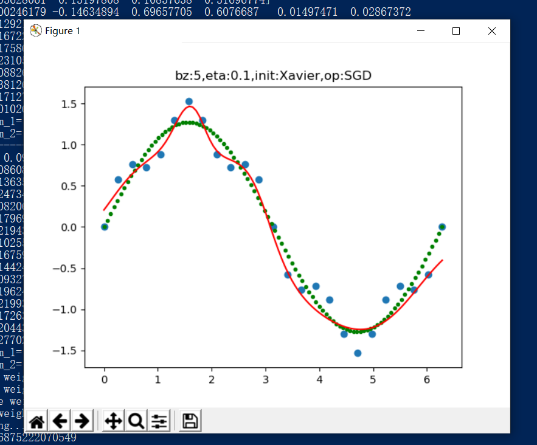
## 数据扩展
>>>>代码运行

### **生成  5 0 4 数据**
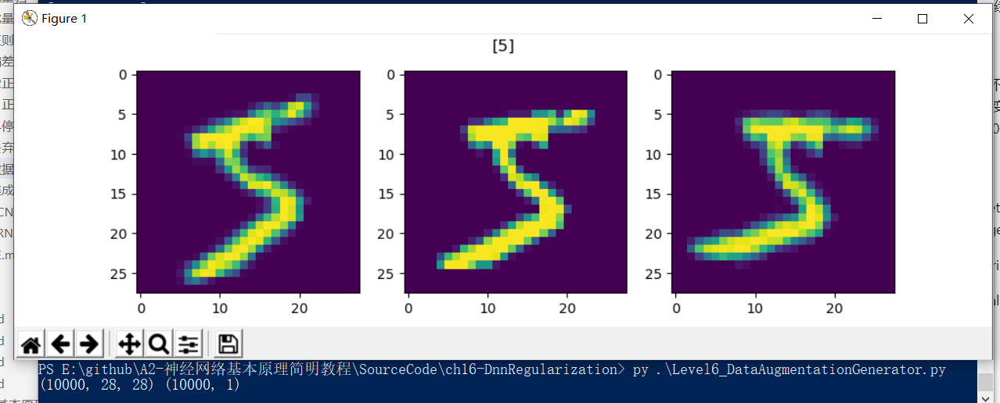

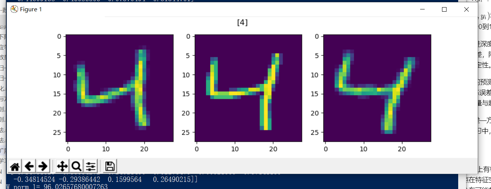
### **训练数据**
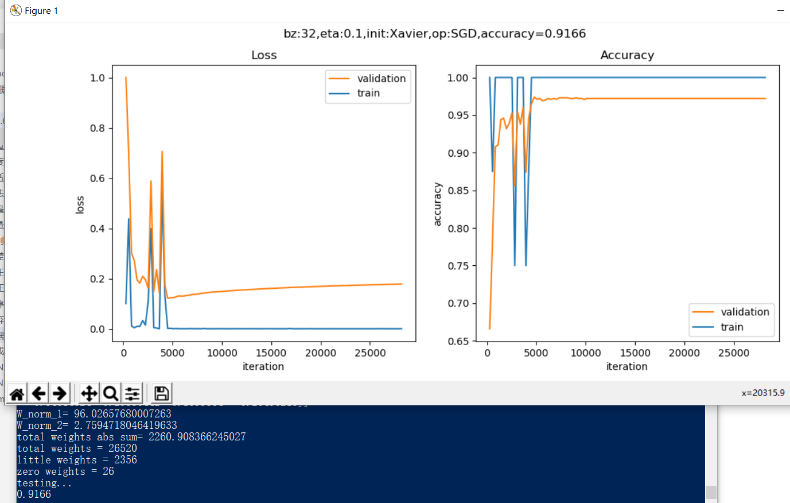