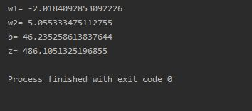
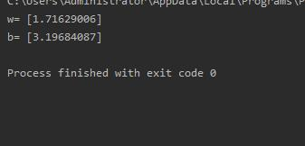
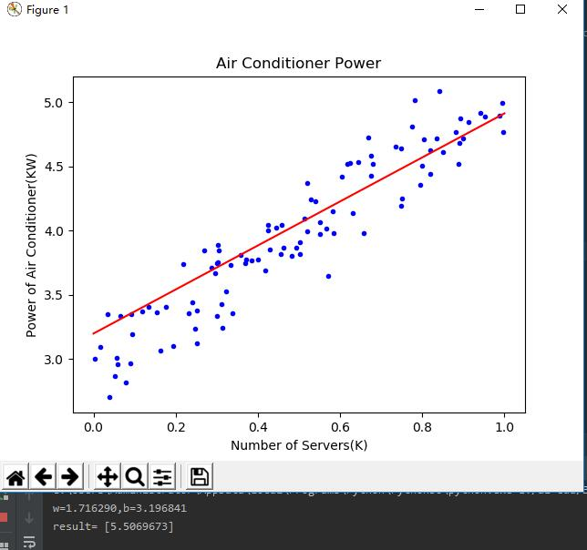
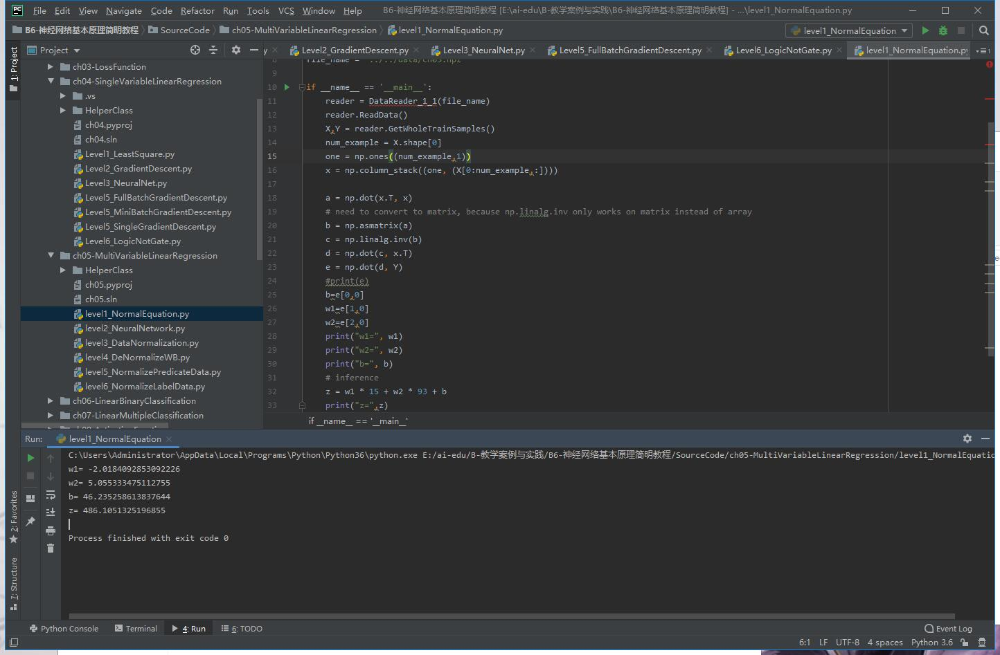

## 第三天学习
### 线性回归
用线性回归作为学习神经网络的起点，是一个非常好的选择，因为线性回归问题本身比较容易理解，在它的基础上，逐步的增加一些新的知识点，会形成一条比较平缓的学习曲线，或者说是迈向神经网络的第一个小台阶。

单层的神经网络，其实就是一个神经元，可以完成一些线性的工作，比如拟合一条直线，这用一个神经元就可以实现。当这个神经元只接收一个输入时，就是单变量线性回归，可以在二维平面上用可视化方法理解。当接收多个变量输入时，叫做多变量线性回归，此时可视化方法理解就比较困难了，通常我们会用变量两两组对的方式来表现。

当变量多于一个时，两个变量的量纲和数值有可能差别很大，这种情况下，我们通常需要对样本特征数据做归一化，然后把数据喂给神经网络进行训练，否则会出现“消化不良”的情况。


### 单入单出单层-单变量线性回归
回归分析是一种数学模型。当因变量和自变量为线性关系时，它是一种特殊的线性模型。

最简单的情形是一元线性回归，由大体上有线性关系的一个自变量和一个因变量组成，模型是：

$$Y=a+bX+ε \tag{1}$$

X是自变量，Y是因变量，ε是随机误差，a和b是参数，在线性回归模型中，a和b是我们要通过算法学习出来的。

对于线性回归模型，有如下一些概念需要了解：

- 通常假定随机误差的均值为0，方差为σ^2（σ^2﹥0，σ^2与X的值无关）
- 若进一步假定随机误差遵从正态分布，就叫做正态线性模型
- 一般地，若有k个自变量和1个因变量（即公式1中的Y），则因变量的值分为两部分：一部分由自变量影响，即表示为它的函数，函数形式已知且含有未知参数；另一部分由其他的未考虑因素和随机性影响，即随机误差
- 当函数为参数未知的线性函数时，称为线性回归分析模型
- 当函数为参数未知的非线性函数时，称为非线性回归分析模型
- 当自变量个数大于1时称为多元回归
- 当因变量个数大于1时称为多重回归

解决方法
1. 最小二乘法
2. 梯度下降法
3. 简单的神经网络法
4. 更通用的神经网络算法

通过这几种方法的代码的运行，

## 多入单出单层-多变量线性回归
对于一般的应用问题，建立多元线性回归模型时，为了保证回归模型具有优良的解释能力和预测效果，应首先注意自变量的选择，其准则是：
1. 自变量对因变量必须有显著的影响，并呈密切的线性相关；
2. 自变量与因变量之间的线性相关必须是真实的，而不是形式上的；
3. 自变量之间应具有一定的互斥性，即自变量之间的相关程度不应高于自变量与因变量之因的相关程度；
4. 自变量应具有完整的统计数据，其预测值容易确定。

### 解决方案

如果用传统的数学方法解决这个问题，我们可以使用正规方程，从而可以得到数学解析解，然后再使用神经网络方式来求得近似解，从而比较两者的精度，再进一步调试神经网络的参数，达到学习的目的。

我们不妨先把两种方式在这里做一个对比，读者阅读并运行代码，得到结果后，再回到这里来仔细体会下面这个表格中的比较项：

|方法|正规方程|梯度下降|
|---|-----|-----|
|原理|几次矩阵运算|多次迭代|
|特殊要求|$X^TX$的逆矩阵存在|需要确定学习率|
|复杂度|$O(n^3)$|$O(n^2)$|
|适用样本数|$m \lt 10000$|$m \ge 10000$|


### 实验代码结果
最小二乘法
ch04 level1
 

梯度下降法
```Python
if __name__ == '__main__':

    reader = SimpleDataReader()
    reader.ReadData()
    X,Y = reader.GetWholeTrainSamples()

    eta = 0.1
    w, b = 0.0, 0.0
    for i in range(reader.num_train):
        # get x and y value for one sample
        xi = X[i]
        yi = Y[i]
        # 公式1
        zi = xi * w + b
        # 公式3
        dz = zi - yi
        # 公式4
        dw = dz * xi
        # 公式5
        db = dz
        # update w,b
        w = w - eta * dw
        b = b - eta * db

    print("w=", w)    
    print("b=", b)
```
 

 神经网络法
  

  正规方程法
   
   
## 梯度下降的三种形式

 + 单样本随机梯度下降:特点:训练样本：每次使用一个样本数据进行一次训练，更新一次梯度，重复以上过程。
优点：训练开始时损失值下降很快，随机性大，找到最优解的可能性大。
缺点：受单个样本的影响最大，损失函数值波动大，到后期徘徊不前，在最优解附近震荡。不能并行计算。
结果 

结果
 
 + 小批量样本梯度下降:特点
训练样本：选择一小部分样本进行训练，更新一次梯度，然后再选取另外一小部分样本进行训练，再更新一次梯度。
优点：不受单样本噪声影响，训练速度较快。
缺点：batch size的数值选择很关键，会影响训练结果
运行结果：
 + 全批量样本梯度下降:特点:
训练样本：每次使用全部数据集进行一次训练，更新一次梯度，重复以上过程。
优点：受单个样本的影响最小，一次计算全体样本速度快，损失函数值没有波动，到达最优点平稳。方便并行计算。
缺点：
数据量较大时不能实现（内存限制），训练过程变慢。初始值不同，可能导致获得局部最优解，并非全局最优解。运行结果：
## 总结
由于今天学习的内容比较多，还有其他课程也需要学习完成，本节课说讲的内容也没有好好预习，学起来很费时间，代码只是跑了一遍，还没有认真去理解，今天没完成的留在周末继续完成，没有做到今日事今日毕还是有些遗憾。
经过后面的学习，把当天没做完的又完善了一遍，加深了映像。