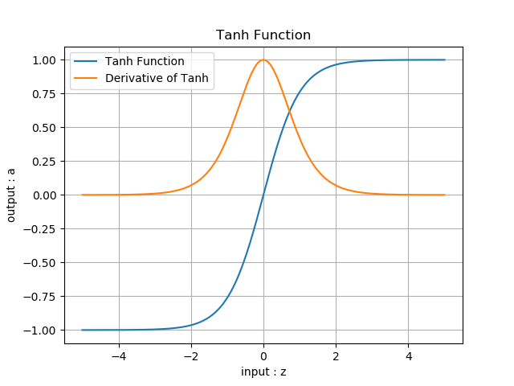

## 激活函数
## 激活函数的基本作用

看神经网络中的一个神经元，为了简化，假设该神经元接受三个输入，分别为$x_1, x_2, x_3$，那么：

$$z=x_1 w_1 + x_2 w_2 + x_3 w_3 +b \tag{1}$$
$$a = \sigma(z) \tag{2}$$
  
激活函数也就是$a=\sigma(z)$这一步了，他有什么作用呢？  

1. 给神经网络增加非线性因素，这个问题在第1章《神经网络基本工作原理》中已经讲过了；
2. 把公式1的计算结果压缩到[0,1]之间，便于后面的计算。

激活函数的基本性质：

+ 非线性：线性的激活函数和没有激活函数一样
+ 可导性：做误差反向传播和梯度下降，必须要保证激活函数的可导性
+ 单调性：单一的输入会得到单一的输出，较大值的输入得到较大值的输出

在物理试验中使用的继电器，是最初的激活函数的原型：当输入电流大于一个阈值时，会产生足够的磁场，从而打开下一级电源通道，如下图所示：
  
用到神经网络中的概念，用‘1’来代表一个神经元被激活，‘0’代表一个神经元未被激活。

这个Step函数有什么不好的地方呢？主要的一点就是，他的梯度（导数）恒为零（个别点除外)。反向传播公式中，梯度传递用到了链式法则，如果在这样一个连乘的式子其中有一项是零，这样的梯度就会恒为零，是没有办法进行反向传播的。

## 何时会用到激活函数

激活函数用在神经网络的层与层之间的连接，神经网络的最后一层不用激活函数。

神经网络不管有多少层，最后的输出层决定了这个神经网络能干什么。在单层神经网络中，我们学习到了以下示例：

|网络|输入|输出|激活函数|分类函数|功能|
|---|---|---|---|---|---|
|单层|单变量|单输出|无|无|线性回归|
|单层|多变量|单输出|无|无|线性回归|
|单层|多变量|单输出|无|二分类函数|二分类|
|单层|多变量|多输出|无|多分类函数|多分类|

从上表可以看到，我们一直没有使用激活函数，而只使用了分类函数。对于多层神经网络也是如此，在最后一层只会用到分类函数来完成二分类或多分类任务，如果是拟合任务，则不需要分类函数。

很多文字材料中通常把激活函数和分类函数混淆在一起说，原因其实只有一个：在二分类任务中使用的Logistic分类函数与在神经网络之间连接的Sigmoid激活函数，是同样的形式。所以它既是激活函数，又是分类函数，是个特例。

##  挤压型激活函数 Squashing Function

又可以叫饱和型激活函数，因为在输入值域的绝对值较大的时候，它的输出在两端是饱和的。挤压型激活函数中，用的最多的是Sigmoid函数，所谓Sigmoid函数，原意是指一类函数，它们都具有S形的函数曲线以及压缩输入值域的作用，所以又叫挤压型激活函数。

### 对数几率函数 Sigmoid Function

对率函数，在用于激活函数时常常被称为Sigmoid函数，因为它是最常用的Sigmoid函数。

#### 公式

$$a(z) = \frac{1}{1 + e^{-z}}$$

#### 导数

$$a^{'}(z) = a(z) \odot (1 - a(z))$$

利用公式33，令：$u=1，v=1+e^{-z}$ 则：

$$
a' = \frac{u'v-v'u}{v^2}=\frac{0-(1+e^{-z})'}{(1+e^{-z})^2}
$$
$$
=\frac{e^{-z}}{(1+e^{-z})^2}
=\frac{1+e^{-z}-1}{(1+e^{-z})^2}
$$
$$
=\frac{1}{1+e^{-z}}-(\frac{1}{1+e^{-z}})^2
$$
$$
=a-a^2=a(1-a)
$$

#### 值域

输入值域：$[-\infty, \infty]$

输出值域：$[0,1]$

#### 函数图像

  

#### 优点

从函数图像来看，sigmoid函数的作用是将输入压缩到(0, 1)这个区间范围内，这种输出在0~1之间的函数可以用来模拟一些概率分布的情况。他还是一个连续函数，导数简单易求。  

从数学上来看，Sigmoid函数对中央区的信号增益较大，对两侧区的信号增益小，在信号的特征空间映射上，有很好的效果。 

从神经科学上来看，中央区酷似神经元的兴奋态，两侧区酷似神经元的抑制态，因而在神经网络学习方面，可以将重点特征推向中央区，
将非重点特征推向两侧区。

分类功能：我们经常听到这样的对白“你觉得这件事情成功概率有多大？”“我有六成把握能成功”。sigmoid函数在这里就起到了如何把一个数值转化成一个通俗意义上的把握的表示。值越大，那么这个神经元对于这张图里有这样一条线段的把握就越大，经过sigmoid函数之后的结果就越接近100%，也就是1这样一个值，表现在图里，也就是这个神经元越兴奋（亮）。

#### 缺点

exp()计算代价大。

反向传播时梯度消失：从梯度图像中可以看到，sigmoid的梯度在两端都会接近于0，根据链式法则，如果传回的误差是$\delta$，那么梯度传递函数是$\delta \cdot a'(z)$，而$a'(z)$这时是零，也就是说整体的梯度是零。这也就很容易出现梯度消失的问题，并且这个问题可能导致网络收敛速度比较慢，比如采取MSE作为损失函数算法时。

给个纯粹数学的例子吧，假定我们的学习速率是0.2，sigmoid函数值是0.9，如果我们想把这个函数的值降到0.5，需要经过多少步呢？

我们先来做数值计算：

第一步，求出当前输入的值

$$\frac{1}{1 + e^{-z}} = 0.9$$
$$e^{-z} = \frac{1}{9}$$
$$x = ln{9}$$

第二步，求出当前梯度

$$\Delta = a(z)\times(1 - a(z)) = 0.9 \times 0.1= 0.09$$

第三步，根据梯度更新当前输入值

$$z_{new} = z - \eta \times \Delta = ln{9} - 0.2 \times 0.09 = ln(9) - 0.018$$

第四步，判断当前函数值是否接近0.5

$$\frac{1}{1 + e^{-z_{new}}} = 0.898368$$

第五步，重复步骤2-3直到当前函数值接近0.5

###  Tanh函数

TanHyperbolic，双曲正切函数。

#### 公式  
$$a(z) = \frac{e^{z} - e^{-z}}{e^{z} + e^{-z}} = \frac{2}{1 + e^{-2z}} - 1$$

$$a(z) = 2 \cdot Sigmoid(2z) - 1$$

#### 导数公式

$$a'(z) = (1 + a(z)) \odot (1 - a(z))$$

利用基本导数公式23，令：$u={e^{z}-e^{-z}}，v=e^{z}+e^{-z}$ 则

$$
a'=\frac{u'v-v'u}{v^2} \tag{71}
$$
$$
=\frac{(e^{z}-e^{-z})'(e^{z}+e^{-z})-(e^{z}+e^{-z})'(e^{z}-e^{-z})}{(e^{z}+e^{-z})^2}
$$
$$
=\frac{(e^{z}+e^{-z})(e^{z}+e^{-z})-(e^{z}-e^{-z})(e^{z}-e^{-z})}{(e^{z}+e^{-z})^2}
$$
$$
=\frac{(e^{z}+e^{-z})^2-(e^{z}-e^{-z})^2}{(e^{z}+e^{-z})^2}
$$
$$
=1-(\frac{(e^{z}-e^{-z}}{e^{z}+e^{-z}})^2=1-a^2
$$

#### 值域

输入值域：$[-\infty, \infty]$

输出值域：$[-1,1]$

#### 函数图像

  

#### 优点

具有Sigmoid的所有优点。

无论从理论公式还是函数图像，这个函数都是一个和sigmoid非常相像的激活函数，他们的性质也确实如此。但是比起sigmoid，tanh减少了一个缺点，就是他本身是零均值的，也就是说，在传递过程中，输入数据的均值并不会发生改变，这就使他在很多应用中能表现出比sigmoid优异一些的效果。

#### 缺点

exp()计算代价大。

梯度消失。

##  半线性激活函数

又可以叫非饱和型激活函数。

###  ReLU函数 

Rectified Linear Unit，修正线性单元，线性整流函数，斜坡函数。

#### 公式

$$a(z) = max(0,z) = \begin{Bmatrix} 
  z & (z \geq 0) \\ 
  0 & (z < 0) 
\end{Bmatrix}$$

#### 导数

$$a'(z) = \begin{cases} 1 & z \geq 0 \\ 0 & z < 0 \end{cases}$$

#### 值域

输入值域：$[-\infty, \infty]$

输出值域：$[0,\infty]$

导数值域：$[0,1]$

  
## 总结
随着课程的更加深入，我越发明白了机器学习的重要性，这充分开拓了我们的视野，我也知道了激活函数的重要性，在两层神经网络之间，必须有激活函数连接，从而加入非线性因素，提高神经网络的能力。非线性问题我们经常遇到，这次我学会了如何去处理非线性问题，使用线性回归去处理此类问题是一个很不错的办法。这也和数学思想相契合，所以在平常的学习中也得仔细思考。