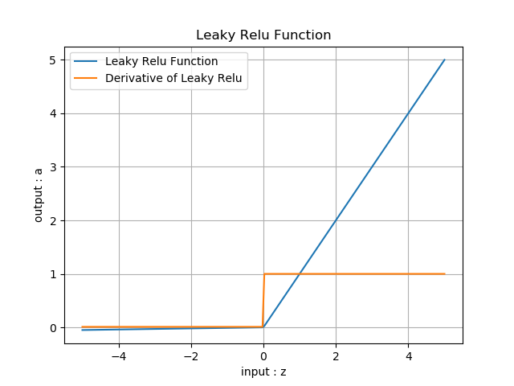

# Step4 非线性回归
## 一、激活函数
### 1.基本作用

看神经网络中的一个神经元，为了简化，假设该神经元接受三个输入，分别为$x_1, x_2, x_3$，那么：

$$z=x_1 w_1 + x_2 w_2 + x_3 w_3 +b \tag{1}$$
$$a = \sigma(z) \tag{2}$$

    1. 给神经网络增加非线性因素，这个问题在第1章《神经网络基本工作原理》中已经讲过了；
    2. 把公式1的计算结果压缩到[0,1]之间，便于后面的计算。

**激活函数的基本性质：**

    非线性：线性的激活函数和没有激活函数一样
    可导性：做误差反向传播和梯度下降，必须要保证激活函数的可导性
    单调性：单一的输入会得到单一的输出，较大值的输入得到较大值的输出

在物理试验中使用的继电器，是最初的激活函数的原型：当输入电流大于一个阈值时，会产生足够的磁场，从而打开下一级电源通道，如下图所示：


用到神经网络中的概念，用‘1’来代表一个神经元被激活，‘0’代表一个神经元未被激活。
### 2、挤压型激活函数 Squashing Function
**对数几率函数 Sigmoid Function**

对率函数，在用于激活函数时常常被称为Sigmoid函数，因为它是最常用的Sigmoid函数。

**公式**
$$a(z) = \frac{1}{1 + e^{-z}}$$


**Tanh函数**
TanHyperbolic，双曲正切函数。

$$a(z) = \frac{e^{z} - e^{-z}}{e^{z} + e^{-z}} = \frac{2}{1 + e^{-2z}} - 1$$

$$a(z) = 2 \cdot Sigmoid(2z) - 1$$
**导数公式**

$$a'(z) = (1 + a(z)) \odot (1 - a(z))$$
**函数图像**


### 3、 半线性激活函数
**ReLU函数**

Rectified Linear Unit，修正线性单元，线性整流函数，斜坡函数。

**公式**

$$a(z) = max(0,z) = \begin{Bmatrix} 
  z & (z \geq 0) \\ 
  0 & (z < 0) 
\end{Bmatrix}$$

**导数**

$$a'(z) = \begin{cases} 1 & z \geq 0 \\ 0 & z < 0 \end{cases}$$

**Leaky ReLU函数**

PReLU，带泄露的线性整流函数。

**公式**

$$a(z) = \begin{cases} z & z \geq 0 \\ \alpha * z & z < 0 \end{cases}$$

**导数**

$$a'(z) = \begin{cases} z & 1 \geq 0 \\ \alpha & z < 0 \end{cases}$$

**函数图像**



## 二、 单入单出的双层神经网络
### 1、用多项式回归法拟合正弦曲线
**用二次多项式拟合**

鉴于以上的认知，我们要考虑使用几次的多项式来拟合正弦曲线。在没有什么经验的情况下，可以先试一下二次多项式，即：

$$z = x w_1 + x^2 w_2 + b \tag{5}$$

从SimpleDataReader类中派生出子类DataReaderEx，然后添加Add()方法，先计算XTrain第一列的平方值放入矩阵X中，然后再把X合并到XTrain右侧，这样XTrain就变成了两列，第一列是x的原始值，第二列是x的平方值。

**主程序**

在主程序中，先加载数据，做数据增强，然后建立一个net，参数num_input=2，对应着XTrain中的两列数据，相当于两个特征值，

```Python
if __name__ == '__main__':
    dataReader = DataReaderEx(file_name)
    dataReader.ReadData()
    dataReader.Add()
    print(dataReader.XTrain.shape)

    # net
    num_input = 2
    num_output = 1
    params = HyperParameters(num_input, num_output, eta=0.2, max_epoch=10000, batch_size=10, eps=0.005, net_type=NetType.Fitting)
    net = NeuralNet(params)
    net.train(dataReader, checkpoint=10)
    ShowResult(net, dataReader, params.toString())
```

### 2.**用三次多项式拟合**

**公式：**

$$z = x w_1 + x^2 w_2 + x^3 w_3 + b \tag{6}$$

在二次多项式的基础上，把训练数据的再增加一列x的三次方，作为一个新的特征。以下为数据增强代码：

```Python
class DataReaderEx(SimpleDataReader):
    def Add(self):
        X = self.XTrain[:,]**2
        self.XTrain = np.hstack((self.XTrain, X))
        X = self.XTrain[:,0:1]**3
        self.XTrain = np.hstack((self.XTrain, X))
```
同时修改主过程参数中的num_input值：

```Python
    num_input = 3
```

### 3.**双层神经网络实现非线性回归**

**定义神经网络结构**

通过观察样本数据的范围，x是在[0,1]，y是[-0.5,0.5]，这样我们就不用做数据归一化了。这条线看起来像一条处于攻击状态的眼镜蛇！由于是拟合任务，所以标签值y是一系列的实际数值，并不是0/1这样的特殊标记。

根据万能近似定理的要求，我们定义一个两层的神经网络，输入层不算，一个隐藏层，含3个神经元，一个输出层。

为什么用3个神经元呢？因为输入层只有一个特征值，我们不需要在隐层放很多的神经元，先用3个神经元试验一下。如果不够的话再增加，神经元数量是由超参控制的。

$$

**权重矩阵W1/B1**

$$
W1=
\begin{pmatrix}
w^1_{11} & w^1_{12} & w^1_{13}
\end{pmatrix}
$$

$$
B1=
\begin{pmatrix}
b^1_{1} & b^1_{2} & b^1_{3} 
\end{pmatrix}
$$

**权重矩阵W2/B2**

W2的尺寸是3x1，B2的尺寸是1x1。
$$
W2=
\begin{pmatrix}
w^2_{11} \\
w^2_{21} \\
w^2_{31}
\end{pmatrix}
$$

$$
B2=
\begin{pmatrix}
b^2_{1}
\end{pmatrix}
$$

**输出层**

由于我们只想完成一个拟合任务，所以输出层只有一个神经元：

$$
Z2 = 
\begin{pmatrix}
    z^2_{1}
\end{pmatrix}
$$

**反向传播**
```Python
class NeuralNet2(object):
    def backward(self, batch_x, batch_y, batch_a):
        # 批量下降，需要除以样本数量，否则会造成梯度爆炸
        m = batch_x.shape[0]
        # 第二层的梯度输入 
        dZ2 = self.A2 - batch_y
        # 第二层的权重和偏移 
        self.wb2.dW = np.dot(self.A1.T, dZ2)/m 
        # 公式7 对于多样本计算，需要在横轴上做sum，得到平均值
        self.wb2.dB = np.sum(dZ2, axis=0, keepdims=True)/m 
        # 第一层的梯度输入 
        d1 = np.dot(dZ2, self.wb2.W.T) 
        # 第一层的dZ 公式10
        dZ1,_ = Sigmoid().backward(None, self.A1, d1)
        # 第一层的权重和偏移 
        self.wb1.dW = np.dot(batch_x.T, dZ1)/m
        # 公式12 对于多样本计算，需要在横轴上做sum，得到平均值
        self.wb1.dB = np.sum(dZ1, axis=0, keepdims=True)/m 
```

## 三、总结
    在这一步的学习中我们开始接触到神经网络较为复杂的内容，两层神经网络来解决非线性问题。下面则是我对两层神经网络的理解。激活函数是学习它的基础，而激活函数分为两类，一类是挤压型的激活函数，常用于简单网络的学习；另一类是半线性的激活函数则常用于深度网络的学习。在两层神经网络之间，必须有激活函数连接，从而加入非线性因素，提高神经网络的能力。
    这一步的学习后感觉自己开始有一些乏力，很多东西通过讲解不太能懂，不过在网络上找到一些网友简单通俗的讲解明白了其作用，这也让我发现神经网络的学习才真正开始，而对之前学习的知识一定要加强应用。


