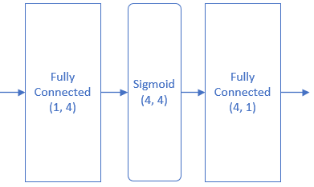
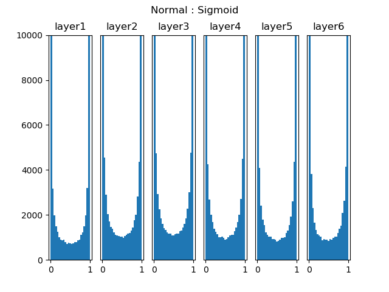

# Step7 深度神经网络
## 一、搭建深度神经网络框架
### 1.搭建深度神经网络框架

**功能/模式分析**

```Python
def backward3(dict_Param,cache,X,Y):
    ...
    # layer 3
    dZ3= A3 - Y
    dW3 = np.dot(dZ3, A2.T)
    dB3 = np.sum(dZ3, axis=1, keepdims=True)
    # layer 2
    dZ2 = np.dot(W3.T, dZ3) * (1-A2*A2) # tanh
    dW2 = np.dot(dZ2, A1.T)
    dB2 = np.sum(dZ2, axis=1, keepdims=True)
    # layer 1
    dZ1 = np.dot(W2.T, dZ2) * A1 * (1-A1)   #sigmoid
    dW1 = np.dot(dZ1, X.T)
    dB1 = np.sum(dZ1, axis=1, keepdims=True)
    ...
```
因为三层网络比两层网络多了一层，所以会在初始化、前向、反向、更新参数等四个环节有所不同，但却是有规律的。

**NeuralNet**

我们首先需要一个NeuralNet类，来包装基本的神经网络结构和功能：

- Layers - 神经网络各层的容器，按添加顺序维护一个列表
- Parameters - 基本参数，包括普通参数和超参
- Loss Function - 提供计算损失函数值，存储历史记录并最后绘图的功能
- LayerManagement() - 添加神经网络层
- ForwardCalculation() - 调用各层的前向计算方法
- BackPropagation() - 调用各层的反向传播方法
- PreUpdateWeights() - 预更新各层的权重参数
- UpdateWeights() - 更新各层的权重参数
- Train() - 训练
- SaveWeights() - 保存各层的权重参数
- LoadWeights() - 加载各层的权重参数

**Layer**

是一个抽象类，以及更加需要增加的实际类，包括：
- Fully Connected Layer
- Classification Layer
- Activator Layer
- Dropout Layer
- Batch Norm Layer

将来还会包括：
- Convolution Layer
- Max Pool Layer

每个Layer都包括以下基本方法：
 - ForwardCalculation() - 调用本层的前向计算方法
 - BackPropagation() - 调用本层的反向传播方法
 - PreUpdateWeights() - 预更新本层的权重参数
 - UpdateWeights() - 更新本层的权重参数
 - SaveWeights() - 保存本层的权重参数
 - LoadWeights() - 加载本层的权重参数

**Activator Layer**

激活函数和分类函数：

- Identity - 直传函数，即没有激活处理
- Sigmoid
- Tanh
- Relu

**Classification Layer**

分类函数，包括：
- Sigmoid二分类
- Softmax多分类


**Parameters**

 基本神经网络运行参数：

 - 学习率
 - 最大epoch
 - batch size
 - 损失函数定义
 - 初始化方法
 - 优化器类型
 - 停止条件
 - 正则类型和条件

**LossFunction**

损失函数及帮助方法：

- 均方差函数
- 交叉熵函数二分类
- 交叉熵函数多分类
- 记录损失函数
- 显示损失函数历史记录
- 获得最小函数值时的权重参数

**Optimizer**

优化器：

- SGD
- Momentum
- Nag
- AdaGrad
- AdaDelta
- RMSProp
- Adam

**WeightsBias**

权重矩阵，仅供全连接层使用：

- 初始化 
  - Zero, Normal, MSRA (HE), Xavier
  - 保存初始化值
  - 加载初始化值
- Pre_Update - 预更新
- Update - 更新
- Save - 保存训练结果值
- Load - 加载训练结果值

**DataReader**

样本数据读取器：

- ReadData - 从文件中读取数据
- NormalizeX - 归一化样本值
- NormalizeY - 归一化标签值
- GetBatchSamples - 获得批数据
- ToOneHot - 标签值变成OneHot编码用于多分类
- ToZeorOne - 标签值变成0/1编码用于二分类
- Shuffle - 打乱样本顺序

从中派生出两个数据读取器：
- MnistImageDataReader - 读取MNIST数据
- CifarImageReader - 读取Cifar10数据
### 2、搭建模型


```Python
def model():
    dataReader = LoadData()
    num_input = 1
    num_hidden1 = 4
    num_output = 1

    max_epoch = 10000
    batch_size = 10
    learning_rate = 0.5

    params = HyperParameters_4_0(
        learning_rate, max_epoch, batch_size,
        net_type=NetType.Fitting,
        init_method=InitialMethod.Xavier,
        stopper=Stopper(StopCondition.StopLoss, 0.001))

    net = NeuralNet_4_0(params, "Level1_CurveFittingNet")
    fc1 = FcLayer_1_0(num_input, num_hidden1, params)
    net.add_layer(fc1, "fc1")
    sigmoid1 = ActivationLayer(Sigmoid())
    net.add_layer(sigmoid1, "sigmoid1")
    fc2 = FcLayer_1_0(num_hidden1, num_output, params)
    net.add_layer(fc2, "fc2")

    net.train(dataReader, checkpoint=100, need_test=True)

    net.ShowLossHistory()
    ShowResult(net, dataReader)
```


### 3、神经网络反向传播四大公式
著名的反向传播四大公式是：

  $$\delta^{L} = \nabla_{a}C \odot \sigma_{'}(Z^L) \tag{80}$$
  $$\delta^{l} = ((W^{l + 1})^T\delta^{l+1})\odot\sigma_{'}(Z^l) \tag{81}$$
  $$\frac{\partial{C}}{\partial{b_j^l}} = \delta_j^l \tag{82}$$
  $$\frac{\partial{C}}{\partial{w_{jk}^{l}}} = a_k^{l-1}\delta_j^l \tag{83}$$
  
## 二、二分类任务功能测试
### 1.二分类试验 - 双弧形非线性二分类
**Logistic二分类函数来完成二分类任务：**

```Python

def model(dataReader):
    num_input = 2
    num_hidden = 3
    num_output = 1

    max_epoch = 1000
    batch_size = 5
    learning_rate = 0.1

    params = HyperParameters_4_0(
        learning_rate, max_epoch, batch_size,
        net_type=NetType.BinaryClassifier,
        init_method=InitialMethod.Xavier,
        stopper=Stopper(StopCondition.StopLoss, 0.02))

    net = NeuralNet_4_0(params, "Arc")

    fc1 = FcLayer_1_0(num_input, num_hidden, params)
    net.add_layer(fc1, "fc1")
    sigmoid1 = ActivationLayer(Sigmoid())
    net.add_layer(sigmoid1, "sigmoid1")
    
    fc2 = FcLayer_1_0(num_hidden, num_output, params)
    net.add_layer(fc2, "fc2")
    logistic = ClassificationLayer(Logistic())
    net.add_layer(logistic, "logistic")

    net.train(dataReader, checkpoint=10, need_test=True)
    return net
```

## 三、多分类功能测试 
#### 1.搭建模型一
**使用Sigmoid做为激活函数的两层网络：**

```Python
def model_sigmoid(num_input, num_hidden, num_output, hp):
    net = NeuralNet_4_0(hp, "chinabank_sigmoid")

    fc1 = FcLayer_1_0(num_input, num_hidden, hp)
    net.add_layer(fc1, "fc1")
    s1 = ActivationLayer(Sigmoid())
    net.add_layer(s1, "Sigmoid1")

    fc2 = FcLayer_1_0(num_hidden, num_output, hp)
    net.add_layer(fc2, "fc2")
    softmax1 = ClassificationLayer(Softmax())
    net.add_layer(softmax1, "softmax1")

    net.train(dataReader, checkpoint=50, need_test=True)
    net.ShowLossHistory()
    
    ShowResult(net, hp.toString())
    ShowData(dataReader)

if __name__ == '__main__':
    dataReader = LoadData()
    num_input = dataReader.num_feature
    num_hidden = 8
    num_output = 3

    max_epoch = 5000
    batch_size = 10
    learning_rate = 0.1

    hp = HyperParameters_4_0(
        learning_rate, max_epoch, batch_size,
        net_type=NetType.MultipleClassifier,
        init_method=InitialMethod.Xavier,
        stopper=Stopper(StopCondition.StopLoss, 0.08))
    model_sigmoid(num_input, num_hidden, num_output, hp) 
```


### 2.搭建模型
使用Relu做为激活函数的三层网络：

用两层网络也可以实现，但是使用Relu函数时，训练效果不是很稳定，用三层比较保险。

**代码**

```Python
def model_relu(num_input, num_hidden, num_output, hp):
    net = NeuralNet_4_0(hp, "chinabank_relu")

    fc1 = FcLayer_1_0(num_input, num_hidden, hp)
    net.add_layer(fc1, "fc1")
    r1 = ActivationLayer(Relu())
    net.add_layer(r1, "Relu1")

    fc2 = FcLayer_1_0(num_hidden, num_hidden, hp)
    net.add_layer(fc2, "fc2")
    r2 = ActivationLayer(Relu())
    net.add_layer(r2, "Relu2")

    fc3 = FcLayer_1_0(num_hidden, num_output, hp)
    net.add_layer(fc3, "fc3")
    softmax = ClassificationLayer(Softmax())
    net.add_layer(softmax, "softmax")

    net.train(dataReader, checkpoint=50, need_test=True)
    net.ShowLossHistory()
    
    ShowResult(net, hp.toString())
    ShowData(dataReader)
    
if __name__ == '__main__':
    dataReader = LoadData()
    num_input = dataReader.num_feature
    num_hidden = 8
    num_output = 3

    max_epoch = 5000
    batch_size = 10
    learning_rate = 0.1

    hp = HyperParameters_4_0(
        learning_rate, max_epoch, batch_size,
        net_type=NetType.MultipleClassifier,
        init_method=InitialMethod.Xavier,
        stopper=Stopper(StopCondition.StopLoss, 0.08))
    #model_sigmoid(num_input, num_hidden, num_output, hp)
    hp.init_method = InitialMethod.MSRA
    model_relu(num_input, num_hidden, num_output, hp)
```

## 四、网络优化
### 1.权重矩阵初始化

即把所有层的W值的初始值都设置为0。
$$
W = 0
$$

但是对于多层网络来说，绝对不能用零初始化，否则权重值不能学习到合理的结果。看下面的零值初始化的权重矩阵值打印输出：
```
W= [[-0.82452497 -0.82452497 -0.82452497]]
B= [[-0.01143752 -0.01143752 -0.01143752]]
W= [[-0.68583865]
 [-0.68583865]
 [-0.68583865]]
B= [[0.68359678]]
```

可以看到W1、B1、W2内部3个单元的值都一样，这是因为初始值都是0，所以梯度均匀回传，导致所有w的值都同步更新，没有差别。这样的话，无论多少论，最终的结果也不会正确。

**随机初始化**

把W初始化均值为0，方差为1的矩阵：

$$
W \sim G \begin{bmatrix} 0, 1 \end{bmatrix}
$$

当目标问题较为简单时，网络深度不大，所以用随机初始化就可以了。但是当使用深度网络时，会遇到这样的问题：



上图是一个6层的深度网络，使用全连接层+Sigmoid激活函数，图中表示的是各层激活函数的直方图。可以看到各层的激活值严重向两侧[0,1]靠近，从Sigmoid的函数曲线可以知道这些值的导数趋近于0，反向传播时的梯度逐步消失。处于中间地段的值比较少，对参数学习非常不利。

**Xavier初始化方法**

条件：正向传播时，激活值的方差保持不变；反向传播时，关于状态值的梯度的方差保持不变。

$$
W \sim U \begin{bmatrix} -\sqrt{{6 \over n_{input} + n_{output}}}, \sqrt{{6 \over n_{input} + n_{output}}} \end{bmatrix}
$$

假设激活函数关于0对称，且主要针对于全连接神经网络。适用于tanh和softsign。

即权重矩阵参数应该满足在该区间内的均匀分布。其中的W是权重矩阵，U是Uniform分布，即均匀分布。

**MSRA初始化方法**

又叫做He方法，因为作者姓何。
条件：正向传播时，状态值的方差保持不变；反向传播时，关于激活值的梯度的方差保持不变。
## 五、梯度下降优化算法
### 1.随机梯度下降 SGD

**输入和参数**

- $\eta$ - 全局学习率

**算法**

---

计算梯度：$g_t = \nabla_\theta J(\theta_{t-1})$

更新参数：$\theta_t = \theta_{t-1}  - \eta \cdot g_t$

---

随机梯度下降算法，在当前点计算梯度，根据学习率前进到下一点。到中点附近时，由于样本误差或者学习率问题，会发生来回徘徊的现象，很可能会错过最优解。

### 2.动量算法 Momentum

**输入和参数**

- $\eta$ - 全局学习率
- $\alpha$ - 动量参数，一般取值为0.5, 0.9, 0.99
- $v_t$ - 当前时刻的动量，初值为0
  
**算法**

---

计算梯度：$g_t = \nabla_\theta J(\theta_{t-1})$

计算速度更新：$v_t = \alpha \cdot v_{t-1} + \eta \cdot g_t$ (公式1)
 
更新参数：$\theta_t = \theta_{t-1}  - v_t$ (公式2)

---
### 3.梯度加速算法 NAG

**输入和参数**

- $\eta$ - 全局学习率
- $\alpha$ - 动量参数，缺省取值0.9
- v - 动量，初始值为0
  
**算法**

---

临时更新：$\hat \theta = \theta_{t-1} - \alpha \cdot v_{t-1}$

前向计算：$f(\hat \theta)$

计算梯度：$g_t = \nabla_{\hat\theta} J(\hat \theta)$

计算速度更新：$v_t = \alpha \cdot v_{t-1} + \eta \cdot g_t$

更新参数：$\theta_t = \theta_{t-1}  - v_t$

---
## 六、自适应学习率算法
### 1.AdaGrad
**输入和参数**

- $\eta$ - 全局学习率
- $\epsilon$ - 用于数值稳定的小常数，建议缺省值为1e-6
- r = 0 初始值
  
**算法**

---

计算梯度：$g_t = \nabla_\theta J(\theta_{t-1})$

累计平方梯度：$r_t = r_{t-1} + g_t \odot g_t$

计算梯度更新：$\Delta \theta = {\eta \over \epsilon + \sqrt{r_t}} \odot g_t$

更新参数：$\theta_t=\theta_{t-1} - \Delta \theta$

---
### 2.AdaDelta
**输入和参数**

- $\epsilon$ - 用于数值稳定的小常数，建议缺省值为1e-5
- $\alpha \in [0,1)$ - 衰减速率，建议0.9
- s - 累积变量，初始值0
- r - 累积变量变化量，初始为0
 
**算法**

---

计算梯度：$g_t = \nabla_\theta J(\theta_{t-1})$

累积平方梯度：$s_t = \alpha \cdot s_{t-1} + (1-\alpha) \cdot g_t \odot g_t$

计算梯度更新：$\Delta \theta = \sqrt{r_{t-1} + \epsilon \over s_t + \epsilon} \odot g_t$

更新梯度：$\theta_t = \theta_{t-1} - \Delta \theta$

更新变化量：$r = \alpha \cdot r_{t-1} + (1-\alpha) \cdot \Delta \theta \odot \Delta \theta$

---
### 3.均方根反向传播 RMSProp
**输入和参数**

- $\eta$ - 全局学习率，建议设置为0.001
- $\epsilon$ - 用于数值稳定的小常数，建议缺省值为1e-8
- $\alpha$ - 衰减速率，建议缺省取值0.9
- $r$ - 累积变量矩阵，与$\theta$尺寸相同，初始化为0
  
**算法**

---

计算梯度：$g_t = \nabla_\theta J(\theta_{t-1})$

累计平方梯度：$r = \alpha \cdot r + (1-\alpha)(g_t \odot g_t)$

计算梯度更新：$\Delta \theta = {\eta \over \sqrt{r + \epsilon}} \odot g_t$

更新参数：$\theta_{t}=\theta_{t-1} - \Delta \theta$

---
### 4.Adam - Adaptive Moment Estimation

**输入和参数**

- t - 当前迭代次数
- $\eta$ - 全局学习率，建议缺省值为0.001
- $\epsilon$ - 用于数值稳定的小常数，建议缺省值为1e-8
- $\beta_1, \beta_2$ - 矩估计的指数衰减速率，$\in[0,1)$，建议缺省值分别为0.9和0.999

**算法**

---

计算梯度：$g_t = \nabla_\theta J(\theta_{t-1})$

计数器加一：$t=t+1$

更新有偏一阶矩估计：$m_t = \beta_1 \cdot m_{t-1} + (1-\beta_1) \cdot g_t$

更新有偏二阶矩估计：$v_t = \beta_2 \cdot v_{t-1} + (1-\beta_2)(g_t \odot g_t)$

修正一阶矩的偏差：$\hat m_t = m_t / (1-\beta_1^t)$

修正二阶矩的偏差：$\hat v_t = v_t / (1-\beta_2^t)$

计算梯度更新：$\Delta \theta = \eta \cdot \hat m_t /(\epsilon + \sqrt{\hat v_t})$

更新参数：$\theta_t=\theta_{t-1} - \Delta \theta$

---
## 七、批量归一化的原理
### 1.正态分布
正态分布，又叫做高斯分布。

若随机变量X，服从一个位置参数为μ、尺度参数为σ的概率分布，且其概率密度函数为：

$$
f(x)={1 \over \sigma\sqrt{2 \pi} } e^{- {(x-\mu)^2} \over 2\sigma^2} \tag{1}
$$

则这个随机变量就称为正态随机变量，正态随机变量服从的分布就称为正态分布，记作：

$$
X \sim N(\mu,\sigma^2) \tag{2}
$$

当μ=0,σ=1时，称为标准正态分布：

$$X \sim N(0,1) \tag{3}$$

此时公式简化为：

$$
f(x)={1 \over \sqrt{2 \pi}} e^{- {x^2} \over 2} \tag{4}
$$

### 2.批量归一化
既然可以把原始训练样本做归一化，那么如果在深度神经网络的每一层，都可以有类似的手段，也就是说把层之间传递的数据移到0点附近，那么训练效果就应该会很理想。这就是批归一化BN的想法的来源。

深度神经网络随着网络深度加深，训练起来越困难，收敛越来越慢，这是个在DL领域很接近本质的问题。很多论文都是解决这个问题的，比如ReLU激活函数，再比如Residual Network。BN本质上也是解释并从某个不同的角度来解决这个问题的。

BN就是在深度神经网络训练过程中使得每一层神经网络的输入保持相同的分布，致力于将每一层的输入数据正则化成$N(0,1)$的分布。因次，每次训练的数据必须是mini-batch形式，一般取32，64等数值。


  1. 数据在训练过程中，在网络的某一层会发生Internal Covariate Shift，导致数据处于激活函数的饱和区；
  2. 经过均值为0、方差为1的变换后，位移到了0点附近。但是只做到这一步的话，会带来两个问题：
   
   a. 在[-1,1]这个区域，Sigmoid激活函数是近似线性的，造成激活函数失去非线性的作用；
   
   b. 在二分类问题中我们学习过，神经网络把正类样本点推向了右侧，把负类样本点推向了左侧，如果再把它们强行向中间集中的话，那么前面学习到的成果就会被破坏；

  3. 经过$\gamma、\beta$的线性变换后，把数据区域拉宽，则激活函数的输出既有线性的部分，也有非线性的部分，这就解决了问题a；而且由于$\gamma、\beta$也是通过网络进行学习的，所以以前学到的成果也会保持，这就解决了问题b。

### 3.批量归一化的优点

1. 可以选择比较大的初始学习率，让你的训练速度提高。
   
    以前还需要慢慢调整学习率，甚至在网络训练到一定程度时，还需要想着学习率进一步调小的比例选择多少比较合适，现在我们可以采用初始很大的学习率，因为这个算法收敛很快。当然这个算法即使你选择了较小的学习率，也比以前的收敛速度快，因为它具有快速训练收敛的特性；

2. 减少对初始化的依赖
   
    一个不太幸运的初始化，可能会造成网络训练实际很长，甚至不收敛。

3. 减少对正则的依赖
   
   在第16章中，我们将会学习正则化知识，以增强网络的泛化能力。采用BN算法后，我们会逐步减少对正则的依赖，比如令人头疼的dropout、L2正则项参数的选择问题，或者可以选择更小的L2正则约束参数了，因为BN具有提高网络泛化能力的特性；

**反向传播**

```Python
    def backward(self, delta_in, flag):
        assert(delta_in.ndim == 2 or delta_in.ndim == 4)  # fc or cv
        m = self.x.shape[0]
        # calculate d_beta, b_gamma
        # 公式11
        self.d_gamma = np.sum(delta_in * self.norm_x, axis=0, keepdims=True)
        # 公式12
        self.d_beta = np.sum(delta_in, axis=0, keepdims=True)

        # calculate delta_out
        # 公式14
        d_norm_x = self.gamma * delta_in 
        # 公式16
        d_var = -0.5 * np.sum(d_norm_x * self.x_mu, axis=0, keepdims=True) / (self.var * self.std) # == self.var ** (-1.5)
        # 公式18
        d_mu = -np.sum(d_norm_x / self.std, axis=0, keepdims=True) - 2 / m * d_var * np.sum(self.x_mu, axis=0, keepdims=True)
        # 公式13
        delta_out = d_norm_x / self.std + d_var * 2 * self.x_mu / m + d_mu / m
        #return delta_out, self.d_gamma, self.d_beta
        return delta_out
```
**主程序代码**

```Python
if __name__ == '__main__':

    dataReader = LoadData()
    num_feature = dataReader.num_feature
    num_example = dataReader.num_example
    num_input = num_feature
    num_hidden1 = 128
    num_hidden2 = 64
    num_hidden3 = 32
    num_hidden4 = 16
    num_output = 10
    max_epoch = 30
    batch_size = 64
    learning_rate = 0.1

    params = HyperParameters_4_1(
        learning_rate, max_epoch, batch_size,
        net_type=NetType.MultipleClassifier,
        init_method=InitialMethod.MSRA,
        stopper=Stopper(StopCondition.StopLoss, 0.12))

    net = NeuralNet_4_1(params, "MNIST")

    fc1 = FcLayer_1_1(num_input, num_hidden1, params)
    net.add_layer(fc1, "fc1")
    bn1 = BnLayer(num_hidden1)
    net.add_layer(bn1, "bn1")
    r1 = ActivationLayer(Relu())
    net.add_layer(r1, "r1")
    
    fc2 = FcLayer_1_1(num_hidden1, num_hidden2, params)
    net.add_layer(fc2, "fc2")
    bn2 = BnLayer(num_hidden2)
    net.add_layer(bn2, "bn2")
    r2 = ActivationLayer(Relu())
    net.add_layer(r2, "r2")

    fc3 = FcLayer_1_1(num_hidden2, num_hidden3, params)
    net.add_layer(fc3, "fc3")
    bn3 = BnLayer(num_hidden3)
    net.add_layer(bn3, "bn3")
    r3 = ActivationLayer(Relu())
    net.add_layer(r3, "r3")
    
    fc4 = FcLayer_1_1(num_hidden3, num_hidden4, params)
    net.add_layer(fc4, "fc4")
    bn4 = BnLayer(num_hidden4)
    net.add_layer(bn4, "bn4")
    r4 = ActivationLayer(Relu())
    net.add_layer(r4, "r4")

    fc5 = FcLayer_1_1(num_hidden4, num_output, params)
    net.add_layer(fc5, "fc5")
    softmax = ClassificationLayer(Softmax())
    net.add_layer(softmax, "softmax")

    net.train(dataReader, checkpoint=0.05, need_test=True)
    net.ShowLossHistory(xcoord=XCoordinate.Iteration)
```
## 八、 正则化
### 1、过拟合
上图是回归任务中的三种情况，依次为：欠拟合、正确的拟合、过拟合。

**出现过拟合的原因：**

   1. 训练集的数量和模型的复杂度不匹配，样本数量级小于模型的参数
   2. 训练集和测试集的特征分布不一致
   3. 样本噪音大，使得神经网络学习到了噪音，正常样本的行为被抑制
   4. 迭代次数过多，过分拟合了训练数据，包括噪音部分和一些非重要特征
### 2、过拟合的例子一

这个模型的复杂度要比训练样本级大很多，所以可以重现过拟合的现象，当然还需要设置好合适的参数，代码片段如下：

```Python
def SetParameters():
    num_hidden = 16
    max_epoch = 20000
    batch_size = 5
    learning_rate = 0.1
    eps = 1e-6
    
    hp = HyperParameters41(
        learning_rate, max_epoch, batch_size, eps,        
        net_type=NetType.Fitting,
        init_method=InitialMethod.Xavier, 
        optimizer_name=OptimizerName.SGD)

    return hp, num_hidden
```

   
## 九、 偏差与方差
### 1.偏差-方差分解

|符号|含义|
|---|---|
|$x$|测试样本|
|$D$|数据集|
|$y$|x的真实标记|
|$y_D$|x在数据集中标记(可能有误差)|
|$f$|从数据集D学习的模型|
|$f_{x;D}$|从数据集D学习的模型对x的预测输出|
|$f_x$|模型f对x的期望预测输出|

**学习算法期望的预测：**
$$f_x=E[f_{x;D}] \tag{1}$$
不同的训练集/验证集产生的预测方差：
$$var(x)=E[(f_{x;D}-f_x)^2] \tag{2}$$
**噪声：**
$$\epsilon^2=E[(y_D-y)^2] \tag{3}$$
期望输出与真实标记的偏差：
$$bias^2(x)=(f_x-y)^2 \tag{4}$$
**算法的期望泛化误差：**
$$
\begin{aligned}
E(f;D)&=E[(f_{x;D}-y_D)^2] \\
&=E[(f_{x;D}-f_x+f_x-y_D)^2] \\
&=E[(f_{x;D}-f_x)^2]+E[(f_x-y_D)^2] \\
&+E[2(f_{x;D}-f_x)(f_x-y_D)](从公式1，此项为0) \\
&=E[(f_{x;D}-f_x)^2]+E[(f_x-y_D)^2] \\
&=E[(f_{x;D}-f_x)^2]+E[(f_x-y+y-y_D)^2] \\
&=E[(f_{x;D}-f_x)^2]+E[(f_x-y)^2]+E(y-y_D)^2] \\
&+E[2(f_x-y)(y-y_D)](噪声期望为0，所以此项为0)\\
&=E[(f_{x;D}-f_x)^2]+(f_x-y)^2+E[(y-y_D)^2] \\
&=var(x) + bias^2(x) + \epsilon^2
\end{aligned}
$$


在上图中，随着训练程度的增加，偏差（蓝色实线）一路下降，但是方差（蓝色虚线）一路上升，整体误差（红色实线，偏差+方差+噪音误差）呈U形，最佳平衡点就是U形的最低点。


## 十、L1正则
### 1、基本数学知识
**拉普拉斯分布**

$$f(x)=\frac{1}{2b}exp(-\frac{|x-\mu|}{b})$$
$$= \frac{1}{2b} \begin{cases} exp(\frac{x-\mu}{b}), & x \lt \mu \\ exp(\frac{\mu-x}{b}), & x \gt \mu \end{cases}$$

**L0范数与L1范数**

L0范数是指向量中非0的元素的个数。如果我们用L0范数来规则化一个参数矩阵W的话，就是希望W的大部分元素都是0，即让参数W是稀疏的。

L1范数是指向量中各个元素绝对值之和，也叫“稀疏规则算子”（Lasso regularization）。为什么L1范数会使权值稀疏？有人可能会这样给你回答“它是L0范数的最优凸近似”。实际上，还存在一个更美的回答：任何的规则化算子，如果他在$w_i=0$的地方不可微，并且可以分解为一个“求和”的形式，那么这个规则化算子就可以实现稀疏。w的L1范数是绝对值，所以$|w|$在$w=0$处是不可微。

### 2、损失函数的变化
代码片段如下：

```Python
  regular_cost = 0
  for i in range(self.layer_count-1,-1,-1):
      layer = self.layer_list[i]
      if isinstance(layer, FcLayer):
          if regularName == RegularMethod.L1:
              regular_cost += np.sum(np.abs(layer.weights.W))
          elif regularName == RegularMethod.L2:
              regular_cost += np.sum(np.square(layer.weights.W))
      # end if
  # end for
  return regular_cost * self.params.lambd
```

可以看到L1部分的代码，先求绝对值，再求和。那个分母上的m是在下一段代码中处理的，因为在上一段代码中，没有任何样本数量的信息。

```Python
loss_train = self.lossFunc.CheckLoss(train_y, self.output)
loss_train += regular_cost / train_y.shape[0]
```
#### 3、反向传播的变化
我们可以修改FullConnectionLayer.py中的反向传播函数如下：

```Python
def backward(self, delta_in, idx):
    dZ = delta_in
    m = self.x.shape[1]
    if self.regular == RegularMethod.L2:
        self.weights.dW = (np.dot(dZ, self.x.T) + self.lambd * self.weights.W) / m
    elif self.regular == RegularMethod.L1:
        self.weights.dW = (np.dot(dZ, self.x.T) + self.lambd * np.sign(self.weights.W)) / m
    else:
        self.weights.dW = np.dot(dZ, self.x.T) / m
    # end if
    self.weights.dB = np.sum(dZ, axis=1, keepdims=True) / m
    ......
```
符号函数的效果如下：
```Python
>>> a=np.array([1,-1,2,0])
>>> np.sign(a)
>>> array([ 1, -1,  1,  0])
```
当w为正数时，符号为正，值为1，相当于直接乘以w的值；当w为负数时，符号为负，值为-1，相当于乘以(-w)的值。最后的效果就是乘以w的绝对值。

**特性**

1. 特征选择(Feature Selection)：

    大家对稀疏规则化趋之若鹜的一个关键原因在于它能实现特征的自动选择。一般来说，x的大部分元素（也就是特征）都是和最终的输出y没有关系或者不提供任何信息的，在最小化目标函数的时候考虑x这些额外的特征，虽然可以获得更小的训练误差，但在预测新的样本时，这些没用的信息反而会被考虑，从而干扰了对正确y的预测。稀疏规则化算子的引入就是为了完成特征自动选择的光荣使命，它会学习地去掉这些没有信息的特征，也就是把这些特征对应的权重置为0。

2. 可解释性(Interpretability)：

    另一个青睐于稀疏的理由是，模型更容易解释。例如患某种病的概率是y，然后我们收集到的数据x是1000维的，也就是我们需要寻找这1000种因素到底是怎么影响患上这种病的概率的。假设我们这个是个回归模型：$y=w1*x1+w2*x2+…+w1000*x1000+b$（当然了，为了让y限定在[0,1]的范围，一般还得加个Logistic函数）。通过学习，如果最后学习到的w就只有很少的非零元素，例如只有5个非零的wi，那么我们就有理由相信，这些对应的特征在患病分析上面提供的信息是巨大的，决策性的。也就是说，患不患这种病只和这5个因素有关，那医生就好分析多了。但如果1000个wi都非0，医生面对这1000种因素,无法采取针对性治疗。
  

## 十一、总结
    本次学习从标题“深度神经网络”可看出它将会是较为难理解学习的一章，在前面的几步中，通过学习简单的案例，逐步学习了众多的知识，而这些将是为了使我们可以更好的地接触深度学习。这次学习我们将开始探讨深度学习的一些细节，如权重矩阵初始化、梯度下降优化算法、批量归一化等高级知识。这一步学习的内容对于我来说我发现很吃力，只能理解到它的意义，但没有掌握，不能上手应用。


