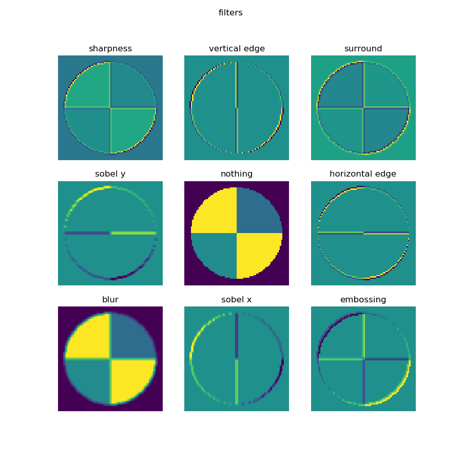
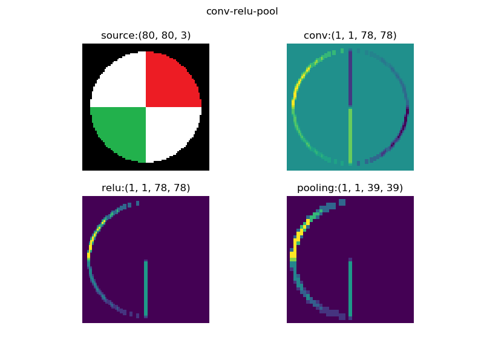
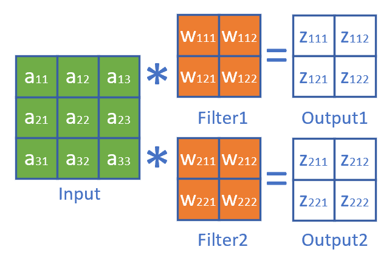
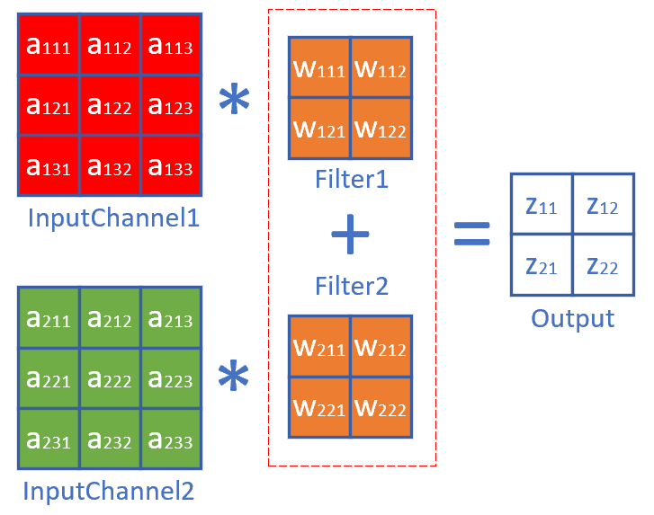

# Step8 卷积神经网络
## 一、卷积神经网络
### 1.卷积网络的典型结构
一个典型的卷积神经网络的结构如下图所示：


在一个典型的卷积神经网络中，会至少包含以下几个层：
- 卷积层
- 激活函数层
- 池化层
- 全连接分类层
   
**卷积核的作用**
卷积核其实就是一个小矩阵，类似这样：

```
1.1  0.23  -0.45
0.1  -2.1   1.24
0.74 -1.32  0.01
```

这是一个3x3的卷积核，还会有1x1、5x5、7x7、9x9、11x11的卷积核。在卷积层中，我们会用输入数据与卷积核相乘，得到输出数据，就类似全连接层中的Weights一样，所以卷积核里的数值，也是通过反向传播的方法学习到的。


**9个卷积核的作用：**

|序号|名称|说明|
|---|---|---|
|1|锐化|如果一个像素点比周围像素点亮，则此算子会令其更亮|
|2|检测竖边|检测出了十字线中的竖线，由于是左侧和右侧分别检查一次，所以得到两条颜色不一样的竖线|
|3|周边|把周边增强，把同色的区域变弱，形成大色块|
|4|Sobel-Y|纵向亮度差分可以检测出横边，与横边检测不同的是，它可以使得两条横线具有相同的颜色，具有分割线的效果|
|5|Identity|中心为1四周为0的过滤器，卷积后与原图相同|
|6|横边检测|检测出了十字线中的横线，由于是上侧和下侧分别检查一次，所以得到两条颜色不一样的横线|
|7|模糊|通过把周围的点做平均值计算而"杀富济贫"造成模糊效果|
|8|Sobel-X|横向亮度差分可以检测出竖边，与竖边检测不同的是，它可以使得两条竖线具有相同的颜色，具有分割线的效果|
|9|浮雕|形成大理石浮雕般的效果|
### 2.卷积后续的运算
下图中的四个子图，依次展示了：
1. 原图
2. 卷积结果
3. 激活结果
4. 池化结果



1. 注意图一是原始图片，用cv2读取出来的图片，其顺序是反向的，即：
- 第一维是高度
- 第二维是宽度
- 第三维是彩色通道数，但是其顺序为BGR，而不是常用的RGB
2. 我们对原始图片使用了一个3x1x3x3的卷积核，因为原始图片为彩色图片，所以第一个维度是3，对应RGB三个彩色通道；我们希望只输出一张feature map，以便于说明，所以第二维是1；我们使用了3x3的卷积核，用的是sobel x算子。所以图二是卷积后的结果。
3. 图三做了一层Relu激活计算，把小于0的值都去掉了，只留下了一些边的特征。
4. 图四是图三的四分之一大小，虽然图片缩小了，但是特征都没有丢失，反而因为图像尺寸变小而变得密集，亮点的密度要比图三大而粗。

## 二、卷积的前向计算
### 1、卷积的前向计算原理
**单入多出的升维卷积**

原始输入是一维的图片，但是我们可以用多个卷积核分别对其计算，从而得到多个特征输出。

一张4x4的图片，用两个卷积核并行地处理，输出为2个2x2的图片。在训练过程中，这两个卷积核会完成不同的特征学习。

**多入单出的降维卷积**

一张图片，通常是彩色的，具有红绿蓝三个通道。我们可以有两个选择来处理

1. 变成灰度的，每个像素只剩下一个值，就可以用二维卷积
2. 对于三个通道，每个通道都使用一个卷积核，分别处理红绿蓝三种颜色的信息

显然第2种方法可以从图中学习到更多的特征，于是出现了三维卷积，即有三个卷积核分别对应书的三个通道，三个子核的尺寸是一样的，比如都是2x2，这样的话，这三个卷积核就是一个3x2x2的立体核，称为过滤器Filter，所以称为三维卷积。

在上图中，每一个卷积核对应着左侧相同颜色的输入通道，三个过滤器的值并不一定相同。对三个通道各自做卷积后，得到右侧的三张特征图，然后在按照原始值不加权地相加在一起，得到最右侧的黑色特征图，这张图里面已经把三种颜色的特征混在一起了，所以画成了黑色。

虽然输入图片是多个通道的，或者说是三维的，但是在相同数量的过滤器的计算后，相加在一起的结果是一个通道，即2维数据，所以称为降维。这当然简化了对多通道数据的计算难度，但同时也会损失多通道数据自带的颜色信息。

**步长 stride**

前面的例子中，每次计算后，卷积核会向右或者向下移动一个单元，即步长stride = 1。而在下面这个卷积操作中，卷积核每次向右或向下移动两个单元，即stride = 2。
在后续的步骤中，由于每次移动两格，所以最终得到一个2x2的图片。

**填充 padding**

如果原始图为4x4，用3x3的卷积核进行卷积后，目标图片变成了2x2。如果我们想保持目标图片和原始图片为同样大小，该怎么办呢？一般我们会向原始图片周围填充一圈0，然后再做卷积。

##  三、卷积前向计算代码实现
### 1、卷积核的实现

```Python
class ConvWeightsBias(WeightsBias_2_1):
    def __init__(self, output_c, input_c, filter_h, filter_w, init_method, optimizer_name, eta):
        self.FilterCount = output_c
        self.KernalCount = input_c
        self.KernalHeight = filter_h
        self.KernalWidth = filter_w
        ...

    def Initialize(self, folder, name, create_new):
        self.WBShape = (self.FilterCount, self.KernalCount, self.KernalHeight, self.KernalWidth)        
        ...

    def CreateNew(self):
        self.W = ConvWeightsBias.InitialConvParameters(self.WBShape, self.init_method)
        self.B = np.zeros((self.FilterCount, 1))
...
```

### 2、 前向前向运算实现的3种方法
**方法1**
  ```Python
class ConvLayer(CLayer):
    def forward(self, x, train=True):
        self.x = x
        self.batch_size = self.x.shape[0]
        # 如果有必要的话，先对输入矩阵做padding
        if self.padding > 0:
            self.padded = np.pad(...)
        else:
            self.padded = self.x
        #end if
        self.z = conv_4d(...)
        return self.z
```
**方法2**
```Python
    # dry run
    output2 = jit_conv_4d(x, wb.W, wb.B, output_height, output_width, stride)
    # run
    s2 = time.time()
    for i in range(10):
        output2 = jit_conv_4d(x, wb.W, wb.B, output_height, output_width, stride)
    e2 = time.time()
    print("Time used for Numba:", e2 - s2)
```
**- 方法3**

```Python
    def forward_img2col(self, x, train=True):
        self.x = x
        self.batch_size = self.x.shape[0]
        assert(self.x.shape == (self.batch_size, self.InC, self.InH, self.InW))
        self.col_x = img2col(x, self.FH, self.FW, self.stride, self.padding)
        self.col_w = self.WB.W.reshape(self.OutC, -1).T
        self.col_b = self.WB.B.reshape(-1, self.OutC)
        out1 = np.dot(self.col_x, self.col_w) + self.col_b
        out2 = out1.reshape(batch_size, self.OutH, self.OutW, -1)
        self.z = np.transpose(out2, axes=(0, 3, 1, 2))
        return self.z
```
## 四、卷积的反向传播原理
### 1、计算反向传播的梯度矩阵

**正向公式：**

$$Z = W*A+b \tag{0}$$

其中，W是卷积核，*表示卷积（互相关）计算，A为当前层的输入项，b是偏移（未在图中画出），Z为当前层的输出项，但尚未经过激活函数处理。
### 2、有多个卷积核时的梯度计算

有多个卷积核也就意味着有多个输出通道。



#### 3、有多个输入时的梯度计算

当输入层是多个图层时，每个图层必须对应一个卷积核，如下图：



#### 4、权重（卷积核）梯度计算


要求J对w11的梯度，从正向公式可以看到，w11对所有的z都有贡献，所以：

$$
\frac{\partial J}{\partial w_{11}} = \frac{\partial J}{\partial z_{11}}\frac{\partial z_{11}}{\partial w_{11}} + \frac{\partial J}{\partial z_{12}}\frac{\partial z_{12}}{\partial w_{11}} + \frac{\partial J}{\partial z_{21}}\frac{\partial z_{21}}{\partial w_{11}} + \frac{\partial J}{\partial z_{22}}\frac{\partial z_{22}}{\partial w_{11}}
$$
$$
=\delta_{z11} \cdot a_{11} + \delta_{z12} \cdot a_{12} + \delta_{z21} \cdot a_{21} + \delta_{z22} \cdot a_{22} \tag{9}
$$

对W22也是一样的：

$$
\frac{\partial J}{\partial w_{12}} = \frac{\partial J}{\partial z_{11}}\frac{\partial z_{11}}{\partial w_{12}} + \frac{\partial J}{\partial z_{12}}\frac{\partial z_{12}}{\partial w_{12}} + \frac{\partial J}{\partial z_{21}}\frac{\partial z_{21}}{\partial w_{12}} + \frac{\partial J}{\partial z_{22}}\frac{\partial z_{22}}{\partial w_{12}}
$$
$$
=\delta_{z11} \cdot a_{12} + \delta_{z12} \cdot a_{13} + \delta_{z21} \cdot a_{22} + \delta_{z22} \cdot a_{23} \tag{10}
$$

## 四、卷积反向传播代码实现
**- 方法1**
```Python
    def backward_numba(self, delta_in, flag):
        # 如果正向计算中的stride不是1，转换成是1的等价误差数组
        dz_stride_1 = expand_delta_map(delta_in, ...)
        # 计算本层的权重矩阵的梯度
        self._calculate_weightsbias_grad(dz_stride_1)
        # 由于输出误差矩阵的尺寸必须与本层的输入数据的尺寸一致，所以必须根据卷积核的尺寸，调整本层的输入误差矩阵的尺寸
        (pad_h, pad_w) = calculate_padding_size(...)
        dz_padded = np.pad(dz_stride_1, ...)
        # 计算本层输出到下一层的误差矩阵
        delta_out = self._calculate_delta_out(dz_padded, flag)
        #return delta_out
        return delta_out, self.WB.dW, self.WB.dB

    # 用输入数据乘以回传入的误差矩阵,得到卷积核的梯度矩阵
    def _calculate_weightsbias_grad(self, dz):
        self.WB.ClearGrads()
        # 先把输入矩阵扩大，周边加0
        (pad_h, pad_w) = calculate_padding_size(...)
        input_padded = np.pad(self.x, ...)
        # 输入矩阵与误差矩阵卷积得到权重梯度矩阵
        (self.WB.dW, self.WB.dB) = calcalate_weights_grad(...)
        self.WB.MeanGrads(self.batch_size)

    # 用输入误差矩阵乘以（旋转180度后的）卷积核
    def _calculate_delta_out(self, dz, layer_idx):
        if layer_idx == 0:
            return None
        # 旋转卷积核180度
        rot_weights = self.WB.Rotate180()
        # 定义输出矩阵形状
        delta_out = np.zeros(self.x.shape)
        # 输入梯度矩阵卷积旋转后的卷积核，得到输出梯度矩阵
        delta_out = calculate_delta_out(dz, ..., delta_out)

        return delta_out
```
**- 方法2**
```Python
    def backward_col2img(self, delta_in, layer_idx):
        OutC, InC, FH, FW = self.WB.W.shape
        # 误差矩阵变换
        delta_in_2d = np.transpose(delta_in, axes=(0,2,3,1)).reshape(-1, OutC)
        # 计算Bias的梯度
        self.WB.dB = np.sum(delta_in_2d, axis=0, keepdims=True).T / self.batch_size
        # 计算Weights的梯度
        dW = np.dot(self.col_x.T, delta_in_2d) / self.batch_size
        # 转换成卷积核的原始形状
        self.WB.dW = np.transpose(dW, axes=(1, 0)).reshape(OutC, InC, FH, FW)# 计算反向传播误差矩阵
        dcol = np.dot(delta_in_2d, self.col_w.T)
        # 转换成与输入数据x相同的形状
        delta_out = col2img(dcol, self.x.shape, FH, FW, self.stride, self.padding)
        return delta_out, self.WB.dW, self.WB.dB
```
## 五、总结
    本次学习的卷积神经网络在神经网络技术中有着重要意义，这个技术的应用将使神经网络技术在AI里起到更多更全面的应用。卷积神经网络是深度学习中的一个里程碑式的技术，有了这个技术，才会让计算机有能力理解图片和视频信息，才会有计算机视觉的众多应用。这部分内容将会为我们逐步介绍卷积的前向计算、卷积的反向传播、池化的前向计算与反向传播，然后用代码实现一个卷积网络并训练一些实际数据。这次的学习可以说是让我游览了神经网络在各个领域的地位与应用，同样认识到卷积神经网络的技术也是建立在之前学习的基础上，若前面学习的内容没有熟练掌握的话学习起来也是很吃力的。
