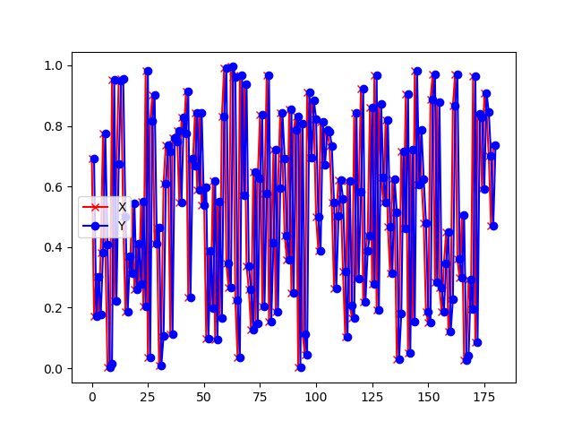
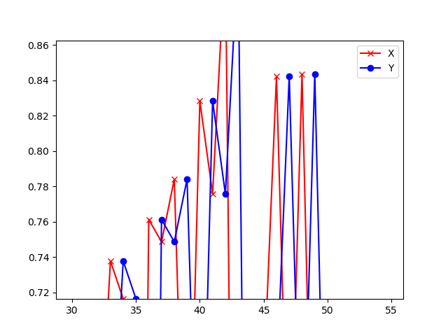
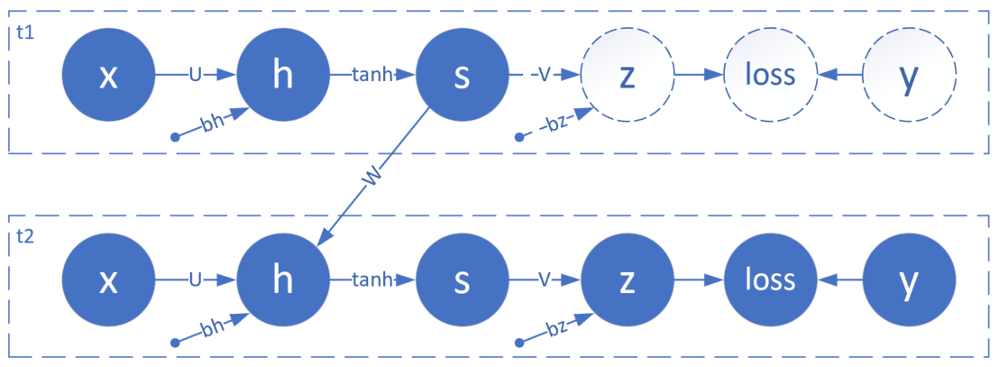
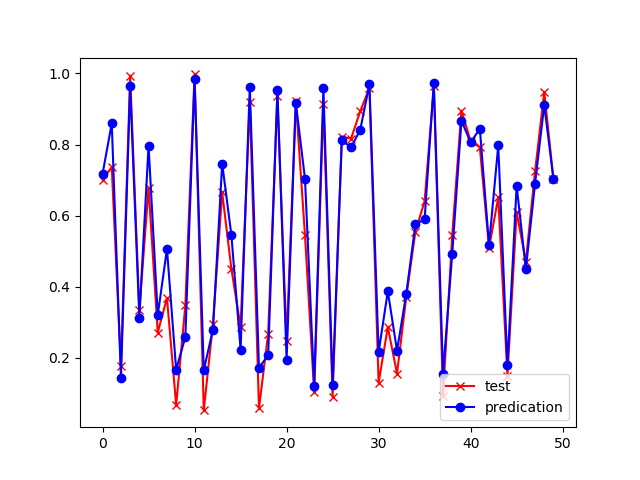
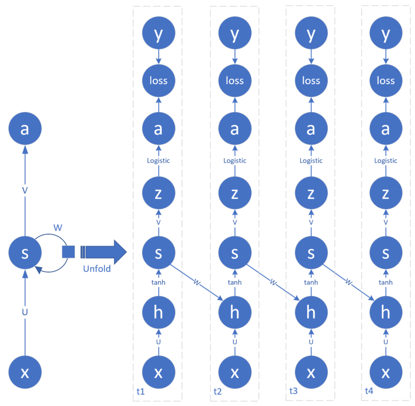
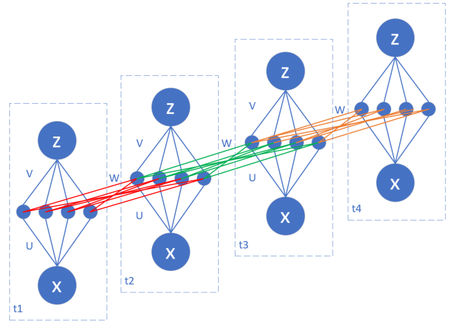

# Step9 循环神经网络
## 一、初步认识RNN
### 1、初步认识RNN
假设有一个随机信号发射器，每秒产生一个随机信号，随机值为(0,1)之间。信号发出后，碰到一面墙壁反射回来，来回的时间相加正好是1秒，于是接收器就收到了1秒钟之前的信号。对于接收端来说，可以把接收到的数据序列列表如下：

|时刻|t1|t2|t3|t4|t5|t6|...|
|---|---|---|---|---|---|---|---|
|发射随机信号X|0.35|0.46|0.12|0.69|0.24|0.94|...|
|接收回波信号Y|0|0.35|0.46|0.12|0.69|0.24|...|

具体的描述此问题：当接收端接收到两个连续的值，如0.35、0.46时，系统响应为0.35；下一个时间点接收到了0.12，考虑到上一个时间点的0.46，则二者组合成0.46、0.12序列，此时系统响应为0.46；依此类推，即接收到第二个数值时，总要返回相邻的第一个数值。

如果把发射信号和回波信号绘制成图，如下图所示：

|样本图|局部放大图|
|---|---|
|| />|

图一：信号及回波样本序列

其中，红色叉子为样本数据点，蓝色圆点为标签数据点，它总是落后于样本数据一个时间步。还可以看到以上数据形成的曲线完全随机，毫无规律。

与前面学习的DNN和CNN的样本数据都不同，此时的样本数据为三维：
- 第一维：样本 x[0,:,:]表示第0个样本
- 第二维：时间 x[:,1,:]表示第1个时间点
- 第三维：特征 x[:,:,2]表示第2个特征

举个例子来说，x[10, 2, 4] 表示第10个样本的第2个时间点的第4个特征数据。

标签数据为两维：
- 第一维：样本
- 第二维：标签值
### 2、用DNN的知识来解决问题


图二：两个时间步的DNN

图二中含有两个简单的DNN网络，t1和t2，每个节点上都只有一个神经元，其中，各个节点的名称和含义是：

|名称|含义|在t1,t2上的取值|
|---|---|---|
|x|输入层样本|根据样本值|
|U|x到h的权重值|相同|
|h|隐层|不同|不同|
|bh|h节点的偏移值|相同|
|tanh|激活函数|函数相同|
|s|隐层激活状态|不同|
|V|s到z的权重值|相同|
|z|输出层|不同|
|bz|z的偏移值|相同|
|loss|损失函数|函数相同|
|y|标签值|根据标签值|

由于是一个值拟合的网络，所以在输出层不使用分类函数，损失函数使用 MSE 均方差。在这个具体的问题中，t2的标签值y应该和t1的样本值x相同。
### 3、代码实现

按照图二的设计，我们实现两个网络来模拟两个时序。
**时序1的网络实现**

时序1的类名叫做timestep_1，其前向计算过程遵循公式1、2，其反向传播过程遵循公式14至公式19。

```Python
class timestep_1(object):
    def forward(self,x,U,V,W,bh):
        self.W = W
        self.x = x
        # 公式1
        self.h = np.dot(self.x, U) + bh
        # 公式2
        self.s = Tanh().forward(self.h)
        self.z = 0

    def backward(self, y, dh_t2):
        # 公式14
        self.dh = np.dot(dh_t2, self.W.T) * Tanh().backward(self.s)
        # 公式15
        self.dbh = self.dh       
        # 公式16
        self.dbz = 0
        # 公式17
        self.dU = np.dot(self.x.T, self.dh)
        # 公式18
        self.dV = 0        
        # 公式19
        self.dW = 0
```

**时序2的网络实现**

时序2的类名叫做timestep_2，其前向计算过程遵循公式3至公式3，其反向传播过程遵循公式7至公式13。

```Python
class timestep_2(object):
    def forward(self,x,U,V,W,bh,bz,s_t1):
        self.V = V
        self.x = x
        # 公式3
        self.h = np.dot(x, U) + np.dot(s_t1, W) + bh
        # 公式4
        self.s = Tanh().forward(self.h)
        # 公式5
        self.z = np.dot(self.s, V) + bz

    def backward(self, y, s_t1):
        # 公式7
        self.dz = self.z - y
        # 公式8
        self.dh = np.dot(self.dz, self.V.T) * Tanh().backward(self.s)
        # 公式9
        self.dbz = self.dz
        # 公式10
        self.dbh = self.dh        
        # 公式11
        self.dV = np.dot(self.s.T, self.dz)
        # 公式12
        self.dU = np.dot(self.x.T, self.dh)
        # 公式13
        self.dW = np.dot(s_t1.T, self.dh)
```

**网络训练代码**

在初始化函数中，先建立好一些基本的类，如损失函数计算、训练历史记录，再建立好两个时序的类，分别命名为t1和t2。

```Python
class net(object):
    def __init__(self, dr):
        self.dr = dr
        self.loss_fun = LossFunction_1_1(NetType.Fitting)
        self.loss_trace = TrainingHistory_3_0()
        self.t1 = timestep_1()
        self.t2 = timestep_2()
```

在训练函数中，仍然采用DNN/CNN中学习过的双重循环的方法，外循环为epoch，内循环为iteration，每次只用一个样本做训练，分别取出它的时序1和时序2的样本值和标签值，先做前向计算，再做反向传播，然后更新参数。

```Python
    def train(self):
        num_input = 1
        num_hidden = 1
        num_output = 1
        max_epoch = 100
        eta = 0.1
        self.U = np.random.random((num_input,num_hidden))*2-1
        self.W = np.random.random((num_hidden,num_hidden))*2-1
        self.V = np.random.random((num_hidden,num_output))*2-1
        self.bh = np.zeros((1,num_hidden))
        self.bz = np.zeros((1,num_output))
        max_iteration = dr.num_train
        for epoch in range(max_epoch):
            for iteration in range(max_iteration):
                # get data
                batch_x, batch_y = self.dr.GetBatchTrainSamples(1, iteration)
                xt1 = batch_x[:,0,:]
                xt2 = batch_x[:,1,:]
                yt1 = batch_y[:,0]
                yt2 = batch_y[:,1]
                # forward
                self.t1.forward(xt1,self.U,self.V,self.W,self.bh)
                self.t2.forward(xt2,self.U,self.V,self.W,self.bh,self.bz,self.t1.s)
                # backward
                self.t2.backward(yt2, self.t1.h)
                self.t1.backward(yt1, self.t2.dh)
                # update
                self.U = self.U - (self.t1.dU + self.t2.dU)*eta
                self.V = self.V - (self.t1.dV + self.t2.dV)*eta
                self.W = self.W - (self.t1.dW + self.t2.dW)*eta
                self.bh = self.bh - (self.t1.dbh + self.t2.dbh)*eta
                self.bz = self.bz - (self.t1.dbz + self.t2.dbz)*eta
            #end for
            total_iteration = epoch * max_iteration + iteration
            if (epoch % 5 == 0):
                loss_vld,acc_vld = self.check_loss(dr)
                self.loss_trace.Add(epoch, total_iteration, None, None, loss_vld, acc_vld, None)
                print(epoch)
                print(str.format("validation: loss={0:6f}, acc={1:6f}", loss_vld, acc_vld))
        #end for
        self.loss_trace.ShowLossHistory("Loss and Accuracy", XCoordinate.Epoch)
```

#### 分析：
以下是打印输出的最后几行信息：

```
...
98
loss=0.001396, acc=0.952491
99
loss=0.001392, acc=0.952647
testing...
loss=0.002230, acc=0.952609
```

使用完全不同的测试集数据，得到的准确度为95.26%。最后在测试集上得到的拟合结果：



红色x是测试集样本，蓝色圆点是模型的预测值，可以看到波动的趋势全都预测准确，具体的值上面有一些微小的误差。

以下是训练出来的各个参数的值：

```
U=[[-0.54717934]], bh=[[0.26514691]],
V=[[0.50609376]], bz=[[0.53271514]],
W=[[-4.39099762]]
```

可以看到W的值比其他值大出一个数量级，这就意味着在t2上的输出主要来自于t1的样本输入，这也符合我们的预期，即：接收到两个序列的数值时，返回第一个序列的数值。

## 二、更多时序的RNN
### 1、搭建多个时序的网络

**搭建网络**

在本例中，我们仍然从DNN的结构扩展到含有4个时序的网络结构：



图一：含有4个时序的网络结构图

图一中，最左侧的简易结构是通常的RNN的画法，而右侧是其展开后的细节，由此可见细节有很多，如果不展开的话，对于初学者来说很难理解，而且也不利于我们进行反向传播的推导。

再重复一下，请读者记住，t1是二进制数的最低位，但是由于我们把样本倒序了，所以，现在的t1就是样本的第0个单元的值。并且由于涉及到被减数和减数，所以每个样本的第0个单元（时间步）都有两个特征值，其它3个单元也一样。

在图一中，连接x和h的是一条线标记为U，在19.1节的例子中，U是一个参数，但是在本节中，U是一个 1x4 的参数矩阵，V是一个 4x1 的参数矩阵，而W就是一个 4x4 的参数矩阵。我们把它们展开画成下图（其中把s和h合并在一起了）：


图二：W权重矩阵的展开图

U和V都比较容易理解，而W是一个连接相邻时序的参数矩阵，并且共享相同的参数值，这一点在刚开始接触RNN时不太容易理解。图二中把W绘制成3种颜色，代表它们在不同的时间步中的作用，是想让读者看得清楚些，并不代表它们是不同的值。

与19.1节不同的是，在每个时间步的结构中，多出来一个a，是从z经过Logistic函数生成的。这是为什么呢？因为在本例中，我们想模拟二进制数的减法，所以结果应该是0或1，于是我们把它看作是二分类问题，z的值是一个浮点数，而a的值尽量向0或1靠近，所以用Logistic作为二分类函数。

二分类问题的损失函数使用交叉熵函数，这与我们在DNN中学习的二分类问题完全相同。

**正向计算**

下面我们先看看4个时序的正向计算过程。

从图一中看，t2、t3、t4的结构是一样的，只有t1缺少了从前面的时间步的输入，因为它是第一个时序，前面没有输入，所以我们单独定义t1的前向计算函数：

$$
h = x \cdot U \tag{1}
$$

$$
s = tanh(h) \tag{2}
$$

$$
z = s \cdot V \tag{3}
$$

$$
a = Logistic(z) \tag{4}
$$

单个时间步的loss值：

$$
loss = -[y \ln a + (1-y) \ln (1-a)]
$$

所有时间步的loss值计算：

$$
LOSS = \frac{1}{4} \sum_{t=1}^4 loss_t \tag{5}
$$


细心的读者可能会注意到在公式1和公式3中，我们并没有添加偏移项b，是因为在此问题中，没有偏移项一样可以完成任务。

```Python
class timestep_1(timestep):
    # compare with timestep class: no h_t value from previous layer
    def forward(self,x,U,V,W):
        self.U = U
        self.V = V
        self.W = W
        self.x = x
        # 公式1
        self.h = np.dot(self.x, U)
        # 公式2
        self.s = Tanh().forward(self.h)
        # 公式3
        self.z = np.dot(self.s, V)
        # 公式4
        self.a = Logistic().forward(self.z)
```        

其它三个时间步的前向计算过程是一样的，它们与t1的不同之处在于公式1，所以我们单独说明一下：

$$
h = x \cdot U + s_{t-1} \cdot W \tag{6}
$$

```Python
class timestep(object):
    def forward(self,x,U,V,W,prev_s):
        ...
        # 公式6
        self.h = np.dot(x, U) + np.dot(prev_s, W)
        ...
```

### 2、代码实现
**初始化**

初始化loss function和loss trace，然后初始化4个时间步的实例。

```Python
class net(object):
    def __init__(self, dr):
        self.dr = dr
        self.loss_fun = LossFunction_1_1(NetType.BinaryClassifier)
        self.loss_trace = TrainingHistory_3_0()
        self.t1 = timestep_1()
        self.t2 = timestep()
        self.t3 = timestep()
        self.t4 = timestep_4()
```

**前向计算**

按顺序分别调用4个时间步的前向计算函数，注意在t2到t4时，需要把t-1时刻的s值代进去。

```Python
    def forward(self,X):
        self.t1.forward(X[:,0],self.U,self.V,self.W)
        self.t2.forward(X[:,1],self.U,self.V,self.W,self.t1.s)
        self.t3.forward(X[:,2],self.U,self.V,self.W,self.t2.s)
        self.t4.forward(X[:,3],self.U,self.V,self.W,self.t3.s)
```

**反向传播**

按相反的顺序调用4个时间步的反向传播函数，注意在t3、t2、t1时，要把t+1时刻的dh代进去，以便计算当前时刻的dh；而在t4、t3、t2时，需要把t+1时刻的s值代进去，以便计算dW的值。

```Python
    def backward(self,Y):
        self.t4.backward(Y[:,3], self.t3.s)
        self.t3.backward(Y[:,2], self.t2.s, self.t4.dh)
        self.t2.backward(Y[:,1], self.t1.s, self.t3.dh)
        self.t1.backward(Y[:,0],            self.t2.dh)
```

**损失函数**

4个时间步都参与损失函数计算，所以总体的损失函数是4个时间步的损失函数值的和。

```Python
    def check_loss(self,X,Y):
        self.forward(X)
        loss1,acc1 = self.loss_fun.CheckLoss(self.t1.a,Y[:,0:1])
        loss2,acc2 = self.loss_fun.CheckLoss(self.t2.a,Y[:,1:2])
        loss3,acc3 = self.loss_fun.CheckLoss(self.t3.a,Y[:,2:3])
        loss4,acc4 = self.loss_fun.CheckLoss(self.t4.a,Y[:,3:4])
        output = np.concatenate((self.t1.a,self.t2.a,self.t3.a,self.t4.a), axis=1)
        result = np.round(output).astype(int)
        correct = 0
        for i in range(X.shape[0]):
            if (np.allclose(result[i], Y[i])):
                correct += 1
        acc = correct/X.shape[0]
        loss = (loss1 + loss2 + loss3 + loss4)/4
        return loss,acc,result
```

**训练过程**

先初始化参数矩阵，然后用双重循环进行训练，每次只用一个样本，因此batch_size=1。

```Python
    def train(self, batch_size, checkpoint=0.1):
        num_input = 2
        num_hidden = 4
        num_output = 1
        max_epoch = 100
        eta = 0.1
        self.U = np.random.random((num_input,num_hidden))
        self.W = np.random.random((num_hidden,num_hidden))
        self.V = np.random.random((num_hidden,num_output))
        
        max_iteration = math.ceil(self.dr.num_train/batch_size)
        checkpoint_iteration = (int)(math.ceil(max_iteration * checkpoint))

        for epoch in range(max_epoch):
            dr.Shuffle()
            for iteration in range(max_iteration):
                # get data
                batch_x, batch_y = self.dr.GetBatchTrainSamples(1, iteration)
                # forward
                self.forward(batch_x)
                self.backward(batch_y)
                # update
                self.U = self.U - (self.t1.dU + self.t2.dU + self.t3.dU + self.t4.dU)*eta
                self.V = self.V - (self.t1.dV + self.t2.dV + self.t3.dV + self.t4.dV)*eta
                self.W = self.W - (self.t1.dW + self.t2.dW + self.t3.dW + self.t4.dW)*eta
                # check loss
                ...
            #enf for
            if (acc == 1.0):
                break
        #end for
        self.loss_trace.ShowLossHistory("Loss and Accuracy", XCoordinate.Iteration)
```        

## 三、不定长时序的RNN
### 1、准备数据

由于名字的长度不同，所以不同长度的两个名字，是不能放在一个batch里做批量运算的。但是如果一个一个地训练样本，将会花费很长的时间，所以需要我们对本例中的数据做一个特殊的处理：

1. 先按字母个数（名字的长度）把所有数据分开，由于最短的名字是2个字母，最长的是19个字母，所以一共有18组数据。
2. 使用OneHot编码把名字转换成向量，比如：名字为“Duan”，变成小写字母“duan”，则OneHot编码是：

```
[[0,0,0,1,0,0,0,0,0,0,0,0,0,0,0,0,0,0,0,0,0,0,0,0,0,0],  # d
 [0,0,0,0,0,0,0,0,0,0,0,0,0,0,0,0,0,0,0,0,1,0,0,0,0,0],  # u
 [1,0,0,0,0,0,0,0,0,0,0,0,0,0,0,0,0,0,0,0,0,0,0,0,0,0],  # a
 [0,0,0,0,0,0,0,0,0,0,0,0,0,1,0,0,0,0,0,0,0,0,0,0,0,0]]  # n
```

3. 把所有4个字母的名字的OneHot编码都堆放在一个矩阵中，形成批量，这样就是成为了一个三维矩阵，第一维是4个字母的名字的数量；第二维是4，即字母个数；第三维是26，即a~z的小写字母的个数，相应的位为1，其它位为0。

### 2、代码实现

在主过程调用代码中，我们主要讲解几个核心函数。下面是前向计算的调用函数：

```Python
    def forward(self,X):
        self.x = X
        self.batch = self.x.shape[0]
        self.ts = self.x.shape[1]
        for i in range(0, self.ts):
            if (i == 0):
                self.ts_list[i].forward(X[:,i], self.U, self.V, self.W, None, True, False)
            elif (i == self.ts - 1):
                self.ts_list[i].forward(X[:,i], self.U, self.V, self.W, self.ts_list[i-1].s[0:self.batch], False, True)
            else:
                self.ts_list[i].forward(X[:,i], self.U, self.V, self.W, self.ts_list[i-1].s[0:self.batch], False, False)
        #end for
        return self.ts_list[self.ts-1].a
```
在这个函数中，先得到批数量batch和时序数量ts，然后根据当前循环所处的时序来给前向计算函数不同的参数，尤其是isFirst和isLast参数，最后返回最后一个时序的a值。

下面是反向传播的调用函数，也是要根据当前时序来设置正确的参数：

```Python
    def backward(self,Y):
        for i in range(self.ts-1, -1, -1):
            if (i == 0):
                self.ts_list[i].backward(Y, None, self.ts_list[i+1].dh[0:self.batch], True, False)
            elif (i == self.ts - 1):
                self.ts_list[i].backward(Y, self.ts_list[i-1].s[0:self.batch], None, False, True)
            else:
                self.ts_list[i].backward(Y, self.ts_list[i-1].s[0:self.batch], self.ts_list[i+1].dh[0:self.batch], False, False)
        #end for
```

下面是参数更新函数，注意要在更新前清空梯度，然后把每个时序的dU、dV、dW各自相加，尽管有的时序中该梯度值为0：

```Python
    def update(self):
        du = np.zeros_like(self.U)
        dv = np.zeros_like(self.V)
        dw = np.zeros_like(self.W)
        for i in range(self.ts):
            du += self.ts_list[i].dU
            dv += self.ts_list[i].dV
            dw += self.ts_list[i].dW
        #end for
        self.U = self.U - du * self.hp.eta
        self.V = self.V - dv * self.hp.eta
        self.W = self.W - dw * self.hp.eta
```

## 四、总结
    本次学习就是对循环神经网络RNN的学习，通过mooc、案例及资料进行了更深层次的了解。这次的学习也是这门课程的最后学习，当然学习是还没有停下的，不一定是继续深入，也可以将当下所学习的内容进行练习再练习，能够熟练的掌握应用它还是有着一定难度的，而也只有熟练的应用了才能去探索，去创新学习，让自身更加的充实。
    神经网络是让机器人更加接近于人类的不要条件，让机器人能够像我们一样去感知这个世界，从而可以帮助人类去探索人类所不能达到的世界并反馈给予我们。神经网络它的知识量所庞大是我们不知道的，但它的完成让人类的收益也是非常庞大的，所有今后的学习还不至于这一点，还需加油努力。
