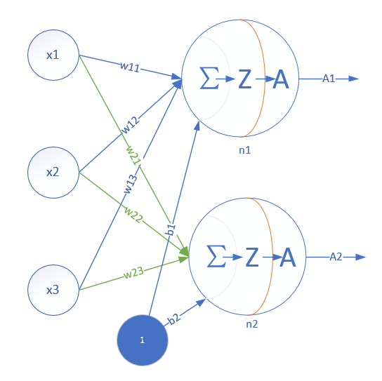
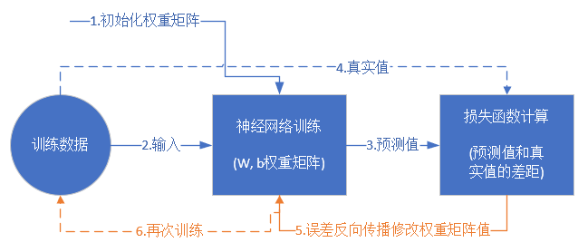
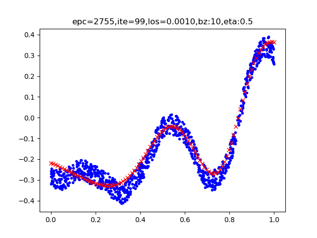
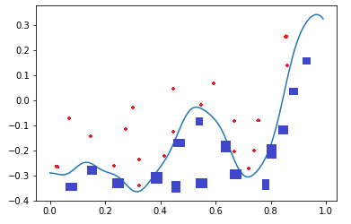
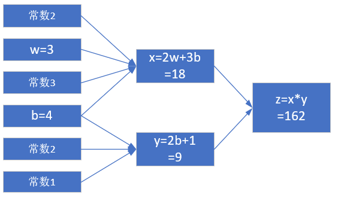
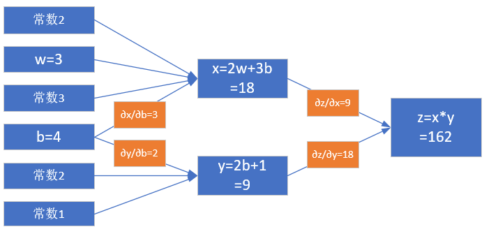
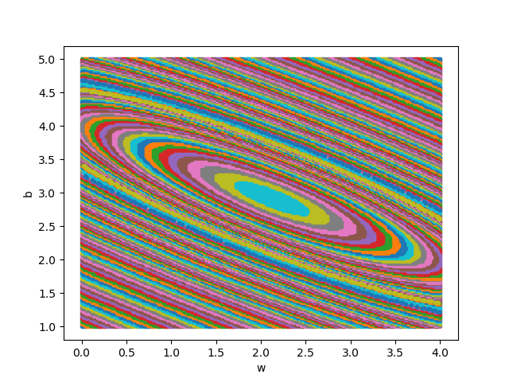

# Step1 - BasicKnowledge
#  神经网络的基本工作原理
### 神经元细胞的数学模型
神经网络由基本的神经元组成，下图就是一个神经元的数学/计算模型，便于我们用程序来实现。

#### 输入 input

(x1,x2,x3) 是外界输入信号，一般是一个训练数据样本的多个属性，比如，我们要预测一套房子的价格，那么在房屋价格数据样本中，x1可能代表了面积，x2可能代表地理位置，x3可能朝向。另外一个例子是，假设(x1,x2,x3)分别代表了(红,绿,蓝)三种颜色，而此神经元用于识别输入的信号是暖色还是冷色。

#### 权重 weights

(w1,w2,w3) 是每个输入信号的权重值，以上面的 (x1,x2,x3) 的例子来说，x1的权重可能是0.92，x2的权重可能是0.2，x3的权重可能是0.03。当然权重值相加之后可以不是1。

#### 偏移 bias

还有个b是怎么来的？一般的书或者博客上会告诉你那是因为$y=wx+b$，b是偏移值，使得直线能够沿Y轴上下移动。这是用结果来解释原因，并非b存在的真实原因。从生物学上解释，在脑神经细胞中，一定是输入信号的电平/电流大于某个临界值时，神经元细胞才会处于兴奋状态，这个b实际就是那个临界值。亦即当：

$$w1 \cdot x1 + w2 \cdot x2 + w3 \cdot x3 >= t$$

时，该神经元细胞才会兴奋。我们把t挪到等式左侧来，变成$(-t)$，然后把它写成b，变成了：

$$w1 \cdot x1 + w2 \cdot x2 + w3 \cdot x3 + b >= 0$$

于是b诞生了！

#### 求和计算 sum

$$Z = w1 \cdot x1 + w2 \cdot x2 + w3 \cdot x3 + b = \sum_{i=1}^m(w_i \cdot x_i) + b$$

在上面的例子中m=3。我们把$w_i \cdot x_i$变成矩阵运算的话，就变成了：

$$Z = W \cdot X + b$$

#### 激活函数 activation

求和之后，神经细胞已经处于兴奋状态了，已经决定要向下一个神经元传递信号了，但是要传递多强烈的信号，要由激活函数来确定：

$$A=a{(Z)}$$
### 神经网络的训练过程
#### 单层神经网络模型
这是一个单层的神经网络，有m个输入 (这里m=3)，有n个输出 (这里n=2)。在单个神经元里，b是个值。但是在神经网络中，我们把b的值永远设置为1，而用b到每个神经元的权值来表示实际的偏移值，亦即(b1,b2)，这样便于矩阵运算。
- $(x1,x2,x3)$是一个样本数据的三个特征值
- $(w11,w12,w13)$是$(x1,x2,x3)$到$n1$的权重
- $(w21,w22,w23)$是$(x1,x2,x3)$到$n2$的权重
- $b1$是$n1$的偏移
- $b2$是$n2$的偏移

##### 训练流程

##### 训练步骤
假设我们有以下训练数据样本：
|Id|x1|x2|x3|Y|
|---|---|---|---|---|
|1|0.5|1.4|2.7|3|
|2|0.4|1.3|2.5|5|
|3|0.1|1.5|2.3|9|
|4|0.5|1.7|2.9|1|
其中，x1，x2，x3是每一个样本数据的三个特征值，Y是样本的真实结果值：

1. 随机初始化权重矩阵，可以根据高斯分布或者正态分布等来初始化。这一步可以叫做"蒙"，但不是瞎蒙。
2. 拿一个或一批数据作为输入，带入权重矩阵中计算，再通过激活函数传入下一层，最终得到预测值。在本例中，我们先用Id-1的数据输入到矩阵中，得到一个A值，假设A=5
3. 拿到Id-1样本的真实值Y=3
4. 计算损失，假设用均方差函数 $Loss = (A-Y)^2=(5-3)^2=4$
5. 根据一些神奇的数学公式（反向微分），把Loss=4这个值用大喇叭喊话，告诉在前面计算的步骤中，影响A=5这个值的每一个权重矩阵，然后对这些权重矩阵中的值做一个微小的修改（当然是向着好的方向修改，这一点可以用数学家的名誉来保证）
6. 用Id-2样本作为输入再次训练（goto 2）
7. 这样不断地迭代下去，直到以下一个或几个条件满足就停止训练：损失函数值非常小；迭代了指定的次数；
 #### ③神经网络中的矩阵运算
下面这个图是一个两层的神经网络，包含隐藏层和输出层，输入层不算做一层：

其中，w1(m,n)，1表示第1层，表示第一层神经网络的权重矩阵，w2(m,n)表示第二层神经网络的权重矩阵。Visio中不容易写上下标，所以形式有所变动。
#### ④神经网络的主要功能
- **回归/拟合 Regression/fitting**
- **分类 Classification**
  单层的神经网络能够模拟一条二维平面上的直线，从而可以完成线性分割任务。而理论证明，两层神经网络可以无限逼近任意连续函数。

比如下面这张图，二维平面中有两类点，红色的和蓝色的，用一条直线肯定不能把两者分开了。

|拟合|分类|
|---|---|
|||
#### ⑤激活函数作用
激活函数就相当于关节。看以下的例子：
$$Z1 = W1 \cdot X + B1$$
$$Z2 = W2 \cdot Z1 + B2$$
$$Z3 = W3 \cdot Z2 + B3$$
展开：
$$Z3=W3 \cdot(W2 \cdot (W1 \cdot X+B1)+B2)+B3$$
$$=(W3W2W1) \cdot X+ (W3W2B1+W3B2+B3)$$
$$=W \cdot X+B$$
$Z1,Z2,Z3$分别代表三层神经网络。最后可以看到，不管有多少层，总可以归结到WX+B的形式，这和单层神经网络没有区别。
如果我们不运用激活函数的话，则输出信号将仅仅是一个简单的线性函数。线性函数一个一级多项式。现如今，线性方程是很容易解决的，但是它们的复杂性有限，并且从数据中学习复杂函数映射的能力更小。一个没有激活函数的神经网络将只不过是一个线性回归模型（Linear regression Model）罢了，它功率有限，并且大多数情况下执行得并不好。

激活函数的另一个重要特征是：它应该是可导的。我们需要这样的特性，以便在网络中向后推进以计算相对于权重的误差（损失）梯度时执行反向优化策略，然后相应地使用梯度下降或任何其他优化技术改变权重以减少误差。

#### ⑥深度神经网络与深度学习介绍
1. 卷积神经网络 CNN (Convolutional Neural Networks)
对于图像类的机器学习问题，最有效的就是卷积神经网络。

2. 循环神经网络 RNN (Recurrent Neural Networks)
对于语言类的机器学习问题，最有效的就是循环神经网络。


#  反向传播与梯度下降

三大概念：反向传播，梯度下降，损失函数。

反向传播和梯度下降这两个词，第一眼看上去似懂非懂，不明觉厉。这两个概念是整个神经网络中的重要组成部分，是和误差函数/损失函数的概念分不开的。

神经网络训练的最基本的思想就是：先“蒙”一个结果，我们叫预测结果a，看看这个预测结果和事先标记好的训练集中的真实结果y之间的差距，然后调整策略，再试一次，这一次就不是“蒙”了，而是有依据地向正确的方向靠近。如此反复多次，一直到预测结果和真实结果之间相差无几，亦即|a-y|->0，就结束训练。

在神经网络训练中，我们把“蒙”叫做初始化，可以随机，也可以根据以前的经验给定初始值。即使是“蒙”，也是有技术含量的。

这三个概念是前后紧密相连的，讲到一个，肯定会牵涉到另外一个。

### 通俗的总结

我们简单总结一下反向传播与梯度下降的基本工作原理：

1. 初始化
2. 正向计算
3. 损失函数为我们提供了计算损失的方法
4. 梯度下降是在损失函数基础上向着损失最小的点靠近而指引了网络权重调整的方向
5. 反向传播把损失值反向传给神经网络的每一层，让每一层都根据损失值反向调整权重
6. goto 2，直到精度足够好（比如损失函数值小于0.001）

#  线性反向传播
### ①正向计算

假设我们有一个函数：

$$z = x \cdot y \tag{1}$$

其中:

$$x = 2w + 3b \tag{2}$$

$$y = 2b + 1 \tag{3}$$

计算图如下：

当w = 3, b = 4时，会得到如下结果：

### ②反向传播求解w
#### 求w的偏导
我们从z开始一层一层向回看，图中各节点关于变量w的偏导计算结果如下：

$$因为z = x \cdot y，其中x = 2w + 3b，y = 2b + 1$$

所以：

$$\frac{\partial{z}}{\partial{w}}=\frac{\partial{z}}{\partial{x}} \cdot \frac{\partial{x}}{\partial{w}}=y \cdot 2=18 \tag{4}$$

其中：

$$\frac{\partial{z}}{\partial{x}}=\frac{\partial{}}{\partial{x}}(x \cdot y)=y=9$$

$$\frac{\partial{x}}{\partial{w}}=\frac{\partial{}}{\partial{w}}(2w+3b)=2$$


### ③反向传播求解b


###  同时求解w和b的变化值

这次我们要同时改变w和b，到达最终结果为z=150的目的。

已知$\Delta z=12$，我们不妨把这个误差的一半算在w账上，另外一半算在b的账上：

$$\Delta b=\frac{\Delta z / 2}{63} = \frac{12/2}{63}=0.095$$

$$\Delta w=\frac{\Delta z / 2}{18} = \frac{12/2}{18}=0.333$$

- $w = w-\Delta w=3-0.333=2.667$
- $b = b - \Delta b=4-0.095=3.905$
- $x=2w+3b=2 \times 2.667+3 \times 3.905=17.049$
- $y=2b+1=2 \times 3.905+1=8.81$
- $z=x \times y=17.049 \times 8.81=150.2$


容易出现的问题：
1. 在检查Δz时的值时，注意要用绝对值，因为有可能是个负数
2. 在计算Δb和Δw时，第一次时，它们对z的贡献值分别是1/63和1/18，但是第二次时，由于b和w值的变化，对于z的贡献值也会有微小变化，所以要重新计算。具体解释如下：

$$
\frac{\partial{z}}{\partial{b}}=\frac{\partial{z}}{\partial{x}} \cdot \frac{\partial{x}}{\partial{b}}+\frac{\partial{z}}{\partial{y}}\cdot\frac{\partial{y}}{\partial{b}}=y \cdot 3+x \cdot 2=3y+2x
$$
$$
\frac{\partial{z}}{\partial{w}}=\frac{\partial{z}}{\partial{x}} \cdot \frac{\partial{x}}{\partial{w}}+\frac{\partial{z}}{\partial{y}}\cdot\frac{\partial{y}}{\partial{w}}=y \cdot 2+x \cdot 0 = 2y
$$
所以，在每次迭代中，要重新计算下面两个值：
$$
\Delta b=\frac{\Delta z}{3y+2x}
$$
$$
\Delta w=\frac{\Delta z}{2y}
$$

以下是程序的运行结果。

没有在迭代中重新计算Δb的贡献值：
```
single variable: b -----
w=3.000000,b=4.000000,z=162.000000,delta_z=12.000000
delta_b=0.190476
w=3.000000,b=3.809524,z=150.217687,delta_z=0.217687
delta_b=0.003455
w=3.000000,b=3.806068,z=150.007970,delta_z=0.007970
delta_b=0.000127
w=3.000000,b=3.805942,z=150.000294,delta_z=0.000294
delta_b=0.000005
w=3.000000,b=3.805937,z=150.000011,delta_z=0.000011
delta_b=0.000000
w=3.000000,b=3.805937,z=150.000000,delta_z=0.000000
done!
final b=3.805937
```
在每次迭代中都重新计算Δb的贡献值：
```
single variable new: b -----
w=3.000000,b=4.000000,z=162.000000,delta_z=12.000000
factor_b=63.000000, delta_b=0.190476
w=3.000000,b=3.809524,z=150.217687,delta_z=0.217687
factor_b=60.714286, delta_b=0.003585
w=3.000000,b=3.805938,z=150.000077,delta_z=0.000077
factor_b=60.671261, delta_b=0.000001
w=3.000000,b=3.805937,z=150.000000,delta_z=0.000000
done!
final b=3.805937
```
从以上两个结果对比中，可以看到三点：

1. factor_b第一次是63，以后每次都会略微降低一些
2. 第二个函数迭代了3次就结束了，而第一个函数迭代了5次，效率不一样
3. 最后得到的结果是一样的，因为这个问题只有一个解

对于双变量的迭代，有同样的问题：

没有在迭代中重新计算Δb,Δw的贡献值(factor_b和factor_w每次都保持63和18)：
```
double variable: w, b -----
w=3.000000,b=4.000000,z=162.000000,delta_z=12.000000
delta_b=0.095238, delta_w=0.333333
w=2.666667,b=3.904762,z=150.181406,delta_z=0.181406
delta_b=0.001440, delta_w=0.005039
w=2.661628,b=3.903322,z=150.005526,delta_z=0.005526
delta_b=0.000044, delta_w=0.000154
w=2.661474,b=3.903278,z=150.000170,delta_z=0.000170
delta_b=0.000001, delta_w=0.000005
w=2.661469,b=3.903277,z=150.000005,delta_z=0.000005
done!
final b=3.903277
final w=2.661469
```

在每次迭代中都重新计算Δb,Δw的贡献值(factor_b和factor_w每次都变化)：
```
double variable new: w, b -----
w=3.000000,b=4.000000,z=162.000000,delta_z=12.000000
factor_b=63.000000, factor_w=18.000000, delta_b=0.095238, delta_w=0.333333
w=2.666667,b=3.904762,z=150.181406,delta_z=0.181406
factor_b=60.523810, factor_w=17.619048, delta_b=0.001499, delta_w=0.005148
w=2.661519,b=3.903263,z=150.000044,delta_z=0.000044
factor_b=60.485234, factor_w=17.613053, delta_b=0.000000, delta_w=0.000001
w=2.661517,b=3.903263,z=150.000000,delta_z=0.000000
done!
final b=3.903263
final w=2.661517
```
这个与第一个单变量迭代不同的地方是：这个问题可以有多个解，所以两种方式都可以得到各自的正确解，但是第二种方式效率高，而且满足梯度下降的概念。

#  非线性反向传播
在上面的线性例子中，我们可以发现，误差一次性地传递给了初始值w和b，即，只经过一步，直接修改w和b的值，就能做到误差校正。因为从它的计算图看，无论中间计算过程有多么复杂，它都是线性的，所以可以一次传到底。缺点是这种线性的组合最多只能解决线性问题，不能解决更复杂的问题。这个我们在神经网络基本原理中已经阐述过了，需要有激活函数连接两个线性单元。

#  损失函数
 ### 概念

在各种材料中经常看到的中英文词汇有：误差，偏差，Error，Cost，Loss，损失，代价......意思都差不多，在本系列文章中，使用损失函数和Loss Function这两个词汇，具体的损失函数符号用J()来表示，误差值用loss表示。

**损失**就是所有样本的**误差**的总和，亦即：
$$损失 = \sum^m_{i=1}误差_i$$
$$J = \sum_{i=1}^m loss$$
#### 损失函数的作用

损失函数的作用，就是计算神经网络每次迭代的前向计算结果与真实值的差距，从而指导下一步的训练向正确的方向进行。
### 机器学习常用损失函数

符号规则：a是预测值，y是样本标签值，J是损失函数值。

- Gold Standard Loss，又称0-1误差
$$
loss=\begin{cases} 0 & a=y \\ 1 & a \ne y \end{cases}
$$

- 绝对值损失函数

$$
loss = |y-a|
$$

- Hinge Loss，铰链/折页损失函数或最大边界损失函数，主要用于SVM（支持向量机）中

$$
loss=max(0,1-y \cdot a), y=\pm 1
$$

- Log Loss，对数损失函数，又叫交叉熵损失函数(cross entropy error)

$$
loss = -\frac{1}{m} \sum_i^m y_i log(a_i) + (1-y_i)log(1-a_i),  y_i \in \{0,1\}
$$

- Squared Loss，均方差损失函数
$$
loss=\frac{1}{2m} \sum_i^m (a_i-y_i)^2
$$

- Exponential Loss，指数损失函数
$$
loss = \frac{1}{m}\sum_i^m e^{-(y_i \cdot a_i)}
$$
### 损失函数图像理
#### ①用二维函数图像理解单变量对损失函数的影响


上图中，纵坐标是损失函数值，横坐标是变量。不断地改变变量的值，会造成损失函数值的上升或下降。而梯度下降算法会让我们沿着损失函数值下降的方向前进。

1. 假设我们的初始位置在A点，X=x0，Loss值（纵坐标）较大，回传给网络做训练
2. 经过一次迭代后，我们移动到了B点，X=x1，Loss值也相应减小，再次回传重新训练
3. 以此节奏不断向损失函数的最低点靠近，经历了x2 x3 x4 x5
4. 直到损失值达到可接受的程度，就停止训练

#### ②用等高线图理解双变量对损失函数影响


上图中，横坐标是一个变量w，纵坐标是另一个变量b。两个变量的组合形成的损失函数值，在图中对应处于等高线上的唯一的一个坐标点。所有的不同的值的组合会形成一个损失函数值的矩阵，我们把矩阵中具有相同（相近）损失函数值的点连接起来，可以形成一个不规则椭圆，其圆心位置，是损失值为0的位置，也是我们要逼近的目标。

这个椭圆如同平面地图的等高线，来表示的一个洼地，中心位置比边缘位置要低，通过对损失函数的计算，对损失函数的求导，会带领我们沿着等高线形成的梯子一步步下降，无限逼近中心点。

###  神经网络中常用的损失函数

- 均方差函数，主要用于回归

- 交叉熵函数，主要用于分类

二者都是非负函数，极值在底部，用梯度下降法可以求解。

#  均方差函数
函数就是最直观的一个损失函数了，计算预测值和真实值之间的欧式距离。预测值和真实值越接近，两者的均方差就越小。

均方差函数常用于线性回归(linear regression)，即函数拟合(function fitting)。

#### ①公式

$$
loss = {1 \over 2}(z-y)^2 \tag{单样本}
$$

$$
J=\frac{1}{2m} \sum_{i=1}^m (z_i-y_i)^2 \tag{多样本}
$$
#### ②工作原理

要想得到预测值a与真实值y的差距，最朴素的想法就是用$Error=a_i-y_i$。

对于单个样本来说，这样做没问题，但是多个样本累计时，$a_i-y_i$有可能有正有负，误差求和时就会导致相互抵消，从而失去价值。所以有了绝对值差的想法，即$Error=|a_i-y_i|$。

假设有三个样本的标签值是$y=[1,1,1]$：

|样本标签值|样本预测值|绝对值损失函数|均方差损失函数|
|------|------|------|------|
|$[1,1,1]$|$[1,2,3]$|$(1-1)+(2-1)+(3-1)=3$|$(1-1)^2+(2-1)^2+(3-1)^2=5$|
|$[1,1,1]$|$[1,3,3]$|$(1-1)+(3-1)+(3-1)=4$|$(1-1)^2+(3-1)^2+(3-1)^2=8$|
|||4/3=1.33|8/5=1.6|

可以看到5比3已经大了很多，8比4大了一倍，而8比5也放大了某个样本的局部损失对全局带来的影响。
####  损失函数的可视化

##### 损失函数值的3D示意图

横坐标为w，纵坐标为b，针对每一个w和一个b的组合计算出一个损失函数值，用三维图的高度来表示这个损失函数值。下图中的底部并非一个平面，而是一个有些下凹的曲面，只不过曲率较小.


##### 损失函数值的2D示意图

在平面地图中，我们经常会看到用等高线的方式来表示海拔高度值，下图就是上图在平面上的投影，即损失函数值的等高线图。


代码：
```Python
    s = 200
    W = np.linspace(w-2,w+2,s)
    B = np.linspace(b-2,b+2,s)
    LOSS = np.zeros((s,s))
    for i in range(len(W)):
        for j in range(len(B)):
            z = W[i] * x + B[j]
            loss = CostFunction(x,y,z,m)
            LOSS[i,j] = round(loss, 2)
```
结果：


#  交叉熵损失函数

交叉熵（Cross Entropy）是Shannon信息论中一个重要概念，主要用于度量两个概率分布间的差异性信息。在信息论中，交叉熵是表示两个概率分布p,q的差异，其中p表示真实分布，q表示非真实分布，那么H(p,q)就称为交叉熵：

$$H(p,q)=\sum_i p_i \cdot log {1 \over q_i} = - \sum_i p_i \log q_i$$

交叉熵可在神经网络中作为损失函数，p表示真实标记的分布，q则为训练后的模型的预测标记分布，交叉熵损失函数可以衡量p与q的相似性。

**交叉熵函数常用于逻辑回归(logistic regression)，也就是分类(classification)。**
### 二分类问题交叉熵

当y=1时，即标签值是1，是个正例：

$$loss = -log(a)$$

横坐标是预测输出，纵坐标是损失函数值。y=1意味着当前样本标签值是1，当预测输出越接近1时，Loss值越小，训练结果越准确。当预测输出越接近0时，Loss值越大，训练结果越糟糕。

当y=0时，即标签值是0，是个反例：
$$loss = -\log (1-a)$$

此时，损失值与预测值的关系是：


我们改变一下上面的例子，假设出勤率高的同学都学会了课程，我们想建立一个预测器，对于一个特定的学员，根据TA的出勤率来预测：

|出勤率|高|低|
|---|---|---|
|学会了课程的真实值统计|1|0|
|根据学员的高出勤率的预测|||
|预测1|0.6|0.4|
|预测2|0.7|0.3|

那么这个预测与真实统计之间的交叉熵损失函数值是：

$$loss_1 = -(1 \times \log 0.6 + (1-1) \times \log (1-0.6)) = 0.51$$

$$loss_2 = -(1 \times \log 0.7 + (1-1) \times \log (1-0.7)) = 0.36$$

由于0.7是相对准确的值，所以loss2要比loss1小，反向传播的力度也会小。

### 多分类问题交叉熵

最后输出层使用Softmax激活函数，并且配合One-Hot编码使用。

|等级|初级|中级|高级|
|---|---|---|---|
|出勤率很低|1|0|0|
|出勤率中等|0|1|0|
|出勤率很高|0|0|1|
|对于一个出勤率很高的同学的预测||||
|预测1|0.1|0.6|0.3|
|预测2|0.1|0.3|0.6|


我们想建立一个预测器，预测一个出勤率很高的学员的学习等级，很显然，根据标签值，应该属于$[0,0,1]$。

假设开始时不太准确，一个学员的出勤率很高，但预测出的值为：$[0.1, 0.6, 0.3]$，这样得到的交叉熵是：

$$loss_1 = -(0 \times \log 0.1 + 0 \times \log 0.6 + 1 \times \log 0.3) = 1.2$$

如果预测出的值为：$[0.1, 0.3, 0.6]$，标签为：$[0, 0, 1]$，这样得到的交叉熵是：

$$loss_2 = -(0 \times \log 0.1 + 0 \times \log 0.3 + 1 \times \log 0.6) = 0.51$$

可以看到，0.51比1.2的损失值小很多，这说明预测值越接近真实标签值(0.6 vs 0.3)，交叉熵损失函数值越小，反向传播的力度越小。
### 交叉熵损失函数

有了上一节的最小二乘法做基准，我们这次用梯度下降法求解w和b，从而可以比较二者的结果。

###  数学原理

在下面的公式中，我们规定x是样本特征值（单特征），y是样本标签值，z是预测值，下标 $i$ 表示其中一个样本。

#### 预设函数（Hypothesis Function）

为一个线性函数：

$$z_i = x_i \cdot w + b \tag{1}$$

#### 损失函数（Loss Function）

为均方差函数：

$$loss(w,b) = \frac{1}{2} (z_i-y_i)^2 \tag{2}$$


与最小二乘法比较可以看到，梯度下降法和最小二乘法的模型及损失函数是相同的，都是一个线性模型加均方差损失函数，模型用于拟合，损失函数用于评估效果。

区别在于，最小二乘法从损失函数求导，直接求得数学解析解，而梯度下降以及后面的神经网络，都是利用导数传递误差，再通过迭代方式一步一步逼近近似解。

### 梯度计算

#### 计算z的梯度

根据公式2：
$$
{\partial loss \over \partial z_i}=z_i - y_i \tag{3}
$$

#### 计算w的梯度

我们用loss的值作为误差衡量标准，通过求w对它的影响，也就是loss对w的偏导数，来得到w的梯度。由于loss是通过公式2->公式1间接地联系到w的，所以我们使用链式求导法则，通过单个样本来求导。

根据公式1和公式3：

$$
{\partial{loss} \over \partial{w}} = \frac{\partial{loss}}{\partial{z_i}}\frac{\partial{z_i}}{\partial{w}}=(z_i-y_i)x_i \tag{4}
$$

#### 计算b的梯度

$$
\frac{\partial{loss}}{\partial{b}} = \frac{\partial{loss}}{\partial{z_i}}\frac{\partial{z_i}}{\partial{b}}=z_i-y_i \tag{5}
$$

###  神经网络法

在梯度下降法中，我们简单讲述了一下神经网络做线性拟合的原理，即：

1. 初始化权重值
2. 根据权重值放出一个解
3. 根据均方差函数求误差
4. 误差反向传播给线性计算部分以调整权重值
5. 是否满足终止条件？不满足的话跳回2

###  定义神经网络结构

我们是首次尝试建立神经网络，先用一个最简单的单层单点神经元。

#### 输入层

此神经元在输入层只接受一个输入特征，经过参数w,b的计算后，直接输出结果。这样一个简单的“网络”，只能解决简单的一元线性回归问题，而且由于是线性的，我们不需要定义激活函数，这就大大简化了程序，而且便于大家循序渐进地理解各种知识点。

严格来说输入层在神经网络中并不能称为一个层。

#### 权重w/b

因为是一元线性问题，所以w/b都是一个标量。

#### 输出层

输出层1个神经元，线性预测公式是：

$$z_i = x_i \cdot w + b$$

z是模型的预测输出，y是实际的样本标签值，下标 $i$ 为样本。

#### 损失函数

因为是线性回归问题，所以损失函数使用均方差函数。

$$loss(w,b) = \frac{1}{2} (z_i-y_i)^2$$

###  反向传播

由于我们使用了和上一节中的梯度下降法同样的数学原理，所以反向传播的算法也是一样的，细节请查看4.2.2。

#### 计算w的梯度

$$
{\partial{loss} \over \partial{w}} = \frac{\partial{loss}}{\partial{z_i}}\frac{\partial{z_i}}{\partial{w}}=(z_i-y_i)x_i
$$

#### 计算b的梯度

$$
\frac{\partial{loss}}{\partial{b}} = \frac{\partial{loss}}{\partial{z_i}}\frac{\partial{z_i}}{\partial{b}}=z_i-y_i
$$

#  总结
通过这次课的学习，我了解了神经网络的基础知识，学习到了神经网络的基本概念。通过这次课的学习，我学习了一元线性回归模型，以及损失函数，均方差函数，交叉熵损失函数等知识。神经网络这门课是我们学习中的一大难题，但是在本课学习中需要积极打好基础，为以后的深度学习做准备。课上跟随老师的讲解，积极记笔记划重点，课下在慕课中学习自己的薄弱之处，争取今早掌握这门学课。