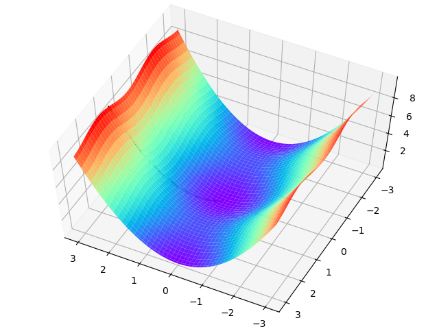
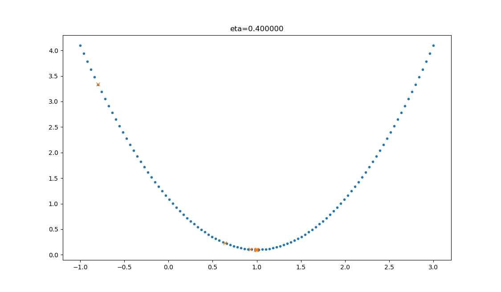
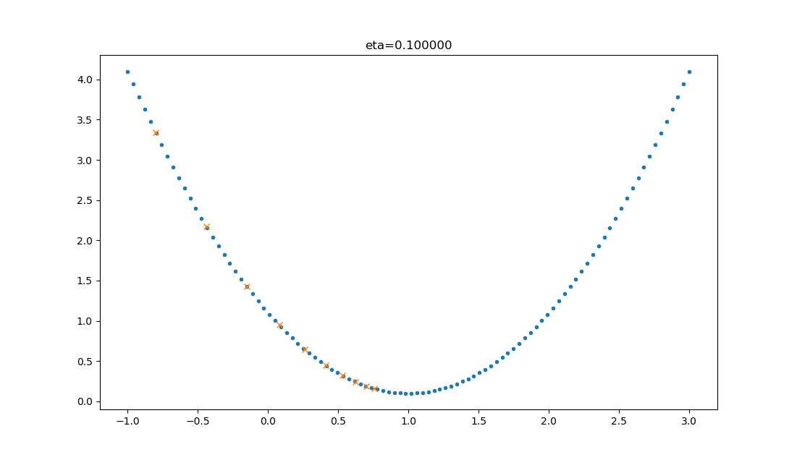

# Step2 - LinearRegression
#  单入单出的单层神经网络

## 单变量线性回归问题

### 提出问题

**问题：在一个新建的机房里，如果计划部署346台服务器，我们如何配置空调的最大功率？**

在互联网建设初期，各大运营商需要解决的问题就是保证服务器所在的机房的温度常年保持在23摄氏度左右。那么一个机房安装多少台空调或者提供多大功率的空调合适呢？

这个问题虽然能通过热力学计算得到公式，但是总会有误差。因此人们往往会在机房里装一个温控器，来控制空调的开关或者风扇的转速或者制冷能力，其中最大制冷能力是一个关键性的数值。更先进的做法是直接把机房建在海底，用隔离的海水循环降低空气温度的方式来冷却。

通过一些统计数据（称为样本数据），我们得到了这张表格：

|样本序号|服务器数量(千台)X|空调功率(千瓦)Y|
|---|---|---|
|1|0.928|4.824|
|2|0.469|2.950|
|3|0.855|4.643|
|...|...|...|

在上面的样本中，我们一般把自变量X称为样本特征值，把因变量Y称为样本标签值。

这个数据是二维的，所以我们可以用可视化的方式来展示，横坐标是服务器数量，纵坐标是空调功率：


通过对上图的观察，我们可以判断它属于一个线性回归问题，而且是最简单的一元线性回归。于是，我们把热力学计算的问题转换成为了一个统计问题，因为实在是不能精确地计算出每块电路板或每台机器到底能产生多少热量。

头脑灵活的读者可能会想到一个办法：在样本数据中，我们找到一个与346非常近似的例子，以它为参考就可以找到合适的空调功率数值了。

不得不承认，这样做是完全科学合理的，实际上这就是线性回归的解题思路：利用已有值，预测未知值。也就是说，这些读者不经意间使用了线性回归模型。而实际上，这个例子非常简单，只有一个自变量和一个因变量，因此可以用简单直接的方法来解决问题。但是，当有多个自变量时，这种直接的办法可能就会失效了。假设有三个自变量，很有可能不能够在样本中找到和这三个自变量的组合非常接近的数据，此时我们就应该借助更系统的方法了。

#  一元线性回归模型

回归分析是一种数学模型。当因变量和自变量为线性关系时，它是一种特殊的线性模型。

最简单的情形是一元线性回归，由大体上有线性关系的一个自变量和一个因变量组成，模型是：

$$Y=a+bX+ε \tag{1}$$

X是自变量，Y是因变量，ε是随机误差，a和b是参数，在线性回归模型中，a和b是我们要通过算法学习出来的。

什么叫模型？第一次接触这个概念时，可能会有些不明觉厉。从常规概念上讲，是人们通过主观意识借助实体或者虚拟表现来构成对客观事物的描述，这种描述通常是有一定的逻辑或者数学含义的抽象表达方式。

比如对小轿车建模的话，会是这样描述：由发动机驱动的四轮铁壳子。对能量概念建模的话，那就是爱因斯坦狭义相对论的著名推论：$E=mc^2$。

对数据建模的话，就是想办法用一个或几个公式来描述这些数据的产生条件或者相互关系，比如有一组数据是大致满足$y=3x+2$这个公式的，那么这个公式就是模型。为什么说是“大致”呢？因为在现实世界中，一般都有噪音（误差）存在，所以不可能非常准确地满足这个公式，只要是在这条直线两侧附近，就可以算作是满足条件。

对于线性回归模型，有如下一些概念需要了解：

- 通常假定随机误差的均值为0，方差为σ^2（σ^2﹥0，σ^2与X的值无关）
- 若进一步假定随机误差遵从正态分布，就叫做正态线性模型
- 一般地，若有k个自变量和1个因变量（即公式1中的Y），则因变量的值分为两部分：一部分由自变量影响，即表示为它的函数，函数形式已知且含有未知参数；另一部分由其他的未考虑因素和随机性影响，即随机误差
- 当函数为参数未知的线性函数时，称为线性回归分析模型
- 当函数为参数未知的非线性函数时，称为非线性回归分析模型
- 当自变量个数大于1时称为多元回归
- 当因变量个数大于1时称为多重回归

我们通过对数据的观察，可以大致认为它符合线性回归模型的条件，于是列出了公式1，不考虑随机误差的话，我们的任务就是找到合适的a和b，这就是线性回归的任务。
###  解决方案

我们接下来会用几种方法来解决这个问题：

1. 最小二乘法
2. 梯度下降法
3. 简单的神经网络法
4. 更通用的神经网络算法
当学习率=0.8时，会有这种左右跳跃的情况发生，这不利于神经网络的训练。
### 单变量函数的梯度下降

假设一个单变量函数：

$$J(x) = x ^2$$

我们的目的是找到该函数的最小值，于是计算其微分：

$$J'(x) = 2x$$

假设初始位置为：

$$x_0=1.2$$

假设学习率：

$$\eta = 0.3$$

根据公式(1)，迭代公式：

$$x_{n+1} = x_{n} - \eta \cdot \nabla J(x)= x_{n} - \eta \cdot 2x\tag{1}$$

假设终止条件为J(x)<1e-2，迭代过程是：
```
x=0.480000, y=0.230400
x=0.192000, y=0.036864
x=0.076800, y=0.005898
x=0.030720, y=0.000944
```
### 双变量的梯度下降
根据公式(1)，迭代过程是的计算公式：
$$(x_{n+1},y_{n+1}) = (x_n,y_n) - \eta \cdot \nabla J(x,y)$$
$$ = (x_n,y_n) - \eta \cdot (2x,2 \cdot \sin y \cdot \cos y) \tag{1}$$

根据公式(1)，假设终止条件为$J(x,y)<1e-2$，迭代过程：

||x|y|J(x,y)|
|---|---|---|---|
|1|3|1|9.708073|
|2|2.4|0.909070|6.382415|
|3|1.92|0.812114|4.213103|
|...|...|...|...|
|15|0.105553|0.063481|0.015166|
|16|0.084442|0.050819|0.009711|

迭代16次后，J(x,y)的值为0.009711，满足小于1e-2的条件，停止迭代。

上面的过程如下图所示，由于是双变量，所以需要用三维图来解释。请注意看那条隐隐的黑色线，表示梯度下降的过程，从红色的高地一直沿着坡度向下走，直到蓝色的洼地。

|观察角度1|观察角度2|
|---|---|
|| |
### 最小二乘法

####  历史

最小二乘法，也叫做最小平方法（Least Square），它通过最小化误差的平方和寻找数据的最佳函数匹配。利用最小二乘法可以简便地求得未知的数据，并使得这些求得的数据与实际数据之间误差的平方和为最小。最小二乘法还可用于曲线拟合。其他一些优化问题也可通过最小化能量或最大化熵用最小二乘法来表达。

1801年，意大利天文学家朱赛普·皮亚齐发现了第一颗小行星谷神星。经过40天的跟踪观测后，由于谷神星运行至太阳背后，使得皮亚齐失去了谷神星的位置。随后全世界的科学家利用皮亚齐的观测数据开始寻找谷神星，但是根据大多数人计算的结果来寻找谷神星都没有结果。时年24岁的高斯也计算了谷神星的轨道。奥地利天文学家海因里希·奥尔伯斯根据高斯计算出来的轨道重新发现了谷神星。

高斯使用的最小二乘法的方法发表于1809年他的著作《天体运动论》中。法国科学家勒让德于1806年独立发明“最小二乘法”，但因不为世人所知而默默无闻。勒让德曾与高斯为谁最早创立最小二乘法原理发生争执。

1829年，高斯提供了最小二乘法的优化效果强于其他方法的证明，因此被称为高斯-马尔可夫定理。

#### 数学原理

线性回归试图学得：

$$z(x_i)=w \cdot x_i+b \tag{1}$$

使得：

$$z(x_i) \simeq y_i \tag{2}$$

其中，$x_i$是样本特征值，$y_i$是样本标签值，$z_i$是模型预测值。

如何学得w和b呢？均方差(MSE - mean squared error)是回归任务中常用的手段：
$$
J = \sum_{i=1}^m(z(x_i)-y_i)^2 = \sum_{i=1}^m(y_i-wx_i-b)^2 \tag{3}
$$

$J$称为损失函数。


当学习率=0.6时，也会有跳跃，幅度偏小。


当学习率=0.4时，损失值会从单侧下降，4步以后基本接近了理想值。



当学习率=0.2时，损失值会从单侧下降，但下降速度较慢，8步左右接近极值。


当学习率=0.1时，损失值会从单侧下降，但下降速度非常慢，10步了还没有到达理想状态。



#  梯度下降法

有了上一节的最小二乘法做基准，我们这次用梯度下降法求解w和b，从而可以比较二者的结果。

## 数学原理

在下面的公式中，我们规定x是样本特征值（单特征），y是样本标签值，z是预测值，下标 $i$ 表示其中一个样本。

### 预设函数（Hypothesis Function）

为一个线性函数：

$$z_i = x_i \cdot w + b \tag{1}$$

### 损失函数（Loss Function）

为均方差函数：

$$loss(w,b) = \frac{1}{2} (z_i-y_i)^2 \tag{2}$$


与最小二乘法比较可以看到，梯度下降法和最小二乘法的模型及损失函数是相同的，都是一个线性模型加均方差损失函数，模型用于拟合，损失函数用于评估效果。

区别在于，最小二乘法从损失函数求导，直接求得数学解析解，而梯度下降以及后面的神经网络，都是利用导数传递误差，再通过迭代方式一步一步逼近近似解。

##  梯度计算

### 计算z的梯度

根据公式2：
$$
{\partial loss \over \partial z_i}=z_i - y_i \tag{3}
$$

### 计算w的梯度

我们用loss的值作为误差衡量标准，通过求w对它的影响，也就是loss对w的偏导数，来得到w的梯度。由于loss是通过公式2->公式1间接地联系到w的，所以我们使用链式求导法则，通过单个样本来求导。

根据公式1和公式3：

$$
{\partial{loss} \over \partial{w}} = \frac{\partial{loss}}{\partial{z_i}}\frac{\partial{z_i}}{\partial{w}}=(z_i-y_i)x_i \tag{4}
$$

### 计算b的梯度

$$
\frac{\partial{loss}}{\partial{b}} = \frac{\partial{loss}}{\partial{z_i}}\frac{\partial{z_i}}{\partial{b}}=z_i-y_i \tag{5}
$$

##  代码实现

```Python
if __name__ == '__main__':

    reader = SimpleDataReader()
    reader.ReadData()
    X,Y = reader.GetWholeTrainSamples()

    eta = 0.1
    w, b = 0.0, 0.0
    for i in range(reader.num_train):
        # get x and y value for one sample
        xi = X[i]
        yi = Y[i]
        # 公式1
        zi = xi * w + b
        # 公式3
        dz = zi - yi
        # 公式4
        dw = dz * xi
        # 公式5
        db = dz
        # update w,b
        w = w - eta * dw
        b = b - eta * db

    print("w=", w)    
    print("b=", b)
```

大家可以看到，在代码中，我们完全按照公式推导实现了代码，所以，大名鼎鼎的梯度下降，其实就是把推导的结果转化为数学公式和代码，直接放在迭代过程里！另外，我们并没有直接计算损失函数值，而只是把它融入在公式推导中。

###  运行结果

```
w= [1.71629006]
b= [3.19684087]
```
读者可能会注意到，上面的结果和最小二乘法的结果（w1=2.056827, b1=2.965434）相差比较多，这个问题我们留在本章稍后的地方解决。

#  多变量线性回归问题

##  提出问题

**问题：在北京通州，距离通州区中心15公里的一套93平米的房子，大概是多少钱？**

房价预测问题，成为了机器学习的一个入门话题，著名的波士顿的房价数据及相关的比赛已经很多了，但是美国的房子都是独栋的，前院后院停车库游泳池等等参数非常多，初学者可能理解起来有困难。我们不妨用简化版的北京通州的房价来举例，感受一下房价预测的过程。

影响北京通州房价的因素有很多，居住面积、地理位置、朝向、学区房、周边设施、建筑年份等等，其中，面积和地理位置是两个比较重要的因素。地理位置信息一般采用经纬度方式表示，但是经纬度是两个特征值，联合起来才有意义，因此，我们把它转换成了到通州区中心的距离。

我们有1000个样本，每个样本有两个特征值，一个标签值，示例如下：

|样本序号|地理位置|居住面积|价格（万元）|
|---|---|---|---|
|1|10.06|60|302.86|
|2|15.47|74|393.04|
|3|18.66|46|270.67|
|4|5.20|77|450.59|
|...|...|...|...|

- 特征值1 - 地理位置，统计得到：
  - 最大值：21.96公里
  - 最小值：2.02公里
  - 平均值：12.13公里

- 特征值2 - 房屋面积，统计得到：
  - 最大值：119平米
  - 最小值：40平米
  - 平均值：78.9平米

- 标签值 - 房价，单位为百万元：
  - 最大值：674.37
  - 最小值：181.38
  - 平均值：420.64

这个数据是三维的，所以可以用两个特征值作为x和y，用标签值作为z，在xyz坐标中展示：

|正向|侧向|
|---|---|
|||

从正向看，很像一块草坪，似乎是一个平面。再从侧向看，和第4章中的直线拟合数据很像。所以，对于这种三维的线性拟合，我们可以把它想象成为拟合一个平面，这个平面会位于这块“草坪”的中位，把“草坪”分割成上下两块更薄的“草坪”，最终使得所有样本点到这个平面的距离的平方和最小。

## 多元线性回归模型

由于表中可能没有恰好符合15公里、93平米条件的数据，因此我们需要根据1000个样本值来建立一个模型，来解决预测问题。

通过图示，我们基本可以确定这个问题是个线性回归问题，而且是典型的多元线性回归，即包括两个或两个以上自变量的回归。多元线性回归的函数模型如下：

$$y=a_0+a_1x_1+a_2x_2+\dots+a_kx_k$$

具体化到房价预测问题，上面的公式可以简化成：

$$ 
z = x_1 \cdot w_1 + x_2 \cdot w_2 + b
$$

抛开本例的房价问题，对于一般的应用问题，建立多元线性回归模型时，为了保证回归模型具有优良的解释能力和预测效果，应首先注意自变量的选择，其准则是：
1. 自变量对因变量必须有显著的影响，并呈密切的线性相关；
2. 自变量与因变量之间的线性相关必须是真实的，而不是形式上的；
3. 自变量之间应具有一定的互斥性，即自变量之间的相关程度不应高于自变量与因变量之因的相关程度；
4. 自变量应具有完整的统计数据，其预测值容易确定。


#  神经网络法

在梯度下降法中，我们简单讲述了一下神经网络做线性拟合的原理，即：

1. 初始化权重值
2. 根据权重值放出一个解
3. 根据均方差函数求误差
4. 误差反向传播给线性计算部分以调整权重值
5. 是否满足终止条件？不满足的话跳回2

一个不恰当的比喻就是穿糖葫芦：桌子上放了一溜儿12个红果，给你一个足够长的竹签子，选定一个角度，在不移动红果的前提下，想办法用竹签子穿起最多的红果。

最开始你可能会任意选一个方向，用竹签子比划一下，数数能穿到几个红果，发现是5个；然后调整一下竹签子在桌面上的水平角度，发现能穿到6个......最终你找到了能穿10个红果的的角度。

## 定义神经网络结构

我们是首次尝试建立神经网络，先用一个最简单的单层单点神经元：


下面，我们用这个最简的线性回归的例子，来说明神经网络中最重要的反向传播和梯度下降的概念、过程以及代码实现。

### 输入层

此神经元在输入层只接受一个输入特征，经过参数w,b的计算后，直接输出结果。这样一个简单的“网络”，只能解决简单的一元线性回归问题，而且由于是线性的，我们不需要定义激活函数，这就大大简化了程序，而且便于大家循序渐进地理解各种知识点。

严格来说输入层在神经网络中并不能称为一个层。

### 权重w/b

因为是一元线性问题，所以w/b都是一个标量。

### 输出层

输出层1个神经元，线性预测公式是：

$$z_i = x_i \cdot w + b$$

z是模型的预测输出，y是实际的样本标签值，下标 $i$ 为样本。

### 损失函数

因为是线性回归问题，所以损失函数使用均方差函数。

$$loss(w,b) = \frac{1}{2} (z_i-y_i)^2$$

##  反向传播

由于我们使用了和上一节中的梯度下降法同样的数学原理，所以反向传播的算法也是一样的，细节请查看4.2.2。

### 计算w的梯度

$$
{\partial{loss} \over \partial{w}} = \frac{\partial{loss}}{\partial{z_i}}\frac{\partial{z_i}}{\partial{w}}=(z_i-y_i)x_i
$$

### 计算b的梯度

$$
\frac{\partial{loss}}{\partial{b}} = \frac{\partial{loss}}{\partial{z_i}}\frac{\partial{z_i}}{\partial{b}}=z_i-y_i
$$

为了简化问题，在本小节中，反向传播使用单样本方式，在下一小节中，我们将介绍多样本方式。

##  代码实现

其实神经网络法和梯度下降法在本质上是一样的，只不过神经网络法使用一个崭新的编程模型，即以神经元为中心的代码结构设计，这样便于以后的功能扩充。

在Python中可以使用面向对象的技术，通过创建一个类来描述神经网络的属性和行为，下面我们将会创建一个叫做NeuralNet的class，然后通过逐步向此类中添加方法，来实现神经网络的训练和推理过程。

### 定义类

```Python
class NeuralNet(object):
    def __init__(self, eta):
        self.eta = eta
        self.w = 0
        self.b = 0
```
NeuralNet类从object类派生，并具有初始化函数，其参数是eta，也就是学习率，需要调用者指定。另外两个成员变量是w和b，初始化为0。

### 前向计算

```Python
    def __forward(self, x):
        z = x * self.w + self.b
        return z
```
这是一个私有方法，所以前面有两个下划线，只在NeuralNet类中被调用，不对外公开。

### 反向传播

下面的代码是通过梯度下降法中的公式推导而得的，也设计成私有方法：

```Python
    def __backward(self, x,y,z):
        dz = z - y
        db = dz
        dw = x * dz
        return dw, db
```
dz是中间变量，避免重复计算。dz又可以写成delta_Z，是当前层神经网络的反向误差输入。

### 梯度更新

```Python
    def __update(self, dw, db):
        self.w = self.w - self.eta * dw
        self.b = self.b - self.eta * db
```

每次更新好新的w和b的值以后，直接存储在成员变量中，方便下次迭代时直接使用，不需要在全局范围当作参数内传来传去的。

### 训练过程

只训练一轮的算法是：

***
for 循环，直到所有样本数据使用完毕：
1. 读取一个样本数据
2. 前向计算
3. 反向传播
4. 更新梯度
***

```Python
    def train(self, dataReader):
        for i in range(dataReader.num_train):
            # get x and y value for one sample
            x,y = dataReader.GetSingleTrainSample(i)
            # get z from x,y
            z = self.__forward(x)
            # calculate gradient of w and b
            dw, db = self.__backward(x, y, z)
            # update w,b
            self.__update(dw, db)
        # end for
```

#### 推理预测

```Python
    def inference(self, x):
        return self.__forward(x)
```

推理过程，实际上就是一个前向计算过程，我们把它单独拿出来，方便对外接口的设计，所以这个方法被设计成了公开的方法。

#### 主程序

```Python
if __name__ == '__main__':
    # read data
    sdr = SimpleDataReader()
    sdr.ReadData()
    # create net
    eta = 0.1
    net = NeuralNet(eta)
    net.train(sdr)
    # result
    print("w=%f,b=%f" %(net.w, net.b))
    # predication
    result = net.inference(0.346)
    print("result=", result)
    ShowResult(net, sdr)
```

## 运行结果

打印输出结果：

```
w=1.716290,b=3.196841
result= [3.79067723]
```

最终我们得到了W和B的值，对应的直线方程是$y=1.71629x+3.196841$。推理预测时，已知有346台服务器，先要除以1000，因为横坐标是以K(千台)服务器为单位的，代入前向计算函数，得到的结果是3.74千瓦。

结果显示函数：

```Python
def ShowResult(net, dataReader):
    X,Y = dataReader.GetWholeTrainSamples()
    # draw sample data
    plt.plot(X, Y, "b.")
    # draw predication data
    PX = np.linspace(0,1,10)
    PZ = net.inference(PX)
    plt.plot(PX, PZ, "r")
    plt.title("Air Conditioner Power")
    plt.xlabel("Number of Servers(K)")
    plt.ylabel("Power of Air Conditioner(KW)")
    plt.show()
```

对于初学神经网络的人来说，可视化的训练过程及结果，可以极大地帮助理解神经网络的原理，Python的Matplotlib库提供了非常丰富的绘图功能。

在上面的函数中，先获得所有样本点数据，把它们绘制出来。然后在[0,1]之间等距设定10个点做为x值，用x值通过网络推理方法net.inference()获得每个点的y值，最后把这些点连起来，就可以画出下图中的拟合直线：


可以看到红色直线虽然穿过了蓝色点阵，但是好像不是处于正中央的位置，应该再逆时针旋转几度才会达到最佳的位置。我们后面小节中会讲到如何提高训练结果的精度问题。

## 代码位置

ch04, Level3

## 思考和练习

1. 请把上述代码中的dw和db也改成私有属性，然后试着运行程序。

#  总结
本次课程较为复杂，课后需加以时间来掌握，配合慕课的学习方能逐渐理解。此次学习的多为函数知识，更是考验我们数学的学习功底，同时也帮助我们复习了函数知识，就是这样在学习中不断进步才能取得成功，课程愈来愈复杂了，我一定要保持自己的态度认真学习绝不松懈。