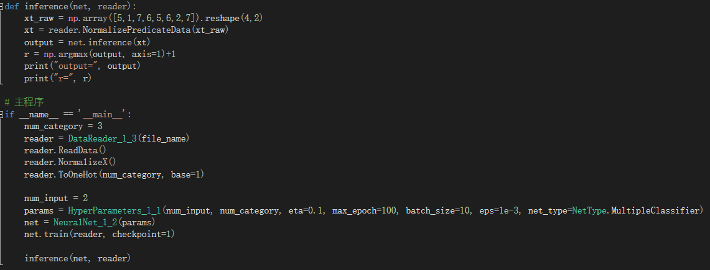

# **线性分类**

>## 多入单出的单层神经网路

>### 二分类函数 

- 公式

$$a(z) = \frac{1}{1 + e^{-z}}$$

- 导数

$$a^{'}(z) = a(z)(1 - a(z))$$

具体求导过程可以参考8.1节。

- 输入值域

$$(-\infty, \infty)$$

- 输出值域

$$(0,1)$$

- 函数图像


>### 正向传播

#### 矩阵运算

$$
z=x \cdot w + b \tag{1}
$$

#### 分类计算

$$
a = Logistic(z)={1 \over 1 + e^{-z}} \tag{2}
$$

#### 损失函数计算

二分类交叉熵损失函数：

$$
loss(w,b) = -[y \ln a+(1-y)\ln(1-a)] \tag{3}
$$

>### 反向传播

#### 求损失函数loss对a的偏导

$$
\frac{\partial loss}{\partial a}=-[{y \over a}+{-(1-y) \over 1-a}]=\frac{a-y}{a(1-a)} \tag{4}
$$

#### 求损失函数a对z的偏导

$$
\frac{\partial a}{\partial z}= a(1-a) \tag{5}
$$

#### 求损失函数loss对z的偏导

使用链式法则链接公式4和公式5：

$$
\frac{\partial loss}{\partial z}=\frac{\partial loss}{\partial a}\frac{\partial a}{\partial z}
$$
$$
=\frac{a-y}{a(1-a)} \cdot a(1-a)=a-y \tag{6}
$$

**[代码实现线性二分类的神经网络]**

 
```Python
if __name__ == '__main__':
    # data
    reader = SimpleDataReader()
    reader.ReadData()
    # net
    params = HyperParameters(eta=0.1, max_epoch=100, batch_size=10, eps=1e-3, net_type=NetType.BinaryClassifier)
    input = 2
    output = 1
    net = NeuralNet(params, input, output)
    net.train(reader, checkpoint=1)
    # inference
    x_predicate = np.array([0.58,0.92,0.62,0.55,0.39,0.29]).reshape(3,2)
    a = net.inference(x_predicate)
    print("A=", a)    
```
 

>### 二分类的几何原理

   
假设绿色方块为正类：标签值$y=1$，红色三角形为负类：标签值$y=0$。

从几何关系上理解，如果我们有一条直线，其公式为：$z = w \cdot x_1+b$，如图中的虚线所示，则所有正类的样本的x2都大于z，而所有的负类样本的x2都小于z，那么这条直线就是我们需要的分割线

>### 二分类结果可视化

   
- 展示样本数据，以便判断分割线和样本数据的吻合程度
- 显示一下三个预测点的位置，看看是否正确

**主程序**  

此时已经几近完美的分开了两个区域
 

>### 多入单出的单层神经网路

>#### 多分类函数定义 - Softmax
#### （1）定义

$$
a_j = \frac{e^{z_j}}{\sum\limits_{i=1}^m e^{z_i}}=\frac{e^{z_j}}{e^{z_1}+e^{z_2}+\dots+e^{z_m}}
$$
上式中:
- $z_j$是对第 j 项的分类原始值，即矩阵运算的结果
- $z_i$是参与分类计算的每个类别的原始值
- m 是总的分类数
- $a_j$是对第 j 项的计算结果

#### (2) 代码实现
①公式法
```Python
def Softmax1(x):
    e_x = np.exp(x)
    v = np.exp(x) / np.sum(e_x)
    return v
```
②修改法
```Python
class Softmax(object):
    def forward(self, z):
        shift_z = z - np.max(z, axis=1, keepdims=True)
        exp_z = np.exp(shift_z)
        a = exp_z / np.sum(exp_z, axis=1, keepdims=True)
        return a

```

>## 线性多分类的神经网络实现 

#### 输入层

输入经度(x1)和纬度(x2)两个特征：

$$
x=\begin{pmatrix}
x_1 & x_2
\end{pmatrix}
$$

#### 权重矩阵w/b

W权重矩阵的尺寸，可以从后往前看，比如：输出层是3个神经元，输入层是2个特征，则W的尺寸就是3x2。

$$
w=\begin{pmatrix}
w_{11} & w_{12} & w_{13}\\
w_{21} & w_{22} & w_{23} 
\end{pmatrix}
$$

b的尺寸是1x3，列数永远和神经元的数量一样，行数永远是1。

$$
b=\begin{pmatrix}
b_1 & b_2 & b_3 
\end{pmatrix}
$$

#### 输出层

输出层三个神经元，再加上一个Softmax计算，最后有A1,A2,A3三个输出，写作：

$$
z = \begin{pmatrix}z_1 & z_2 & z_3 \end{pmatrix}
$$

$$
a = \begin{pmatrix}a_1 & a_2 & a_3 \end{pmatrix}
$$

其中，$Z=X \cdot W+B，A = Softmax(Z)$

**[代码实现]**
    
推理模型和主函数
 
