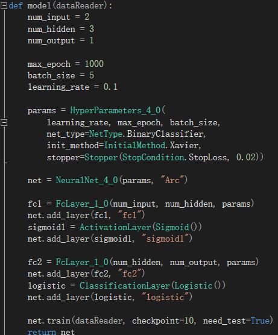
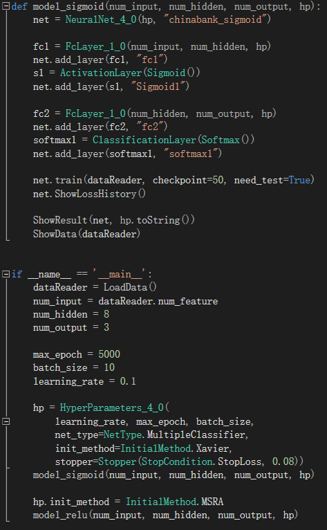

# **深度神经网络**

>## 回归任务功能测试

**搭建模型**
 
一个双层的神经网络，第一层后面接一个Sigmoid激活函数，第二层直接输出拟合数据：

**[代码实现]**
    
超参数说明：

1. 输入层1个神经元，因为只有一个x值
2. 隐层4个神经元，对于此问题来说应该是足够了，因为特征很少
3. 输出层1个神经元，因为是拟合任务
4. 学习率=0.5
5. 最大epoch=10000轮
6. 批量样本数=10
7. 拟合网络类型
8. Xavier初始化
9. 绝对损失停止条件=0.001

    
上图左边是拟合的情况，绿色点是测试集数据，红色点是神经网路的推理结果，可以看到除了最左侧开始的部分，其它部分都拟合的不错。注意，这里我们不是在讨论过拟合、欠拟合的问题，我们在这个章节的目的就是更好地拟合一条曲线。
 

由于我们设置了eps=0.001，所以在5000多个epoch时便达到了要求，训练停止。最后用测试集得到的准确率为98.2%，已经非常不错了。如果训练更多的轮，可以得到更好的结果。
 

>## 二分类试验 - 双弧形非线性二分类

**搭建模型**
同样是一个双层神经网络，但是最后一层要接一个Logistic二分类函数来完成二分类任务：
 

**[代码实现]**
    

超参数说明：

1. 输入层神经元数为2
2. 隐层的神经元数为3，使用Sigmoid激活函数
3. 由于是二分类任务，所以输出层只有一个神经元，用Logistic做二分类函数
4. 最多训练1000轮
5. 批大小=5
6. 学习率=0.1
7. 绝对误差停止条件=0.02

>## 多分类功能测试 

**搭建模型**
使用Sigmoid做为激活函数的两层网络：
 
#### 超参数说明

1. 隐层8个神经元
2. 最大epoch=5000
3. 批大小=10
4. 学习率0.1
5. 绝对误差停止条件=0.08
6. 多分类网络类型
7. 初始化方法为Xavier

net.train()函数是一个阻塞函数，只有当训练完毕后才返回。

**[代码实现]**

