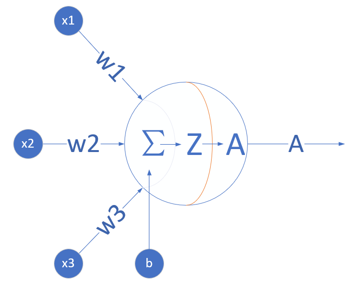
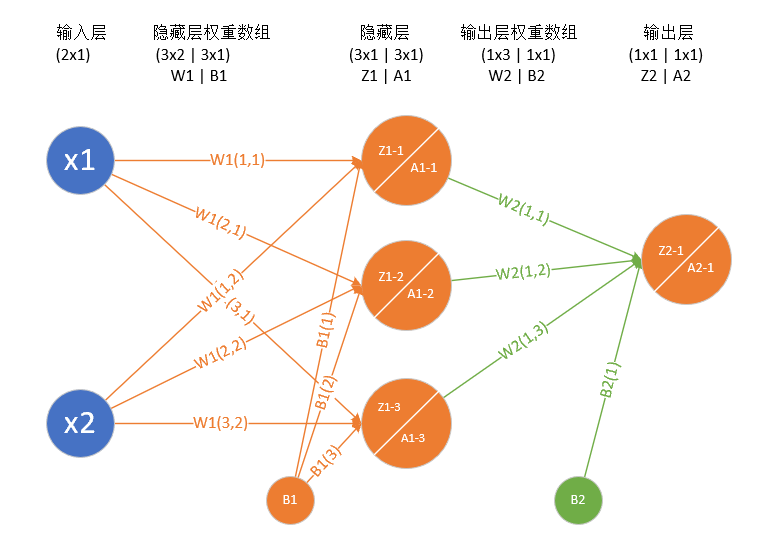
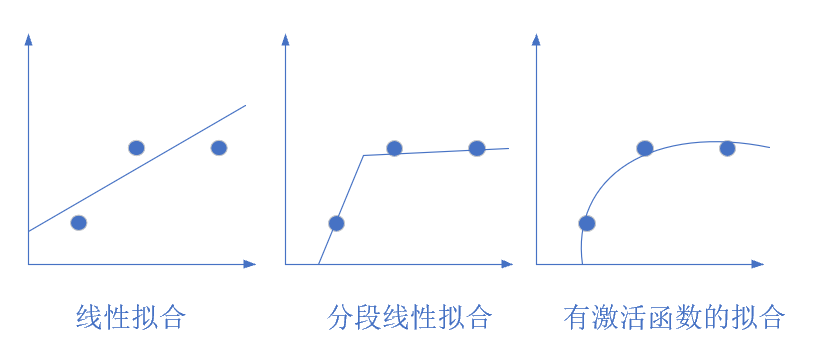
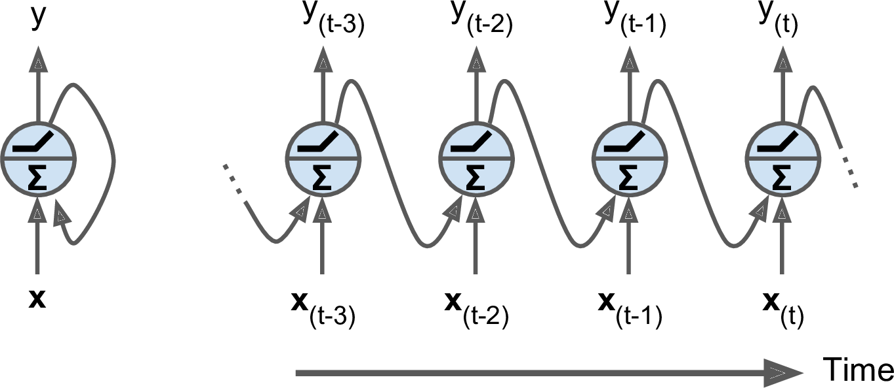

# 第一章 基本概念

九个章节
1. 基本概念
2. 线性回归
3. 线性分类
4. 非线性回归
5. 非线性分类
6. 模型的推理与应用部署
7. 深度神经网络
8. 卷积神经网络
9. 循环神经网络

## 符号约定

|符号|含义|
|---|---|
|x，X|输入样本 |
|y，Y|输入样本的标签 |
|z，Z|线性运算的结果|
|a，A|激活函数/结果|
|w，W|权重矩阵|
|b，B|偏移矩阵|
|$x，y，z，w，b$|标量|
|$X，Y，Z，W，B$|矩阵|
|$x_1，y_1，z_1$|单样本或其计算结果|
|$x$|样本|
|$x^2$|样本值的平方|
|$x_1$|第一个样本，或，样本的第一个特征值，在上下文中会有说明|
|$x_{23}$|第2个样本的第3个特征值|
|$y_1$|第一个样本的标签值|
|$Y$|多样本的标签值矩阵|
|$z_1$|第一个样本的计算输出值，或，z向量中第一个元素值，在上下文中会有说明|
|$Z2$|第二层网络的线性计算结果矩阵|
|$w$|权重|
|$w_1$|权重向量第一个元素|
|$W$|权重矩阵|
|$W^1, W1$|第一层网络的权重矩阵|
|$w_{23},w_{2,3}$|权重矩阵中的第二行第三列权重值，即从上层的第2个神经元到下层的第3个神经元的权重连接|
|$w^1_{23}$|第一层网络的权重矩阵中的第二行第三列权重值|
|$A2$|第二层网络的激活函数输出或者分类函数输出矩阵|
|$a$|激活函数值|
|$a^1_2$|第一层网络的第二个神经元的激活函数值|
|$Z^{(m \times n)}$|Z是一个$m \times n$的矩阵|
|$X^T$|X的转置矩阵|
|$X^{-1}$|X的逆矩阵|
|$loss,loss(w,b)$|单样本误差函数|
|$J, J(w,b)$|多样本损失函数|

# 神经网络的基本工作原理

## 1.0 神经网络的基本工作原理简介

### 1.0.1 神经元细胞的数学模型

神经网络由基本的神经元组成，下图就是一个神经元的数学/计算模型，便于我们用程序来实现。

#### 输入 input

(x1,x2,x3) 是外界输入信号，一般是一个训练数据样本的多个属性，比如，我们要预测一辆车的价格，那么在车辆价格数据样本中，x1可能代表了品牌，x2可能代表车的造价，x3可能代表油耗等。另外一个例子是，假设(x1,x2,x3)分别代表了(红,绿,蓝)三种颜色，而此神经元用于识别输入的信号是暖色还是冷色。

#### 权重 weights

(w1,w2,w3) 是每个输入信号的权重值，以上面的 (x1,x2,x3) 的例子来说，x1的权重可能是0.92，x2的权重可能是0.2，x3的权重可能是0.03。当然权重值相加之后可以不是1。

#### 偏移 bias

生物学上解释，在脑神经细胞中，一定是输入信号的电平/电流大于某个临界值时，神经元细胞才会处于兴奋状态，这个b实际就是那个临界值。亦即当：

$$w1 \cdot x1 + w2 \cdot x2 + w3 \cdot x3 >= t$$

时，该神经元细胞才会兴奋。我们把t挪到等式左侧来，变成$(-t)$，然后把它写成b，变成了：

$$w1 \cdot x1 + w2 \cdot x2 + w3 \cdot x3 + b >= 0$$

于是b诞生了！

#### 求和计算 sum

$$Z = w1 \cdot x1 + w2 \cdot x2 + w3 \cdot x3 + b = \sum_{i=1}^m(w_i \cdot x_i) + b$$

在上面的例子中m=3。我们把$w_i \cdot x_i$变成矩阵运算的话，就变成了：

$$Z = W \cdot X + b$$

#### 激活函数 activation

求和之后，神经细胞已经处于兴奋状态了，已经决定要向下一个神经元传递信号了，但是要传递多强烈的信号，要由激活函数来确定：

$$A=a{(Z)}$$

如果激活函数是一个阶跃信号的话，那受不了啊，你会觉得脑子里总是一跳一跳的，像继电器开合一样咔咔乱响，所以一般激活函数都是有一个渐变的过程，也就是说是个曲线。

至此，一个神经元的工作过程就在电光火石般的一瞬间结束了。

#### 小结

- 一个神经元可以有多个输入
- 一个神经元只能有一个输出，这个输出可以同时输入给多个神经元**
- 一个神经元的w的数量和输入的数量一致
- 一个神经元只有一个b
- w和b有人为的初始值，在训练过程中被不断修改
- 激活函数不是必须有的，亦即A可以等于Z
- 一层神经网络中的所有神经元的激活函数必须一致

### 1.0.2 神经网络的训练过程

#### 单层神经网络模型

这是一个单层的神经网络，有m个输入 (这里m=3)，有n个输出 (这里n=2)。在单个神经元里，b是个值。但是在神经网络中，我们把b的值永远设置为1，而用b到每个神经元的权值来表示实际的偏移值，亦即(b1,b2)，这样便于矩阵运算。也有些作者把b写成x0，其实是同一个意思，只不过x0用于等于1。

- $(x1,x2,x3)$是一个样本数据的三个特征值
- $(w11,w12,w13)$是$(x1,x2,x3)$到$n1$的权重
- $(w21,w22,w23)$是$(x1,x2,x3)$到$n2$的权重
- $b1$是$n1$的偏移
- $b2$是$n2$的偏移

 

从这里大家可以意识到，同一个特征x1，对于n1、n2来说，权重是不相同的，因为n1、n2是两个神经元，它们完成不同的任务（特征识别）。我们假设x1,x2,x3分别代表红绿蓝三种颜色，而n1,n2分别用于识别暖色和冷色，那么x1到n1的权重，肯定要大于x1到n2的权重，因为x1代表红色，是暖色。

而对于n1来说，x1，x2，x3输入的权重也是不相同的，因为它要对不同特征有选择地接纳。如同上面的例子，n1对于代表红色的x1，肯定是特别重视，权重值较高；而对于代表蓝色的x3，尽量把权重值降低，才能有正确的输出。

#### 训练流程

#### 前提条件

 1. 首先是我们已经有了训练数据
 2. 我们已经根据数据的规模、领域，建立了神经网络的基本结构，比如有几层，每一层有几个神经元
 3. 定义好损失函数来合理地计算误差

#### 步骤

假设我们有以下训练数据样本：

|Id|x1|x2|x3|Y|
|---|---|---|---|---|
|1|0.5|1.4|2.7|3|
|2|0.4|1.3|2.5|5|
|3|0.1|1.5|2.3|9|
|4|0.5|1.7|2.9|1|

其中，x1，x2，x3是每一个样本数据的三个特征值，Y是样本的真实结果值：

1. 随机初始化权重矩阵，可以根据高斯分布或者正态分布等来初始化。这一步可以叫做“蒙”，但不是瞎蒙。
2. 拿一个或一批数据作为输入，带入权重矩阵中计算，再通过激活函数传入下一层，最终得到预测值。在本例中，我们先用Id-1的数据输入到矩阵中，得到一个A值，假设A=5
3. 拿到Id-1样本的真实值Y=3
4. 计算损失，假设用均方差函数 $Loss = (A-Y)^2=(5-3)^2=4$
5. 根据一些神奇的数学公式（反向微分），把Loss=4这个值用大喇叭喊话，告诉在前面计算的步骤中，影响A=5这个值的每一个权重矩阵，然后对这些权重矩阵中的值做一个微小的修改（当然是向着好的方向修改，这一点可以用数学家的名誉来保证）
6. 用Id-2样本作为输入再次训练（goto 2）
7. 这样不断地迭代下去，直到以下一个或几个条件满足就停止训练：损失函数值非常小；迭代了指定的次数；

训练完成后，我们会把这个神经网络中的结构和权重矩阵的值导出来，形成一个计算图（就是矩阵运算加上激活函数）模型，然后嵌入到任何可以识别/调用这个模型的应用程序中，根据输入的值进行运算，输出预测值。

### 1.0.3 神经网络中的矩阵运算

下面这个图是一个两层的神经网络，包含隐藏层和输出层，输入层不算做一层：

其中，w1(m,n)，1表示第1层，表示第一层神经网络的权重矩阵，w2(m,n)表示第二层神经网络的权重矩阵。Visio中不容易写上下标，所以形式有所变动。

$$Z^1_1 = w^1_{1,1}x_1+w^1_{1,2}x_2+b^1_1 \tag{上标1表示第1层}$$
$$Z^1_2 = w^1_{2,1}x_1+w^1_{2,2}x_2+b^1_2$$
$$Z^1_{3} = w^1_{3,1}x_1+w^1_{3,2}x_2+b^1_{3}$$

变成矩阵运算：

$$Z^1_1=\begin{pmatrix}w^1_{1,1}&w^1_{1,2}\end{pmatrix}
\begin{pmatrix}x_1 \\ x_2\end{pmatrix}+b^1_1$$

$$Z^1_2=\begin{pmatrix}w^1_{2,1}&w^1_{2,2}\end{pmatrix}
\begin{pmatrix}x_1 \\ x_2\end{pmatrix}+b^1_2$$

$$Z^1_{3}=\begin{pmatrix}w^1_{3,1}&w^1_{3,2}\end{pmatrix}
\begin{pmatrix}x_1 \\ x_2\end{pmatrix}+b^1_3$$

再变成大矩阵：

$$Z1 =
\begin{pmatrix}
w^1_{1,1}&w^1_{1,2} \\
w^1_{2,1}&w^1_{2,2}\\
w^1_{3,1}&w^1_{3,2}
\end{pmatrix}
\begin{pmatrix}x_1 \\
x_2 \end{pmatrix}
+\begin{pmatrix}b^1_1 \\
b^1_2 \\
b^1_3
\end{pmatrix}$$

最后变成矩阵符号：

$$Z1 = W1 \cdot X + B1$$

然后是激活函数运算：

$$A1=a{(Z1)} (有激活函数)|or|A = Z(无激活函数)$$

同理可得：

$$Z2 = W2 \cdot A1 + B2$$

$$A2=a{(Z2)}$$

注意：损失函数不是前向计算的一部分。

### 1.0.4 神经网络的主要功能

- **回归/拟合 Regression/fitting**
- **分类 Classification**

单层的神经网络能够模拟一条二维平面上的直线，从而可以完成线性分割任务。而理论证明，两层神经网络可以无限逼近任意连续函数。

比如下面这张图，二维平面中有两类点，红色的和蓝色的，用一条直线肯定不能把两者分开了。

|拟合|分类|
|---|---|
|||

我们使用一个两层的神经网络可以得到一个非常近似的结果，使得分类误差在满意的范围之内。而这个真实的连续函数的原型是：

$$y=0.4x^2 + 0.3xsin(15x) + 0.01cos(50x)-0.3$$

神经网络的训练结果，是一大堆的权重组成的数组（近似解），并不能得到上面那种精确的数学表达式（数学解析解）。

#### 激活函数的作用

激活函数就相当于关节。看以下的例子：

$$Z1 = W1 \cdot X + B1$$

$$Z2 = W2 \cdot Z1 + B2$$

$$Z3 = W3 \cdot Z2 + B3$$

将前式依次代入并展开：

$$Z3=W3 \cdot(W2 \cdot (W1 \cdot X+B1)+B2)+B3$$

$$=(W3W2W1) \cdot X+ (W3W2B1+W3B2+B3)$$

$$=W \cdot X+B$$

$Z1,Z2,Z3$分别代表三层神经网络。

最后可以看到，不管有多少层，总可以归结到WX+B的形式，这和单层神经网络没有区别。

如果我们不运用激活函数的话，则输出信号将仅仅是一个简单的线性函数。线性函数一个一级多项式。现如今，线性方程是很容易解决的，但是它们的复杂性有限，并且从数据中学习复杂函数映射的能力更小。一个没有激活函数的神经网络将只不过是一个线性回归模型（Linear regression Model）罢了，它功率有限，并且大多数情况下执行得并不好。

应当意识到线性函数的局限性，并不能很好地解释客观世界。

我们希望我们的神经网络不仅仅可以学习和计算线性函数，而且还要比这复杂得多。同样是因为没有激活函数，我们的神经网络将无法学习和模拟其他复杂类型的数据，例如图像、视频、音频、语音等。这就是为什么我们要使用人工神经网络技术，诸如深度学习（Deep learning），来理解一些复杂的事情，一些相互之间具有很多隐藏层的非线性问题，而这也可以帮助我们了解复杂的数据。

Sigmoid激活函数：

$$a = \frac{1}{1+e^{-z}}=\frac{1}{1+e^{-(wx+b)}}$$

非线性函数是那些多次方函数，而且当绘制非线性函数时它们具有曲率。现在我们需要一个可以学习和表示几乎任何东西的神经网络模型，以及可以将输入映射到输出的任意复杂函数。

神经网络被认为是通用函数近似器（Universal Function Approximators）。这意味着他们可以计算和学习任何函数。几乎我们可以想到的任何过程都可以表示为神经网络中的函数计算。

而这一切都归结于这一点，我们需要应用激活函数a(z)，以便使网络更加强大，增加它的能力，使它可以学习复杂的事物，复杂的表单数据，以及表示输入输出之间非线性的复杂的任意函数映射。因此，使用非线性激活函数，我们便能够从输入输出之间生成非线性映射。

激活函数的另一个重要特征是：它应该是可导的。我们需要这样的特性，以便在网络中向后推进以计算相对于权重的误差（损失）梯度时执行反向优化策略，然后相应地使用梯度下降或任何其他优化技术改变权重以减少误差。

### 1.0.6 为什么需要深度神经网络与深度学习

通常我们把三层以上的网络称为深度神经网络。两层的神经网络虽然强大，但可能只能完成二维空间上的一些拟合与分类的事情。如果对于图片、语音、文字序列这些复杂的事情，就需要更复杂的网络来理解和处理。第一个方式是增加每一层中神经元的数量，但这是线性的，不够有效。另外一个方式是增加层的数量，每一层都处理不同的事情。

1. 卷积神经网络 CNN (Convolutional Neural Networks)

对于图像类的机器学习问题，最有效的就是卷积神经网络。

1. 循环神经网络 RNN (Recurrent Neural Networks)

对于语言类的机器学习问题，最有效的就是循环神经网络。

### 1.0.7 Deep Learning的训练过程简介

1. 使用自下上升非监督学习（就是从底层开始，一层一层的往顶层训练）

   采用无标签数据（有标签数据也可）分层训练各层参数，这一步可以看作是一个无监督训练过程，是和传统神经网络区别最大的部分（这个过程可以看作是feature learning过程）。
   具体的，先用无标签数据训练第一层，训练时先学习第一层的参数（这一层可以看作是得到一个使得输出和输入差别最小的三层神经网络的隐层），由于模型capacity的限制以及稀疏性约束，使得得到的模型能够学习到数据本身的结构，从而得到比输入更具有表示能力的特征；在学习得到第n-1层后，将n-1层的输出作为第n层的输入，训练第n层，由此分别得到各层的参数；

2. 自顶向下的监督学习（就是通过带标签的数据去训练，误差自顶向下传输，对网络进行微调）

   基于第一步得到的各层参数进一步fine-tune整个多层模型的参数，这一步是一个有监督训练过程；第一步类似神经网络的随机初始化初值过程，由于deep learning的第一步不是随机初始化，而是通过学习输入数据的结构得到的，因而这个初值更接近全局最优，从而能够取得更好的效果；所以deep learning效果好很大程度上归功于第一步的feature learning过程。

本系列文章主要解释第2种类型（有监督学习）的神经网络机器学习过程。

## 1.1 基本函数导数公式

### 1.1.1 基本函数及其导数

|公式序号|函数|导数|备注|
|---|---|---|---|
|1|$y=c$|$y'=0$|
|2|$y=x^a$|$y'=ax^{a-1}$|
|3|$y=log_ax$|$y'=\frac{1}{x}log_ae=\frac{1}{xlna}$|
|4|$y=lnx$|$y'=\frac{1}{x}$|
|5|$y=a^x$|$y'=a^xlna$|
|6|$y=e^x$|$y'=e^x$|
|7|$y=e^{-x}$|$y'=-e^{-x}$|
|8|$y=sin(x)$|$y'=cos(x)$|正弦函数|
|9|$y=cos(x)$|$y'=-sin(x)$|余弦函数|
|10|$y=tg(x)$|$y'=sec^2(x)=\frac{1}{cos^2x}$| 正切函数 |
|11|$y=ctg(x)$|$y'=-csc^2(x)$| 余切函数 |
|12|$y=arcsin(x)$|$y'=\frac{1}{\sqrt{1-x^2}}$| 反正弦函数 |
|13|$y=arccos(x)$|$y'=-\frac{1}{\sqrt{1-x^2}}$| 反余弦函数 |
|14|$y=arctan(x)$|$y'=\frac{1}{1+x^2}$| 反正切函数 |
|15|$y=arcctg(x)$|$y'=-\frac{1}{1+x^2}$| 反余切函数 |
|16|$y=sinh(x)=(e^x-e^{-x})/2$|$y'=cosh(x)$|双曲正弦函数 |
|17|$y=cosh(x)=(e^x+e^{-x})/2$|$y'=sinh(x)$|双曲余弦函数 |
|18|$y=tanh(x)=(e^x-e^{-x})/(e^x+e^{-x})$|$y'=sech^2(x)=1-tanh^2(x)$|双曲正切函数|
|19|$y=coth(x)=(e^x+e^{-x})/(e^x-e^{-x})$|$y'=-csch^2(x)$|双曲余切函数|
|20|$y=sech(x)=2/(e^x+e^{-x})$|$y'=-sech(x)*tanh(x)$|双曲正割函数|
|21|$y=csch(x)=2/(e^x-e^{-x})$|$y'=-csch(x)*coth(x)$| 双曲余割函数|

### 1.1.2 导数四则运算

$$[u(x) + v(x)]' = u'(x) + v'(x) \tag{30}$$
$$[u(x) - v(x)]' = u'(x) - v'(x) \tag{31}$$
$$[u(x)*v(x)]' = u'(x)*v(x) + v'(x)*u(x) \tag{32}$$
$$[\frac{u(x)}{v(x)}]'=\frac{u'(x)v(x)-v'(x)u(x)}{v^2(x)} \tag{33}$$

### 1.1.3 偏导数

如$Z=f(x,y)$，则Z对x的偏导可以理解为当y是个常数时，Z单独对x求导：

$$Z'_x=f'_x(x,y)=\frac{\partial{Z}}{\partial{x}} \tag{40}$$

则Z对y的偏导可以理解为当x是个常数时，Z单独对y求导：

$$Z'_y=f'_y(x,y)=\frac{\partial{Z}}{\partial{y}} \tag{41}$$

在二元函数中，偏导的何意义，就是对任意的$y=y_0$的取值，在二元函数曲面上做一个$y=y_0$切片，得到$Z = f(x, y_0)$的曲线，这条曲线的一阶导数就是Z对x的偏导。对$x=x_0$同样，就是Z对y的偏导。

### 1.1.4 复合函数求导（链式法则）

- 如果 $y=f(u), u=g(x)$ 则：

$$y'_x = f'(u) \cdot u'(x) = y'_u \cdot u'_x=\frac{dy}{du} \cdot \frac{du}{dx} \tag{50}$$

- 如果$y=f(u),u=g(v),v=h(x)$ 则：

$$
\frac{dy}{dx}=f'(u) \cdot g'(v) \cdot h'(x)=\frac{dy}{du} \cdot \frac{du}{dv} \cdot \frac{dv}{dx} \tag{51}
$$

- 如$Z=f(U,V)$，通过中间变量$U = g(x,y), V=h(x,y)$成为x,y的复合函数$Z=f[g(x,y),h(x,y)]$ 则：

$$
\frac{\partial{Z}}{\partial{x}}=\frac{\partial{Z}}{\partial{U}} \cdot \frac{\partial{U}}{\partial{x}} + \frac{\partial{Z}}{\partial{V}} \cdot \frac{\partial{V}}{\partial{x}} \tag{52}
$$

$$
\frac{\partial{Z}}{\partial{y}}=\frac{\partial{Z}}{\partial{U}} \cdot \frac{\partial{U}}{\partial{y}} + \frac{\partial{Z}}{\partial{V}} \cdot \frac{\partial{V}}{\partial{y}}
$$

### 1.1.5 矩阵求导

如$A,B,X$都是矩阵，则：

$$
B\frac{\partial{(AX)}}{\partial{X}} = A^TB \tag{60}
$$

$$
B\frac{\partial{(XA)}}{\partial{X}} = BA^T \tag{61}
$$

$$
\frac{\partial{(X^TA)}}{\partial{X}} = \frac{\partial{(A^TX)}}{\partial{X}}=A \tag{62}
$$

$$
\frac{\partial{(A^TXB)}}{\partial{X}} = AB^T \tag{63}
$$

$$
\frac{\partial{(A^TX^TB)}}{\partial{X}} = BA^T, {dX^TAX \over dX} = (A+A^T)X \tag{64}
$$

$${dX^T \over dX} = I, {dX \over dX^T} = I, {dX^TX \over dX}=2X\tag{65}$$

$${du \over dX^T} = ({du^T \over dX})^T$$

$${du^Tv \over dx} = {du^T \over dx}v + {dv^T \over dx}u^T, {duv^T \over dx} = {du \over dx}v^T + u{dv^T \over dx} \tag{66}$$

$${dAB \over dX} = {dA \over dX}B + A{dB \over dX} \tag{67}$$

$${du^TXv \over dx}=uv^T, {du^TX^TXu \over dX}=2Xuu^T \tag{68}$$

$${d[(Xu-v)^T(Xu-v)] \over dX}=2(Xu-v)u^T \tag{69}$$

### 1.1.6 标量对矩阵导数的定义

假定$y$是一个标量，$X$是一个$N \times M$大小的矩阵，有$y=f(X)$， $f$是一个函数。我们来看$df$应该如何计算。

首先给出定义：

$$
df = \sum_j^M\sum_i^N \frac{\partial{f}}{\partial{x_{ij}}}dx_{ij}
$$

下面我们引入矩阵迹的概念，所谓矩阵的迹，就是矩阵对角线元素之和。也就是说：

$$
tr(X) = \sum_i x_{ii}
$$

引入迹的概念后，我们来看上面的梯度计算是不是可以用迹来表达呢？

$$
\frac{\partial{f}}{\partial{X}} =
\begin{pmatrix}
\frac{\partial{f}}{\partial{x_{11}}} & \frac{\partial{f}}{\partial{x_{12}}} & \dots & \frac{\partial{f}}{\partial{x_{1M}}} \\
\frac{\partial{f}}{\partial{x_{21}}} & \frac{\partial{f}}{\partial{x_{22}}} & \dots & \frac{\partial{f}}{\partial{x_{2M}}} \\
\vdots & \vdots & \ddots & \vdots \\
\frac{\partial{f}}{\partial{x_{N1}}} & \frac{\partial{f}}{\partial{x_{N2}}} & \dots & \frac{\partial{f}}{\partial{x_{NM}}}
\end{pmatrix} \tag{90}
$$

$$
dX =
\begin{pmatrix}
dx_{11} & d{x_{12}} & \dots & d{x_{1M}} \\
d{x_{21}} & d{x_{22}} & \dots & d{x_{2M}} \\
\vdots & \vdots & \ddots & \vdots \\
d{x_{N1}} & d{x_{N2}} & \dots & d{x_{NM}}
\end{pmatrix} \tag{91}
$$

我们来看矩阵$(90)$的转置和矩阵$(91)$乘积的对角线元素

$$
((\frac{\partial f}{\partial X})^T dX)_{jj}=\sum_i^N \frac{\partial f}{\partial x_{ij}} dx_{ij}
$$

因此，

$$
tr({(\frac{\partial{f}}{\partial{X}})}^TdX) = \sum_j^M\sum_i^N\frac{\partial{f}}{\partial{x_{ij}}}dx_{ij} = df = tr(df) \tag{92}
$$

上式的最后一个等号是因为$df$是一个标量，标量的迹就等于其本身。

### 1.1.7 矩阵迹和导数的部分性质

这里将会给出部分矩阵的迹和导数的性质，作为后面推导过程的参考。性子急的同学可以姑且默认这是一些结论。

$$
d(X + Y) = dX + dY \tag{93}
$$
$$
d(XY) = (dX)Y + X(dY)\tag{94}
$$
$$
dX^T = {(dX)}^T \tag{95}
$$
$$
d(tr(X)) = tr(dX) \tag{96}
$$
$$
d(X \odot Y) = dX \odot Y + X \odot dY \tag{97}
$$
$$
d(f(X)) = f^{'}(X) \odot dX \tag{98}
$$
$$
tr(XY) = tr(YX) \tag{99}
$$
$$
tr(A^T (B \odot C)) = tr((A \odot B)^T C) \tag{100}
$$

以上各性质的证明方法类似，我们选取式(94)作为证明的示例：

$$
Z = XY
$$

则Z中的任意一项是

$$
z_{ij} = \sum_k x_{ik}y_{kj}
$$
$$
dz_{ij} = \sum_k d(x_{ik}y_{kj})
$$
$$
= \sum_k (dx_{ik}) y_{kj} + \sum_k x_{ik} (dy_{kj})
$$
$$
=dX_{ij} \cdot Y_{ij} + X_{ij} \cdot dY_{ij}
$$
从上式可见，$dZ$的每一项和$(dX)Y + X(dY)$的每一项都是相等的。因此，可以得出式(94)成立。

  # 第2章 反向传播与梯度下降

## 2.0 通俗地理解三大概念

这三大概念是：反向传播，梯度下降，损失函数。

反向传播和梯度下降这两个词，第一眼看上去似懂非懂，不明觉厉。这两个概念是整个神经网络中的重要组成部分，是和误差函数/损失函数的概念分不开的。

神经网络训练的最基本的思想就是：先“蒙”一个结果，我们叫预测结果a，看看这个预测结果和事先标记好的训练集中的真实结果y之间的差距，然后调整策略，再试一次，这一次就不是“蒙”了，而是有依据地向正确的方向靠近。如此反复多次，一直到预测结果和真实结果之间相差无几，亦即|a-y|->0，就结束训练。

损失函数有两个信息：
1. 距离
2. 方向

**所以，梯度，是个矢量！** 它应该即告诉我们方向，又告诉我们数值。

1. 记录下所有输入值和输出值，列个表：

|样本ID|输入(特征值)|输出(标签)|
|:---:|--|--|
|1|1|2.21|
|2|1.1|2.431|
|3|1.2|2.652|
|4|2|4.42|

2. 搭建一个神经网络，给出初始权重值，我们先假设这个黑盒子的逻辑是：$z=x + x^2$
3. 输入1，假设得到输出为2，而实际的输出值是2.21，则误差值为$2-2.21=-0.21$，小了
4. 调整权重值，比如$z=1.5x+x^2$，再输入1.1，得到的输出为2.86，实际输出为2.431，则误差值为$2.86-2.431=0.429$，大了
5. 调整权重值，比如$z=1.2x+x^2$再输入1.2......
6. 调整权重值，再输入2......
7. 所有样本遍历一遍，计算损失函数值
8. 依此类推，重复3，4，5，6过程，直到损失函数值小于一个指标，比如0.001，我们就可以认为网络训练完毕，黑盒子“破解”了，实际是被复制了，因为神经网络并不能得到黑盒子里的真实函数体，而只是近似模拟

从上面的过程可以看出，如果误差值是正数，我们就把权重降低一些；如果误差值为负数，则升高权重。

### 2.0.5 通俗的总结

1. 初始化
2. 正向计算
3. 损失函数为我们提供了计算损失的方法
4. 梯度下降是在损失函数基础上向着损失最小的点靠近而指引了网络权重调整的方向
5. 反向传播把损失值反向传给神经网络的每一层，让每一层都根据损失值反向调整权重
6. goto 2，直到精度足够好（比如损失函数值小于0.001）
   
## 总结
通过这次课的学习，我学习到了神经网络的基本概念，掌握到了神经网络的基础知识，神经网络的基本工作原理，并通过复习基本的数学公式，明白了反向传播与梯度下降的过程。在后面的学习中，我通过比较线性反向传播与非线性反向传播的区别，明白了二者的差异，进一步加深了我对神经网络的认识。
   神经网络这门课需要具备较强的数学与逻辑思维能力，前面的知识是一些高等数学的公式、概念，后面基于前面的基础更深入的探讨复杂抽象的问题。"神经网络"就是用计算机模拟人的神经元网络进行思维与学习，能够在不断运算中调整自身神经元的权重，最后拟合预期的结果从而完成更多高级的任务，是一种模拟人脑的神经网络以期能够实现类人工智能的机器学习技术，同时它是深度学习的基础。

