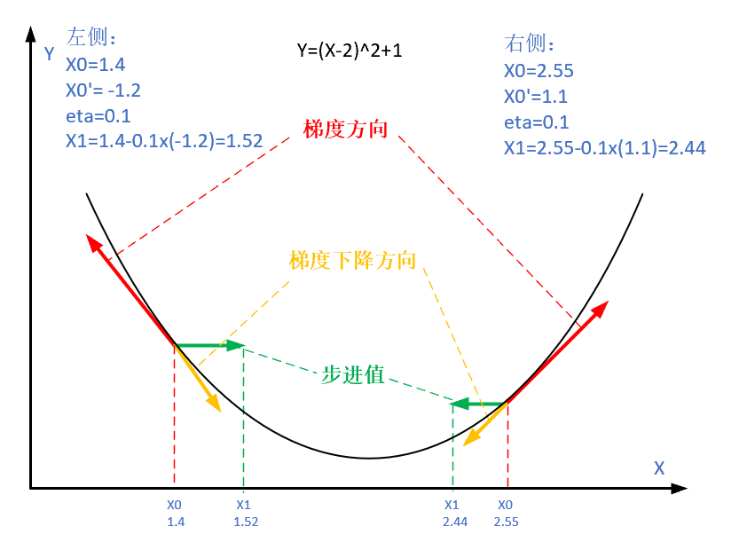
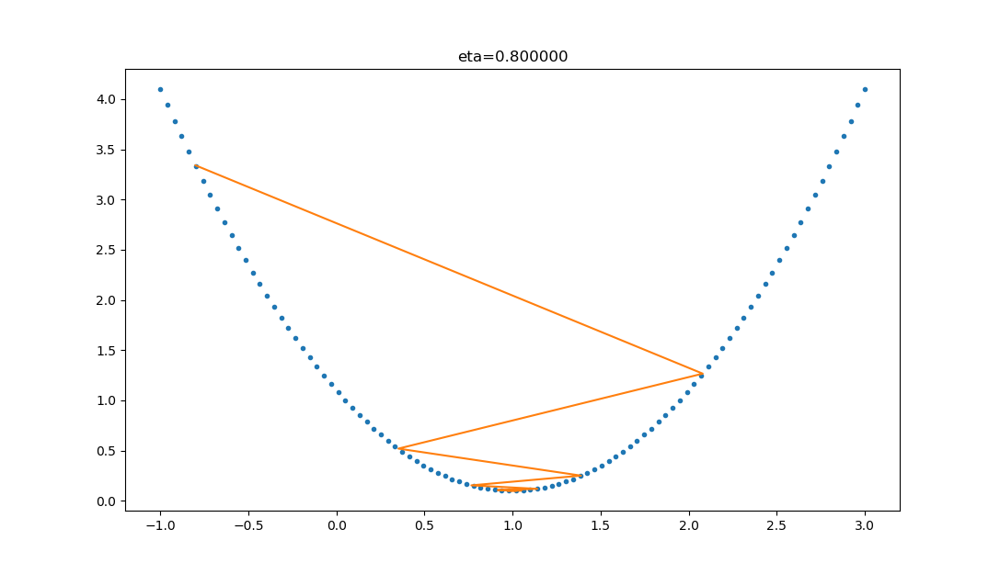
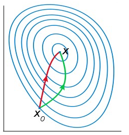

# 2020/02/25    第二次作业
## 学号：201702052       姓名：王欣
## 一、 梯度下降
### 1、梯度下降的数学理解
梯度下降的数学公式：

$$\theta_{n+1} = \theta_{n} - \eta \cdot \nabla J(\theta) \tag{1}$$

其中：
- $\theta_{n+1}$：下一个值
- $\theta_n$：当前值
- $-$：梯度的反向
- $\eta$：学习率或步长，控制每一步走的距离，不要太快以免错过了最佳景点，不要太慢以免时间太长
- $\nabla$：梯度，函数当前位置的最快上升点
- $J(\theta)$：函数

#### 梯度下降的三要素

1. 当前点
2. 方向
3. 步长

“梯度下降”包含了两层含义：

1. 梯度：函数当前位置的最快上升点
2. 下降：与导数相反的方向，用数学语言描述就是那个减号

亦即与上升相反的方向运动，就是下降。

### 2、单变量函数的梯度下降

假设一个单变量函数：

$$J(x) = x ^2$$

我们的目的是找到该函数的最小值，于是计算其微分：

$$J'(x) = 2x$$

假设初始位置为：

$$x_0=1.2$$

假设学习率：

$$\eta = 0.3$$

根据公式(1)，迭代公式：

$$x_{n+1} = x_{n} - \eta \cdot \nabla J(x)= x_{n} - \eta \cdot 2x\tag{1}$$

假设终止条件为J(x)<1e-2，迭代过程是：
```
x=0.480000, y=0.230400
x=0.192000, y=0.036864
x=0.076800, y=0.005898
x=0.030720, y=0.000944
```
### 3、双变量的梯度下降
根据公式(1)，迭代过程是的计算公式：
$$(x_{n+1},y_{n+1}) = (x_n,y_n) - \eta \cdot \nabla J(x,y)$$
$$ = (x_n,y_n) - \eta \cdot (2x,2 \cdot \sin y \cdot \cos y) \tag{1}$$

根据公式(1)，假设终止条件为$J(x,y)<1e-2$，迭代过程：

||x|y|J(x,y)|
|---|---|---|---|
|1|3|1|9.708073|
|2|2.4|0.909070|6.382415|
|3|1.92|0.812114|4.213103|
|...|...|...|...|
|15|0.105553|0.063481|0.015166|
|16|0.084442|0.050819|0.009711|

迭代16次后，J(x,y)的值为0.009711，满足小于1e-2的条件，停止迭代。

上面的过程如下图所示，由于是双变量，所以需要用三维图来解释。请注意看那条隐隐的黑色线，表示梯度下降的过程，从红色的高地一直沿着坡度向下走，直到蓝色的洼地。

|观察角度1|观察角度2|
|---|---|
|| |


### 4、学习率η的选择
当学习率=0.8时，会有这种左右跳跃的情况发生，这不利于神经网络的训练。



当学习率=0.6时，也会有跳跃，幅度偏小。


当学习率=0.4时，损失值会从单侧下降，4步以后基本接近了理想值。


当学习率=0.2时，损失值会从单侧下降，但下降速度较慢，8步左右接近极值。


当学习率=0.1时，损失值会从单侧下降，但下降速度非常慢，10步了还没有到达理想状态。


## 二、损失函数
 ### 概念

使用损失函数和Loss Function这两个词汇，具体的损失函数符号用J()来表示，误差值用loss表示。

**损失**就是所有样本的**误差**的总和，亦即：

$$损失 = \sum^m_{i=1}误差_i$$
$$J = \sum_{i=1}^m loss$$

#### 损失函数的作用

损失函数的作用，就是计算神经网络每次迭代的前向计算结果与真实值的差距，从而指导下一步的训练向正确的方向进行。

### 机器学习常用损失函数

符号规则：a是预测值，y是样本标签值，J是损失函数值。

- Gold Standard Loss，又称0-1误差
$$
loss=\begin{cases} 0 & a=y \\ 1 & a \ne y \end{cases}
$$

- 绝对值损失函数

$$
loss = |y-a|
$$

- Hinge Loss，铰链/折页损失函数或最大边界损失函数，主要用于SVM（支持向量机）中

$$
loss=max(0,1-y \cdot a), y=\pm 1
$$

- Log Loss，对数损失函数，又叫交叉熵损失函数(cross entropy error)

$$
loss = -\frac{1}{m} \sum_i^m y_i log(a_i) + (1-y_i)log(1-a_i),  y_i \in \{0,1\}
$$

- Squared Loss，均方差损失函数
$$
loss=\frac{1}{2m} \sum_i^m (a_i-y_i)^2
$$

- Exponential Loss，指数损失函数
$$
loss = \frac{1}{m}\sum_i^m e^{-(y_i \cdot a_i)}
$$

### 损失函数图像理
#### ①用二维函数图像理解单变量对损失函数的影响


上图中，纵坐标是损失函数值，横坐标是变量。不断地改变变量的值，会造成损失函数值的上升或下降。而梯度下降算法会让我们沿着损失函数值下降的方向前进。

1. 假设我们的初始位置在A点，X=x0，Loss值（纵坐标）较大，回传给网络做训练
2. 经过一次迭代后，我们移动到了B点，X=x1，Loss值也相应减小，再次回传重新训练
3. 以此节奏不断向损失函数的最低点靠近，经历了x2 x3 x4 x5
4. 直到损失值达到可接受的程度，就停止训练

#### ②用等高线图理解双变量对损失函数影响



上图中，横坐标是一个变量w，纵坐标是另一个变量b。两个变量的组合形成的损失函数值，在图中对应处于等高线上的唯一的一个坐标点。所有的不同的值的组合会形成一个损失函数值的矩阵，我们把矩阵中具有相同（相近）损失函数值的点连接起来，可以形成一个不规则椭圆，其圆心位置，是损失值为0的位置，也是我们要逼近的目标。

这个椭圆如同平面地图的等高线，来表示的一个洼地，中心位置比边缘位置要低，通过对损失函数的计算，对损失函数的求导，会带领我们沿着等高线形成的梯子一步步下降，无限逼近中心点。

###  神经网络中常用的损失函数

- 均方差函数，主要用于回归

- 交叉熵函数，主要用于分类

二者都是非负函数，极值在底部，用梯度下降法可以求解。
## 三、均方差函数
函数就是最直观的一个损失函数了，计算预测值和真实值之间的欧式距离。预测值和真实值越接近，两者的均方差就越小。

均方差函数常用于线性回归(linear regression)，即函数拟合(function fitting)。

#### ①公式

$$
loss = {1 \over 2}(z-y)^2 \tag{单样本}
$$

$$
J=\frac{1}{2m} \sum_{i=1}^m (z_i-y_i)^2 \tag{多样本}
$$
#### ②工作原理

要想得到预测值a与真实值y的差距，最朴素的想法就是用$Error=a_i-y_i$。

对于单个样本来说，这样做没问题，但是多个样本累计时，$a_i-y_i$有可能有正有负，误差求和时就会导致相互抵消，从而失去价值。所以有了绝对值差的想法，即$Error=|a_i-y_i|$。

假设有三个样本的标签值是$y=[1,1,1]$：

|样本标签值|样本预测值|绝对值损失函数|均方差损失函数|
|------|------|------|------|
|$[1,1,1]$|$[1,2,3]$|$(1-1)+(2-1)+(3-1)=3$|$(1-1)^2+(2-1)^2+(3-1)^2=5$|
|$[1,1,1]$|$[1,3,3]$|$(1-1)+(3-1)+(3-1)=4$|$(1-1)^2+(3-1)^2+(3-1)^2=8$|
|||4/3=1.33|8/5=1.6|

可以看到5比3已经大了很多，8比4大了一倍，而8比5也放大了某个样本的局部损失对全局带来的影响。
#### ③ 损失函数的可视化

##### 损失函数值的3D示意图

横坐标为w，纵坐标为b，针对每一个w和一个b的组合计算出一个损失函数值，用三维图的高度来表示这个损失函数值。下图中的底部并非一个平面，而是一个有些下凹的曲面，只不过曲率较小.


##### 损失函数值的2D示意图

在平面地图中，我们经常会看到用等高线的方式来表示海拔高度值，下图就是上图在平面上的投影，即损失函数值的等高线图。


代码：
```Python
    s = 200
    W = np.linspace(w-2,w+2,s)
    B = np.linspace(b-2,b+2,s)
    LOSS = np.zeros((s,s))
    for i in range(len(W)):
        for j in range(len(B)):
            z = W[i] * x + B[j]
            loss = CostFunction(x,y,z,m)
            LOSS[i,j] = round(loss, 2)
```
结果：

## 四、交叉熵损失函数

交叉熵（Cross Entropy）是Shannon信息论中一个重要概念，主要用于度量两个概率分布间的差异性信息。在信息论中，交叉熵是表示两个概率分布p,q的差异，其中p表示真实分布，q表示非真实分布，那么H(p,q)就称为交叉熵：

$$H(p,q)=\sum_i p_i \cdot log {1 \over q_i} = - \sum_i p_i \log q_i$$

交叉熵可在神经网络中作为损失函数，p表示真实标记的分布，q则为训练后的模型的预测标记分布，交叉熵损失函数可以衡量p与q的相似性。

**交叉熵函数常用于逻辑回归(logistic regression)，也就是分类(classification)。**

### 二分类问题交叉熵

当y=1时，即标签值是1，是个正例：

$$loss = -log(a)$$

横坐标是预测输出，纵坐标是损失函数值。y=1意味着当前样本标签值是1，当预测输出越接近1时，Loss值越小，训练结果越准确。当预测输出越接近0时，Loss值越大，训练结果越糟糕。

当y=0时，即标签值是0，是个反例：
$$loss = -\log (1-a)$$

此时，损失值与预测值的关系是：


我们改变一下上面的例子，假设出勤率高的同学都学会了课程，我们想建立一个预测器，对于一个特定的学员，根据TA的出勤率来预测：

|出勤率|高|低|
|---|---|---|
|学会了课程的真实值统计|1|0|
|根据学员的高出勤率的预测|||
|预测1|0.6|0.4|
|预测2|0.7|0.3|

那么这个预测与真实统计之间的交叉熵损失函数值是：

$$loss_1 = -(1 \times \log 0.6 + (1-1) \times \log (1-0.6)) = 0.51$$

$$loss_2 = -(1 \times \log 0.7 + (1-1) \times \log (1-0.7)) = 0.36$$

由于0.7是相对准确的值，所以loss2要比loss1小，反向传播的力度也会小。

### 多分类问题交叉熵

最后输出层使用Softmax激活函数，并且配合One-Hot编码使用。

|等级|初级|中级|高级|
|---|---|---|---|
|出勤率很低|1|0|0|
|出勤率中等|0|1|0|
|出勤率很高|0|0|1|
|对于一个出勤率很高的同学的预测||||
|预测1|0.1|0.6|0.3|
|预测2|0.1|0.3|0.6|


我们想建立一个预测器，预测一个出勤率很高的学员的学习等级，很显然，根据标签值，应该属于$[0,0,1]$。

假设开始时不太准确，一个学员的出勤率很高，但预测出的值为：$[0.1, 0.6, 0.3]$，这样得到的交叉熵是：

$$loss_1 = -(0 \times \log 0.1 + 0 \times \log 0.6 + 1 \times \log 0.3) = 1.2$$

如果预测出的值为：$[0.1, 0.3, 0.6]$，标签为：$[0, 0, 1]$，这样得到的交叉熵是：

$$loss_2 = -(0 \times \log 0.1 + 0 \times \log 0.3 + 1 \times \log 0.6) = 0.51$$

可以看到，0.51比1.2的损失值小很多，这说明预测值越接近真实标签值(0.6 vs 0.3)，交叉熵损失函数值越小，反向传播的力度越小。


## 五、总结
通过这次课的学习，梯度下降的基本原理，以及两种损失函数的表示方法及作用。梯度下降中“梯度”是指函数当前位置的最快上升点而“下降”是指与导数相反的方向，用数学语言描述就是那个负号，就是与上升相反的方向。通过比较"单变量梯度下降"与"双变量梯度下降"的差别，了解到梯度下降在神经网络研究中的应用。神经网络中常用的两种损失函数，“均方差函数”，主要用于回归；“交叉熵函数”，主要用于分类。


