# 第1章  BasicKnowledge
## 神经网络的基本工作原理
### 神经元细胞的数学模型
- 一个神经元可以有多个输入
- 一个神经元只能有一个输出，这个输出可以同时输入给多个神经元**
- 一个神经元的w的数量和输入的数量一致
- 一个神经元只有一个b
- w和b有人为的初始值，在训练过程中被不断修改
- 激活函数不是必须有的，亦即A可以等于Z
- 一层神经网络中的所有神经元的激活函数必须一致
### 神经网络的训练过程
#### 前提条件
 1. 训练数据
 2. 建立神经网络的基本结构
 3. 定义好损失函数

#### 步骤

假设我们有以下训练数据样本：

|Id|x1|x2|x3|Y|
|---|---|---|---|---|
|1|0.5|1.4|2.7|3|
|2|0.4|1.3|2.5|5|
|3|0.1|1.5|2.3|9|
|4|0.5|1.7|2.9|1|

其中，x1，x2，x3是每一个样本数据的三个特征值，Y是样本的真实结果值：

1. 随机初始化权重矩阵，可以根据高斯分布或者正态分布等来初始化。这一步可以叫做“蒙”，但不是瞎蒙。
2. 拿一个或一批数据作为输入，带入权重矩阵中计算，再通过激活函数传入下一层，最终得到预测值。在本例中，我们先用Id-1的数据输入到矩阵中，得到一个A值，假设A=5
3. 拿到Id-1样本的真实值Y=3
4. 计算损失，假设用均方差函数 $Loss = (A-Y)^2=(5-3)^2=4$
5. 根据一些神奇的数学公式（反向微分），把Loss=4这个值用大喇叭喊话，告诉在前面计算的步骤中，影响A=5这个值的每一个权重矩阵，然后对这些权重矩阵中的值做一个微小的修改（当然是向着好的方向修改，这一点可以用数学家的名誉来保证）
6. 用Id-2样本作为输入再次训练（goto 2）
7. 这样不断地迭代下去，直到以下一个或几个条件满足就停止训练：损失函数值非常小；迭代了指定的次数

训练完成后，我们会把这个神经网络中的结构和权重矩阵的值导出来，形成一个计算图（就是矩阵运算加上激活函数）模型，然后嵌入到任何可以识别/调用这个模型的应用程序中，根据输入的值进行运算，输出预测值。

### 神经网络的主要功能
- **回归/拟合 Regression/fitting**
- **分类 Classification**

#### 激活函数的作用

我们需要应用激活函数a(z)，以便使网络更加强大，增加它的能力，使它可以学习复杂的事物，复杂的表单数据，以及表示输入输出之间非线性的复杂的任意函数映射。因此，使用非线性激活函数，我们便能够从输入输出之间生成非线性映射。

激活函数的另一个重要特征是：它应该是可导的。我们需要这样的特性，以便在网络中向后推进以计算相对于权重的误差（损失）梯度时执行反向优化策略，然后相应地使用梯度下降或任何其他优化技术改变权重以减少误差。
### 为什么需要深度神经网络与深度学习
通常我们把三层以上的网络称为深度神经网络。两层的神经网络虽然强大，但可能只能完成二维空间上的一些拟合与分类的事情。如果对于图片、语音、文字序列这些复杂的事情，就需要更复杂的网络来理解和处理。第一个方式是增加每一层中神经元的数量，但这是线性的，不够有效。另外一个方式是增加层的数量，每一层都处理不同的事情。
1. 卷积神经网络 CNN (Convolutional Neural Networks)

对于图像类的机器学习问题，最有效的就是卷积神经网络。

2. 循环神经网络 RNN (Recurrent Neural Networks)

对于语言类的机器学习问题，最有效的就是循环神经网络。

### Deep Learning的训练过程

1. 使用自下上升非监督学习（就是从底层开始，一层一层的往顶层训练）

2. 自顶向下的监督学习（就是通过带标签的数据去训练，误差自顶向下传输，对网络进行微调）

## 反向传播与梯度下降

### 通俗地理解三大概念

这三大概念是：反向传播，梯度下降，损失函数。

反向传播和梯度下降这两个词，第一眼看上去似懂非懂，不明觉厉。这两个概念是整个神经网络中的重要组成部分，是和误差函数/损失函数的概念分不开的。

神经网络训练的最基本的思想就是：先“蒙”一个结果，我们叫预测结果a，看看这个预测结果和事先标记好的训练集中的真实结果y之间的差距，然后调整策略，再试一次，这一次就不是“蒙”了，而是有依据地向正确的方向靠近。如此反复多次，一直到预测结果和真实结果之间相差无几，亦即|a-y|->0，就结束训练。

在神经网络训练中，我们把“蒙”叫做初始化，可以随机，也可以根据以前的经验给定初始值。即使是“蒙”，也是有技术含量的。

这三个概念是前后紧密相连的，讲到一个，肯定会牵涉到另外一个。

### 通俗的总结

我们简单总结一下反向传播与梯度下降的基本工作原理：

1. 初始化
2. 正向计算
3. 损失函数为我们提供了计算损失的方法
4. 梯度下降是在损失函数基础上向着损失最小的点靠近而指引了网络权重调整的方向
5. 反向传播把损失值反向传给神经网络的每一层，让每一层都根据损失值反向调整权重
6. goto 2，直到精度足够好（比如损失函数值小于0.001）


## 线性反向传播

### 正向计算的实例

假设我们有一个函数：

$$z = x \cdot y \tag{1}$$

其中:

$$x = 2w + 3b \tag{2}$$

$$y = 2b + 1 \tag{3}$$

计算图如下：


注意这里x, y, z不是变量，只是计算结果。w, b是才变量。因为在后面要学习的神经网络中，我们要最终求解的是w和b的值，在这里先预热一下。

当w = 3, b = 4时，会得到如下结果：


最终的z值，受到了前面很多因素的影响：变量w，变量b，计算式x，计算式y。常数是个定值，不考虑。

### 反向传播求解w

#### 求w的偏导

目前的z=162，如果我们想让z变小一些，比如目标是z=150，w应该如何变化呢？为了简化问题，我们先只考虑改变w的值，而令b值固定为4。

如果想解决这个问题，我们可以在输入端一点一点的试，把w变成4试试，再变成3.5试试......直到满意为止。现在我们将要学习一个更好的解决办法：反向传播。

我们从z开始一层一层向回看，图中各节点关于变量w的偏导计算结果如下：

$$因为z = x \cdot y，其中x = 2w + 3b，y = 2b + 1$$

所以：

$$\frac{\partial{z}}{\partial{w}}=\frac{\partial{z}}{\partial{x}} \cdot \frac{\partial{x}}{\partial{w}}=y \cdot 2=18 \tag{4}$$

其中：

$$\frac{\partial{z}}{\partial{x}}=\frac{\partial{}}{\partial{x}}(x \cdot y)=y=9$$

$$\frac{\partial{x}}{\partial{w}}=\frac{\partial{}}{\partial{w}}(2w+3b)=2$$


上图其实就是链式法则的具体表现，z的误差通过中间的x传递到w。如果不是用链式法则，而是直接用z的表达式计算对w的偏导数，会是什么样呢？我们来试验一下。

根据公式1、2、3，我们有：

$$z=x \cdot y=(2w+3b)(2b+1)=4wb+2w+6b^2+3b \tag{5}$$

对上式求w的偏导：

$$
{\partial z \over \partial w}=4b+2=4 \cdot 4 + 2=18 \tag{6}
$$

公式4和公式6的结果完全一致！所以，请大家相信链式法则的科学性。

#### 求w的具体变化值

公式4和公式6的含义是：当w变化一点点时，z会发生w的变化值的18倍的变化。记住我们的目标是让z=150，目前在初始状态时是162，所以，问题转化为：当我们需要z从162变到150时，w需要变化多少？

既然：

$$
\Delta z = 18 \cdot \Delta w
$$

则：

$$
\Delta w = {\Delta z \over 18}={162-150 \over 18}= 0.6667
$$

所以：

$$w = w - 0.6667=2.3333$$
$$x=2w+3b=16.6667$$
$$z=x \cdot y=16.6667 \times 9=150.0003$$

我们一下子就成功地让z值变成了150.0003，与150的目标非常地接近，这就是偏导数的威力所在。


### 反向传播求解b

#### 求b的偏导

这次我们令w的值固定为3，变化b的值，目标还是让z=150。同上一小节一样，先求b的偏导数。

注意，在上一小节中，求w的导数只经过了一条路：从z到x到w。但是求b的导数时要经过两条路：
1. 从z到x到b
2. 从z到y到b

如下图所示：


从复合导数公式来看，这两者应该是相加的关系，所以有：

$$\frac{\partial{z}}{\partial{b}}=\frac{\partial{z}}{\partial{x}} \cdot \frac{\partial{x}}{\partial{b}}+\frac{\partial{z}}{\partial{y}}\cdot\frac{\partial{y}}{\partial{b}}=y \cdot 3+x \cdot 2=63 \tag{7}$$

其中：

$$\frac{\partial{z}}{\partial{x}}=\frac{\partial{}}{\partial{x}}(x \cdot y)=y=9$$
$$\frac{\partial{z}}{\partial{y}}=\frac{\partial{}}{\partial{y}}(x \cdot y)=x=18$$
$$\frac{\partial{x}}{\partial{b}}=\frac{\partial{}}{\partial{b}}(2w+3b)=3$$
$$\frac{\partial{y}}{\partial{b}}=\frac{\partial{}}{\partial{b}}(2b+1)=2$$

我们不妨再验证一下链式求导的正确性。把公式5再拿过来：

$$z=x \cdot y=(2w+3b)(2b+1)=4wb+2w+6b^2+3b \tag{5}$$

对上式求b的偏导：

$$
{\partial z \over \partial b}=4w+12b+3=12+48+3=63 \tag{8}
$$

结果和公式7的链式法则一样。

#### 求b的具体变化值

公式7和公式8的含义是：当b变化一点点时，z会发生b的变化值的63倍的变化。记住我们的目标是让z=150，目前在初始状态时是162，所以，问题转化为：当我们需要z从162变到150时，b需要变化多少？

既然：

$$\Delta z = 63 \cdot \Delta b$$

则：

$$
\Delta b = {\Delta z \over 63}={162-150 \over 63}=​0.1905
$$

所以：
$$
b=b-0.1905=3.8095
$$
$$x=2w+3b=17.4285$$
$$y=2b+1=8.619$$
$$z=x \cdot y=17.4285 \times 8.619=150.2162$$

这个结果也是与150很接近了，但是精度还不够。再迭代几次，应该可以近似等于150了，直到误差不大于1e-4时，我们就可以结束迭代了，对于计算机来说，这些运算的执行速度很快。


###  同时求解w和b的变化值

这次我们要同时改变w和b，到达最终结果为z=150的目的。

已知$\Delta z=12$，我们不妨把这个误差的一半算在w账上，另外一半算在b的账上：

$$\Delta b=\frac{\Delta z / 2}{63} = \frac{12/2}{63}=0.095$$

$$\Delta w=\frac{\Delta z / 2}{18} = \frac{12/2}{18}=0.333$$

- $w = w-\Delta w=3-0.333=2.667$
- $b = b - \Delta b=4-0.095=3.905$
- $x=2w+3b=2 \times 2.667+3 \times 3.905=17.049$
- $y=2b+1=2 \times 3.905+1=8.81$
- $z=x \times y=17.049 \times 8.81=150.2$


容易出现的问题：
1. 在检查Δz时的值时，注意要用绝对值，因为有可能是个负数
2. 在计算Δb和Δw时，第一次时，它们对z的贡献值分别是1/63和1/18，但是第二次时，由于b和w值的变化，对于z的贡献值也会有微小变化，所以要重新计算。具体解释如下：

$$
\frac{\partial{z}}{\partial{b}}=\frac{\partial{z}}{\partial{x}} \cdot \frac{\partial{x}}{\partial{b}}+\frac{\partial{z}}{\partial{y}}\cdot\frac{\partial{y}}{\partial{b}}=y \cdot 3+x \cdot 2=3y+2x
$$
$$
\frac{\partial{z}}{\partial{w}}=\frac{\partial{z}}{\partial{x}} \cdot \frac{\partial{x}}{\partial{w}}+\frac{\partial{z}}{\partial{y}}\cdot\frac{\partial{y}}{\partial{w}}=y \cdot 2+x \cdot 0 = 2y
$$
所以，在每次迭代中，要重新计算下面两个值：
$$
\Delta b=\frac{\Delta z}{3y+2x}
$$
$$
\Delta w=\frac{\Delta z}{2y}
$$

以下是程序的运行结果。

没有在迭代中重新计算Δb的贡献值：
```
single variable: b -----
w=3.000000,b=4.000000,z=162.000000,delta_z=12.000000
delta_b=0.190476
w=3.000000,b=3.809524,z=150.217687,delta_z=0.217687
delta_b=0.003455
w=3.000000,b=3.806068,z=150.007970,delta_z=0.007970
delta_b=0.000127
w=3.000000,b=3.805942,z=150.000294,delta_z=0.000294
delta_b=0.000005
w=3.000000,b=3.805937,z=150.000011,delta_z=0.000011
delta_b=0.000000
w=3.000000,b=3.805937,z=150.000000,delta_z=0.000000
done!
final b=3.805937
```
在每次迭代中都重新计算Δb的贡献值：
```
single variable new: b -----
w=3.000000,b=4.000000,z=162.000000,delta_z=12.000000
factor_b=63.000000, delta_b=0.190476
w=3.000000,b=3.809524,z=150.217687,delta_z=0.217687
factor_b=60.714286, delta_b=0.003585
w=3.000000,b=3.805938,z=150.000077,delta_z=0.000077
factor_b=60.671261, delta_b=0.000001
w=3.000000,b=3.805937,z=150.000000,delta_z=0.000000
done!
final b=3.805937
```
从以上两个结果对比中，可以看到三点：

1. factor_b第一次是63，以后每次都会略微降低一些
2. 第二个函数迭代了3次就结束了，而第一个函数迭代了5次，效率不一样
3. 最后得到的结果是一样的，因为这个问题只有一个解

对于双变量的迭代，有同样的问题：

没有在迭代中重新计算Δb,Δw的贡献值(factor_b和factor_w每次都保持63和18)：
```
double variable: w, b -----
w=3.000000,b=4.000000,z=162.000000,delta_z=12.000000
delta_b=0.095238, delta_w=0.333333
w=2.666667,b=3.904762,z=150.181406,delta_z=0.181406
delta_b=0.001440, delta_w=0.005039
w=2.661628,b=3.903322,z=150.005526,delta_z=0.005526
delta_b=0.000044, delta_w=0.000154
w=2.661474,b=3.903278,z=150.000170,delta_z=0.000170
delta_b=0.000001, delta_w=0.000005
w=2.661469,b=3.903277,z=150.000005,delta_z=0.000005
done!
final b=3.903277
final w=2.661469
```

在每次迭代中都重新计算Δb,Δw的贡献值(factor_b和factor_w每次都变化)：
```
double variable new: w, b -----
w=3.000000,b=4.000000,z=162.000000,delta_z=12.000000
factor_b=63.000000, factor_w=18.000000, delta_b=0.095238, delta_w=0.333333
w=2.666667,b=3.904762,z=150.181406,delta_z=0.181406
factor_b=60.523810, factor_w=17.619048, delta_b=0.001499, delta_w=0.005148
w=2.661519,b=3.903263,z=150.000044,delta_z=0.000044
factor_b=60.485234, factor_w=17.613053, delta_b=0.000000, delta_w=0.000001
w=2.661517,b=3.903263,z=150.000000,delta_z=0.000000
done!
final b=3.903263
final w=2.661517
```
这个与第一个单变量迭代不同的地方是：这个问题可以有多个解，所以两种方式都可以得到各自的正确解，但是第二种方式效率高，而且满足梯度下降的概念。

##  非线性反向传播

###  实例

在上面的线性例子中，我们可以发现，误差一次性地传递给了初始值w和b，即，只经过一步，直接修改w和b的值，就能做到误差校正。因为从它的计算图看，无论中间计算过程有多么复杂，它都是线性的，所以可以一次传到底。缺点是这种线性的组合最多只能解决线性问题，不能解决更复杂的问题。这个我们在神经网络基本原理中已经阐述过了，需要有激活函数连接两个线性单元。


5个人，分别代表x,a,b,c,y，其中$1<x<=10，0<y<2.15$


1. 第1个人，输入层
- 正向：随机输入第一个x值，x取值范围(1,10]，假设第一个数是2
- 反向，第2个人传回$\Delta x，更新x：x = x - \Delta x$，再次正向
2. 第2个人，第一层网络计算
- 正向，第1个人传入x的值，计算：$a=x^2$
- 反向，第3个人传回$\Delta a，计算\Delta x：\Delta x = \Delta a / 2x$
3. 第3个人，第二层网络计算
- 正向，第2个人传入a的值，计算b：$b=\ln (a)$
- 反向，第4个人传回$\Delta b，计算\Delta a：\Delta a = \Delta b \cdot a$
4. 第4个人，第三层网络计算
- 正向，第3个人传入b的值，计算c：$c=\sqrt{b}$
- 反向，第5个人传回$\Delta c，计算\Delta b：\Delta b = \Delta c \cdot 2\sqrt{b}$
5. 第5个人，输出层
- 正向，第4个人传入c的值
- 反向，计算y与c的差值：$\Delta c = c - y$，传回给第4个人

假设我们想最后得到c=2.13的值，问：x应该是多少？（误差小于0.001即可）

### 数学解析解

$$c=\sqrt{b}=\sqrt{\ln(a)}=\sqrt{\ln(x^2)}=\sqrt{2\ln(x)}=2.13$$
$$2*\ln{x}=2.13^2=4.5369$$
$$\ln{x}=4.5369/2=2.26854$$
$$两侧取e的次方：e^{\ln{x}} = e^{2.26854}$$
$$x = 9.6653$$

###  梯度迭代解

$$
\frac{da}{dx}=\frac{d(x^2)}{dx}=2x=\frac{\Delta a}{\Delta x} \tag{1}
$$
$$
\frac{db}{da} =\frac{d(\ln{a})}{da} =\frac{1}{a} = \frac{\Delta b}{\Delta a} \tag{2}
$$
$$
\frac{dc}{db}=\frac{d(\sqrt{b})}{db}=\frac{1}{2\sqrt{b}}=\frac{\Delta c}{\Delta b} \tag{3}
$$
因此得到如下一组公式，可以把最后一层$\Delta c$的误差一直反向传播给最前面的$\Delta x$，从而更新x值：
$$
\Delta c = c - y \tag{4}
$$
$$
\Delta b = \Delta c \cdot 2\sqrt{b}  \tag{根据式3}
$$
$$
\Delta a = \Delta b \cdot a  \tag{根据式2}
$$
$$
\Delta x = \Delta a / 2x \tag{根据式1}
$$


我们给定一个初始值$x=2，\Delta x=0$，依次计算结果如下表：

|方向|公式|迭代1|迭代2|迭代3|迭代4|迭代5|
|---|---|---|---|---|---|---|
|正向|$x=x-\Delta x$|2|4.243|7.344|9.295|9.665|
|正向|$a=x^2$|4|18.005|53.934|86.404|93.233|
|正向|$b=\ln(a)$|1.386|2.891|3.988|4.459|4.535|
|正向|$c=\sqrt{b}$|1.177|1.700|1.997|2.112|2.129|
||标签值y|2.13|2.13|2.13|2.13|2.13|
|反向|$\Delta c = c - y$|-0.953|-0.430|-0.133|-0.018||
|反向|$\Delta b = \Delta c \cdot 2\sqrt{b}$|-2.243|-1.462|-0.531|-0.078||
|反向|$\Delta a = \Delta b \cdot a$|-8.973|-26.317|-28.662|-6.698||
|反向|$\Delta x = \Delta a / 2x$|-2.243|-3.101|-1.951|-0.360||

到第5轮时，正向计算得到的c=2.129，非常接近2.13了，迭代结束。

下图是运行结果：

```
how to play: 1) input x, 2) calculate c, 3) input target number but not faraway from c
input x as initial number(1.2,10), you can try 1.3:
2
c=1.177410
input y as target number(0.5,2), you can try 1.8:
2.13
forward...
x=2.000000,a=4.000000,b=1.386294,c=1.177410
backward...
delta_c=-0.952590, delta_b=-2.243178, delta_a=-8.972712, delta_x=-2.243178

forward...
x=4.243178,a=18.004559,b=2.890625,c=1.700184
backward...
delta_c=-0.429816, delta_b=-1.461533, delta_a=-26.314258, delta_x=-3.100772

forward...
x=7.343950,a=53.933607,b=3.987754,c=1.996936
backward...
delta_c=-0.133064, delta_b=-0.531440, delta_a=-28.662487, delta_x=-1.951435

forward...
x=9.295386,a=86.404194,b=4.459036,c=2.111643
backward...
delta_c=-0.018357, delta_b=-0.077527, delta_a=-6.698641, delta_x=-0.360321

forward...
x=9.655706,a=93.232666,b=4.535098,c=2.129577
backward...
done!
```
该组合函数图像（蓝色）和导数图像（绿色）：


上图中的几个x坐标点，就是整个计算过程中，x的移动轨迹。

##  梯度下降


###  梯度下降的数学理解

先抛开神经网络，损失函数，反向传播等内容，用数学概念理解一下梯度下降。

梯度下降的数学公式：

$$\theta_{n+1} = \theta_{n} - \eta \cdot \nabla J(\theta) \tag{1}$$

其中：
- $\theta_{n+1}$：下一个值
- $\theta_n$：当前值
- $-$：梯度的反向
- $\eta$：学习率或步长，控制每一步走的距离，不要太快以免错过了最佳景点，不要太慢以免时间太长
- $\nabla$：梯度，函数当前位置的最快上升点
- $J(\theta)$：函数

#### 梯度下降的三要素

1. 当前点
2. 方向
3. 步长

#### 为什么说是“梯度下降”？

“梯度下降”包含了两层含义：

1. 梯度：函数当前位置的最快上升点
2. 下降：与导数相反的方向，用数学语言描述就是那个减号

亦即与上升相反的方向运动，就是下降。


### 单变量函数的梯度下降

假设一个单变量函数：

$$J(x) = x ^2$$

我们的目的是找到该函数的最小值，于是计算其微分：

$$J'(x) = 2x$$

假设初始位置为：

$$x_0=1.2$$

假设学习率：

$$\eta = 0.3$$

根据公式(1)，迭代公式：

$$x_{n+1} = x_{n} - \eta \cdot \nabla J(x)= x_{n} - \eta \cdot 2x\tag{1}$$

假设终止条件为J(x)<1e-2，迭代过程是：
```
x=0.480000, y=0.230400
x=0.192000, y=0.036864
x=0.076800, y=0.005898
x=0.030720, y=0.000944
```

上面的过程如下图所示：


###  双变量的梯度下降

假设一个双变量函数：

$$J(x,y) = x^2 + \sin^2(y)$$

我们的目的是找到该函数的最小值，于是计算其微分：

$${\partial{J(x,y)} \over \partial{x}} = 2x$$
$${\partial{J(x,y)} \over \partial{y}} = 2 \sin y \cos y$$

假设初始位置为：

$$(x_0,y_0)=(3,1)$$

假设学习率：

$$\eta = 0.1$$

根据公式(1)，迭代过程是的计算公式：
$$(x_{n+1},y_{n+1}) = (x_n,y_n) - \eta \cdot \nabla J(x,y)$$
$$ = (x_n,y_n) - \eta \cdot (2x,2 \cdot \sin y \cdot \cos y) \tag{1}$$

根据公式(1)，假设终止条件为$J(x,y)<1e-2$，迭代过程：

||x|y|J(x,y)|
|---|---|---|---|
|1|3|1|9.708073|
|2|2.4|0.909070|6.382415|
|3|1.92|0.812114|4.213103|
|...|...|...|...|
|15|0.105553|0.063481|0.015166|
|16|0.084442|0.050819|0.009711|

迭代16次后，J(x,y)的值为0.009711，满足小于1e-2的条件，停止迭代。

上面的过程如下图所示，由于是双变量，所以需要用三维图来解释。请注意看那条隐隐的黑色线，表示梯度下降的过程，从红色的高地一直沿着坡度向下走，直到蓝色的洼地。

|观察角度1|观察角度2|
|---|---|
|| |

##  损失函数

### 概念

**损失**就是所有样本的**误差**的总和，亦即：
$$损失 = \sum^m_{i=1}误差_i$$
$$J = \sum_{i=1}^m loss$$


#### 损失函数的作用

损失函数的作用，就是计算神经网络每次迭代的前向计算结果与真实值的差距，从而指导下一步的训练向正确的方向进行。

如何使用损失函数呢？具体步骤：

1. 用随机值初始化前向计算公式的参数
2. 代入样本，计算输出的预测值
3. 用损失函数计算预测值和标签值（真实值）的误差
4. 根据损失函数的导数，沿梯度最小方向将误差回传，修正前向计算公式中的各个权重值
5. goto 2, 直到损失函数值达到一个满意的值就停止迭代

###  机器学习常用损失函数

符号规则：a是预测值，y是样本标签值，J是损失函数值。

- Gold Standard Loss，又称0-1误差
$$
loss=\begin{cases} 0 & a=y \\ 1 & a \ne y \end{cases}
$$

- 绝对值损失函数

$$
loss = |y-a|
$$

- Hinge Loss，铰链/折页损失函数或最大边界损失函数，主要用于SVM（支持向量机）中

$$
loss=max(0,1-y \cdot a), y=\pm 1
$$

- Log Loss，对数损失函数，又叫交叉熵损失函数(cross entropy error)

$$
loss = -\frac{1}{m} \sum_i^m y_i log(a_i) + (1-y_i)log(1-a_i),  y_i \in \{0,1\}
$$

- Squared Loss，均方差损失函数
$$
loss=\frac{1}{2m} \sum_i^m (a_i-y_i)^2
$$

- Exponential Loss，指数损失函数
$$
loss = \frac{1}{m}\sum_i^m e^{-(y_i \cdot a_i)}
$$


###  损失函数图像理解

#### 用二维函数图像理解单变量对损失函数的影响


上图中，纵坐标是损失函数值，横坐标是变量。不断地改变变量的值，会造成损失函数值的上升或下降。而梯度下降算法会让我们沿着损失函数值下降的方向前进。

1. 假设我们的初始位置在A点，X=x0，Loss值（纵坐标）较大，回传给网络做训练
2. 经过一次迭代后，我们移动到了B点，X=x1，Loss值也相应减小，再次回传重新训练
3. 以此节奏不断向损失函数的最低点靠近，经历了x2 x3 x4 x5
4. 直到损失值达到可接受的程度，就停止训练

#### 用等高线图理解双变量对损失函数影响


上图中，横坐标是一个变量w，纵坐标是另一个变量b。两个变量的组合形成的损失函数值，在图中对应处于等高线上的唯一的一个坐标点。所有的不同的值的组合会形成一个损失函数值的矩阵，我们把矩阵中具有相同（相近）损失函数值的点连接起来，可以形成一个不规则椭圆，其圆心位置，是损失值为0的位置，也是我们要逼近的目标。

这个椭圆如同平面地图的等高线，来表示的一个洼地，中心位置比边缘位置要低，通过对损失函数的计算，对损失函数的求导，会带领我们沿着等高线形成的梯子一步步下降，无限逼近中心点。

### 神经网络中常用的损失函数

- 均方差函数，主要用于回归

- 交叉熵函数，主要用于分类

二者都是非负函数，极值在底部，用梯度下降法可以求解。


## 均方差函数

MSE - Mean Square Error。

该函数就是最直观的一个损失函数了，计算预测值和真实值之间的欧式距离。预测值和真实值越接近，两者的均方差就越小。

均方差函数常用于线性回归(linear regression)，即函数拟合(function fitting)。

#### 公式

$$
loss = {1 \over 2}(z-y)^2 \tag{单样本}
$$

$$
J=\frac{1}{2m} \sum_{i=1}^m (z_i-y_i)^2 \tag{多样本}
$$

### 工作原理

要想得到预测值a与真实值y的差距，最朴素的想法就是用$Error=a_i-y_i$。

对于单个样本来说，这样做没问题，但是多个样本累计时，$a_i-y_i$有可能有正有负，误差求和时就会导致相互抵消，从而失去价值。所以有了绝对值差的想法，即$Error=|a_i-y_i|$。

假设有三个样本的标签值是$y=[1,1,1]$：

|样本标签值|样本预测值|绝对值损失函数|均方差损失函数|
|------|------|------|------|
|$[1,1,1]$|$[1,2,3]$|$(1-1)+(2-1)+(3-1)=3$|$(1-1)^2+(2-1)^2+(3-1)^2=5$|
|$[1,1,1]$|$[1,3,3]$|$(1-1)+(3-1)+(3-1)=4$|$(1-1)^2+(3-1)^2+(3-1)^2=8$|
|||4/3=1.33|8/5=1.6|

可以看到5比3已经大了很多，8比4大了一倍，而8比5也放大了某个样本的局部损失对全局带来的影响，用不通俗的语言说，就是“对某些偏离大的样本比较敏感”，从而引起监督训练过程的足够重视，以便回传误差。

##  交叉熵损失函数

交叉熵（Cross Entropy）是Shannon信息论中一个重要概念，主要用于度量两个概率分布间的差异性信息。在信息论中，交叉熵是表示两个概率分布p,q的差异，其中p表示真实分布，q表示非真实分布，那么H(p,q)就称为交叉熵：

$$H(p,q)=\sum_i p_i \cdot log {1 \over q_i} = - \sum_i p_i \log q_i$$

交叉熵可在神经网络中作为损失函数，p表示真实标记的分布，q则为训练后的模型的预测标记分布，交叉熵损失函数可以衡量p与q的相似性。

**交叉熵函数常用于逻辑回归(logistic regression)，也就是分类(classification)。**

###  交叉熵的由来

#### 信息量

信息论中，信息量的表示方式：

$$I(x_j) = -\log (p(x_j))$$

$x_j$：表示一个事件

$p(x_j)$：表示$x_i$发生的概率

$I(x_j)$：信息量，$x_j$越不可能发生时，它一旦发生后的信息量就越大

#### 熵

$$H(p) = - \sum_j^n p(x_j) \log (p(x_j))$$

则上面的问题的熵是：

$$H(p) = -[p(A) \log p(A) + p(B) \log p(B) + p(C) \log p(C)]$$
$$=0.7 \times 0.36 + 0.2 \times 1.61 + 0.1 \times 2.30$$
$$=0.804$$

#### 相对熵(KL散度)

相对熵又称KL散度,如果我们对于同一个随机变量 x 有两个单独的概率分布 P(x) 和 Q(x)，我们可以使用 KL 散度（Kullback-Leibler (KL) divergence）来衡量这两个分布的差异，这个相当于信息论范畴的均方差。

KL散度的计算公式：

$$D_{KL}(p||q)=\sum_{j=1}^n p(x_j) \log{p(x_j) \over q(x_j)}$$

n为事件的所有可能性。 D的值越小，表示q分布和p分布越接近。

#### 交叉熵

把上述公式变形：

$$D_{KL}(p||q)=\sum_{j=1}^n p(x_j) \log{p(x_j)} - \sum_{j=1}^n p(x_j) \log q(x_j)$$
$$
=- H(p(x)) + H(p,q) 
$$

等式的前一部分恰巧就是p的熵，等式的后一部分，就是交叉熵：

$$H(p,q) =- \sum_{j=1}^n p(x_j) \log q(x_j)$$

在机器学习中，我们需要评估label和predicts之间的差距，使用KL散度刚刚好，即$D_{KL}(y||a)$，由于KL散度中的前一部分$H(y)$不变，故在优化过程中，只需要关注交叉熵就可以了。所以一般在机器学习中直接用用交叉熵做loss，评估模型。

$$loss =- \sum_{j=1}^n y_j \log a_j$$

其中，n并不是样本个数，而是分类个数。所以，对于批量样本的交叉熵计算公式是：

$$J =- \sum_{i=1}^m \sum_{j=1}^n y_{ij} \log a_{ij}$$

m是样本数，n是分类数。

有一类特殊问题，就是事件只有两种情况发生的可能，比如“学会了”和“没学会”，称为0-1分布或二分类。对于这类问题，由于n=2，所以交叉熵可以简化为：

$$loss =-[y \log a + (1-y) \log (1-a)]$$

二分类对于批量样本的交叉熵计算公式是：

$$J= - \sum_{i=1}^m [y_i \log a_i + (1-y_i) \log (1-a_i)]$$

###  二分类问题交叉熵

当y=1时，即标签值是1，是个正例：

$$loss = -log(a)$$

横坐标是预测输出，纵坐标是损失函数值。y=1意味着当前样本标签值是1，当预测输出越接近1时，Loss值越小，训练结果越准确。当预测输出越接近0时，Loss值越大，训练结果越糟糕。

当y=0时，即标签值是0，是个反例：
$$loss = -\log (1-a)$$

此时，损失值与预测值的关系是：


### 代码运行

1. Level1_BP_Linear 
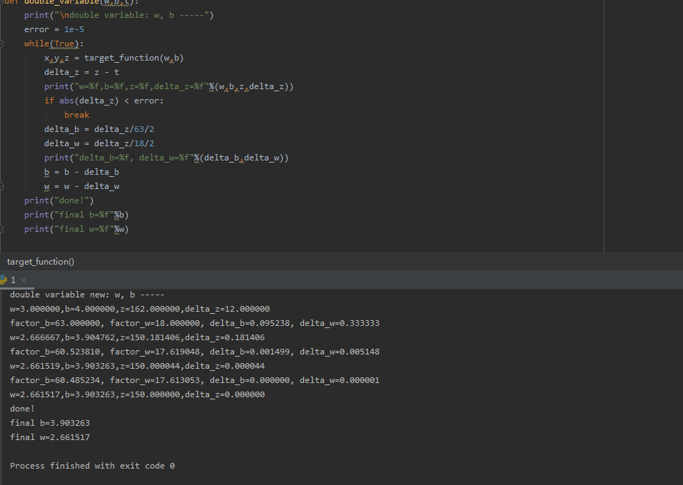
2. Level2_BP_NoneLinear
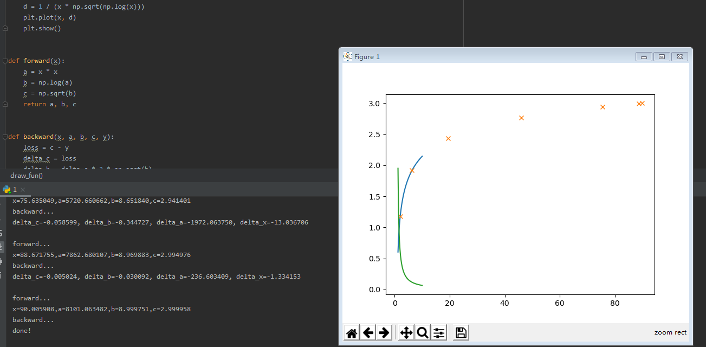
3. Level3_GDSingleVariable
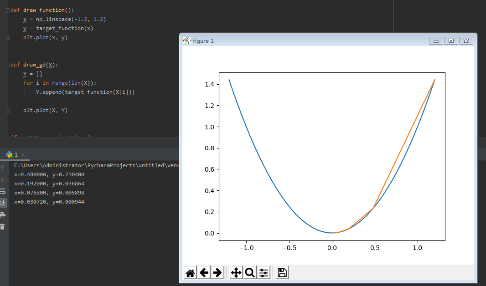
4. Level4_GDDoubleVariable

5. Level5_LearningRate
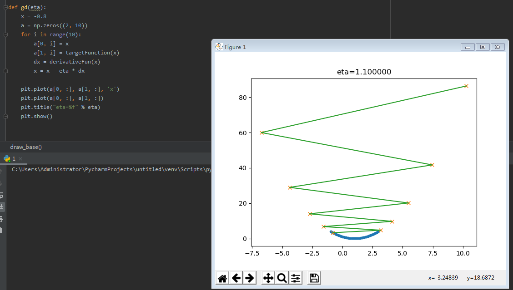


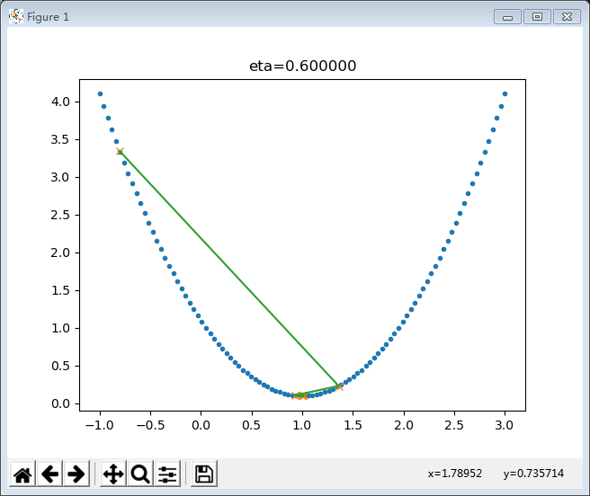

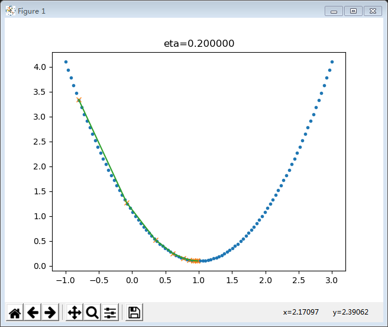

6. Level1_MSE
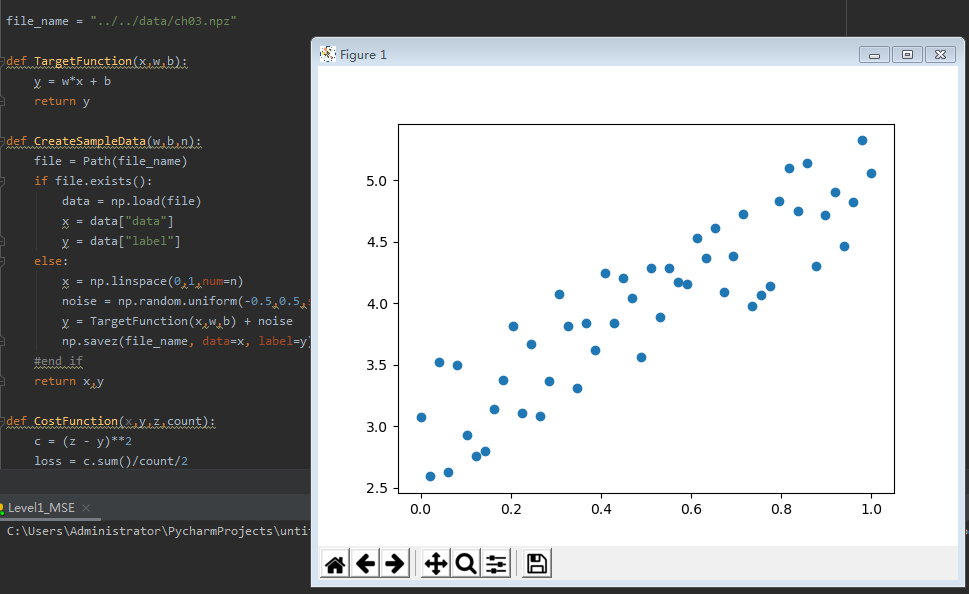
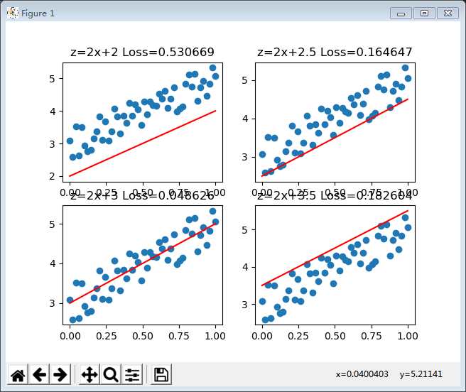


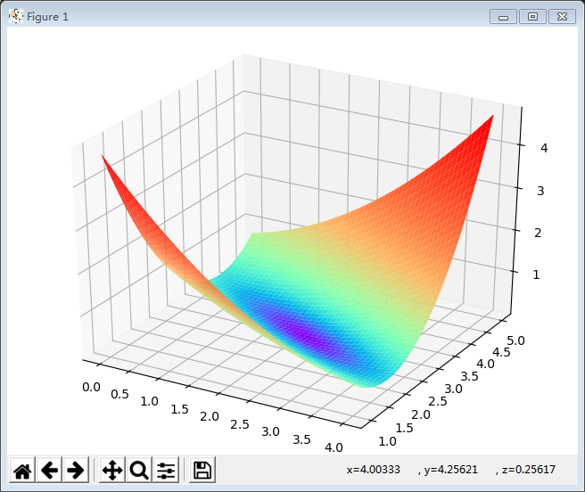
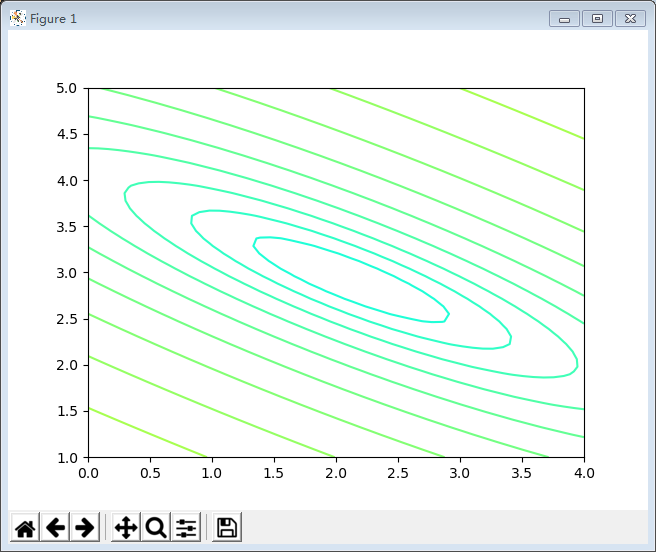
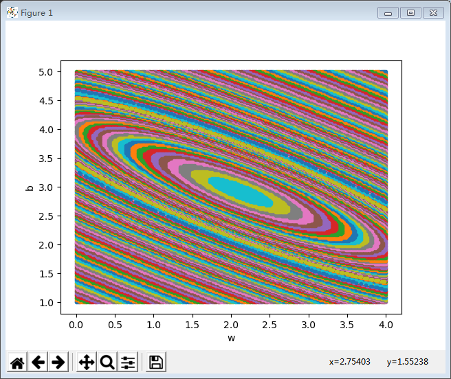
7. Level2_CrossEntropy
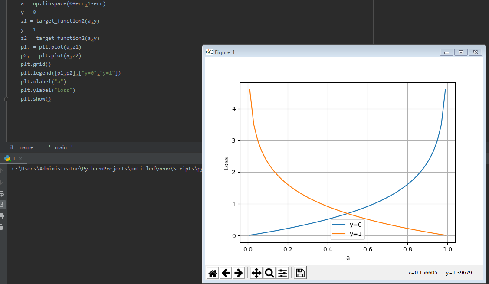