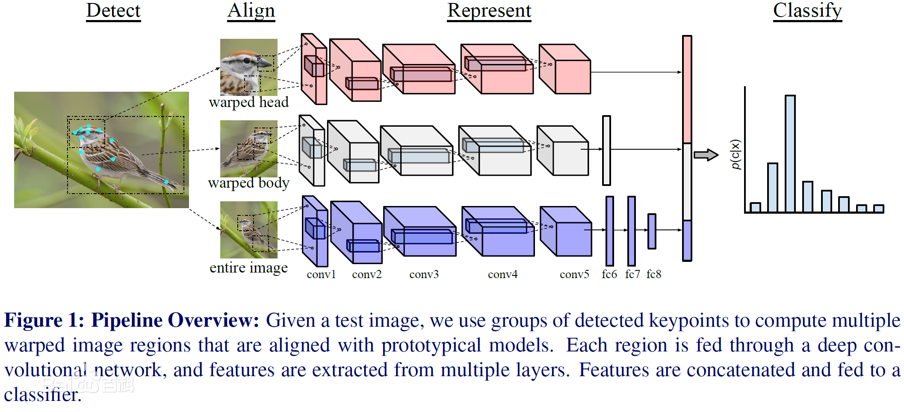
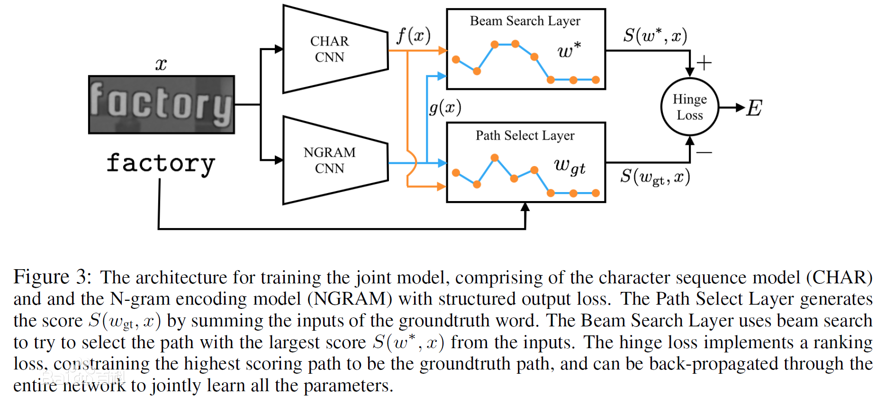

>>>>>> ## 举例说明卷积神经网络的应用
#### 卷积神经网络
##### 简介
+ 是一类包含卷积计算且具有深度结构的前馈神经网络，是深度学习（deep learning）的代表算法之一。卷积神经网络具有表征学习（representation learning）能力，能够按其阶层结构对输入信息进行平移不变分类（shift-invariant classification），因此也被称为“平移不变人工神经网络（Shift-Invariant Artificial Neural Networks, SIANN）”。
+ 对卷积神经网络的研究：
    - 二十世纪80至90年代，时间延迟网络和LeNet-5是最早出现的卷积神经网络。
    - 在二十一世纪后，随着深度学习理论的提出和数值计算设备的改进，卷积神经网络得到了快速发展，并被应用于计算机视觉、自然语言处理等领域。 
+ 卷积神经网络仿造生物的视知觉（visual perception）机制构建，可以进行监督学习和非监督学习，其隐含层内的卷积核参数共享和层间连接的稀疏性使得卷积神经网络能够以较小的计算量对格点化（grid-like topology）特征，例如像素和音频进行学习、有稳定的效果且对数据没有额外的特征工程（feature engineering）要求。
  
#### 结构
+ 输入层：
    - 一对卷积神经网络的输入层接收一维或二维数组，其中一维数组通常为时间或频谱采样。
    - 二维数组可能包含多个通道；二维卷积神经网络的输入层接收二维或三维数组。
    - 三维卷积神经网络的输入层接收四维数组。
    - 由于卷积神经网络在计算机视觉领域应用较广，因此许多研究在介绍其结构时预先假设了三维输入数据，即平面上的二维像素点和RGB通道。
+ 隐含层：包含卷积层、池化层和全连接层3类常见构筑。卷积层中的卷积核包含权重系数，而池化层不包含权重系数，因此在文献中，池化层可能不被认为是独立的层
    - 卷积层：
        - 卷积核：对输入数据进行特征提取。
        - 卷积层参数：卷积层参数包括卷积核大小、步长和填充，三者共同决定了卷积层输出特征图的尺寸，是卷积神经网络的超参数 。其中卷积核大小可以指定为小于输入图像尺寸的任意值，卷积核越大，可提取的输入特征越复杂。填充依据其层数和目的可分为四类：有效填充、相同填充/半填充、全填充、任意填充。
        - 激励函数
    - 池化层：在卷积层进行特征提取后，输出的特征图会被传递至池化层进行特征选择和信息过滤。池化层包含预设定的池化函数，其功能是将特征图中单个点的结果替换为其相邻区域的特征图统计量。池化层选取池化区域与卷积核扫描特征图步骤相同，由池化大小、步长和填充控制。
        - Lp池化：是一类受视觉皮层内阶层结构启发而建立的池化模型。
        - 随机/混合池化：是Lp池化概念的延伸。
        - 谱池化：是基于FFT的池化方法，可以和FFT卷积一起被用于构建基于FFT的卷积神经网络。 
    - 全连接层：卷积神经网络中的全连接层等价于传统前馈神经网络中的隐含层。全连接层位于卷积神经网络隐含层的最后部分，并只向其它全连接层传递信号。特征图在全连接层中会失去空间拓扑结构，被展开为向量并通过激励函数。
+ 输出层：卷积神经网络中输出层的上游通常是全连接层，因此其结构和工作原理与传统前馈神经网络中的输出层相同。对于图像分类问题，输出层使用逻辑函数或归一化指数函数输出分类标签。在物体识别问题中，输出层可设计为输出物体的中心坐标、大小和分类。在图像语义分割中，输出层直接输出每个像素的分类结果。

#### 应用：
1. 计算机视觉：
    + 图像识别：卷积神经网络长期以来是图像识别领域的核心算法之一，并在学习数据充足时有稳定的表现。对于一般的大规模图像分类问题，卷积神经网络可用于构建阶层分类器，也可以在精细分类识别中用于提取图像的判别特征以供其它分类器进行学习。对于后者，特征提取可以人为地将图像的不同部分分别输入卷积神经网络，也可以由卷积神经网络通过非监督学习自行提取。 
    + 物体识别：卷积神经网络可以通过三类方法进行物体识别：滑动窗口、选择性搜索和YOLO。
    + 行为认为
    + 姿态估计
    + 神经风格迁移：是在给定的两份图像的基础上创作第三份图像，并使其内容和风格与给定的图像尽可能地接近。
2. 自然语言处理:
    + 在语音处理领域，卷积神经网络的表现被证实优于隐马尔可夫模型、高斯混合模型和其它一些深度算法。有研究使用卷积神经网络和HMM的混合模型进行语音处理，模型使用了小的卷积核并将替池化层用全连接层代替以提升其学习能力。卷积神经网络也可用于语音合成和语言建模.
3. 其他:
    + 物理学：在高能物理学中，卷积神经网络被用于粒子对撞机输出的喷流图的分析和特征学习，有关研究包括夸克/胶子分类、W玻色子识别和中微子相互作用研究等。卷积神经网络在天体物理学中也有应用，有研究使用卷积神经网络对天文望远镜图像进行星系形态学分析和提取星系模型参数。利用迁移学习技术，预训练的卷积神经网络可以对LIGO数据中的噪声进行检测，为数据的预处理提供帮助 。
    + 
    + 遥感科学：被认为在解析遥感图像的几何、纹理和空间分布特征时，有计算效率和分类准确度方面的优势。依据遥感图像的来源和目的，卷积神经网络被用于下垫面使用和类型改变研究 以及物理量，例如海冰覆盖率的遥感反演。
    + 
    + 大气科学：卷积神经网络被用于数值模式的统计降尺度和格点气候数据的极端天气检测。在统计降尺度方面，由SRCNN堆叠的多层级的降尺度系统可以将插值到高分辨率的原始气象数据和高分辨率的数字高程模型作为输入，并输出高分辨率的气象数据，其准确率超过了传统的空间分解误差订正方法。在极端天气检测方面，仿AlexNet结构的卷积神经网络在监督学习和半监督学习中被证实能以很高的准确度识别气候模式输出和再分析数据中的热带气旋、大气层河流和锋面现象。
    + 
    + 包含卷积神经网络的编程模块：现代主流的机器学习库和界面，包括TensorFlow、Keras、Thenao、Microsoft-CNTK等都可以运行卷积神经网络算法。此外一些商用数值计算软件，例如MATLAB也有卷积神经网络的构建工具可用。