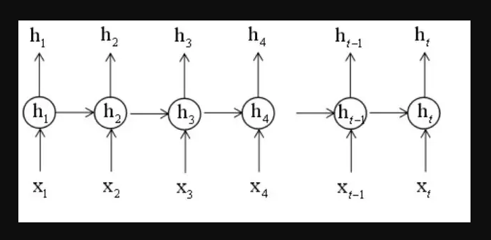

>>>>> # 循环层的工作原理
### 循环神经网络（简称RNN）
+ 会记住网络在上一个时刻的输出值，并将该值用于当前时刻输出值的生成，这由循环层实现。
+ 
+ 
+ 
+ 
+ 
+ 这是一个递推关系式，现在的问题是确定这个表达式的具体形式，即将上一时刻的状态值与当前时刻的输入值整合到一起。在全连接神经网络中，神经元的输出值是对输入值进行加权，然后用激活函数进行作用，得到输出。在这里，我们可以对上一时刻的状态值，当前时刻的输入值进行类似的处理，即将它们分别都乘以权重矩阵，然后整合起来。整合可以采用加法，也可以采用乘法或者更复杂的运算，最简单的是加法，乘法在数值上不稳定，多次乘积之后数为变得非常大或者非常小。
+ 它意味着在实现循环神经网络的时候需要用变量记住隐含层上次的输出值。使用激活函数的原因在 SIGAI ，是为了确保非线性。

### 网络结构
+ 最简单的循环神经网络由一个输入层，一个循环层，一个输出层组成。输出层接收循环层的输出值作为输入并产生输出，它不具有记忆功能。
+ 
+ 函数g的类型根据任务而定，对于分类任务一般选用softmax函数，输出各个类的概率。
+ 在这里只使用了一个循环层和一个输出层，实际使用时可以有多个循环层，即深度循环神经网络。

### 深层网络
+ 上面我们介绍的循环神经网络只有一个输入层，一个循环层和一个输出层，这是一个浅层网络。和全连接网络以及卷积网络一样，我们可以把它推广到任意多个隐含层的情况，得到深度循环神经网络。
+ 这里有3种方案:
+ 第一种方案为Deep Input-to-Hidden Function，在循环层之前加入多个普通的前馈层，将输入向量进行多层映射之后再送入循环层进行处理。
+ 第二种方案是Deep Hidden -to-Hidden Transition，它使用多个循环层，这和前馈型神经网络类似，唯一不同的是计算隐含层输出的时候需要利用本隐含层在上一个时刻的输出值。
+ 第三种方案是Deep Hidden-to-Output Function，它在循环层到输出层之间加入多前馈层，这和第一种情况类似。
由于循环层一般用tanh作为激活函数，层次过多之后会导致梯度消失问题，和残差网络类似，可以采用跨层连接的方案。在语音识别、自然语言处理问题上，我们会看到深层循环神经网络的应用，实验结果证明深层网络比浅层网络有更好的精度

### 训练算法
+ 由于循环神经网络的输入是时间序列，因此每个训练样本是一个时间序列，包含多个相同维度的向量。解决循环神经网络训练问题的算法是Back Propagation Through Time算法，简称BPTT，原理和标准的反向传播算法类似，都是建立误差项的递推公式，根据误差项计算出损失函数对权重矩阵、偏置向量的梯度值。不同的是，全连接神经网络中递推是在层之间建立的，而这里是沿着时间轴建立的。