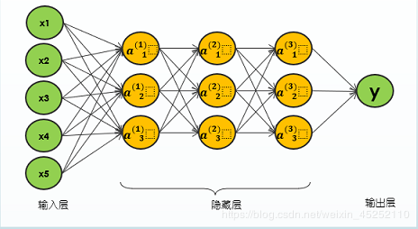

>>>>>>>> ## 第一章 神经网络的基本工作原理
###  神经网络的基本工作原理
#### 神经元细胞的数学模型
 + 输入 input ：是外界输入信号，一般是一个训练数据样本的多个属性。
 + 权重 weights：每个输入信号的权重值。
 + 偏移 bias：b实际就是那个临界值。（用结果来解释是b是偏移值，使直线能够沿Y轴上下移动）
 + 求和计算 sum
 + 激活函数 activation：激活函数都是有一个渐变的过程，也就是说是个曲线。
 + 小结：
    + 一个神经元：
        + 可以有多个输入
        + 只能有一个输出，这个输出可以同时输入给多个神经元
        + w的数量和输入的数量一致
        + 只有一个b
    + w和b有人为的初始值，在训练过程中被不断修改
    + 激活函数不是必须有的，亦即A可以等于Z
    + 一层神经网络中的所有神经元的激活函数必须一致

#### 神经网络的训练过程
1. 单层神经网络模型：这是一个单层的神经网络，有m个输入 (这里m=3)，有n个输出 (这里n=2)。在单个神经元里，b是个值。但是在神经网络中，我们把b的值永远设置为1，而用b到每个神经元的权值来表示实际的偏移值，亦即(b1,b2)，这样便于矩阵运算。
    + $(x1,x2,x3)$是一个样本数据的三个特征值
    + $(w11,w12,w13)$是$(x1,x2,x3)$到$n1$的权重
    + $(w21,w22,w23)$是$(x1,x2,x3)$到$n2$的权重
    + $b1$是$n1$的偏移
    + $b2$是$n2$的偏移
2. 前提条件：
    + 有训练数据
    + 根据数据的规模、领域，建立了神经网络的基本结构。
    + 定义好损失函数来合理地计算误差
3. 神经网络中的矩阵运算

#### 神经网络的主要功能
1. 回归/拟合
2. 分类

#### 激活函数
1. 生理学上的例子
   
2. 激活函数的作用:一个没有激活函数的神经网络将只不过是一个线性回归模型.同样是因为没有激活函数，我们的神经网络将无法学习和模拟其他复杂类型的数据。
    + Sigmoid激活函数：$$a = \frac{1}{1+e^{-z}}=\frac{1}{1+e^{-(wx+b)}}$$ 
3. 激活函数的另一个重要特征是：它应该是可导的。
   
#### 深度神经网络与深度学习：三层以上的网络称为深度神经网络。
1. 卷积神经网络(CNN)对于图像类的机器学习问题，最有效的就是卷积神经网络
2. 循环神经网络(RNN)对于语言类的机器学习问题，最有效的就是循环神经网络。

#### Deep Learning的训练过程
1. 使用自下上升非监督学习（就是从底层开始，一层一层的往顶层训练）
2. 自顶向下的监督学习（就是通过带标签的数据去训练，误差自顶向下传输，对网络进行微调）
   

### 总结
+ 这个章节介绍的是有监督学习的神经网络机器学习过程。神经网络模型：，神经网络模型是逻辑单元按照不同层级组织起来的网络，每一层的输出变量都是下一层的输入变量。
+ 反向传播算法是比较快速可以计算出结果的。在计算神经网络预测结果的时候采用一种正向传播方法（从第一层开始正向一层一层进行计算，直到最后一层的 hθ(x)。）。而反向传播算法（首先计算最后一层的误差，然后再一层一层反向求出各层的误差，直到倒数第二层。）
+ 反向传播算法推导：
    +  求deltaTheta
    +  求δ(误差) 链式求导
+ 即首先正向传播方法计算出每一层的激活单元，利用训练集的结果与神经网络预测的结果求出最后一层的误差，然后利用该误差运用反向传播法计算出直至第二层的所有误差。