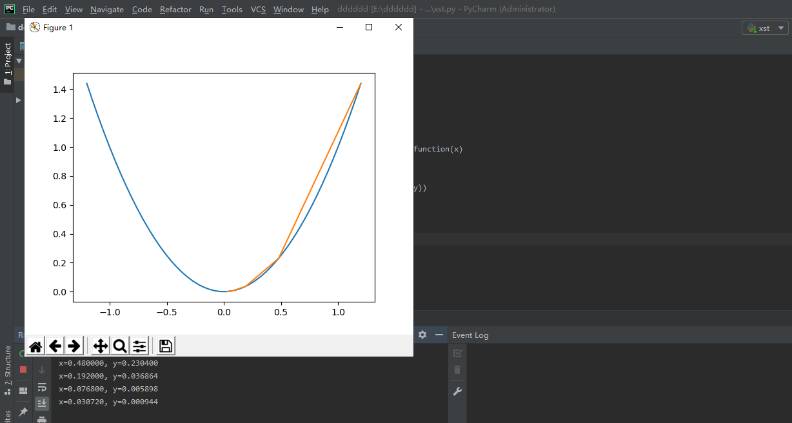
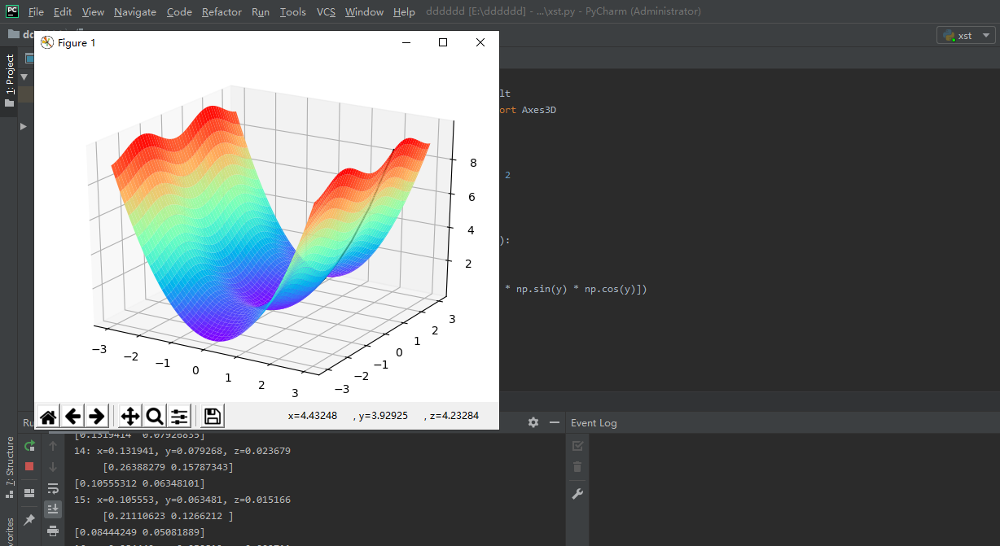
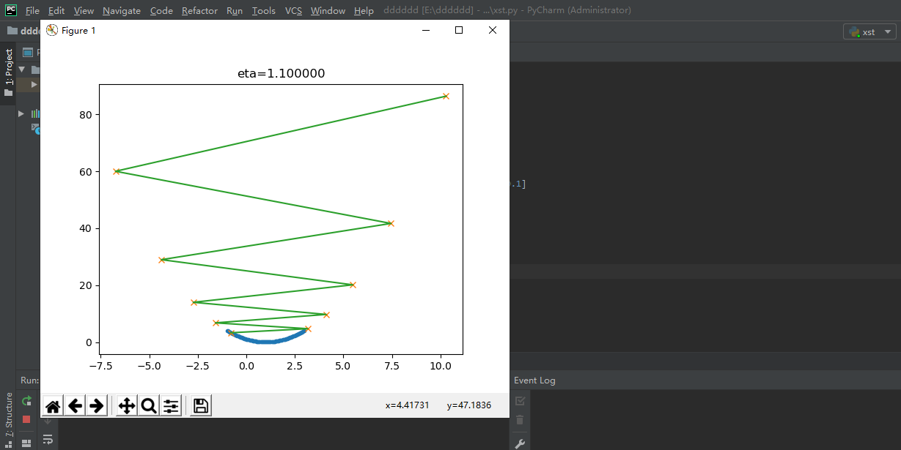

>>>>>>>>>>> # 202002025
### 梯度下降：
+ 梯度下降是迭代法的一种,可以用于求解最小二乘问题(线性和非线性都可以)。
+ 在求解机器学习算法的模型参数，即无约束优化问题时，梯度下降（Gradient Descent）是最常采用的方法之一，另一种常用的方法是最小二乘法。
+ 在求解损失函数的最小值时，可以通过梯度下降法来一步步的迭代求解，得到最小化的损失函数和模型参数值。在机器学习中，基于基本的梯度下降法发展了两种梯度下降方法，分别为随机梯度下降法和批量梯度下降法。
+ 梯度：对于可微的数量场,以为分量的向量场称为f的梯度或斜量。
+ 缺点：
    + 靠近极小值时收敛速度减慢。
    + 直线搜索时可能会产生一些问题。
    + 可能会“之字形”地下降。
+ 根据GitHub上的代码运行的结果
+ 
+ 
+ 
  
### 损失函数：
+ 损失就是所有样本的误差总和，亦即：$$损失 = \sum^m_{i=1}，误差：i$$ $$J = \sum_{i=1}^m loss$$
#### 损失函数的作用：计算神经网络每次迭代的前向计算结果与真实值的差距。
+ 使用损失函数：
    1. 用随机值初始化前向计算公式的参数
    2. 代入样本，计算输出的预测值
    3. 用损失函数计算预测值和标签值（真实值）的误差
    4. 根据损失函数的导数，沿梯度最小方向将误差回传，修正前向计算公式中的各个权重值
    5. goto 2, 直到损失函数值达到一个满意的值就停止迭代
   

#### 机器学习常用损失函数
+ 符号规则： a是预测值，y是样本标签值，J是损失函数值。
+ Gold Standard Loss，又称0-1误差：$$ loss=\begin{cases} 0 & a=y \ 1 & a \ne y \end{cases} $$
+ 绝对值损失函数：$$ loss = |y-a| $$
+ Hinge Loss，铰链/折页损失函数或最大边界损失函数，主要用于SVM（支持向量机）中：$$ loss=max(0,1-y \cdot a), y=\pm 1 $$
+ Log Loss，对数损失函数，又叫交叉熵损失函数(cross entropy error)：$$ loss = -\frac{1}{m} \sum_i^m y_i log(a_i) + (1-y_i)log(1-a_i), y_i \in {0,1} $$
+ Squared Loss，均方差损失函数 $$ loss=\frac{1}{2m} \sum_i^m (a_i-y_i)^2 $$
+ Exponential Loss，指数损失函数 $$ loss = \frac{1}{m}\sum_i^m e^{-(y_i \cdot a_i)} $$

#### 损失函数图像理解
1. 用二维函数图像理解单变量对损失函数的影响
2. 用等高线图理解双变量对损失函数影响

#### 神经网络中常用损失函数
1. 均方差函数，主要用于回归：该函数就是最直观的一个损失函数了，计算预测值和真实值之间的欧式距离。预测值和真实值越接近，两者的均方差就越小。
+ 公式
    + $$ loss = {1 \over 2}(z-y)^2 \tag{单样本} $$
    + $$ J=\frac{1}{2m} \sum_{i=1}^m (z_i-y_i)^2 \tag{多样本} $$
+ 工作原理：
    + 要想得到预测值a与真实值y的差距，最朴素的想法就是用$Error=a_i-y_i$。
    + 对于单个样本来说，这样做没问题，但是多个样本累计时，$a_i-y_i$有可能有正有负，误差求和时就会导致相互抵消，从而失去价值。所以有了绝对值差的想法，即$Error=|a_i-y_i|$。
  
2. 交叉熵函数，主要用于分类：是Shannon信息论中一个重要概念，主要用于度量两个概率分布间的差异性信息。
+ 在信息论中，交叉熵是表示两个概率分布p,q的差异，其中p表示真实分布，q表示非真实分布，那么H(p,q)就称为交叉熵
+ 公式:$$H(p,q)=\sum_i p_i \cdot log {1 \over q_i} = - \sum_i p_i \log q_i$$
+ 交叉熵的由来：
    + 信息量：$$I(x_j) = -\log (p(x_j))$$（$x_j$：表示一个事件；$p(x_j)$：表示$x_i$发生的概率；$I(x_j)$：信息量，$x_j$越不可能发生时，它一旦发生后的信息量就越大）
    + 熵：$$H(p) = - \sum_j^n p(x_j) \log (p(x_j))$$
    + 相对熵（KL散度）：,如果我们对于同一个随机变量 x 有两个单独的概率分布 P(x) 和 Q(x)，我们可以使用KL散度来衡量这两个分布的差异，这个相当于信息论范畴的均方差。
        + 公式：$$D_{KL}(p||q)=\sum_{j=1}^n p(x_j) \log{p(x_j) \over q(x_j)}$$（n为时间的所有可能性。D的值越小，表示q分布和p分布越接近）
+ 交叉熵：$$D_{KL}(p||q)=\sum_{j=1}^n p(x_j) \log{p(x_j)} - \sum_{j=1}^n p(x_j) \log q(x_j)$$ $$ =- H(p(x)) + H(p,q) $$
+ 二分类问题交叉熵
+ 多分类问题交叉熵
+ 不能使用均方差作为分类问题的损失函数原因
    + 回归问题通常用均方差损失函数，可以保证损失函数是个凸函数，即可以得到最优解。而分类问题如果用均方差的话，损失函数的表现不是凸函数，就很难得到最优解。而交叉熵函数可以保证区间内单调。
    + 分类问题的最后一层网络，需要分类函数，Sigmoid或者Softmax，如果再接均方差函数的话，其求导结果很复杂，运算量比较大。用交叉熵函数的话，可以得到比较简单的计算结果，一个简单的减法就可以得到反向误差。
+ 运算代码的结果：

3. 二者都是非负函数，极值在底部，用梯度下降法可以求解。
   