>>>>>>>>>>>>># 线性分类
### 多入单出的单层神经网络
#### 二分类函数：
+ 对率函数Logistic Function，即可以做为激活函数使用，又可以当作二分类函数使用。
    + 公式:$$a(z) = \frac{1}{1 + e^{-z}}$$
    + 导数:$$a^{'}(z) = a(z)(1 - a(z))$$
    + 输入值域：$$(-\infty, \infty)$$
    + 输出值域：$$(0,1)$$ 
+ 正向传播：
    + 矩阵运算: $$ z=x \cdot w + b \tag{1} $$
    + 分类计算：$$ a = Logistic(z)={1 \over 1 + e^{-z}} \tag{2} $$
    + 损失函数计算（二分类交叉熵损失函数）：$$ loss(w,b) = -[y \ln a+(1-y)\ln(1-a)] \tag{3} $$
+  反向传播：
    + 损失函数loss对a的偏导：$$ \frac{\partial loss}{\partial a}=-[{y \over a}+{-(1-y) \over 1-a}]=\frac{a-y}{a(1-a)} \tag{4} $$
    + 损失函数a对z的偏导：$$ \frac{\partial a}{\partial z}= a(1-a) \tag{5} $$
    + 损失函数loss对z的偏导：$$ \frac{\partial loss}{\partial z}=a-y \tag{6} $$
    + 损失函数满足二分类的要求，无论是正例还是反例，都是单调的；
    + 损失函数可导，以便于使用反向传播算法；
    + 让计算过程非常简单，一个减法就可以搞定

#### 线性二分类的神经网络实现：
+ 定义神经网络：
    + 
    + 这里神经元输出时使用了分类函数，所以有个A输出，而不是以往的z的直接输出。
    + 输入层（输入经度(x1)和纬度(x2)两个特征）：$$ x=\begin{pmatrix} x_{1} & x_{2} \end{pmatrix} $$
    + 权重矩阵：
        + 输入是2个特征，输出一个数，则W的尺寸就是2x1：$$ w=\begin{pmatrix} w_{1} \ w_{2} \end{pmatrix} $$
        + B的尺寸是1x1，行数永远是1，列数永远和W一样。$$ b=\begin{pmatrix} b_{1} \end{pmatrix} $$
    + 输出层：$$ z = x \cdot w + b =\begin{pmatrix} x_1 & x_2 \end{pmatrix} \begin{pmatrix} w_1 \ w_2 \end{pmatrix} $$ $$ =x_1 \cdot w_1 + x_2 \cdot w_2 + b \tag{1} $$ $$a = Logistic(z) \tag{2}$$
    + 损失函数（二分类交叉熵函损失数）：$$ loss(w,b) = -[yln a+(1-y)ln(1-a)] \tag{3} $$
+ 反向传播：$$ \frac{\partial loss}{\partial w}= \begin{pmatrix} {\partial loss / \partial w_1} \ {\partial loss / \partial w_2} \end{pmatrix} $$ $$ =\begin{pmatrix} \frac{\partial loss}{\partial z}\frac{\partial z}{\partial w_1} \ \ \frac{\partial loss}{\partial z}\frac{\partial z}{\partial w_2}
\end{pmatrix}

#### 线性二分类原理：
+ 线性分类和线性回归的异同：
    + 同：需要在样本群中找到一条直线
    + 不同：
        + 线性回归：用直线来拟合所有样本，使得各个样本到这条直线的距离尽可能最短。
        + 线性分类：用直线来分割所有样本，使得正例样本和负例样本尽可能分布在直线两侧（代数和几何）。
+ 二分类过程：
    + 正向计算：$$ z = x_1 w_1+ x_2 w_2 + b \tag{1} $$
    + 分类计算：$$ a={1 \over 1 + e^{-z}} \tag{2} $$
    + 损失函数计算：$$ loss = -[y \ln (a)+(1-y) \ln (1-a)] \tag{3} $$
  
#### 二分类结果可视化：
+ 代码运行结果：
    + 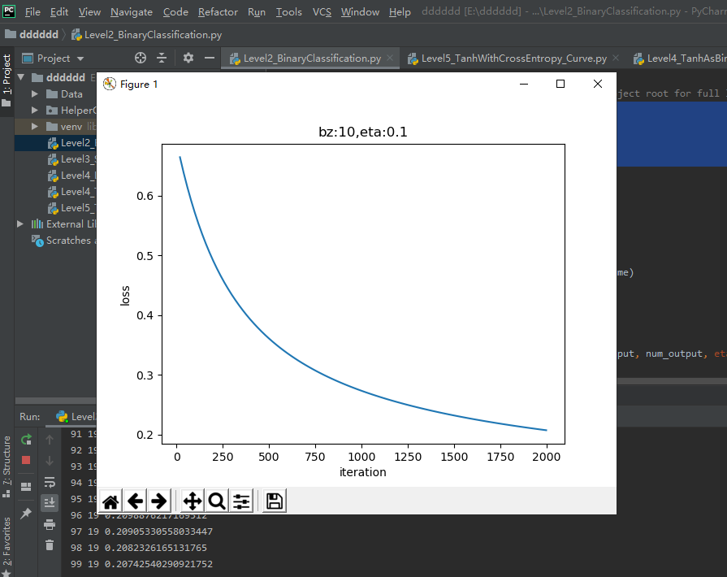

#### 实现逻辑与门和或门
+ 网络模型：用的是 神经元模型
+ 代码实现：
    + 
    + 
    + 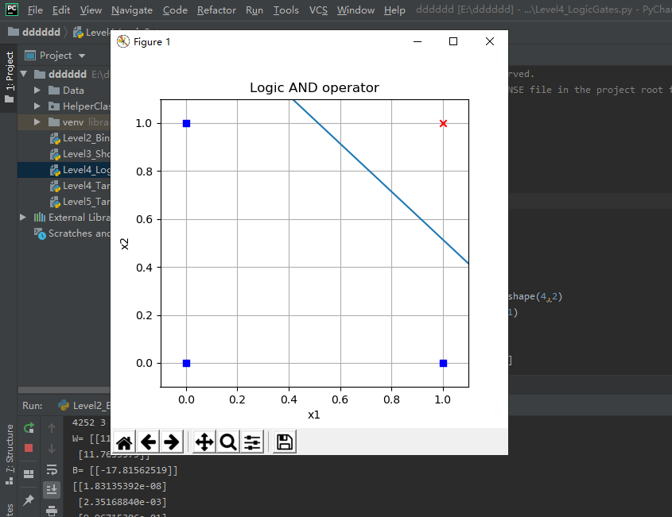
    + 
    + 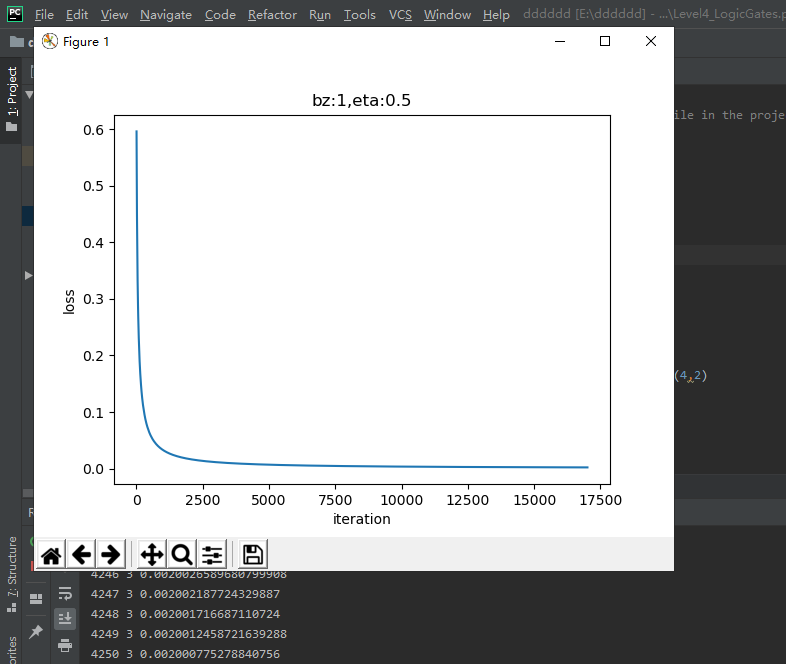
    + 
    + 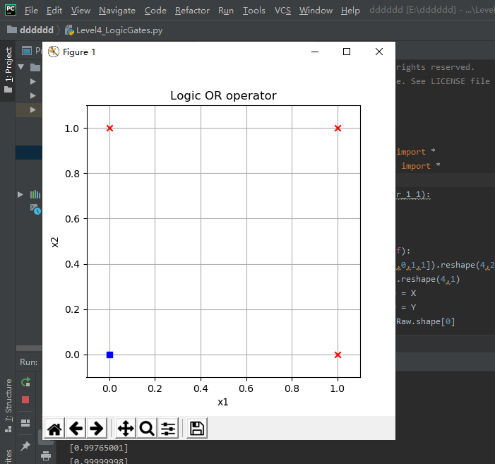
    + 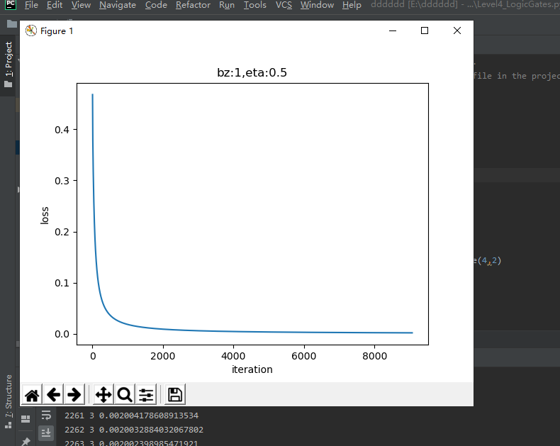
    + 
    + 
    + 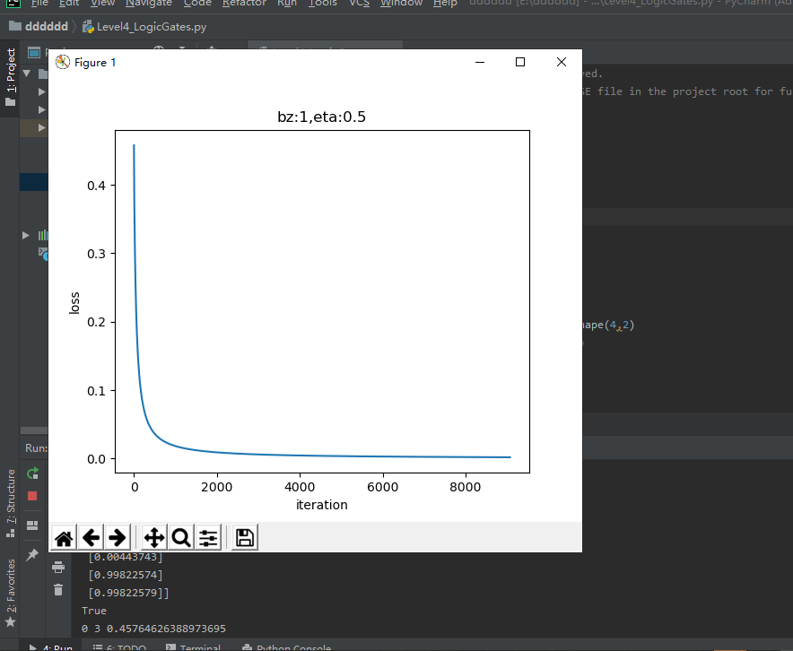
    + 
    + 
    +   

#### 用双曲正切函数做二分类函数：
+ 修改前向计算和反向传播函数：
    + 增加双曲正切分类函数
    + 修改前向计算方法
    + 修改反向传播方法
+ 修改损失函数：
    + 交叉熵原公式：
        + $$loss=-[y_i \ln a_i + (1-y_i) \ln (1-a_i)] \tag{2}$$
    + 改成：
        + $$ {\partial loss \over \partial a_i} = {2(a_i-y_i) \over (1+a_i)(1-a_i)} \tag{8} $$
    + 增加新的损失函数
    + 修改反向传播方法
+ 再次修改损失函数代码
+ 修改样本数据标签
+ 代码运行：
    + 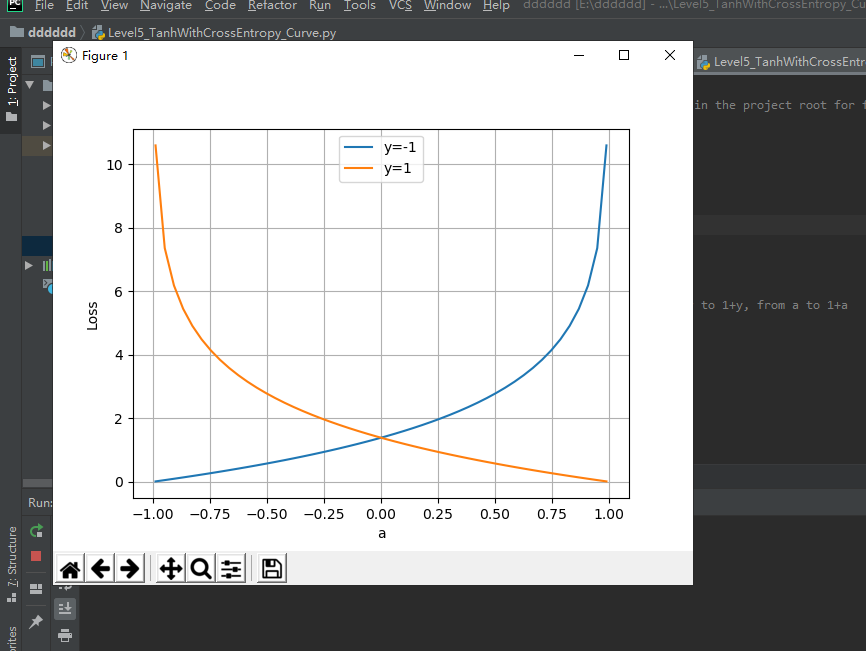
    + 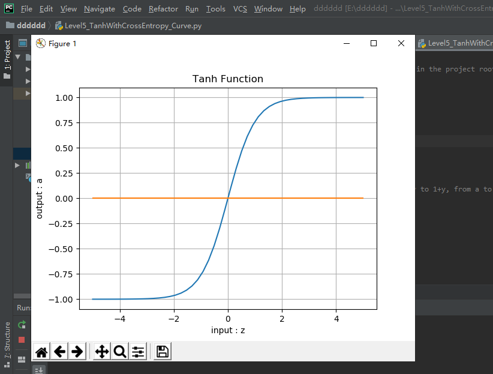
    + 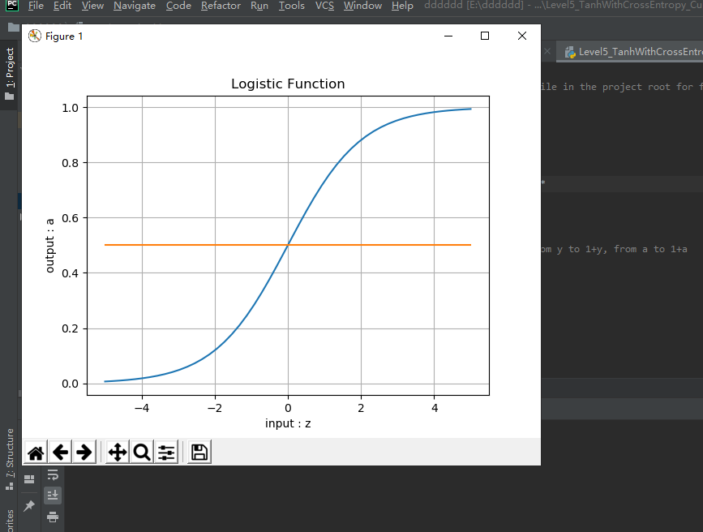

### 多入单出的单层神经网络
#### 多分类学习策略
+ 线性多分类：
+ 非线性多分类：
+ 二分类与多分类的关系：
    + 多分类解法：一对一、一对多、多对多 

#### 多分类函数：
+ 多分类函数定义-Softmax
    + 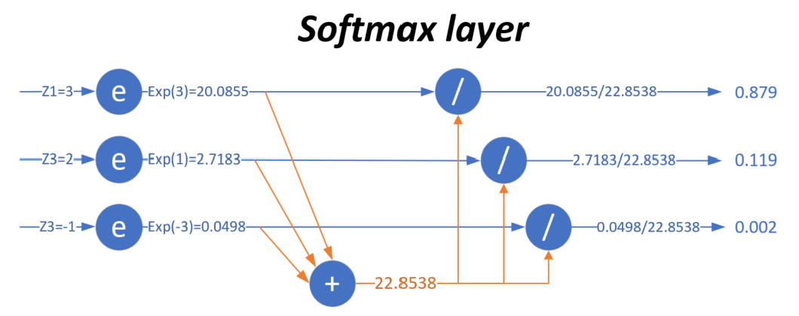
    + 有限项离散概率分布的梯度对数归一化
+ 分类器：
    + 分类是数据挖掘的一种非常重要的方法。分类的概念是在已有数据的基础上学会一个分类函数或构造出一个分类模型（即我们通常所说的分类器(Classifier)）。该函数或模型能够把数据库中的数据纪录映射到给定类别中的某一个，从而可以应用于数据预测。 
    + 分类器是数据挖掘中对样本进行分类的方法的统称，包含决策树、逻辑回归、朴素贝叶斯、神经网络等算法。
+ 交叉熵：
    + 是Shannon信息论中一个重要概念，主要用于度量两个概率分布间的差异性信息。
    + 语言模型的性能通常用交叉熵和复杂度（perplexity）来衡量。交叉熵的意义是用该模型对文本识别的难度，或者从压缩的角度来看，每个词平均要用几个位来编码。
    + 复杂度的意义是用该模型表示这一文本平均的分支数，其倒数可视为每个词的平均概率。
    + 平滑是指对没观察到的N元组合赋予一个概率值，以保证词序列总能通过语言模型得到一个概率值。
    + 通常使用的平滑技术有图灵估计、删除插值平滑、Katz平滑和Kneser-Ney平滑。
    + 交叉熵可在神经网络(机器学习)中作为损失函数，p表示真实标记的分布，q则为训练后的模型的预测标记分布，交叉熵损失函数可以衡量p与q的相似性。
    + 交叉熵作为损失函数还有一个好处是使用sigmoid函数在梯度下降时能避免均方误差损失函数学习速率降低的问题，因为学习速率可以被输出的误差所控制。

#### 线性多分类的神经网络实现：
+ 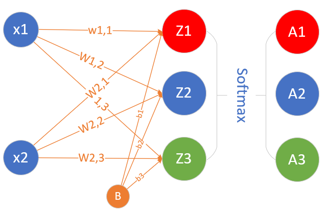
+ 输入层(输入经度(x1)和纬度(x2)两个特征):$$ x=\begin{pmatrix} x_1 & x_2 \end{pmatrix} $$
+ 权重矩阵w/b(W权重矩阵的尺寸，可以从后往前看):
    + $$ w=\begin{pmatrix} w_{11} & w_{12} & w_{13}\ w_{21} & w_{22} & w_{23} \end{pmatrix} $$;
    + b的尺寸是1x3，列数永远和神经元的数量一样，行数永远是1。
    + $$ b=\begin{pmatrix} b_1 & b_2 & b_3 \end{pmatrix} $$
+ 输出层（输出层三个神经元，再加上一个Softmax计算，最后有A1,A2,A3三个输出）：$$ z = \begin{pmatrix}z_1 & z_2 & z_3 \end{pmatrix} $$ $$ a = \begin{pmatrix}a_1 & a_2 & a_3 \end{pmatrix} $$（$Z=X \cdot W+B，A = Softmax(Z)$）
+ 代码运行:
+ 

#### 线性多分类原理：
+ 线性计算：$$z_1 = x_1 w_{11} + x_2 w_{21} + b_1 \tag{1}$$ $$z_2 = x_1 w_{12} + x_2 w_{22} + b_2 \tag{2}$$ $$z_3 = x_1 w_{13} + x_2 w_{23} + b_3 \tag{3}$$
+ 分类计算：$$ a_1=\frac{e^{z_1}}{\sum_i e^{z_i}}=\frac{e^{z_1}}{e^{z_1}+e^{z_2}+e^{z_3}} \tag{4} $$ $$ a_2=\frac{e^{z_2}}{\sum_i e^{z_i}}=\frac{e^{z_2}}{e^{z_1}+e^{z_2}+e^{z_3}} \tag{5} $$ $$ a_3=\frac{e^{z_3}}{\sum_i e^{z_i}}=\frac{e^{z_3}}{e^{z_1}+e^{z_2}+e^{z_3}} \tag{6} $$
+ 损失函数计算：
    + 单样本时（$n$表示类别数，$j$表示类别序号）:$$ loss(w,b)=-(y_1 \ln a_1 + y_2 \ln a_2 + y_3 \ln a_3) $$ $$ =-\sum_{j=1}^{n} y_j \ln a_j \tag{7} $$
    + 批量样本时（$m$表示样本数，$i$表示样本序号）：$$J(w,b) =- \sum_{i=1}^m (y_{i1} \ln a_{i1} + y_{i2} \ln a_{i2} + y_{i3} \ln a_{i3})$$ $$ =- \sum_{i=1}^m \sum_{j=1}^n y_{ij} \ln a_{ij} \tag{8}$$
  
#### 多分类结果可视化：
+ 代码运算：
+ 
+ 
+ 
  

