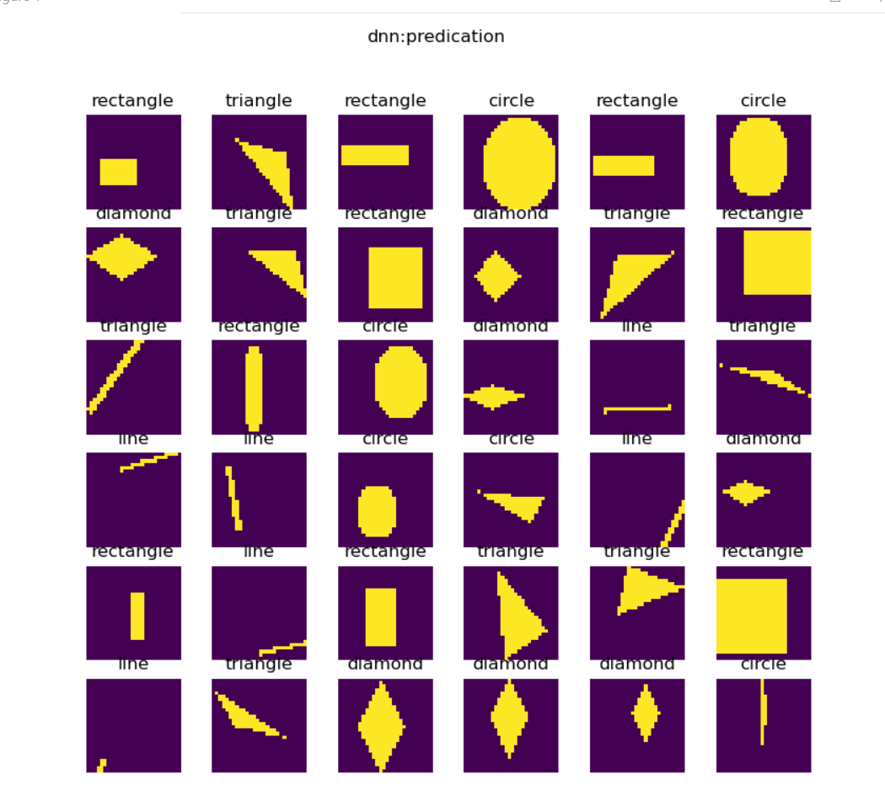
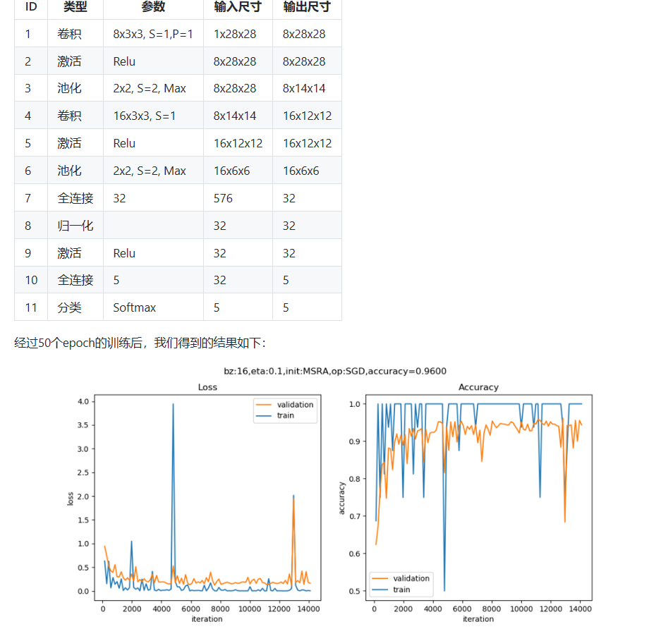
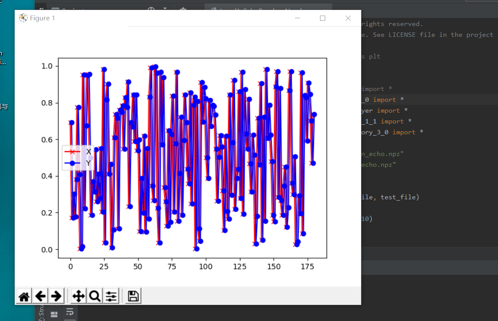
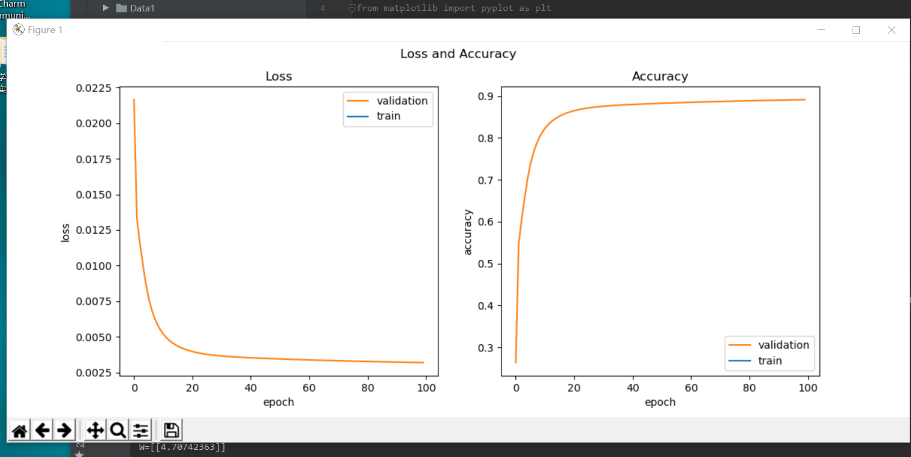
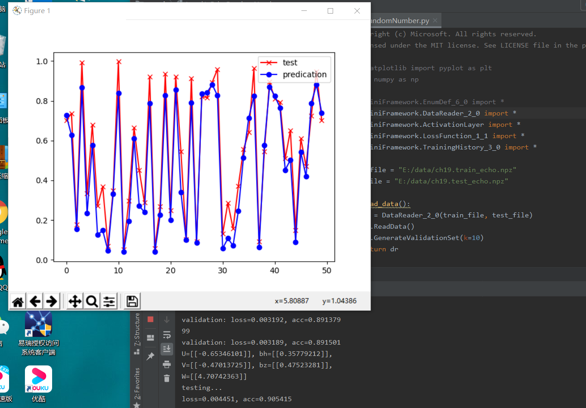
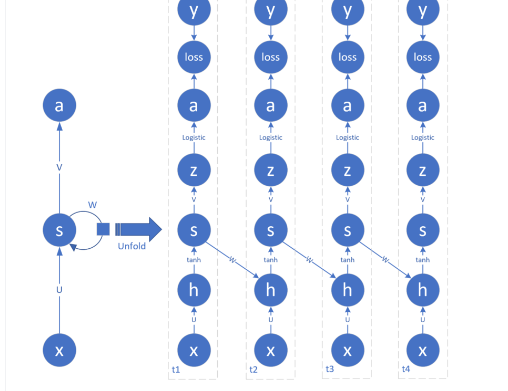
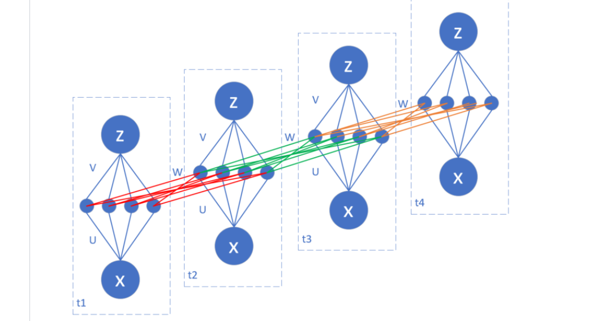
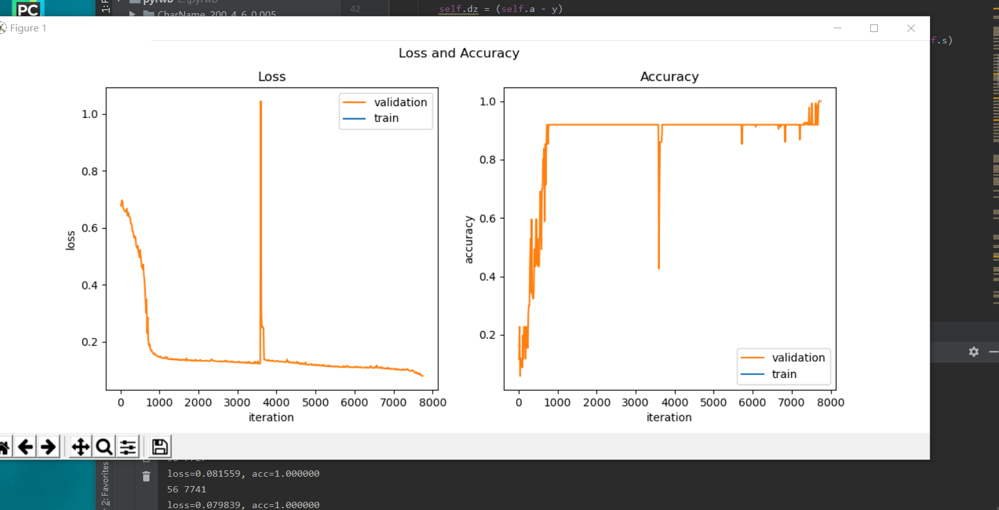
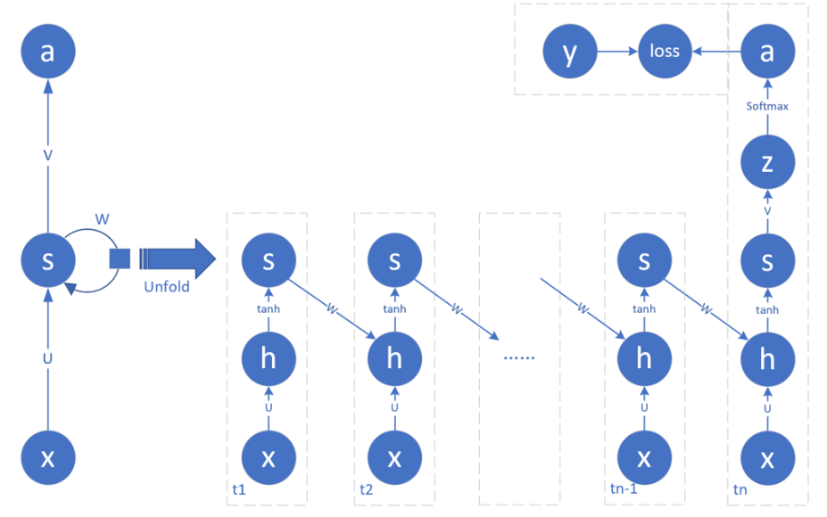
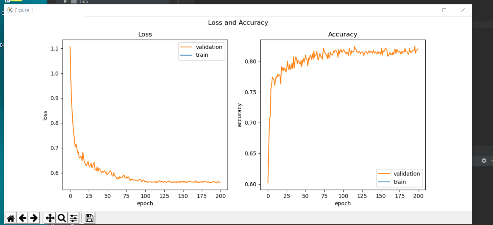

## 
总结

摘要：今天了解了卷积神经网络（CNN）的相关内容，进步的深入学习神经网络，通过了解学习CNN的发展和演变历程到初步的图形分类和识别，比较CNN和DNN两种方法识别的结果来学习神经网络。
1. 卷积神经网络的演进
卷积神经网络是现在深度学习领域中最有用的网络类型，尤其在计算机视觉领域更是一枝独秀。CNN从90年代的LeNet开始，沉寂了10年，也孵化了10年，直到2012年AlexNet开始再次崛起，后续的ZF Net、VGG、GoogLeNet、ResNet、DenseNet，网络越来越深，架构越来越复杂，解决反向传播时梯度消失的方法也越来越巧妙。下面让我们一起学习一下这些经典的网络模型。
  + LeNet (1998)
LeNet是卷积神经网络的开创者LeCun在1998年提出，用于解决手写数字识别的视觉任务。自那时起，CNN的最基本的架构就定下来了：卷积层、池化层、全连接层。
输入为单通道32x32灰度图
使用6组5x5的过滤器，每个过滤器里有一个卷积核，stride=1，得到6张28x28的特征图
使用2x2的池化，stride=2，得到6张14x14的特征图
使用16组5x5的过滤器，每个过滤器里有6个卷积核，对应上一层的6个特征图，得到16张10x10的特征图
池化，得到16张5x5的特征图
接全连接层，120个神经元
接全连接层，84个神经元
接全连接层，10个神经元，softmax输出
  + AlexNet (2012)
AlexNet网络结构在整体上类似于LeNet，都是先卷积然后在全连接。但在细节上有很大不同。AlexNet更为复杂。AlexNet有60 million个参数和65000个 神经元，五层卷积，三层全连接网络，最终的输出层是1000通道的softmax。
AlexNet用两块GPU并行计算，大大提高了训练效率，并且在ILSVRC-2012竞赛中获得了top-5测试的15.3%的error rate，获得第二名的方法error rate是26.2%，差距非常大，足以说明这个网络在当时的影响力
  + ZFNet (2013)
ZFNet是2013年ImageNet分类任务的冠军，其网络结构没什么改进，只是调了调参，性能较Alex提升了不少。ZF-Net只是将AlexNet第一层卷积核由11变成7，步长由4变为2，第3，4，5卷积层转变为384，384，256。这一年的ImageNet还是比较平静的一届，其冠军ZF-Net的名堂也没其他届的经典网络架构响亮。
  + VGGNet (2015)
VGG Net由牛津大学的视觉几何组（Visual Geometry Group）和 Google DeepMind公司的研究员一起研发的的深度卷积神经网络，在 ILSVRC 2014 上取得了第二名的成绩，将 Top-5错误率降到7.3%。它主要的贡献是展示出网络的深度（depth）是算法优良性能的关键部分。目前使用比较多的网络结构主要有ResNet（152-1000层），GooleNet（22层），VGGNet（19层），大多数模型都是基于这几个模型上改进，采用新的优化算法，多模型融合等。到目前为止，VGG Net 依然经常被用来提取图像特征。

  + GoogLeNet (2014)
GoogLeNet在2014的ImageNet分类任务上击败了VGG-Nets夺得冠军，其实力肯定是非常深厚的，GoogLeNet跟AlexNet,VGG-Nets这种单纯依靠加深网络结构进而改进网络性能的思路不一样，它另辟幽径，在加深网络的同时（22层），也在网络结构上做了创新，引入Inception结构代替了单纯的卷积+激活的传统操作（这思路最早由Network in Network提出）。GoogLeNet进一步把对卷积神经网络的研究推上新的高度。
模型结构图：
  + ResNets (2015)
2015年何恺明推出的ResNet在ISLVRC和COCO上横扫所有选手，获得冠军。ResNet在网络结构上做了大创新，而不再是简单的堆积层数，ResNet在卷积神经网络的新思路，绝对是深度学习发展历程上里程碑式的事件
  +  DenseNet (2017)
DenseNet 是一种具有密集连接的卷积神经网络。在该网络中，任何两层之间都有直接的连接，也就是说，网络每一层的输入都是前面所有层输出的并集，而该层所学习的特征图也会被直接传给其后面所有层作为输入。下图是 DenseNet 的一个dense block示意图，一个block里面的结构如下，与ResNet中的BottleNeck基本一致：BN-ReLU-Conv(1×1)-BN-ReLU-Conv(3×3) ，而一个DenseNet则由多个这种block组成。每个DenseBlock的之间层称为transition layers，由BN−>Conv(1×1)−>averagePooling(2×2)组成：
2. 实现颜色分类
CNN可以在图像分类上发挥作用，而一般的图像都是彩色的，也就是说除了形状以外，CNN也应该可以判别颜色的。这一节中我们来测试一下颜色分类问题，也就是说，不管几何图形是什么样子的，只针对颜色进行分类。
  + 用DNN解决问题 
  + 用CNN解决问题  
3. 实现几何图形分类
人工智能现在还是初期阶段,样本数据:一共有5种形状：圆形、菱形、直线、矩形、三角形。上图中列出了一些样本，由于图片尺寸是28x28的灰度图，所以在放大显示后可以看到很多锯齿，读者可以忽略。需要强调的是，每种形状的尺寸和位置在每个样本上都是有差异的，它们的大小和位置都是随机的，比如圆形的圆心位置和半径都是不一样的，还有可能是个椭圆
  + 用DNN解决问题 
  + 用CNN解决问题 
4. 实现几何图形及颜色分类 
    + 用DNN解决问题  
    + 用CNN解决问题 
5. 循环神经网络 编辑 讨论
9
 
循环神经网络（Recurrent Neural Network, RNN）是一类以序列（sequence）数据为输入，在序列的演进方向进行递归（recursion）且所有节点（循环单元）按链式连接的递归神经网络（recursive neural network）  。
对循环神经网络的研究始于二十世纪80-90年代，并在二十一世纪初发展为深度学习（deep learning）算法之一  ，其中双向循环神经网络（Bidirectional RNN, Bi-RNN）和长短期记忆网络（Long Short-Term Memory networks，LSTM）是常见的的循环神经网络   。循环神经网络具有记忆性、参数共享并且图灵完备（Turing completeness），因此在对序列的非线性特征进行学习时具有一定优势 。循环神经网络在自然语言处理（Natural Language Processing, NLP），例如语音识别、语言建模、机器翻译等领域有应用，也被用于各类时间序列预报。引入了卷积神经网络（Convoutional Neural Network,CNN）构筑的循环神经网络可以处理包含序列输入的计算机视觉问题。
  + 初步认识RNN
提出问题
我们先用一个最简单的序列问题来了解一下RNN的基本运作方式。
假设有一个随机信号发射器，每秒产生一个随机信号，随机值为(0,1)之间。信号发出后，碰到一面墙壁反射回来，来回的时间相加正好是1秒，于是接收器就收到了1秒钟之前的信号
  + 用DNN的知识来解决问题
搭建网络
我们回忆一下，在验证万能近似定理时，我们学习了曲线拟合问题，即带有一个隐层和非线性激活函数的前馈神经网络，可以拟合任意曲线。但是在这个问题里，有几点不同：
不是连续值，而是时间序列的离散值
完全随机的离散值，而不是满足一定的规律
测试数据不在样本序列里，完全独立
所以，即使使用DNN技术中曲线拟合技术得到了一个拟合网络，也不能正确地预测不在样本序列里的测试集数据。但是，我们可以把DNN做一个变形，让它能够处理时间序列数据：
运行结果：   
  +  更多时序的RNN
提出问题
在加减法运算中，总会遇到进位或者退位的问题，我们以二进制为例，比如13-6=7这个十进制的减法，变成二进制后如下所示：
被减数13变成了[1, 1, 0, 1]
减数6变成了[0, 1, 1, 0]
结果的7变成了[0, 1, 1, 1]
在减法过程中：
x1和x2的最后一位是1和0，相减为1
倒数第二位是0和1，需要从前面借一位，相减后得1
倒数第三位本来是1和1，借位后变成了0和1，再从前面借一位，相减后得1
倒数第四位现在是0和0，相减为0
  + 搭建多个时序的网络
从DNN的结构扩展到含有4个时序的网络结构：
图一：含有4个时序的网络结构图
图一中，最左侧的简易结构是通常的RNN的画法，而右侧是其展开后的细节，由此可见细节有很多，如果不展开的话，对于初学者来说很难理解，而且也不利于我们进行反向传播的推导。
再重复一下，请读者记住，t1是二进制数的最低位，但是由于我们把样本倒序了，所以，现在的t1就是样本的第0个单元的值。并且由于涉及到被减数和减数，所以每个样本的第0个单元（时间步）都有两个特征值，其它3个单元也一样。
在图一中，连接x和h的是一条线标记为U，在19.1节的例子中，U是一个参数，但是在本节中，U是一个 1x4 的参数矩阵，V是一个 4x1 的参数矩阵，而W就是一个 4x4 的参数矩阵。我们把它们展开画成下图（其中把s和h合并在一起了）：
运行结果：
 + 不定长时序的RNN
搭建不定长时序的网络图一：不定长时序的网络
在图一中，max_n=19，可以容纳最长的单词。为了节省空间，把最后一个时序的y和loss画在了拐弯的位置。
并不是所有的时序都需要做分类输出，而是只有最后一个时序需要。比如当名字是“guan”时，需要在第4个时序做分类输出，并加监督信号做反向传播，而前面3个时序不需要。但是当名字是“baevsky”时，需要在第7个时序做分类输出。所以n值并不是固定的。
对于最后一个序列，展开成DNN网络如图二：
运行结果：  混淆矩阵
在图四中，对角线上的方块越亮，表示识别越准确。对于Chinese，被识别为Chinese和English类别的数量差不多，也就是说很多中文名字被识别成了英语，这与英语名字的数量多有关系。