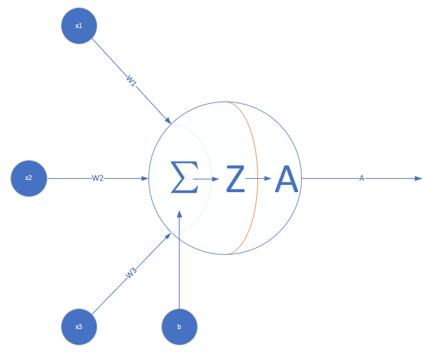

##                
总结 
 
今天我们接触了神经网络，进一步了解人工智能这个家族 。了解了神经网络计算的数学模型，训练过程，训练流程，深度神经网络与深度学习等。通过这次学习使我对人工智能，机器学习，神经网络学习有了更加深入的学习和了解。
1. 人工神经网络（Artificial Neural Networks，简写为ANNs）也简称为神经网络（NNs）或称作连接模型（Connection Model），它是一种模仿动物神经网络行为特征，进行分布式并行信息处理的算法数学模型。这种网络依靠系统的复杂程度，通过调整内部大量节点之间相互连接的关系，从而达到处理信息的目的。
2. 神经网络的简单的基本原理：
人工神经网络首先要以一定的学习准则进行学习，然后才能工作。现以人工神经网络对于写“A”、“B”两个字母的识别为例进行说明，规定当“A”输入网络时，应该输出“1”，而当输入为“B”时，输出为“0”。
3. 人工智能发展史：
  
   研究（包括技术）取得进展。
  
   研究的进展让人们看到人工智能的潜力，产生非常乐观的期望，例在1958年到1970年间科学家对人工智能各种突破的预计，当然他们的绝大多数预计都太乐观了。
   
   上述过高的期望让产业界开始热情地开发各种应用。
  
   但应用未能全部满足期望，于是人工智能行业进入低谷，直到下一波研究和技术取得突破性进展。在2007年之后，是大规模的数据和廉价的计算能力，让神经网络技术再度兴起，成为AI领域的明星技术。
4. 范式演化的四个阶段：
   第一阶段：经验
   第二阶段：理论：这一阶段，科学家们开始明确定义，速度是什么，质量是什么，化学元素是什么（不再是五行和燃素）……也开始构建各种模型，在模型中尽量撇除次要和无关因素
   第三阶段：计算仿真
   第四阶段：数据探索：在这个阶段，科学家收集数据，分析数据，探索新的规律。在深度学习的浪潮中出现的许多结果就是基于海量数据学习得来的
5. 神经元细胞的数学模型
   神经网络由基本的神经元组成，下图就是一个神经元的数学/计算模型
   
   输入(x1,x2,x3) 是外界输入信号，一般是一个训练数据样本的多个属性，比如，我们要识别手写数字0~9，那么在手写图片样本中，x1可能代表了笔画是直的还是有弯曲，x2可能代表笔画所占面积的宽度，x3可能代表笔画上下两部分的复杂度。

   权重(W1,W2,W3) 是每个输入信号的权重值，以上面的 (x1,x2,x3) 的例子来说，x1的权重可能是0.5，x2的权重可能是0.2，x3的权重可能是0.3。当然权重值相加之后可以不是1。
6. 神经网络训练流程：
   先给一个初始值，然后依赖正确值进行修复模型（训练模型），直到模型和真实值的误差可接受
   
   单层神经网络模型：这是一个单层的神经网络，有m个输入 (这里m=3)，有n个输出 (这里n=2)。在单个神经元里，b是个值。但是在神经网络中，我们把b的值永远设置为1，而用b到每个神经元的权值来表示实际的偏移值，亦即(b1,b2)，这样便于矩阵运算。
    + $(x1,x2,x3)$是一个样本数据的三个特征值
    + $(w11,w12,w13)$是$(x1,x2,x3)$到$n1$的权重
    + $(w21,w22,w23)$是$(x1,x2,x3)$到$n2$的权重
    + $b1$是$n1$的偏移
    + $b2$是$n2$的偏移
   前提条件：
    + 有训练数据
    + 根据数据的规模、领域，建立了神经网络的基本结构。
    + 定义好损失函数来合理地计算误差
   神经网络中的矩阵运算
7. 深度神经网络与深度学习
   两层的神经网络虽然强大，但可能只能完成二维空间上的一些曲线拟合的事情。如果对于图片、语音、文字序列这些复杂的事情，就需要更复杂的网络来理解和处理。第一个方式是增加每一层中神经元的数量，但这是线性的，不够有效。另外一个方式是增加层的数量，每一层都处理不同的事情。
   浅神经网络虽然具备了反向传播机制，但是仍存在问题：
   梯度越来越疏，从后向前，误差校正信号越来越微弱
   随机初始化会导致训练过程收敛到局部最小值
   需要数据带标签(人工label好的数据)，但是大部分数据没标签
8. 深度学习：
   使用自下上升非监督学习（就是从底层开始，一层一层的往顶层训练）

   自顶向下的监督学习（就是通过带标签的数据去训练，误差自顶向下传输，对网络进行微调）