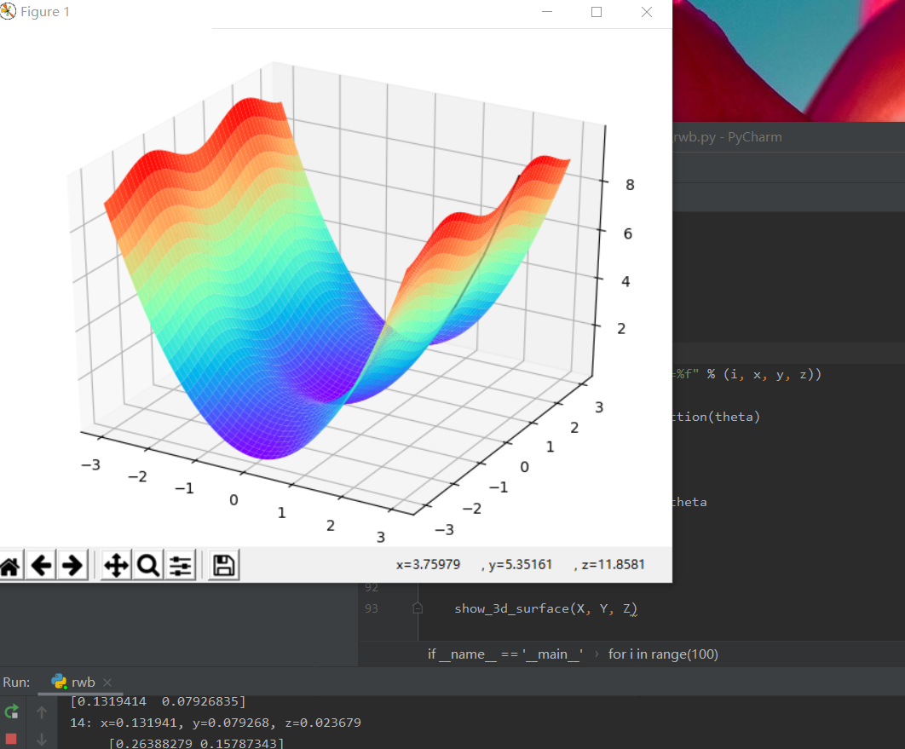
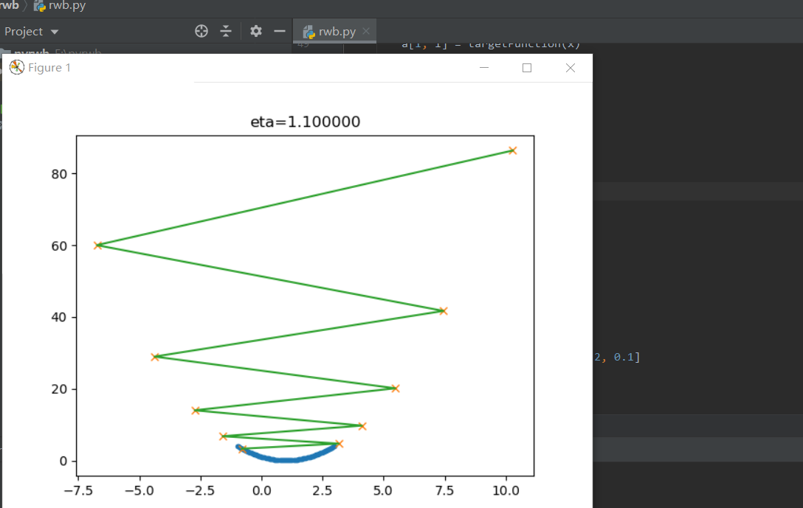
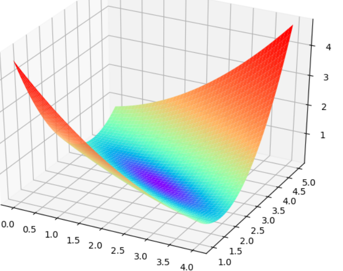

  #        
总结

  前言：今天我们继续学习神经网络的相关内容——梯度下降并学习梯度下降的相关内容，并了解了学习了损失函数，从而进一步学习神经网络。
  ## 1.梯度下降
  + 梯度下降是迭代法的一种,可以用于求解最小二乘问题(线性和非线性都可以)。在求解机器学习算法的模型参数，即无约束优化问题时，梯度下降（Gradient Descent）是最常采用的方法之一，另一种常用的方法是最小二乘法。在求解损失函数的最小值时，可以通过梯度下降法来一步步的迭代求解，得到最小化的损失函数和模型参数值。反过来，如果我们需要求解损失函数的最大值，这时就需要用梯度上升法来迭代了。在机器学习中，基于基本的梯度下降法发展了两种梯度下降方法，分别为随机梯度下降法和批量梯度下降法。
  + 步长（Learning rate）：步长决定了在梯度下降迭代的过程中，每一步沿梯度负方向前进的长度。用上面下山的例子，步长就是在当前这一步所在位置沿着最陡峭最易下山的位置走的那一步的长度。
  + 特征(feature) :指的是样本中输入部分，比如样本(xo, g), (x1, y1),则样本特征为x，样本输出为y。
  + 假设函数(hypothesis function) :在监督学习中，为了拟合输入样本，而使用的假设函数，记为he(x)。比如对于样本(xi, yi)(i= 1, 2,...n),可以采用拟合函数如下:h(x)= θo+ θ1x
  损失函数(loss function) :为了评估模型拟合的好坏，通常用损失函数来度量拟合的程度。损失函数极小化，意味着拟合程度最好，对应的模型参数即为最优参数。在线性回归中，损失函数通常为样本输出和假设函数的差取平方。比如对于样本(xi, yi)(i= 1,2,... n),采用线性回归，损失函数为:

     
  + 梯度下降的三要素:
    + 当前点,
    + 方向,
    + 步长,
  + 梯度下降”包含了两层含义：
    梯度：函数当前位置的最快上升点
    下降：与导数相反的方向，用数学语言描述就是那个减号
    亦即与上升相反的方向运动，就是下降。
  + 关于梯度下降的运行结果：
    
    
    
## 2.损失函数
  + 概念
   在各种材料中经常看到的中英文词汇有：误差，偏差，Error，Cost，Loss，损失，代价......意思都差不多，在本系列文章中，使用损失函数和Loss Function这两个词汇，具体的损失函数符号用J()来表示，误差值用loss表示。
   损失就是所有样本的误差的总和，亦即： $$损失 = \sum^m_{i=1}误差_i$$ $$J = \sum_{i=1}^m loss$$
   在黑盒子的例子中，我们如果说“某个样本的损失”是不对的，只能说“某个样本的误差”，如果我们把神经网络的参数调整到完全满足一个样本的输出误差为0，通常会令其它样本的误差变得更大，这样作为误差之和的损失函数值，就会变得更大。所以，我们通常会在根据某个样本的误差调整权重后，计算一下整体样本的损失函数值，来判定网络是不是已经训练到了可接受的状态。
 + 损失函数的作用，就是计算神经网络每次迭代的前向计算结果与 真实值的差距，从而指导下一步的训练向正确的方向进行。
   使用损失函数具体步骤：
   + 用随机值初始化前向计算公式的参数
   + 代入样本，计算输出的预测值
   + 用损失函数计算预测值和标签值（真实值）的误差
   + 根据损失函数的导数，沿梯度最小方向将误差回传，修正前向计算公式中的各个权重值
   + goto 2, 直到损失函数值达到一个满意的值就停止迭代
 + 机器学习常用损失函数
   符号规则：a是预测值，y是样本标签值，J是损失函数值。
   + Gold Standard Loss，又称0-1误差 $$ loss=\begin{cases} 0 & a=y \ 1 & a \ne y \end{cases} $$
   + 绝对值损失函数
   $$ loss = |y-a| $$
   + Hinge Loss，铰链/折页损失函数或最大边界损失函数，主要用于SVM（支持向量机）中
   $$ loss=max(0,1-y \cdot a), y=\pm 1 $$
   + Log Loss，对数损失函数，又叫交叉熵损失函数(cross entropy error)
   $$ loss = -\frac{1}{m} \sum_i^m y_i log(a_i) + (1-y_i)log(1-a_i), y_i \in {0,1} $$
   + Squared Loss，均方差损失函数 $$ loss=\frac{1}{2m} \sum_i^m (a_i-y_i)^2 $$
   + Exponential Loss，指数损失函数 $$ loss = \frac{1}{m}\sum_i^m e^{-(y_i \cdot a_i)} $$
 + 神经网络中常用的损失函数
   + 均方差函数，主要用于回归
   MSE - Mean Square Error。
   该函数就是最直观的一个损失函数了，计算预测值和真实值之间的欧式距离。预测值和真实值越接近，两者的均方差就越小。
   均方差函数常用于线性回归(linear regression)，即函数拟合(function fitting)。
   公式$$ loss = {1 \over 2}(z-y)^2 \tag{单样本} $$
   $$ J=\frac{1}{2m} \sum_{i=1}^m (z_i-y_i)^2 \tag{多样本} $$
    + 工作原理
      要想得到预测值a与真实值y的差距，最朴素的想法就是用$Error=a_i-y_i$。
      对于单个样本来说，这样做没问题，但是多个样本累计时，$a_i-y_i$有可能有正有负，误差求和时就会导致相互抵消，从而失去价值。所以有了绝对值差的想法，即$Error=|a_i-y_i|$。
      运行结果：
      
   + 交叉熵函数，主要用于分类  
    交叉熵（Cross Entropy）是Shannon信息论中一个重要概念，主要用于度量两个概率分布间的差异性信息。在信息论中，交叉熵是表示两个概率分布p,q的差异，其中p表示真实分布，q表示非真实分布，那么H(p,q)就称为交叉熵：
    $$H(p,q)=\sum_i p_i \cdot log {1 \over q_i} = - \sum_i p_i \log q_i$$
    交叉熵可在神经网络中作为损失函数，p表示真实标记的分布，q则为训练后的模型的预测标记分布，交叉熵损失函数可以衡量p与q的相似性。
    交叉熵函数常用于逻辑回归(logistic regression)，也就是分类(classification)。
     + 相对熵(KL散度)
      相对熵又称KL散度,如果我们对于同一个随机变量 x 有两个单独的概率分布 P(x) 和 Q(x)，我们可以使用 KL 散度（Kullback-Leibler (KL) divergence）来衡量这两个分布的差异，这个相当于信息论范畴的均方差。
      KL散度的计算公式：
      $$D_{KL}(p||q)=\sum_{j=1}^n p(x_j) \log{p(x_j) \over q(x_j)}$$
      n为事件的所有可能性。 D的值越小，表示q分布和p分布越接近
     + 二分类问题交叉熵
     当y=1时，即标签值是1，是个正例：
     $$loss = -log(a)$$
    横坐标是预测输出，纵坐标是损失函数值。y=1意味着当前样本标签值是1，当预测输出越接近1时，Loss值越小，训练结果越准确。当预测输出越接近0时，Loss值越大，训练结果越糟糕。
    当y=0时，即标签值是0，是个反例： $$loss = -\log (1-a)$$
    运行结果：
    

