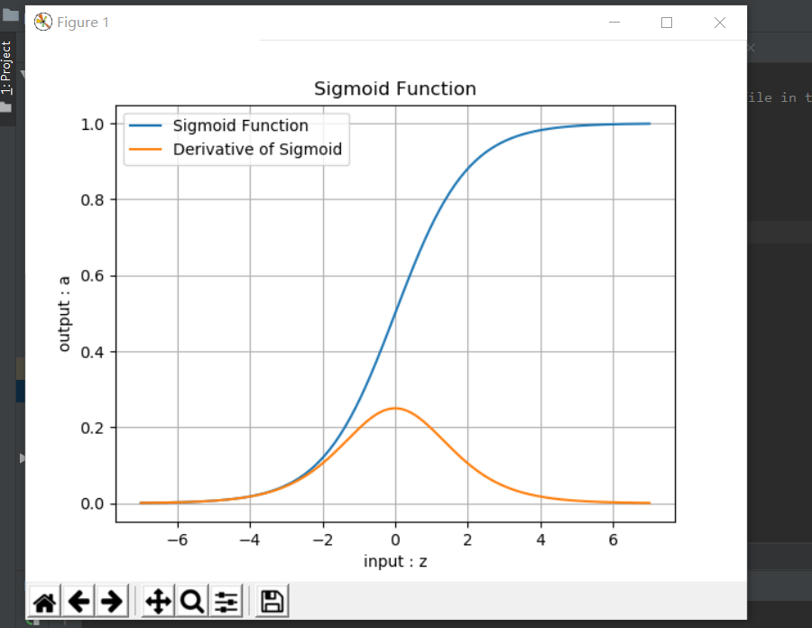
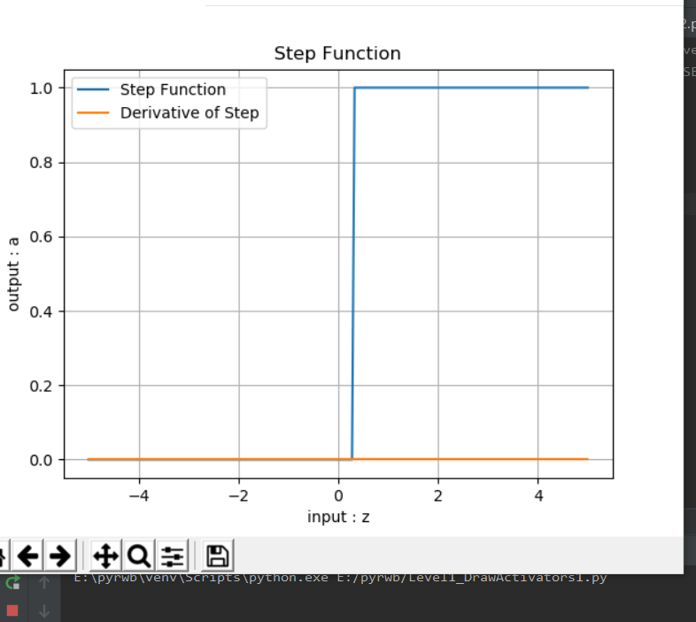
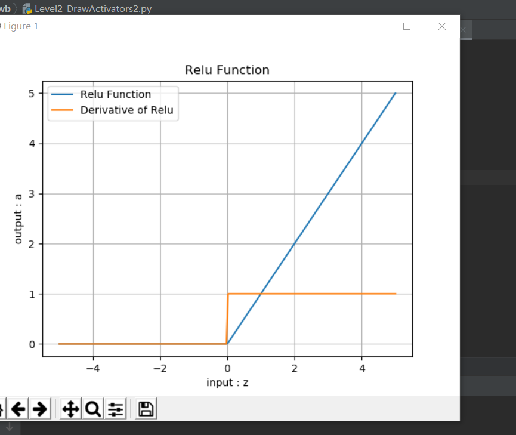
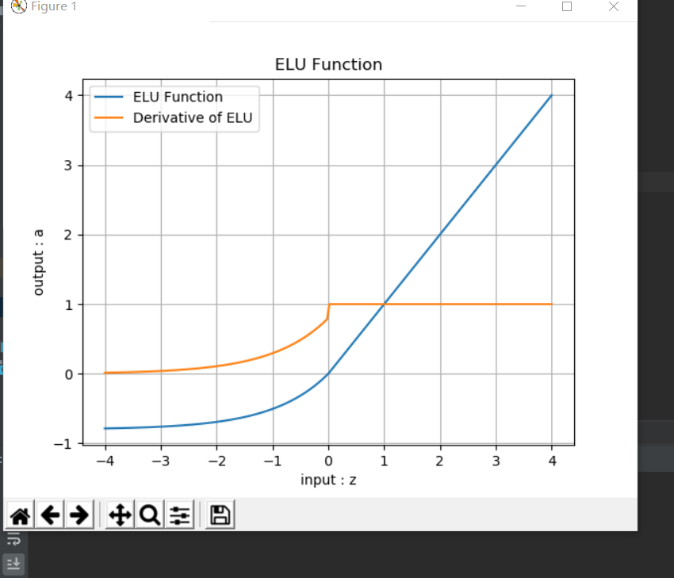
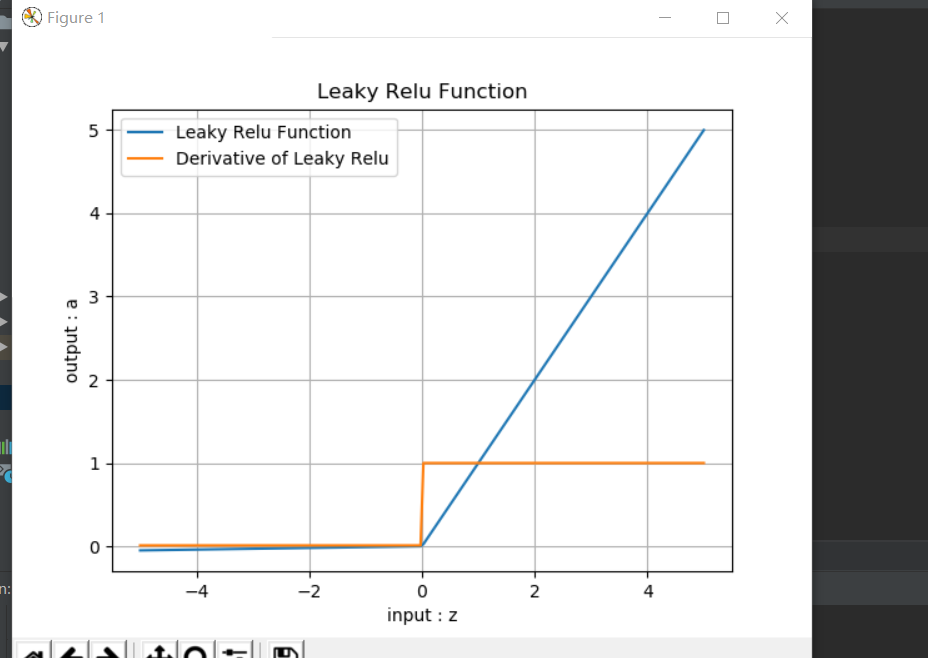
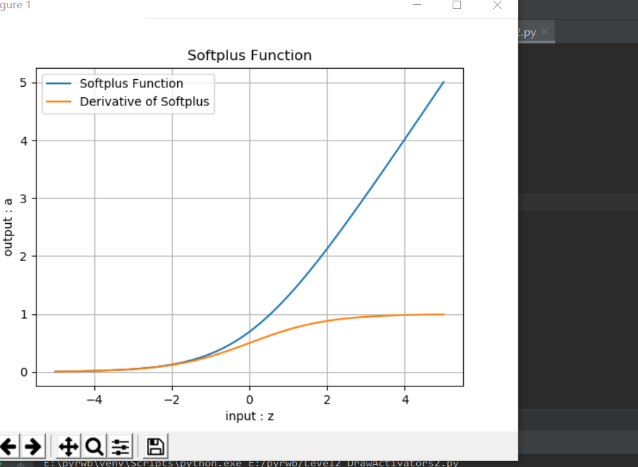
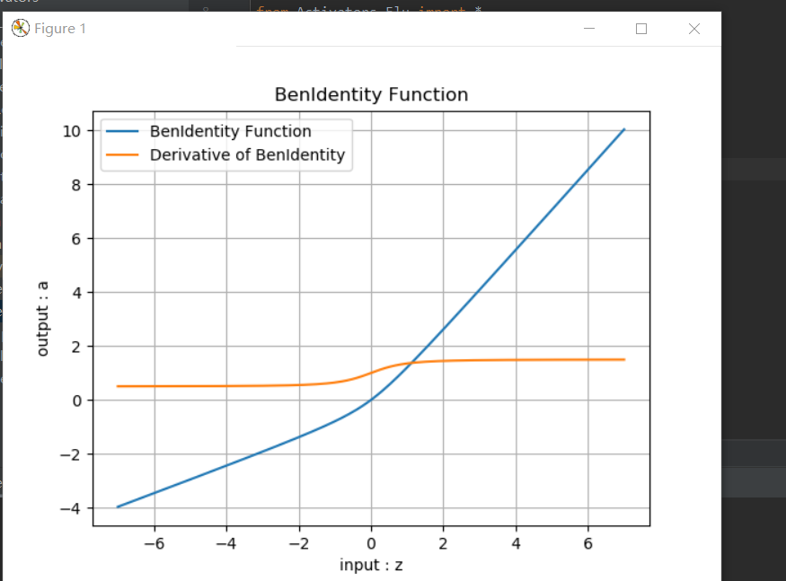

##    
总结

前言：今天我们进一步学习了和了解了非线性回归函数的含义和使用方法，也了解了激活函数的相关内容，激活函数分为哪几类，分类函数的各个相关函数的概念，数学原理，优缺点，使用方法。使我们进一步了解了神经网络。
1. 非线性回归：非线性回归是回归函数关于未知回归系数具有非线性结构的回归。常用的处理方法有回归函数的线性迭代法、分段回归法、迭代最小二乘法等。非线性回归分析的主要内容与线性回归分析相似，如果回归模型的因变量是自变量的一次以上函数形式，回归规律在图形上表现为形态各异的各种曲线，称为非线性回归 。这类模型称为非线性回归模型。在许多实际问题中，回归函数往往是较复杂的非线性函数。非线性函数的求解一般可分为将非线性变换成线性和不能变换成线性两大类。在两层神经网络之间，必须有激活函数连接，从而加入非线性因素，提高神经网络的能力。激活函数学分两类，一类是挤压型的激活函数，常用于简单网络的学习；另一类是半线性的激活函数，常用于深度网络的学习
2. 激活函数 
 + 激活函数的基本性质：
   + 非线性：线性的激活函数和 没有激活函数一样
   + 可导性：做误差反向传播和梯度下降，必须要保证激活函数的可导性
   + 单调性：单一的输入会得到单一的输出，较大值的输入得到较大值的输出
 + 何时会用到激活函数：
   + 神经网络最后一层不需要激活函数
   + 激活函数只用于连接前后两层神经网络
3.  挤压型激活函数 Squashing Function
又可以叫饱和型激活函数，因为在输入值域的绝对值较大的时候，它的输出在两端是饱和的。挤压型激活函数中，用的最多的是Sigmoid函数，所谓Sigmoid函数，原意是指一类函数，它们都具有S形的函数曲线以及压缩输入值域的作用，所以又叫挤压型激活函数
+ 对数几率函数 Sigmoid Function
对率函数，在用于激活函数时常常被称为Sigmoid函数，因为它是最常用的Sigmoid函数。
公式
$$a(z) = \frac{1}{1 + e^{-z}}$$
导数
$$a^{'}(z) = a(z) \odot (1 - a(z))$$
利用公式33，令：$u=1，v=1+e^{-z}$ 则：
$$ a' = \frac{u'v-v'u}{v^2}=\frac{0-(1+e^{-z})'}{(1+e^{-z})^2} $$ $$ =\frac{e^{-z}}{(1+e^{-z})^2} =\frac{1+e^{-z}-1}{(1+e^{-z})^2} $$ $$ =\frac{1}{1+e^{-z}}-(\frac{1}{1+e^{-z}})^2 $$ $$ =a-a^2=a(1-a) $$
值域
输入值域：$[-\infty, \infty]$
输出值域：$[0,1]$
  + 优点
从函数图像来看，sigmoid函数的作用是将输入压缩到(0, 1)这个区间范围内，这种输出在0~1之间的函数可以用来模拟一些概率分布的情况。他还是一个连续函数，导数简单易求。
从数学上来看，Sigmoid函数对中央区的信号增益较大，对两侧区的信号增益小，在信号的特征空间映射上，有很好的效果。
从神经科学上来看，中央区酷似神经元的兴奋态，两侧区酷似神经元的抑制态，因而在神经网络学习方面，可以将重点特征推向中央区， 将非重点特征推向两侧区。
分类功能：我们经常听到这样的对白“你觉得这件事情成功概率有多大？”“我有六成把握能成功”。sigmoid函数在这里就起到了如何把一个数值转化成一个通俗意义上的把握的表示。值越大，那么这个神经元对于这张图里有这样一条线段的把握就越大，经过sigmoid函数之后的结果就越接近100%，也就是1这样一个值，表现在图里，也就是这个神经元越兴奋（亮）
+ Tanh函数
TanHyperbolic，双曲正切函数。
公式
$$a(z) = \frac{e^{z} - e^{-z}}{e^{z} + e^{-z}} = \frac{2}{1 + e^{-2z}} - 1$$
$$a(z) = 2 \cdot Sigmoid(2z) - 1$$
导数公式
$$a'(z) = (1 + a(z)) \odot (1 - a(z))$$
利用基本导数公式23，令：$u={e^{z}-e^{-z}}，v=e^{z}+e^{-z}$ 则
$$ a'=\frac{u'v-v'u}{v^2} \tag{71} $$ $$ =\frac{(e^{z}-e^{-z})'(e^{z}+e^{-z})-(e^{z}+e^{-z})'(e^{z}-e^{-z})}{(e^{z}+e^{-z})^2} $$ $$ =\frac{(e^{z}+e^{-z})(e^{z}+e^{-z})-(e^{z}-e^{-z})(e^{z}-e^{-z})}{(e^{z}+e^{-z})^2} $$ $$ =\frac{(e^{z}+e^{-z})^2-(e^{z}-e^{-z})^2}{(e^{z}+e^{-z})^2} $$ $$ =1-(\frac{(e^{z}-e^{-z}}{e^{z}+e^{-z}})^2=1-a^2 $$
值域
输入值域：$[-\infty, \infty]$
输出值域：$[-1,1]$
  + 优点
具有Sigmoid的所有优点。

无论从理论公式还是函数图像，这个函数都是一个和sigmoid非常相像的激活函数，他们的性质也确实如此。但是比起sigmoid，tanh减少了一个缺点，就是他本身是零均值的，也就是说，在传递过程中，输入数据的均值并不会发生改变，这就使他在很多应用中能表现出比sigmoid优异一些的效果。
  + 缺点
exp()计算代价大。
梯度消失。
  + 运行结果：  
4. 半线性激活函数
又可以叫非饱和型激活函数
  + ReLU函数
  Rectified Linear Unit，修正线性单元，线性整流函数，斜坡函数。
公式
$$a(z) = max(0,z) = \begin{Bmatrix} z & (z \geq 0) \ 0 & (z < 0) \end{Bmatrix}$$
导数
$$a'(z) = \begin{cases} 1 & z \geq 0 \ 0 & z < 0 \end{cases}$$
值域
输入值域：$[-\infty, \infty]$
输出值域：$[0,\infty]$
导数值域：$[0,1]$
  + 优点
反向导数恒等于1，更加有效率的反向传播梯度值，收敛速度快
避免梯度消失问题
计算简单，速度快
活跃度的分散性使得神经网络的整体计算成本下降
  + 缺点
无界。
梯度很大的时候可能导致的神经元“死”掉。而这个死掉的原因是什么呢？是因为很大的梯度导致更新之后的网络传递过来的输入是小于零的，从而导致relu的输出是0，计算所得的梯度是零，然后对应的神经元不更新，从而使relu输出恒为零，对应的神经元恒定不更新，等于这个relu失去了作为一个激活函数的梦想。问题的关键点就在于输入小于零时，relu回传的梯度是零，从而导致了后面的不更新。在学习率设置不恰当的情况下，很有可能网络中大部分神经元“死”掉，也就是说不起作用了.
+  Leaky ReLU函数
PReLU，带泄露的线性整流函数。
公式
$$a(z) = \begin{cases} z & z \geq 0 \ \alpha * z & z < 0 \end{cases}$$
导数
$$a'(z) = \begin{cases} z & 1 \geq 0 \ \alpha & z < 0 \end{cases}$$
值域
输入值域：$[-\infty, \infty]$
输出值域：$[-\infty,\infty]$
导数值域：$[0,1]$
  + 优点
继承了ReLU函数的优点。
相比较于relu函数，leaky relu同样有收敛快速和运算复杂度低的优点，而且由于给了$x<0$时一个比较小的梯度$\alpha$,使得$x<0$时依旧可以进行梯度传递和更新，可以在一定程度上避免神经元“死”掉的问题。
  + 运行结果：     