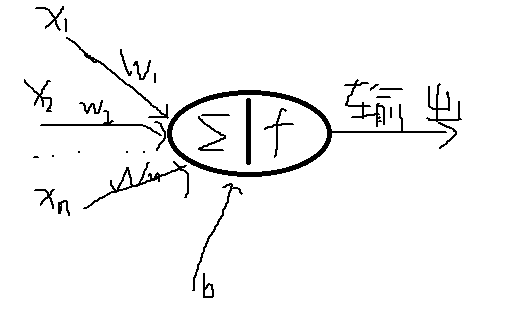

##  总结
由于疫情的原因各位同学都在家学习，通过网络慕课和老师的直播课对神经网络进行学习，并且了解了
神经网络计算的数学模型，训练过程，深度神经网络与深度学习等方面的内容，通过这次的学习让我对人工智能有了更加深入的了解。

1. 神经网络基本原理

   神经网络的一个重要特性是它能够从环境中学习,并把学习的结果分布存储于网络的突触连接中。神经网络的学习是一个过程,在其所处环境的激励下,相继给网络输入一些样本模式,并按照一定的规则(学习算法)调整网络各层的权值矩阵,待网络各层权值都收敛到一定值,学习过程结束。然后我们就可以用生成的神经网络来对真实数据做分类。

2. 人工智能发展历史

   1943年，心理学家W·Mcculloch和数理逻辑学家W·Pitts在分析、总结神经元基本特性的基础上首先提出神经元的数学模型。此模型沿用至今。

   1945年冯·诺依曼领导的设计小组试制成功存储程序式电子计算机，标志着电子计算机时代的开始。1948年，他在研究工作中比较了人脑结构与存储程序式计算机的根本区别，提出了以简单神经元构成的再生自动机网络结构。

 
   另外，在60年代初期，Widrow提出了自适应线性元件网络，这是一种连续取值的线性加权求和阈值网络。后来，在此基础上发展了非线性多层自适应网络。

   随着人们对感知机兴趣的衰退，神经网络的研究沉寂了相当长的时间。80年代初期，模拟与数字混合的超大规模集成电路制作技术提高到新的水平，完全付诸实用化，此外，数字计算机的发展在若干应用领域遇到困难。这一背景预示，向人工神经网络寻求出路的时机已经成熟。美国的物理学家Hopfield于1982年和1984年在美国科学院院刊上发表了两篇关于人工神经网络研究的论文，引起了巨大的反响。人们重新认识到神经网络的威力以及付诸应用的现实性。随即，一大批学者和研究人员围绕着 Hopfield提出的方法展开了进一步的工作，形成了80年代中期以来人工神经网络的研究热潮。

  3. 神经元细胞的数学模型

     下图是简单的神经元的数学模型
     
     有多个输入x1,x2…xn，由于有调整所以对应w1,w2…wn为权重，b为人工输入，然后输出。

     输入x1，x2，x3代表的是输入信号的不同属性。

     权重W1,W2,W3代表每个输入信号的权重值。

   4. 神经网络训练流程：
     先给一个初始值，然后依赖正确值进行修复模型（训练模型），直到模型和真实值的误差可接受
     
     
     单层神经网络模型：
     这是一个单层的神经网络，有m个输入 (这里m=3)，有n个输出 (这里n=2)。在单个神经元里，b是个值。但是在神经网络中，我们把b的值永远设置为1，而用b到每个神经元的权值来表示实际的偏移值，亦即(b1,b2)，这样便于矩阵运算。

    + $(x1,x2,x3)$是一个样本数据的三个特征值
    + $(w11,w12,w13)$是$(x1,x2,x3)$到$n1$的权重
    + $(w21,w22,w23)$是$(x1,x2,x3)$到$n2$的权重
    + $b1$是$n1$的偏移
    + $b2$是$n2$的偏移
   前提条件：

    + 有训练数据
    + 根据数据的规模、领域，建立了神经网络的基本结构。
    + 定义好损失函数来合理地计算误差

    6. 深度神经网络与深度学习 

    通常我们把三层以上的网络称为深度神经网络。两层的神经网络虽然强大，但可能只能完成二维空间上的一些拟合与分类的事情。如果对于图片、语音、文字序列这些复杂的事情，就需要更复杂的网络来理解和处理。第一个方式是增加每一层中神经元的数量，但这是线性的，不够有效。另外一个方式是增加层的数量，每一层都处理不同的事情。
    
    7. 深度学习：
      使用自下上升非监督学习（就是从底层开始，一层一层的往顶层训练）

     自顶向下的监督学习（就是通过带标签的数据去训练，误差自顶向下传输，对网络进行微调）