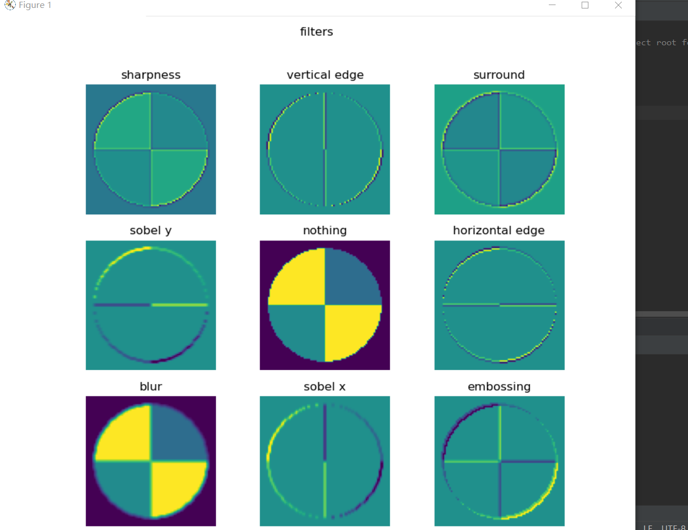
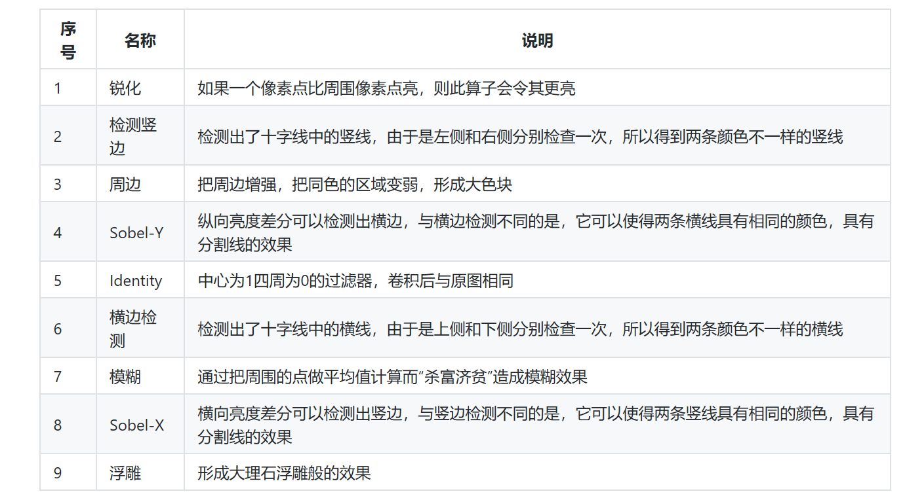
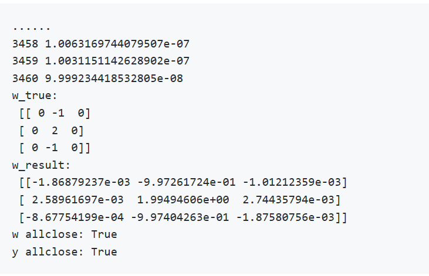

## 总结
今天学习了卷积神经网络的概念，原理，卷积神经网络是深度学习中的一个里程碑式的技术，有了这个技术，才会让计算机有能力理解图片和视频信息，才会有计算机视觉的众多应用，通过对代码的运行测试，让我熟悉了卷积神经网络的原理和实现过程。

### 1.卷积神经网络简述
卷积神经网络（CNN）是目前最流行的深度学习算法之一，尤其适用于发现图像中的模式，从而识别物体、人脸和场景。直接从图像数据中学习，使用模式对图像进行分类，无需手动特征提取，是一类包含卷积计算且具有深度结构的前馈神经网络（Feedforward Neural Networks），是深度学习（deep learning）的代表算法之一 。

### 2. 卷积神经网络的功能
卷积神经网络（ConvNet or CNN)是神经网络的类型之一，在图像识别和分类领域中取得了非常好的效果，比如识别人脸、物体、交通标识等，这就为机器人、自动驾驶等应用提供了坚实的技术基础。

+ 卷积神经网络的典型结构

一个典型的卷积神经网络的结构如下图所示：

我们分析一下它的层级结构：

原始的输入是一张图片，可以是彩色的，也可以是灰度的或黑白的。这里假设是只有一个通道的图片，目的是识别0~9的手写体数字；
第一层卷积，我们使用了4个卷积核，得到了4张feature map；激活函数层没有单独画出来，这里我们紧接着卷积操作使用了Relu激活函数；
第二层是池化，使用了Max Pooling方式，把图片的高宽各缩小一倍，但仍然是4个feature map；
第三层卷积，我们使用了4x6个卷积核，其中4对应着输入通道，6对应着输出通道，从而得到了6张feature map，当然也使用了Relu激活函数；
第四层再次做一次池化，现在得到的图片尺寸只是原始尺寸的四分之一左右；
第五层把第四层的6个图片展平成一维，成为一个fully connected层；
第六层再接一个小一些的fully connected层；
最后接一个softmax函数，判别10个分类。
所以，在一个典型的卷积神经网络中，会至少包含以下几个层：

+ 卷积层
+ 激活函数层
+ 池化层
+ 全连接分类层

  + 卷积核的作用  
  + 9个卷积核的作用：

### 3. 卷积的前向计算

    卷积的数学定义
+ 连续定义
     $$h(x)=(f*g)(x) = \int_{-\infty}^{\infty} f(t)g(x-t)dt \tag{1}$$
     卷积与傅里叶变换有着密切的关系。利用这点性质，即两函数的傅里叶变换的乘积等于它们卷积后的傅里叶变换，能使傅里叶分析中许多问题的处理得到简化。

+ 离散定义
    $$h(x) = (f*g)(x) = \sum^{\infty}_{t=-\infty} f(t)g(x-t) \tag{2}$$

###  单入单出的二维卷积

二维卷积一般用于图像处理上。在二位图片上做卷积，如果把图像Image简写为$I$，把卷积核Kernal简写为$K$，则目标图片的第$(i,j)$个像素的卷积值为：

$$ h(i,j) = (I*K)(i,j)=\sum_m \sum_n I(m,n)K(i-m,j-n) \tag{3} $$

可以看出，这和一维情况下的公式2是一致的。从卷积的可交换性，我们可以把公式3等价地写作：

$$ h(i,j) = (I*K)(i,j)=\sum_m \sum_n I(i-m,j-n)K(m,n) \tag{4} $$

公式4的成立，是因为我们将Kernal进行了翻转。在神经网络中，一般会实现一个互相关函数(corresponding function)，而卷积运算几乎一样，但不反转Kernal：

$$ h(i,j) = (I*K)(i,j)=\sum_m \sum_n I(i+m,j+n)K(m,n) \tag{5} $$

在图像处理中，自相关函数和互相关函数定义如下：

自相关：设原函数是f(t)，则$h=f(t) \star f(-t)$，其中$\star$表示卷积
互相关：设两个函数分别是f(t)和g(t)，则$h=f(t) \star g(-t)$
互相关函数的运算，是两个序列滑动相乘，两个序列都不翻转。卷积运算也是滑动相乘，但是其中一个序列需要先翻转，再相乘。所以，从数学意义上说，机器学习实现的是互相关函数，而不是原始含义上的卷积。但我们为了简化，把公式5也称作为卷积。这就是卷积的来源。

###  多入单出的降维卷积

一张图片，通常是彩色的，具有红绿蓝三个通道。我们可以有两个选择来处理：
变成灰度的，每个像素只剩下一个值，就可以用二维卷积
对于三个通道，每个通道都使用一个卷积核，分别处理红绿蓝三种颜色的信息
显然第2种方法可以从图中学习到更多的特征，于是出现了三维卷积，即有三个卷积核分别对应书的三个通道，三个子核的尺寸是一样的，比如都是2x2，这样的话，这三个卷积核就是一个3x2x2的立体核，称为过滤器Filter，所以称为三维卷积。

在上图中，每一个卷积核对应着左侧相同颜色的输入通道，三个过滤器的值并不一定相同。对三个通道各自做卷积后，得到右侧的三张特征图，然后在按照原始值不加权地相加在一起，得到最右侧的黑色特征图，这张图里面已经把三种颜色的特征混在一起了，所以画成了黑色。

虽然输入图片是多个通道的，或者说是三维的，但是在相同数量的过滤器的计算后，相加在一起的结果是一个通道，即2维数据，所以称为降维。这当然简化了对多通道数据的计算难度，但同时也会损失多通道数据自带的颜色信息。

### 多入多出的同维卷积

第一个过滤器Filter-1为棕色所示，它有三卷积核(Kernal)，命名为Kernal-1，Keanrl-2，Kernal-3，分别在红绿蓝三个输入通道上进行卷积操作，生成三个2x2的输出Feature-1,n。然后三个Feature-1,n相加，并再加上b1偏移值，形成最后的棕色输出Result-1。

对于灰色的过滤器Filter-2也是一样，先生成三个Feature-2,n，然后相加再加b2，最后得到Result-2。

之所以Feature-m,n还用红绿蓝三色表示，是因为在此时，它们还保留着红绿蓝三种色彩的各自的信息，一旦相加后得到Result，这种信息就丢失了。

+ 对于三维卷积，有以下特点：

    + 预先定义输出的feature map的数量，而不是根据前向计算自动计算出来，此例中为2，这样就会 有两组WeightsBias
    + 对于每个输出，都有一个对应的过滤器Filter，此例中Feature Map-1对应Filter-1
    +  每个Filter内都有一个或多个卷积核Kernal，对应每个输入通道(Input Channel)，此例为3，对应输入的红绿蓝三个通道
    + 每个Filter只有一个Bias值，Filter-1对应b1，Filter-2对应b2
    卷积核Kernal的大小一般是奇数如：1x1, 3x3, 5x5, 7x7等，此例为5x5

## 4. 卷积层反向传播原理
+ 卷积层的训练
      同全连接层一样，卷积层的训练也需要从上一层回传的误差矩阵，然后计算：
     本层的权重矩阵的误差项
    本层的需要回传到下一层的误差矩阵
    在下面的描述中，我们假设已经得到了从上一层回传的误差矩阵，并且已经经过了激活函数的反向传导。

 + 计算反向传播的梯度矩阵
   正向公式：
   $$Z = W*A+b \tag{0}$$

   其中，W是卷积核，*表示卷积（互相关）计算，A为当前层的输入项，b是偏移（未在图中画出），Z为当前层的输出项，但尚未经过激活函数处理。

   分解到每一项就是下列公式：

   $$z_{11} = w_{11} \cdot a_{11} + w_{12} \cdot a_{12} + w_{21} \cdot a_{21} + w_{22} \cdot a_{22} + b \tag{1}$$ $$z_{12} = w_{11} \cdot a_{12} + w_{12} \cdot a_{13} + w_{21} \cdot a_{22} + w_{22} \cdot a_{23} + b \tag{2}$$ $$z_{21} = w_{11} \cdot a_{21} + w_{12} \cdot a_{22} + w_{21} \cdot a_{31} + w_{22} \cdot a_{32} + b \tag{3}$$ $$z_{22} = w_{11} \cdot a_{22} + w_{12} \cdot a_{23} + w_{21} \cdot a_{32} + w_{22} \cdot a_{33} + b \tag{4}$$

   最后可以统一成为一个简洁的公式：

###  $$\delta_{out} = \delta_{in} * W^{rot180} \tag{8}$$

  这个误差矩阵可以继续回传到下一层。
 当Weights是3x3时，$\delta_{in}$需要padding=2，即加2圈0，才能和Weights卷积后，得到正确 尺寸的$\delta_{out}$
 $\delta_{in}$需要padding=4，即加4圈0，才能和Weights卷积后，得到正确尺寸的$\delta_{out}$
 以此类推：当Weights是NxN时，$\delta_{in}$需要padding=N-1，即加N-1圈0

+ 有多个卷积核时的梯度计算

### $$\delta_{out} = \sum_m \delta_{in_m} * W^{rot180}_m \tag{9}$$

+ 有多个输入时的梯度计算
泛化以后得到：

### $$\delta_{out2} = \delta_{in} * W_2^{rot180} \tag{15}$$

测试结果 

### 5.池化的前向计算与反向传播

+ 常用池化方法
池化 pooling，又称为下采样，downstream sampling or sub-sampling。

  池化方法分为两种，一种是最大值池化 Max Pooling，一种是平均值池化 Mean/Average Pooling

  + 最大值池化，是取当前池化视野中所有元素的最大值，输出到下一层特征图中。
   + 平均值池化，是取当前池化视野中所有元素的平均值，输出到下一层特征图中。
    其目的是：
    扩大视野：就如同先从近处看一张图片，然后离远一些再看同一张图片，有些细节就会被忽略
    降维：在保留图片局部特征的前提下，使得图片更小，更易于计算
    平移不变性，轻微扰动不会影响输出：比如上如中最大值池化的4，即使向右偏一个像素，其输出值仍为4
    维持同尺寸图片，便于后端处理：假设输入的图片不是一样大小的，就需要用池化来转换成同尺寸图片

    + 池化层的训练
我们假设下面的2x2的图片中，$[[1,2],[3,4]]$是上一层网络回传的残差，那么：

对于最大值池化，残差值会回传到当初最大值的位置上（请对照图14.3.1），而其它三个位置的残差都是0。

对于平均值池化，残差值会平均到原始的4个位置上。
Max Pooling

正向公式：
$$w = max(a,b,e,f)$$
反向公式（假设Input Layer中的最大值是b）：
$${\partial w \over \partial a} = 0$$ $${\partial w \over \partial b} = 1$$ $${\partial w \over \partial e} = 0$$ $${\partial w \over \partial f} = 0$$

因为a,e,f对w都没有贡献，所以偏导数为0，只有b有贡献，偏导数为1。
$$\delta_a = {\partial J \over \partial a} = {\partial J \over \partial w} {\partial w \over \partial a} = 0$$
$$\delta_b = {\partial J \over \partial b} = {\partial J \over \partial w} {\partial w \over \partial b} = \delta_w \cdot 1 = \delta_w$$
$$\delta_e = {\partial J \over \partial e} = {\partial J \over \partial w} {\partial w \over \partial e} = 0$$
$$\delta_f = {\partial J \over \partial f} = {\partial J \over \partial w} {\partial w \over \partial f} = 0$$
Mean Pooling
正向公式：
$$w = \frac{1}{4}(a+b+e+f)$$
反向公式（假设Layer-1中的最大值是b）：
$${\partial w \over \partial a} = \frac{1}{4}$$ $${\partial w \over \partial b} = \frac{1}{4}$$ $${\partial w \over \partial e} = \frac{1}{4}$$ $${\partial w \over \partial f} = \frac{1}{4}$$
因为a,b,e,f对w都有贡献，所以偏导数都为1：
$$\delta_a = {\partial J \over \partial a} = {\partial J \over \partial w} {\partial w \over \partial a} = \frac{1}{4}\delta_w$$
$$\delta_b = {\partial J \over \partial b} = {\partial J \over \partial w} {\partial w \over \partial b} = \frac{1}{4}\delta_w$$
$$\delta_e = {\partial J \over \partial e} = {\partial J \over \partial w} {\partial w \over \partial e} = \frac{1}{4}\delta_w$$
$$\delta_f = {\partial J \over \partial f} = {\partial J \over \partial w} {\partial w \over \partial f} = \frac{1}{4}\delta_w$$

无论是max pooling还是mean pooling，都没有要学习的参数，所以，在卷积网络的训练中，池化层需要做的只是把误差项向后传递，不需要计算任何梯度。

测试的结果 