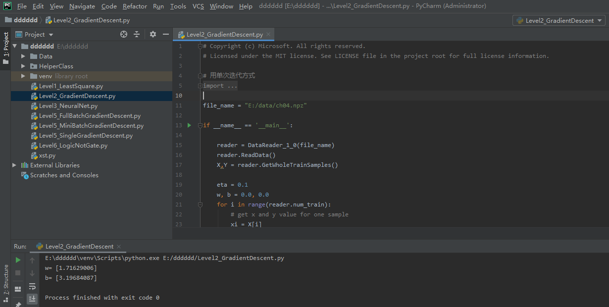
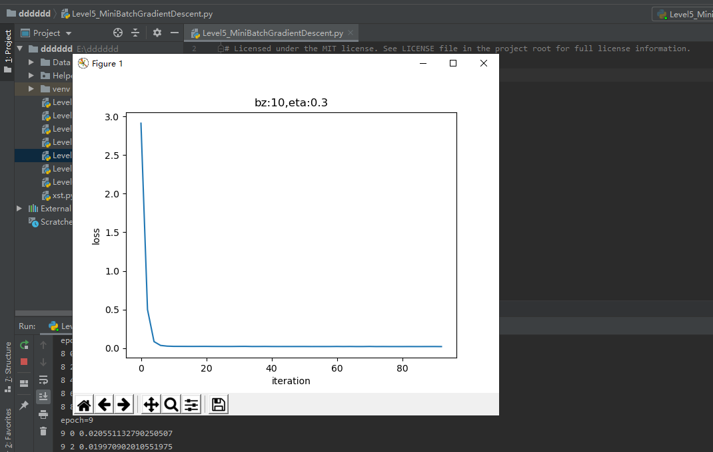

# 第2章 线性回归
## 一、最小二乘法
1. 历史：
  最小二乘法，也叫做最小平方法（Least Square），它通过最小化误差的平方和寻找数据的最佳函数匹配。利用最小二乘法可以简便地求得未知的数据，并使得这些求得的数据与实际数据之间误差的平方和为最小。最小二乘法还可用于曲线拟合。
2. 数学原理：
   $$z(x_i)=w \cdot x_i+b $$
   使得：
   $$z(x_i) \simeq y_i $$
   其中，$x_i$是样本特征值，$y_i$是样本标签值，$z_i$是模型预测值。
3. 代码实现

## 二、梯度下降法
 1.数学原理

    x是样本特征值（单特征），y是样本标签值，z是预测值，下标 $i$ 表示其中一个样本。
* 预设函数
  $$z_i = x_i \cdot w + b \tag{1}$$
* 损失函数
  $$loss(w,b) = \frac{1}{2} (z_i-y_i)^2 \tag{2}$$
2. 梯度计算
* 计算z的梯度\
 根据公式2：
$$
{\partial loss \over \partial z_i}=z_i - y_i \tag{3}
$$
* 计算w的梯度\
  我们用loss的值作为误差衡量标准，通过求w对它的影响，也就是loss对w的偏导数，来得到w的梯度。由于loss是通过公式2->公式1间接地联系到w的，所以我们使用链式求导法则，通过单个样本来求导。\
根据公式1和公式3：
$${\partial{loss} \over \partial{w}} = \frac{\partial{loss}}{\partial{z_i}}\frac{\partial{z_i}}{\partial{w}}=(z_i-y_i)x_i \tag{4}
$$
* 计算b的梯度
$$
\frac{\partial{loss}}{\partial{b}} = \frac{\partial{loss}}{\partial{z_i}}\frac{\partial{z_i}}{\partial{b}}=z_i-y_i \tag{5}
$$
3. 代码实现 
   
## 三、神经网络法
1. 定义神经网络结构
* 最简单的单层神经元：
* 输入层：此神经元在输入层只接受一个输入特征，经过参数w,b的计算后，直接输出结果。
* 权重w/b：因为是一元线性问题，所以w/b都是一个标量。
* 输出层：1个神经元，线性预测公式是：
   $$z_i = x_i \cdot w + b$$
   z是模型的预测输出，y是实际的样本标签值，下标 $i$ 为样本。
* 损失函数：因为是线性回归问题，所以损失函数使用均方差函数。
   $$loss(w,b) = \frac{1}{2} (z_i-y_i)^2$$
2. 反向传播
   + 计算w的梯度：
    + $$ {\partial{loss} \over \partial{w}} = \frac{\partial{loss}}{\partial{z_i}}\frac{\partial{z_i}}{\partial{w}}=(z_i-y_i)x_i $$
+ 计算b的梯度：
    + $$ \frac{\partial{loss}}{\partial{b}} = \frac{\partial{loss}}{\partial{z_i}}\frac{\partial{z_i}}{\partial{b}}=z_i-y_i $$
3. 代码运行结果
   
## 四、梯度下降的三种形势
1. 全批量梯度下降 
2. 单批量梯度下降 
3. 小批量梯度下降  
## 五、总结
 本章主要学习了线性回归的三种方法，即最小二乘法，梯度下降法，神经网络法。最小二乘法通过最小化误差的平方和寻找数据的最佳函数匹配。梯度下降法和最小二乘法的模型及损失函数是相同的，都是一个线性模型加均方差损失函数，模型用于拟合，损失函数用于评估效果。神经网络法和梯度下降法在本质上是一样的，只不过神经网络法使用一个崭新的编程模型，即以神经元为中心的代码结构设计。
