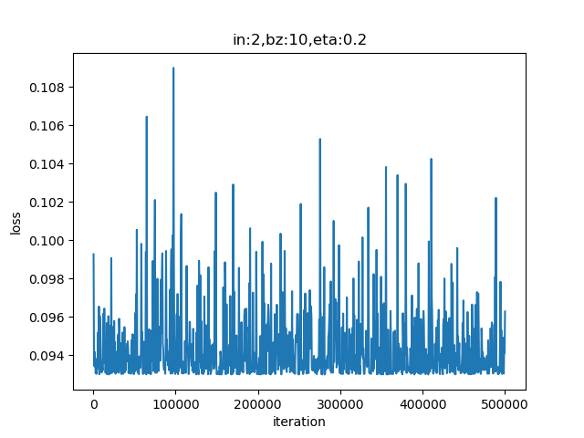

# 第4章 非线性回归
## 一、激活函数
1. 激活函数的作用:\
   给神经网络增加非线性因素
2. 激活函数的基本性质:
   + 非线性：线性的激活函数和没有激活函数一样
   + 可导性：做误差反向传播和梯度下降，必须要保证激活函数的可导性
   + 单调性：单一的输入会得到单一的输出，较大值的输入得到较大值的输出 
3. 何时会用到激活函数\
   激活函数用在神经网络的层与层之间的连接，神经网络的最后一层不用激活函数。
## 二、单入单出双层——非线性回归
 用多项式回归法拟合正弦曲线
#### 2.1 多项式回归的概念
    * 一元一次线性模型
    * 多元一次多项式
    * 一元多次多项式
    * 多元多次多项式
#### 2.2 用二次多项式拟合
 数据增强
##### 运行结果
|损失函数值|拟合结果|
|---|---|
|||
#### 2.3 用三次多项式拟合
##### 运行结果
|损失函数值|拟合结果|
|---|---|
|||
## 三、双层神经网络实现非线性回归
#### 3.1 定义神经网络结构
根据万能近似定理的要求，定义一个两层的神经网络，输入层不算，一个隐藏层，含3个神经元，一个输出层。
1. 输入层\
输入层就是一个标量x值。
$$X = (x)$$
2. 权重矩阵W1/B1
$$W1=
\begin{pmatrix}
w^1_{11} & w^1_{12} & w^1_{13}
\end{pmatrix}$$
$$B1=
\begin{pmatrix}
b^1_{1} & b^1_{2} & b^1_{3} 
\end{pmatrix}$$
3. 隐层\
用3个神经元：
$$Z1 = \begin{pmatrix}
    z^1_1 & z^1_2 & z^1_3
\end{pmatrix}$$
$$A1 = \begin{pmatrix}
    a^1_1 & a^1_2 & a^1_3
\end{pmatrix}$$
4. 权重矩阵W2/B2\
W2的尺寸是3x1，B2的尺寸是1x1。
$$W2=
\begin{pmatrix}
w^2_{11} \\
w^2_{21} \\
w^2_{31}
\end{pmatrix}$$
$$B2=
\begin{pmatrix}
b^2_{1}
\end{pmatrix}$$
5.输出层\
只完成一个拟合任务，所以输出层只有一个神经元：
$$Z2 = 
\begin{pmatrix}
    z^2_{1}
\end{pmatrix}$$
## 四、非线性回归的工作原理
  基本工作原理是把单一特征值的高次方做为额外的特征值加入，使得神经网络可以得到附加的信息用于训练。实践证明其方法有效，但是当问题比较复杂时，需要高达8次方的附加信息，且训练时间也很长。
当我们使用双层神经网络时，在隐层只放置了三个神经元，就轻松解决了复合函数拟合的问题，效率高出十几倍，复杂度却降低了几倍。
## 五、总结
 上两次课主要学习的是线性回归和线性分类，这次课学习的是另外一种处理方法：非线性回归，解决非线性问题。在两层神经网络之间，必须有激活函数连接，从而加入非线性因素，提高神经网络的能力。所以，先从激活函数学起，一类是挤压型的激活函数，常用于简单网络的学习；另一类是半线性的激活函数，常用于深度网络的学习。然后验证万能近似定理，建立一个双层的神经网络，来拟合一个比较复杂的函数。