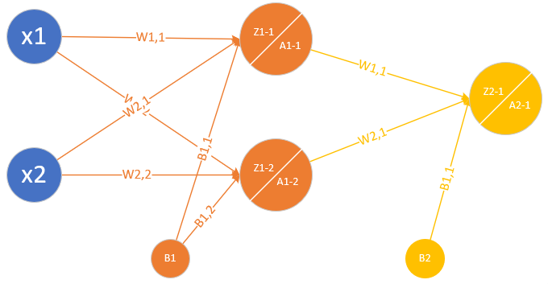

# 第五章 非线性分类
## 一、多入单出双层——非线性二分类
 #### 1. 定义神经网络结构
   
   - 输入层两个特征值x1, x2
  $$X=\begin{pmatrix}
    x_1 & x_2
  \end{pmatrix}$$
- 隐层2x2的权重矩阵W1
$$W1=\begin{pmatrix}
    w^1_{11} & w^1_{12} \\
    w^1_{21} & w^1_{22} 
  \end{pmatrix}$$
- 隐层1x2的偏移矩阵B1
$$B1=\begin{pmatrix}
    b^1_{1} & b^1_{2}
  \end{pmatrix}$$
- 隐层由两个神经元构成
$$Z1=\begin{pmatrix}
  z^1_{1} & z^1_{2}
\end{pmatrix}$$
$$A1=\begin{pmatrix}
  a^1_{1} & a^1_{2}
\end{pmatrix}$$
- 输出层2x1的权重矩阵W2
$$W2=\begin{pmatrix}
    w^2_{11} \\
    w^2_{21}  
  \end{pmatrix}$$
- 输出层1x1的偏移矩阵B2
$$B2=\begin{pmatrix}
    b^2_{1}
  \end{pmatrix}$$
- 输出层有一个神经元使用Logisitc函数进行分类
$$Z2=\begin{pmatrix}
    z^2_{1}
  \end{pmatrix}$$
$$A2=\begin{pmatrix}
    a^2_{1}
  \end{pmatrix}$$
#### 2.向前计算
网络结构，有了前向计算图：

#### 第一层
- 线性计算
$$z^1_{1} = x_{1} w^1_{11} + x_{2} w^1_{21} + b^1_{1}$$
$$z^1_{2} = x_{1} w^1_{12} + x_{2} w^1_{22} + b^1_{2}$$
$$Z1 = X \cdot W1 + B1$$
- 激活函数
$$a^1_{1} = Sigmoid(z^1_{1})$$
$$a^1_{2} = Sigmoid(z^1_{2})$$
$$A1=\begin{pmatrix}
  a^1_{1} & a^1_{2}
\end{pmatrix}$$
#### 第二层
- 线性计算
$$z^2_1 = a^1_{1} w^2_{11} + a^1_{2} w^2_{21} + b^2_{1}$$
$$Z2 = A1 \cdot W2 + B2
$$
- 分类函数
$$a^2_1 = Logistic(z^2_1)$$
$$A2 = Logistic(Z2)$$
## 二、实现逻辑异或门
1. 准备数据
2. 测试函数
3. 运行结果\
   损失函数曲线和准确率曲线图
   
## 三、实现双弧形二分类
#### 主过程代码

```Python
import numpy as np

from HelperClass2.DataReader import *
from HelperClass2.HyperParameters2 import *
from HelperClass2.NeuralNet2 import *

train_data_name = "../../Data/ch10.train.npz"
test_data_name = "../../Data/ch10.test.npz"

if __name__ == '__main__':
    dataReader = DataReader(train_data_name, test_data_name)
    dataReader.ReadData()
    dataReader.NormalizeX()
    dataReader.Shuffle()
    dataReader.GenerateValidationSet()

    n_input = dataReader.num_feature
    n_hidden = 2
    n_output = 1
    eta, batch_size, max_epoch = 0.1, 5, 10000
    eps = 0.08

    hp = HyperParameters2(n_input, n_hidden, n_output, eta, max_epoch, batch_size, eps, NetType.BinaryClassifier, InitialMethod.Xavier)
    net = NeuralNet2(hp, "Arc_221")
    net.train(dataReader, 5, True)
    net.ShowTrainingTrace()
    
```
#### 运行结果
 损失函数曲线和准确率曲线图
   
## 四、总结
在第三章中学习了线性分类，在这一章中，学习了更复杂的分类问题，
异或问题是个简单的二分类问题，因为毕竟只有4个样本数据，所以用更复杂的数据样本来学习非线性多分类问题，并理解其工作原理。数据集的使用，是深度学习的一个基本技能，开发集、验证集、测试集，合理地使用才能得到理想的泛化能力强的模型。