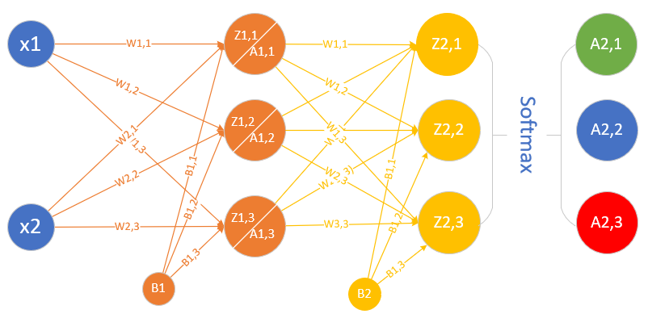
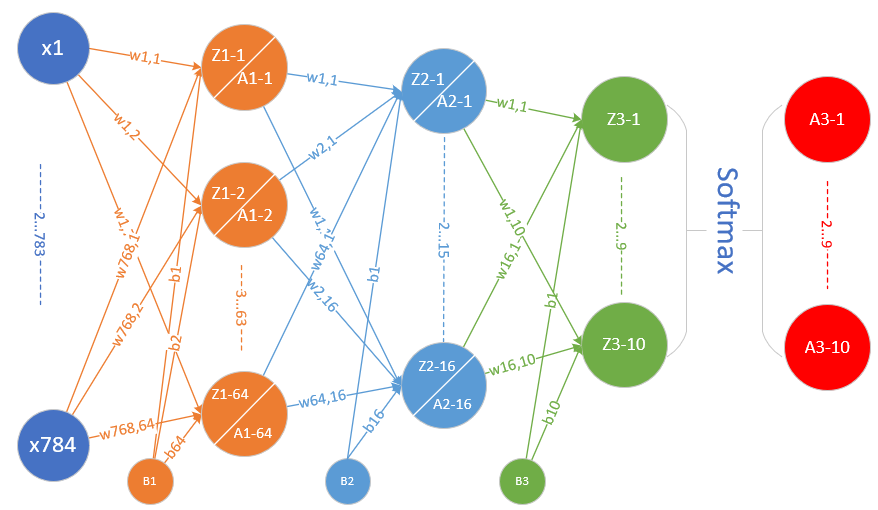
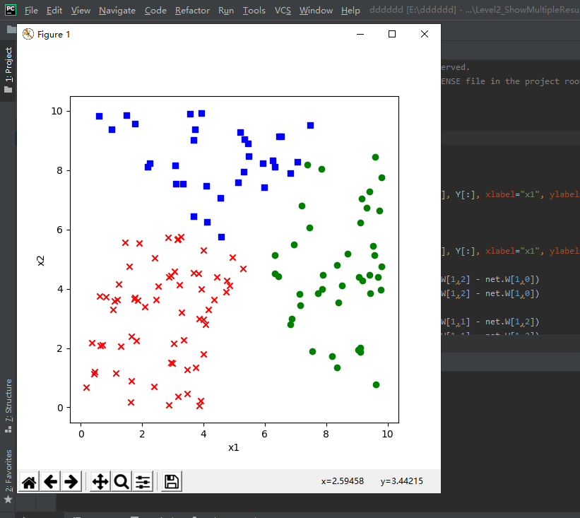

# 第6章 非线性分类
## 一、多入多出双层——非线性多分类
### 1. 定义神经网络结构

- 输入层两个特征值x1, x2
$$x=
\begin{pmatrix}
    x_1 & x_2
\end{pmatrix}$$
- 隐层2x3的权重矩阵W1
$$W1=\begin{pmatrix}
    w^1_{11} & w^1_{12} & w^1_{13} \\
    w^1_{21} & w^1_{22} & w^1_{23}
\end{pmatrix}$$
- 隐层1x3的偏移矩阵B1
$$B1=\begin{pmatrix}
    b^1_1 & b^1_2 & b^1_3 
\end{pmatrix}$$
- 隐层由两个神经元构成
- 输出层3x3的权重矩阵W2
$$W2=\begin{pmatrix}
    w^2_{11} & w^2_{12} & w^2_{13} \\
    w^2_{21} & w^2_{22} & w^2_{23} \\
    w^2_{31} & w^2_{32} & w^2_{33} 
\end{pmatrix}$$
- 输出层1x1的偏移矩阵B2
$$B2=\begin{pmatrix}
    b^2_1 & b^2_2 & b^2_3 
  \end{pmatrix}$$
- 输出层有3个神经元使用Softmax函数进行分类
### 2. 前向计算

#### 第一层
- 线性计算
$$z^1_1 = x_1 w^1_{11} + x_2 w^1_{21} + b^1_1$$
$$z^1_2 = x_1 w^1_{12} + x_2 w^1_{22} + b^1_2$$
$$z^1_3 = x_1 w^1_{13} + x_2 w^1_{23} + b^1_3$$
$$Z1 = X \cdot W1 + B1$$
- 激活函数
$$a^1_1 = Sigmoid(z^1_1) $$
$$a^1_2 = Sigmoid(z^1_2) $$
$$a^1_3 = Sigmoid(z^1_3) $$
$$A1 = Sigmoid(Z1)$$
#### 第二层
- 线性计算
$$z^2_1 = a^1_1 w^2_{11} + a^1_2 w^2_{21} + a^1_3 w^2_{31} + b^2_1$$
$$z^2_2 = a^1_1 w^2_{12} + a^1_2 w^2_{22} + a^1_3 w^2_{32} + b^2_2$$
$$z^2_3 = a^1_1 w^2_{13} + a^1_2 w^2_{23} + a^1_3 w^2_{33} + b^2_3$$
$$Z2 = A1 \cdot W2 + B2$$
- 分类函数
$$a^2_1 = {e^{z^2_1} \over e^{z^2_1} + e^{z^2_2} + e^{z^2_3}}$$
$$a^2_2 = {e^{z^2_2} \over e^{z^2_1} + e^{z^2_2} + e^{z^2_3}}
$$
$$a^2_3 = {e^{z^2_3} \over e^{z^2_1} + e^{z^2_2} + e^{z^2_3}}
$$
$$A2 = Softmax(Z2)$$
#### 损失函数
使用多分类交叉熵损失函数：
$$loss = -(y_1 \ln a^2_1 + y_2 \ln a^2_2 + y_3 \ln a^2_3)$$
$$J(w,b) = -{1 \over m} \sum^m_{i=1} \sum^n_{j=1} y_{ij} \ln (a^2_{ij})$$
m为样本数，n为类别数。
## 二、多入多出三层——多变量线性分类
### 1.三层神经网络实现
#### 定义神经网络

#### 多分类结果可视化：

## 三、总结
   上节课学习了非线性分类里的二分类，这节课学习的是更复杂的非线性多分类和多变量线性分类。非线性分类就是用一个“超曲面”或者多个超平（曲）面的组合将正、负样本隔离开，如：\
  （1）二维平面上的正、负样本用一条曲线或折线来进行分类；\
  （2）三维立体空间内的正、负样本用一个曲面或者折面来进行分类；\
  （3）N维空间内的正负样本用一个超曲面来进行分类。\
   非线性分类器拟合能力强但是编程实现较复杂。
  
