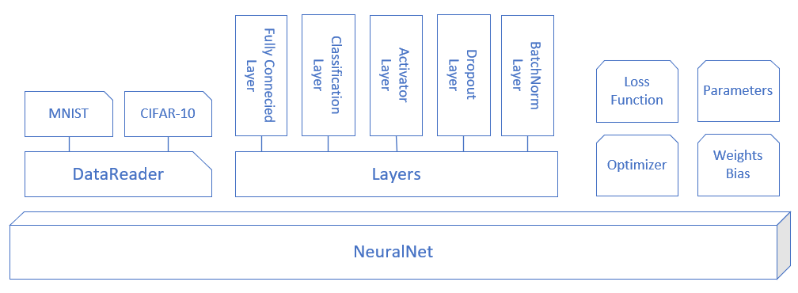
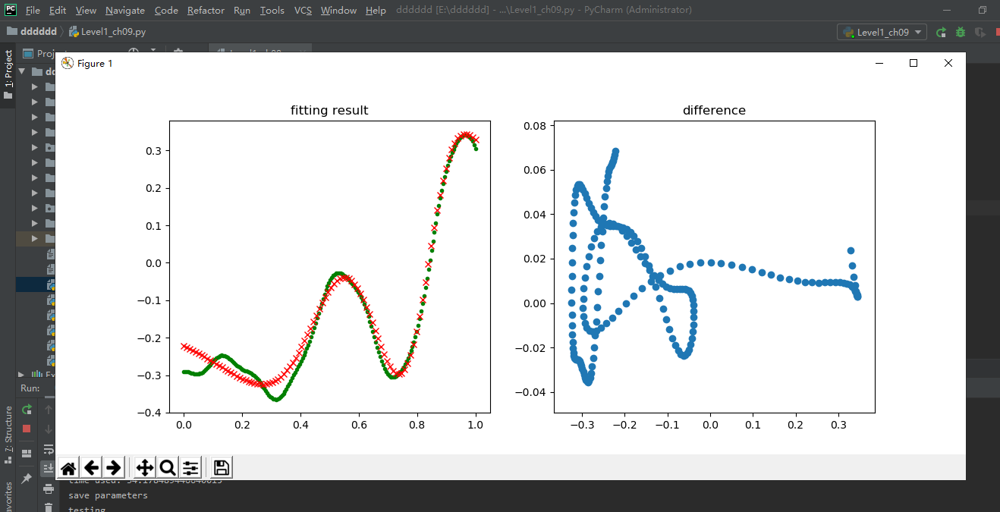

# 第七步 深度神经网络（DNN）
## 搭建深度神经网络框架
1. 框架结构图
 
2. NeuralNet:来包装基本的神经网络结构和功能
    + Layers：神经网络各层的容器，按添加顺序维护一个列表。
    + Parameters：基本参数（包括普参和超参）
    + Loss Function：提供计算损失函数值，存储历史记录并最后绘图的功能
    + LayerManagement()：添加神经网络层
    + ForwardCalculation():调用各层的前向计算方法
    + BackPropagation()：调用各层的反向传播方法
    + PreUpdateWeights() ：预更新各层的权重参数
    + UpdateWeights()：更新各层的权重参数
    + Train()：训练
    + SaveWeights()：保存各层的权重参数
    + LoadWeights()：加载各层的权重参数
3. Layer：是一个抽象类，以及更加需要增加的实际类
    + 包括：
        + Fully Connected Layer
        + Classification Layer
        + Activator Layer
        + Dropout Layer
        + Batch Norm Layer
        + Convolution Layer（将来会包括）
        + Max Pool Layer（将来会包括）
    + 每个Layer都包括以下基本方法：
        + ForwardCalculation():调用各层的前向计算方法
        + BackPropagation()：调用各层的反向传播方法
        + PreUpdateWeights() ：预更新各层的权重参数
        + UpdateWeights()：更新各层的权重参数
        + SaveWeights()：保存各层的权重参数
        + LoadWeights()：加载各层的权重参数
4. Activator Layer：激活函数和分类函数
    + Identity：直传函数，即没有激活处理
    + Sigmoid：S型函数，也成S型生长曲线。由于其单增以及反函数单增等性质，在信息科学中，Sigmoid函数常被用作神经网络的阈值函数。
    + Tanh:双曲函数中的一个，tanh()双曲正切。
    + Relu：线性整流函数，又称修正线性单元。
5. Classification Layer：分类函数
    + Sigmoid二分类
    + Softmax多分类
6. Parameters：基本神经网络运行参数：
    + 学习率
    + 最大epoch
    + batch size
    + 损失函数定义
    + 初始化方法
    + 优化器类型
    + 停止条件
    + 正则类型和条件
7. LossFunction：损失函数及帮助方法（之前有学过）
    + 均方差函数
    + 交叉熵函数二分类
    + 交叉熵函数多分类
    + 记录损失函数
    + 显示损失函数历史记录
    + 获得最小函数值时的权重参数
8. Optimizer：优化器
    + SGD：随机梯度下降。以单个样本为训练单元训练速度会很快，但牺牲了向量化运算所带来的便利性，在较大数据集上效率并不高。
    + Momentum：带动量的梯度下降。带动量的梯度下降考虑历史梯度的加权平均值作为速率进行优化。
    + Nag:
    + AdaGrad
    + AdaDelta
    + RMSProp
    + Adam:是在带动量的梯度下降法的基础上融合了一种称为 RMSprop（加速梯度下降）的算法而成的。
9. WeightsBias:权重矩阵，仅供全连接层使用
   + 初始化：
        + Zero, Normal, MSRA (HE), Xavier
        + 保存初始化值
        + 加载初始化值
    + Pre_Update：预更新
    + Update：更新
    + Save：保存训练结果值
    + Load：加载训练结果值
10. DataReader 样本数据读取器
    + ReadData：从文件中读取数据
    + NormalizeX：归一化样本值
    + NormalizeY：归一化标签值
    + GetBatchSamples：获得批数据
    + ToOneHot：标签值变成OneHot编码用于多分类
    + ToZeorOne：标签值变成0/1编码用于二分类
    + Shuffle：打乱样本顺序
    + MnistImageDataReader：读取MNIST数据（从中派生的数据读取器）
    + CifarImageReader：读取Cifar10数据（从中派生的数据读取器）
## 回归测试——万能近似定理
1. 搭建模型：一个双层的神经网络，第一层后面接一个Sigmoid激活函数，第二层直接输出拟合数据。
2. 超参数说明：
    + 输入层1个神经元，因为只有一个x值
    + 隐层4个神经元，对于此问题来说应该是足够了，因为特征很少
    + 输出层1个神经元，因为是拟合任务
    + 学习率=0.5
    + 最大epoch=10000轮
    + 批量样本数=10
    + 拟合网络类型
    + Xavier初始化
    + 绝对损失停止条件=0.001 
3. 训练结果：代码测试：
    + 
    + 
## 双弧形非线性二分类
+ 搭建模型：同样是一个双层神经网络，但是最后一层要接一个Logistic二分类函数来完成二分类任务。
+ 超参数说明：
    + 输入层神经元数为2
    + 隐层的神经元数为3，使用Sigmoid激活函数
    + 由于是二分类任务，所以输出层只有一个神经元，用Logistic做二分类函数
    + 最多训练1000轮
    + 批大小=5
    + 学习率=0.1
    + 绝对误差停止条件=0.02
+ 代码运行结果：
    + 
    + 
## 总结
  NN是神经网络，其基本结构：
  
神经网络第一层为input层，最后一层为output层，而在input和output中间的层则被称为hidden层.\
DNN就是深度神经网络，神经网络是基于感知机的扩展，而DNN可以理解为有很多隐藏层的神经网络。多层神经网络和深度神经网络DNN其实也是指的一个东西，DNN有时也叫做多层感知机（Multi-Layer perceptron,MLP）。从DNN按不同层的位置划分，DNN内部的神经网络层可以分为三类，输入层，隐藏层和输出层,如下图示例，一般来说第一层是输入层，最后一层是输出层，而中间的层数都是隐藏层。