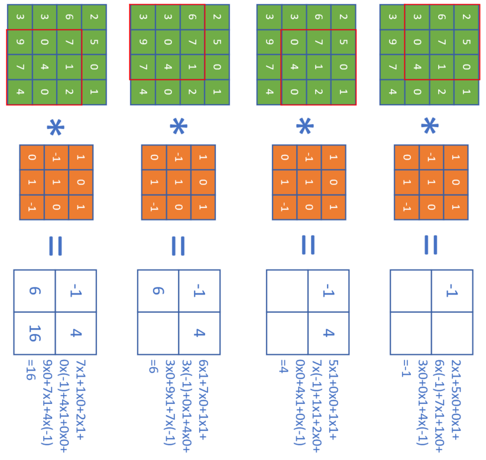
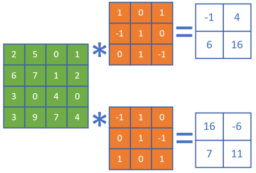
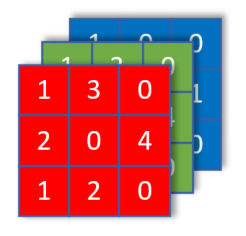

# 第八步 卷积神经网络
## 一、卷积神经网络
### 1. 卷积神经网络的功能
卷积神经网络（ConvNet or CNN)是神经网络的类型之一，在图像识别和分类领域中取得了非常好的效果，比如识别人脸、物体、交通标识等，这就为机器人、自动驾驶等应用提供了坚实的技术基础。
### 2.卷积神经网络的结构
#### 典型结构
  
#### 层级结构
 1. 原始的输入是一张图片，可以是彩色的，也可以是灰度的或黑白的。这里假设是只有一个通道的图片，目的是识别0~9的手写体数字；
2. 第一层卷积，我们使用了4个卷积核，得到了4张feature map；激活函数层没有单独画出来，这里我们紧接着卷积操作使用了Relu激活函数；
3. 第二层是池化，使用了Max Pooling方式，把图片的高宽各缩小一倍，但仍然是4个feature map；
4. 第三层卷积，我们使用了4x6个卷积核，其中4对应着输入通道，6对应着输出通道，从而得到了6张feature map，当然也使用了Relu激活函数；
5. 第四层再次做一次池化，现在得到的图片尺寸只是原始尺寸的四分之一左右；
6. 第五层把第四层的6个图片展平成一维，成为一个fully connected层；
7. 第六层再接一个小一些的fully connected层；
8. 最后接一个softmax函数，判别10个分类。\
在一个典型的卷积神经网络中，会至少包含以下几个层：
- 卷积层
- 激活函数层
- 池化层
- 全连接分类层
### 卷积核的作用
+ 锐化：如果一个像素点比周围像素点亮，则此算子会令其更亮
+ 检测竖边：检测出了十字线中的竖线，由于是左侧和右侧分别检查一次，所以得到两条颜色不一样的竖线
+ 周边:把周边增强，把同色的区域变弱，形成大色块
+ SObel-Y:纵向亮度差分可以检测出横边，与横边检测不同的是，它可以使得两条横线具有相同的颜色，具有分割线的效果
+ Identity:中心为1四周为0的过滤器，卷积后与原图相同
+ 横边检测：检测出了十字线中的横线，由于是上侧和下侧分别检查一次，所以得到两条颜色不一样的横线
+ 模糊：通过把周围的点做平均值计算而“杀富济贫”造成模糊效果
+ Sobel-X：横向亮度差分可以检测出竖边，与竖边检测不同的是，它可以使得两条竖线具有相同的颜色，具有分割线的效果
+ 浮雕：形成大理石浮雕般的效果
## 二、卷积的向前计算
### 1. 卷积的数学定义
* 连续定义
  $$h(x)=(f*g)(x) = \int_{-\infty}^{\infty} f(t)g(x-t)dt $$
卷积与傅里叶变换有着密切的关系。利用这点性质，即两函数的傅里叶变换的乘积等于它们卷积后的傅里叶变换，能使傅里叶分析中许多问题的处理得到简化。
* 离散定义
$$h(x) = (f*g)(x) = \sum^{\infty}_{t=-\infty} f(t)g(x-t)$$ 
### 2.卷积实例
#### 1.单入单出的二维卷积

#### 2.单入多出的升维卷积

#### 3.多入单出的降维卷积

#### 4.多入多出的同维卷积

## 三、总结
卷积网络与常规神经网络不同，卷积神经网络的各层中的神经元是3维排列的：宽度、高度和深度。其中的宽度和高度是很好理解的，因为本身卷积就是一个二维模板，但是在卷积神经网络中的深度指的是激活数据体的第三个维度，而不是整个网络的深度，整个网络的深度指的是网络的层数。