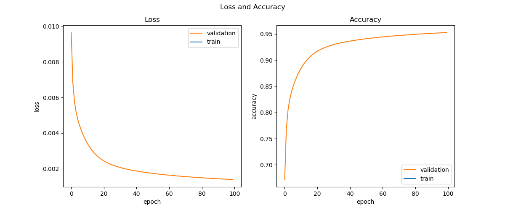
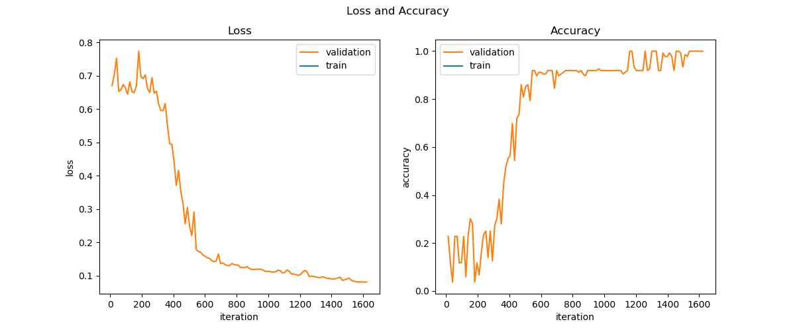
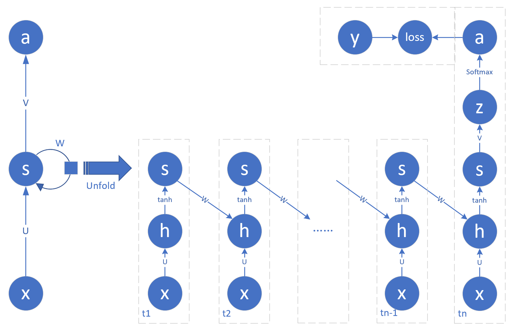
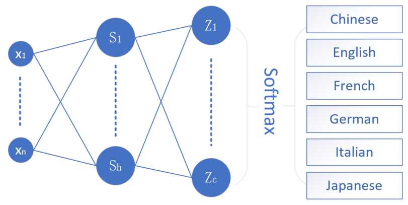

# 第九步 循环神经网络
## 一、初步认识的RNN
1. 搭建网络\
在验证万能近似定理时，学习了曲线拟合问题，即带有一个隐层和非线性激活函数的前馈神经网络，可以拟合任意曲线。但是在这个问题里，有几点不同：
* 不是连续值，而是时间序列的离散值
* 完全随机的离散值，而不是满足一定的规律
* 测试数据不在样本序列里，完全独立
2. 训练代码运行结果

## 二、更多时序的RNN
1. 搭建网络
   
含有4个时序的网络结构图\
最左侧的简易结构是通常的RNN的画法，而右侧是其展开后的细节，t1是二进制数的最低位，但是由于样本倒序了，所以，现在的t1就是样本的第0个单元的值。并且由于涉及到被减数和减数，所以每个样本的第0个单元（时间步）都有两个特征值，其它3个单元也一样。
   
   W权重矩阵的展开图\
   U和V都比较容易理解，而W是一个连接相邻时序的参数矩阵，并且共享相同的参数值，这一点在刚开始接触RNN时不太容易理解。在每个时间步的结构中，多出来一个a，是从z经过Logistic函数生成的。二分类问题的损失函数使用交叉熵函数，这与我们在DNN中学习的二分类问题完全相同。
2. 训练过程曲线
     
## 三、不定长时序的网络
1. 搭建网络
   
    
不定长时序的网络

   
    
某个名字的最后一个时序的展开图 

## 四、总结
   循环神经网络（Recurrent Neural Network, RNN）是一类以序列数据为输入，在序列的演进方向进行递归且所有节点（循环单元）按链式连接的递归神经网络。循环神经网络具有记忆性、参数共享并且图灵完备，因此在对序列的非线性特征进行学习时具有一定优势。循环神经网络在自然语言处理，例如语音识别、语言建模、机器翻译等领域有应用，也被用于各类时间序列预报。引入了卷积神经网络构筑的循环神经网络可以处理包含序列输入的计算机视觉问题。
