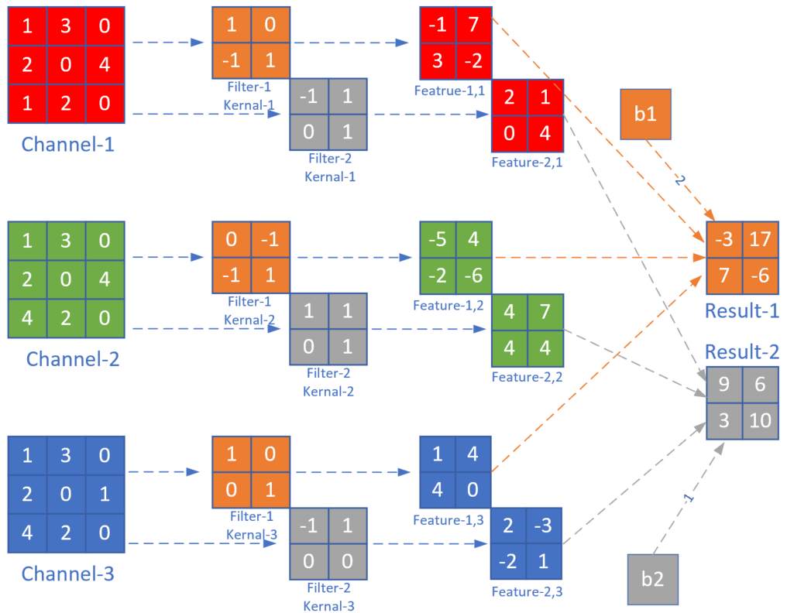
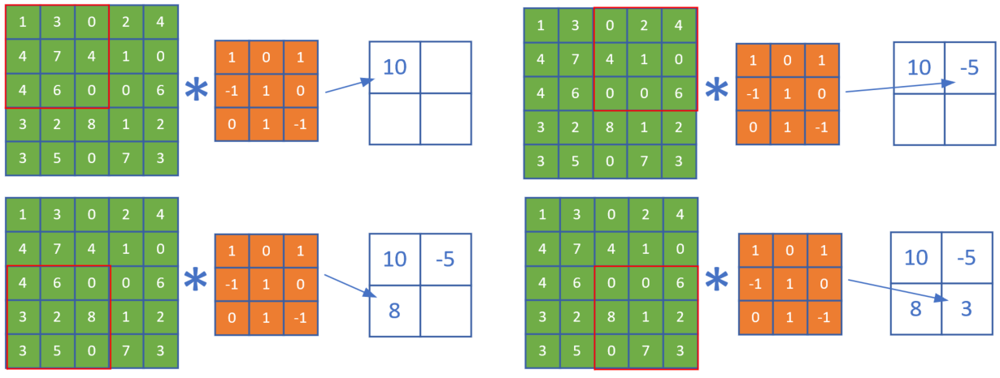
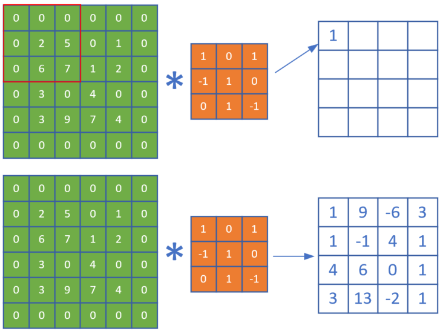

# 王振宇 Step8总结
>## 卷积神经网络
## 卷积网络的典型结构

在一个典型的卷积神经网络中，会至少包含以下几个层：

- 卷积层
- 激活函数层
- 池化层
- 全连接分类层

>### 卷积核的作用

卷积核其实就是一个小矩阵，类似这样：

```
1.1  0.23  -0.45
0.1  -2.1   1.24
0.74 -1.32  0.01
```

这是一个3x3的卷积核，还会有1x1、5x5、7x7、9x9、11x11的卷积核。在卷积层中，我们会用输入数据与卷积核相乘，得到输出数据，就类似全连接层中的Weights一样，所以卷积核里的数值，也是通过反向传播的方法学习到的。

### 卷积后续的运算

1. 注意图一是原始图片，用cv2读取出来的图片，其顺序是反向的，即：

- 第一维是高度
- 第二维是宽度
- 第三维是彩色通道数，但是其顺序为BGR，而不是常用的RGB

2. 我们对原始图片使用了一个3x1x3x3的卷积核，因为原始图片为彩色图片，所以第一个维度是3，对应RGB三个彩色通道；我们希望只输出一张feature map，以便于说明，所以第二维是1；我们使用了3x3的卷积核，用的是sobel x算子。所以图二是卷积后的结果。

3. 图三做了一层Relu激活计算，把小于0的值都去掉了，只留下了一些边的特征。

4. 图四是图三的四分之一大小，虽然图片缩小了，但是特征都没有丢失，反而因为图像尺寸变小而变得密集，亮点的密度要比图三大而粗。

>### 卷积的前向计算

### 卷积的数学定义
#### 连续定义

$$h(x)=(f*g)(x) = \int_{-\infty}^{\infty} f(t)g(x-t)dt \tag{1}$$

卷积与傅里叶变换有着密切的关系。利用这点性质，即两函数的傅里叶变换的乘积等于它们卷积后的傅里叶变换，能使傅里叶分析中许多问题的处理得到简化。

#### 离散定义

$$h(x) = (f*g)(x) = \sum^{\infty}_{t=-\infty} f(t)g(x-t) \tag{2}$$


#### （1）单入多出的升维卷积

原始输入是一维的图片，但是我们可以用多个卷积核分别对其计算，从而得到多个特征输出。如下图所示：


一张4x4的图片，用两个卷积核并行地处理，输出为2个2x2的图片。在训练过程中，这两个卷积核会完成不同的特征学习。

#### （2）多入单出的降维卷积

一张图片，通常是彩色的，具有红绿蓝三个通道。我们可以有两个选择来处理：


1. 变成灰度的，每个像素只剩下一个值，就可以用二维卷积
2. 对于三个通道，每个通道都使用一个卷积核，分别处理红绿蓝三种颜色的信息

显然第2种方法可以从图中学习到更多的特征，于是出现了三维卷积，即有三个卷积核分别对应书的三个通道，三个子核的尺寸是一样的，比如都是2x2，这样的话，这三个卷积核就是一个3x2x2的立体核，称为过滤器Filter，所以称为三维卷积。


在上图中，每一个卷积核对应着左侧相同颜色的输入通道，三个过滤器的值并不一定相同。对三个通道各自做卷积后，得到右侧的三张特征图，然后在按照原始值不加权地相加在一起，得到最右侧的黑色特征图，这张图里面已经把三种颜色的特征混在一起了，所以画成了黑色。

虽然输入图片是多个通道的，或者说是三维的，但是在相同数量的过滤器的计算后，相加在一起的结果是一个通道，即2维数据，所以称为降维。这当然简化了对多通道数据的计算难度，但同时也会损失多通道数据自带的颜色信息。

#### （3）多入多出的同维卷积

在上面的例子中，是一个过滤器Filter内含三个卷积核Kernal。我们假设有一个彩色图片为3x3的，如果有两组3x2x2的卷积核的话，会做什么样的卷积计算？看下图：


第一个过滤器Filter-1为棕色所示，它有三卷积核(Kernal)，命名为Kernal-1，Keanrl-2，Kernal-3，分别在红绿蓝三个输入通道上进行卷积操作，生成三个2x2的输出Feature-1,n。然后三个Feature-1,n相加，并再加上b1偏移值，形成最后的棕色输出Result-1。

对于灰色的过滤器Filter-2也是一样，先生成三个Feature-2,n，然后相加再加b2，最后得到Result-2。

之所以Feature-m,n还用红绿蓝三色表示，是因为在此时，它们还保留着红绿蓝三种色彩的各自的信息，一旦相加后得到Result，这种信息就丢失了。

#### （4）步长 stride

前面的例子中，每次计算后，卷积核会向右或者向下移动一个单元，即步长stride = 1。而在下面这个卷积操作中，卷积核每次向右或向下移动两个单元，即stride = 2。



在后续的步骤中，由于每次移动两格，所以最终得到一个2x2的图片。

#### （5）填充 padding

如果原始图为4x4，用3x3的卷积核进行卷积后，目标图片变成了2x2。如果我们想保持目标图片和原始图片为同样大小，该怎么办呢？一般我们会向原始图片周围填充一圈0，然后再做卷积。如下图：



#### （6） 输出结果

综合以上所有情况，可以得到卷积后的输出图片的大小的公式：

$$
H_{Output}= {H_{Input} - H_{Kernal} + 2Padding \over Stride} + 1
$$

$$
W_{Output}= {W_{Input} - W_{Kernal} + 2Padding \over Stride} + 1
$$

>### 卷积前向计算代码实现  

卷积核，实际上和全连接层一样，是权重矩阵加偏移向量的组合，区别在于全连接层中的权重矩阵是二维的，偏移矩阵是列向量，而卷积核的权重矩阵是四维的，偏移矩阵是也是列向量。

```Python
class ConvWeightsBias(WeightsBias_2_1):
    def __init__(self, output_c, input_c, filter_h, filter_w, init_method, optimizer_name, eta):
        self.FilterCount = output_c
        self.KernalCount = input_c
        self.KernalHeight = filter_h
        self.KernalWidth = filter_w
        ...

    def Initialize(self, folder, name, create_new):
        self.WBShape = (self.FilterCount, self.KernalCount, self.KernalHeight, self.KernalWidth)        
        ...

    def CreateNew(self):
        self.W = ConvWeightsBias.InitialConvParameters(self.WBShape, self.init_method)
        self.B = np.zeros((self.FilterCount, 1))
...
```


以上图为例，各个维度的数值如下：

- FilterCount=2，第一维，过滤器数量，对应输出通道数。
- KernalCount=3，第二维，卷积核数量，对应输入通道数。两个Filter里面的Kernal数必须相同。
- KernalHeight=5，KernalWidth=5，卷积核的尺寸，第三维和第四维。同一组WeightsBias里的卷积核尺寸必须相同。

**[卷积前向运算的实现 - 方法1]**

```Python
class ConvLayer(CLayer):
    def forward(self, x, train=True):
        self.x = x
        self.batch_size = self.x.shape[0]
        # 如果有必要的话，先对输入矩阵做padding
        if self.padding > 0:
            self.padded = np.pad(...)
        else:
            self.padded = self.x
        #end if
        self.z = conv_4d(...)
        return self.z
```
**[卷积前向运算的实现 - 方法2]**
代码：

```Python
    # dry run
    output2 = jit_conv_4d(x, wb.W, wb.B, output_height, output_width, stride)
    # run
    s2 = time.time()
    for i in range(10):
        output2 = jit_conv_4d(x, wb.W, wb.B, output_height, output_width, stride)
    e2 = time.time()
    print("Time used for Numba:", e2 - s2)
```
**[卷积前向运算的实现 - 方法3]**

```Python
    def forward_img2col(self, x, train=True):
        self.x = x
        self.batch_size = self.x.shape[0]
        assert(self.x.shape == (self.batch_size, self.InC, self.InH, self.InW))
        self.col_x = img2col(x, self.FH, self.FW, self.stride, self.padding)
        self.col_w = self.WB.W.reshape(self.OutC, -1).T
        self.col_b = self.WB.B.reshape(-1, self.OutC)
        out1 = np.dot(self.col_x, self.col_w) + self.col_b
        out2 = out1.reshape(batch_size, self.OutH, self.OutW, -1)
        self.z = np.transpose(out2, axes=(0, 3, 1, 2))
        return self.z
```

>### 计算反向传播的梯度矩阵

正向公式：

$$Z = W*A+b \tag{0}$$

其中，W是卷积核，*表示卷积（互相关）计算，A为当前层的输入项，b是偏移（未在图中画出），Z为当前层的输出项，但尚未经过激活函数处理。

我们举一个具体的例子便于分析。下面是正向计算过程：

### 有多个卷积核时的梯度计算
有多个卷积核也就意味着有多个输出通道。

也就是14.1中的升维卷积：


### 步长不为1时的梯度矩阵还原


**[代码实现]**

些模块化的计算放到独立的函数中，用numba在运行时编译加速。
```Python
    def backward_numba(self, delta_in, flag):
        # 如果正向计算中的stride不是1，转换成是1的等价误差数组
        dz_stride_1 = expand_delta_map(delta_in, ...)
        # 计算本层的权重矩阵的梯度
        self._calculate_weightsbias_grad(dz_stride_1)
        # 由于输出误差矩阵的尺寸必须与本层的输入数据的尺寸一致，所以必须根据卷积核的尺寸，调整本层的输入误差矩阵的尺寸
        (pad_h, pad_w) = calculate_padding_size(...)
        dz_padded = np.pad(dz_stride_1, ...)
        # 计算本层输出到下一层的误差矩阵
        delta_out = self._calculate_delta_out(dz_padded, flag)
        #return delta_out
        return delta_out, self.WB.dW, self.WB.dB

    # 用输入数据乘以回传入的误差矩阵,得到卷积核的梯度矩阵
    def _calculate_weightsbias_grad(self, dz):
        self.WB.ClearGrads()
        # 先把输入矩阵扩大，周边加0
        (pad_h, pad_w) = calculate_padding_size(...)
        input_padded = np.pad(self.x, ...)
        # 输入矩阵与误差矩阵卷积得到权重梯度矩阵
        (self.WB.dW, self.WB.dB) = calcalate_weights_grad(...)
        self.WB.MeanGrads(self.batch_size)

    # 用输入误差矩阵乘以（旋转180度后的）卷积核
    def _calculate_delta_out(self, dz, layer_idx):
        if layer_idx == 0:
            return None
        # 旋转卷积核180度
        rot_weights = self.WB.Rotate180()
        # 定义输出矩阵形状
        delta_out = np.zeros(self.x.shape)
        # 输入梯度矩阵卷积旋转后的卷积核，得到输出梯度矩阵
        delta_out = calculate_delta_out(dz, ..., delta_out)

        return delta_out
```
**[方法二]**
#### 代码实现

```Python
    def backward_col2img(self, delta_in, layer_idx):
        OutC, InC, FH, FW = self.WB.W.shape
        # 误差矩阵变换
        delta_in_2d = np.transpose(delta_in, axes=(0,2,3,1)).reshape(-1, OutC)
        # 计算Bias的梯度
        self.WB.dB = np.sum(delta_in_2d, axis=0, keepdims=True).T / self.batch_size
        # 计算Weights的梯度
        dW = np.dot(self.col_x.T, delta_in_2d) / self.batch_size
        # 转换成卷积核的原始形状
        self.WB.dW = np.transpose(dW, axes=(1, 0)).reshape(OutC, InC, FH, FW)# 计算反向传播误差矩阵
        dcol = np.dot(delta_in_2d, self.col_w.T)
        # 转换成与输入数据x相同的形状
        delta_out = col2img(dcol, self.x.shape, FH, FW, self.stride, self.padding)
        return delta_out, self.WB.dW, self.WB.dB
```

>###  池化层

池化方法分为两种，一种是最大值池化 Max Pooling，一种是平均值池化 Mean/Average Pooling。


>#### 池化层的训练

我们假设下面的2x2的图片中，$[[1,2],[3,4]]$是上一层网络回传的残差，那么：

- 对于最大值池化，残差值会回传到当初最大值的位置上（请对照图14.3.1），而其它三个位置的残差都是0。
- 对于平均值池化，残差值会平均到原始的4个位置上。


直观看是这样的，严格的数学推导过程以下图为例：


#### Max Pooling

正向公式：

$$w = max(a,b,e,f)$$

反向公式（假设Input Layer中的最大值是b）：

$${\partial w \over \partial a} = 0$$
$${\partial w \over \partial b} = 1$$
$${\partial w \over \partial e} = 0$$
$${\partial w \over \partial f} = 0$$

因为a,e,f对w都没有贡献，所以偏导数为0，只有b有贡献，偏导数为1。

$$\delta_a = {\partial J \over \partial a} = {\partial J \over \partial w} {\partial w \over \partial a} = 0$$

$$\delta_b = {\partial J \over \partial b} = {\partial J \over \partial w} {\partial w \over \partial b} = \delta_w \cdot 1 = \delta_w$$

$$\delta_e = {\partial J \over \partial e} = {\partial J \over \partial w} {\partial w \over \partial e} = 0$$

$$\delta_f = {\partial J \over \partial f} = {\partial J \over \partial w} {\partial w \over \partial f} = 0$$

#### Mean Pooling

正向公式：

$$w = \frac{1}{4}(a+b+e+f)$$

反向公式（假设Layer-1中的最大值是b）：

$${\partial w \over \partial a} = \frac{1}{4}$$
$${\partial w \over \partial b} = \frac{1}{4}$$
$${\partial w \over \partial e} = \frac{1}{4}$$
$${\partial w \over \partial f} = \frac{1}{4}$$

因为a,b,e,f对w都有贡献，所以偏导数都为1：

$$\delta_a = {\partial J \over \partial a} = {\partial J \over \partial w} {\partial w \over \partial a} = \frac{1}{4}\delta_w$$

$$\delta_b = {\partial J \over \partial b} = {\partial J \over \partial w} {\partial w \over \partial b} = \frac{1}{4}\delta_w$$

$$\delta_e = {\partial J \over \partial e} = {\partial J \over \partial w} {\partial w \over \partial e} = \frac{1}{4}\delta_w$$

$$\delta_f = {\partial J \over \partial f} = {\partial J \over \partial w} {\partial w \over \partial f} = \frac{1}{4}\delta_w$$

无论是max pooling还是mean pooling，都没有要学习的参数，所以，在卷积网络的训练中，池化层需要做的只是把误差项向后传递，不需要计算任何梯度。

**[代码实现]**
## 方法一
按照标准公式来实现池化的正向和反向代码。

```Python
class PoolingLayer(CLayer):
    def forward_numba(self, x, train=True):
        self.x = x
        self.batch_size = self.x.shape[0]
        self.z = jit_maxpool_forward(...)
        return self.z

    def backward_numba(self, delta_in, layer_idx):
        delta_out = jit_maxpool_backward(...)
        return delta_out
```
## 方法二
原始数据先做img2col变换，然后做一次np.max(axis=1)的max计算，会大大增加速度，然后把结果reshape成正确的矩阵即可。做一次大矩阵的max计算，比做4次小矩阵计算要快很多。

```Python
class PoolingLayer(CLayer):
    def forward_img2col(self, x, train=True):
        self.x = x
        N, C, H, W = x.shape
        col = img2col(x, self.pool_height, self.pool_width, self.stride, 0)
        col_x = col.reshape(-1, self.pool_height * self.pool_width)
        self.arg_max = np.argmax(col_x, axis=1)
        out1 = np.max(col_x, axis=1)
        out2 = out1.reshape(N, self.output_height, self.output_width, C)
        self.z = np.transpose(out2, axes=(0,3,1,2))
        return self.z

    def backward_col2img(self, delta_in, layer_idx):
        dout = np.transpose(delta_in, (0,2,3,1))
        dmax = np.zeros((dout.size, self.pool_size))
        dmax[np.arange(self.arg_max.size), self.arg_max.flatten()] = dout.flatten()
        dmax = dmax.reshape(dout.shape + (self.pool_size,))
        dcol = dmax.reshape(dmax.shape[0] * dmax.shape[1] * dmax.shape[2], -1)
        dx = col2img(dcol, self.x.shape, self.pool_height, self.pool_width, self.stride, 0)
        return dx
```

