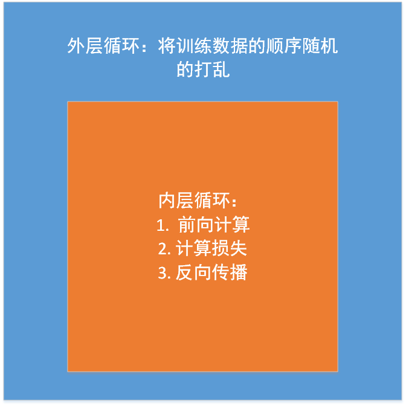
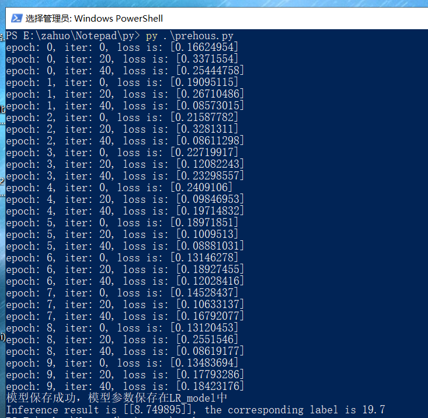

# python+paddlepaddle房价预测
## 陈子良 201702041

## 简要
倘若不使用框架来完成房价预测，则需要自己使用Numpy搭建线性回归模型，其中的代码还是较为复杂的。但是如果选择了一种框架，操作起来很有规律，也十分的容易。此次我使用的是百度的paddlepaddle框架完成。

## 步骤
1.  数据处理：读取数据 和 预处理操作
2.  模型设计：网络结构（假设）
3.  训练配置：优化器（寻解算法）
4.  训练过程：循环调用训练过程，包括前向计算 + 计算损失（优化目标) + 后向传播
5.  保存模型并测试：将训练好的模型保存

> 画出步骤图

## 1.数据处理
首先需要读取数据文件。
> 
> 该数据是来自百度AI studio中的。

每条数据包括14项，其中前面13项是影响因素，第14项是相应的房屋价格中位数。

    #处理代码
    datafile = 'housing.data'
    data = np.fromfile(datafile, sep=' ')
    feature_names = [ 'CRIM', 'ZN', 'INDUS', 'CHAS', 'NOX', 'RM', 'AGE', \
                      'DIS', 'RAD', 'TAX', 'PTRATIO', 'B', 'LSTAT', 'MEDV' ]
    feature_num = len(feature_names)

之后还需要将原始数据进行Reshape，变成[N, 14]这样的形状。将原数据集拆分成训练集和测试集，这里使用80%的数据做训练，20%的数据做测试，注意测试集和训练集必须是没有交集的。

## 2.模型设计
定义线性回归的网络结构，飞桨建议通过创建Python类的方式完成模型网络的定义。

1. 在类的初始化函数中定义每一层网络的实现函数，这里我们定义了一层全连接层FC。
2. 定义forward函数构建神经网络结构，实现前向计算过程，并返回预测结果，本例中返回的是房价预测结果。

**代码实现**

    class Regressor(fluid.dygraph.Layer):
    def __init__(self, name_scope):
        super(Regressor, self).__init__(name_scope)
        name_scope = self.full_name()
        # 定义一层全连接层，输出维度是1，激活函数为None，即不使用激活函数
        self.fc = FC(name_scope, size=1, act=None)
    
    # 网络的前向计算函数
    def forward(self, inputs):
        x = self.fc(inputs)
        return x

## 3.训练配置
训练配置包括：
1. 声明定义好的模型。
2. 加载训练数据和测试数据。
3. 设置优化算法和学习率，本次实验优化算法使用随机梯度下降SGD，学习率使用 0.01

        # 定义飞桨动态图的工作环境
        with fluid.dygraph.guard():
            # 声明定义好的线性回归模型
            model = Regressor("Regressor")
            # 开启模型训练模式
            model.train()
            # 加载数据
            training_data, test_data = load_data()
            # 定义优化算法，这里使用随机梯度下降-SGD
            # 学习率设置为0.01
            opt = fluid.optimizer.SGD(learning_rate=0.01)

在之前基于Python实现神经网络模型的案例中，为实现梯度下降编写了大量代码，而使用飞桨框架可以大大简化这个过程。

**注意：** 上述代码中，可以发现声明模型，定义优化器等都在with创建的fluid.dygraph.guard()上下文环境中进行，可以理解为with fluid.dygraph.guard()创建了飞桨动态图的工作环境，在该环境下完成模型声明、数据转换、以及模型训练等操作。

如图是实现逻辑与或非门的训练代码，确实是大大缩减了代码量，也更加容易理解了。

## 4. 训练过程

完成训练配置后即可启动训练过程。训练采用二层循环嵌套方式：
+ 内层循环负责整个数据集的一次遍历，遍历数据集采用分批次（batch）方式，假设数据集样本数量为1000，一个批次有10个样本，则遍历一次数据集的批次数量是1000/10=100，即内层循环需要循环100次；
+ 外层循环定义遍历数据集的次数，本次训练中外层循环10次，通过参数EPOCH_NUM设置；

**说明：** batch大小的选择会影响训练效果，batch过大会增大内存消耗，过小则每个batch的样本数据没有统计意义。本次训练数据集较小，我设置batch为10。

在每次内层循环都需要进行前向计算、损失函数计算和梯度反向传播三个步骤：
1. 前向计算即将一个批次的样本数据灌入网络中，计算输出结果。
2. 以前向计算结果和真实房价作为输入，通过损失函数square_error_cost计算出损失函数值（Loss）。
3. 执行梯度反向传播backward函数，即从后到前逐层计算每一层的梯度，并根据设置的优化算法更新参数（opt.minimize）。
4. 画出框架

    with dygraph.guard():
        EPOCH_NUM = 10   # 设置外层循环次数
        BATCH_SIZE = 10  # 设置batch大小
        
        # 定义外层循环
        for epoch_id in range(EPOCH_NUM):
            # 在每轮迭代开始之前，将训练数据的顺序随机的打乱
            np.random.shuffle(training_data)
            # 将训练数据进行拆分，每个batch包含10条数据
            mini_batches = [training_data[k:k+BATCH_SIZE] for k in range(0, len(training_data), BATCH_SIZE)]
            # 定义内层循环
            for iter_id, mini_batch in enumerate(mini_batches):
                x = np.array(mini_batch[:, :-1]).astype('float32') # 获得当前批次训练数据
                y = np.array(mini_batch[:, -1:]).astype('float32') # 获得当前批次训练标签（真实房价）
                # 将numpy数据转为飞桨动态图variable形式
                house_features = dygraph.to_variable(x)
                prices = dygraph.to_variable(y)
                
                # 前向计算
                predicts = model(house_features)
                
                # 计算损失
                loss = fluid.layers.square_error_cost(predicts, label=prices)
                avg_loss = fluid.layers.mean(fluid.layers.sqrt(loss))
                if iter_id%20==0:
                    print("epoch: {}, iter: {}, loss is: {}".format(epoch_id, iter_id, avg_loss.numpy()))
                
                # 反向传播
                avg_loss.backward()
                # 最小化loss,更新参数
                opt.minimize(avg_loss)
                # 清除梯度
                model.clear_gradients()
        # 保存模型
        fluid.save_dygraph(model.state_dict(), 'LR_model')

## 5.保存并测试模型
在完成两层循环的训练过程后，将模型当前的参数（model.state_dict()）保存到文件中（通过参数指定保存的文件名 LR_model），以备预测或校验的程序调用。

    # 定义飞桨动态图工作环境
    with fluid.dygraph.guard():
        # 保存模型参数，文件名为LR_model
        fluid.save_dygraph(model.state_dict(), 'LR_model')
        print("模型保存成功，模型参数保存在LR_model中")

运行结果
文件保存

## 总结与思考
以上程序是根据百度paddlepaddle相关课程做的，可以出代码是非常精简易懂的。我也做了没有基于框架的房价预测，还有逻辑与或非门，代码的理解和复杂度是有难度的。使用了框架确实省力。

若我需要做其他数据的预测，只需要更改自己的数据文件，以及修改相关的数据形状就可以完成，代码的修改非常少，最重要的是数据文件。

现实中有很多非线性的关系，就引入非线性的函数即可，房价预测是线性关系
框架对于应用开发者来说，是非常方便的。不需要太高的数学基础和编程能力。

此次设计运用了框架，运用起来挺容易的。刚开始准备做一个paddle图像识别的，但是paddle的gpu库在自己的电脑上调用总是出错，只能退而求其次选择了房价预测。以前在老师的推荐下参加了百度的课程，听过这节课的讲解，也在百度AI studio上运行过，但是完全凭借自己敲到本地的时候，还是十分生涩的。总的来说就是那五个步骤，往里面套。此次实际动手也让自己体会到数据的重要性，没有数据，预测是绝对做不了的。框架的运用可以降低人工智能应用开发者的门槛，当然了自己做的都是一些皮毛。真正的大牛，都是不断优化框架，优化算法。想要学好人工智能需要较高的数学能力，所以人工智能的门槛一般都是硕士，自己还需努力，跟上时代。