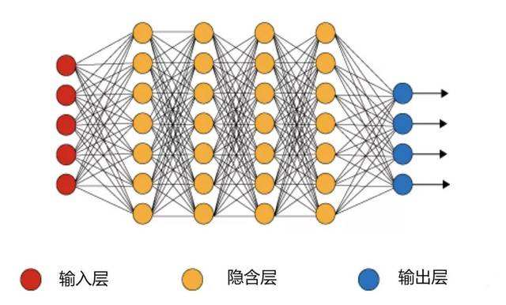

## 深度学习
### 一、深度学习简介
深度学习(DL, Deep Learning)是机器学习(ML, Machine Learning)领域中一个新的研究方向，它被引入机器学习使其更接近于最初的目标——人工智能(AI, Artificial Intelligence)。  
深度学习是学习样本数据的内在规律和表示层次，这些学习过程中获得的信息对诸如文字，图像和声音等数据的解释有很大的帮助。它的最终目标是让机器能够像人一样具有分析学习能力，能够识别文字、图像和声音等数据。 深度学习是一个复杂的机器学习算法，在语音和图像识别方面取得的效果，远远超过先前相关技术。  
深度学习在搜索技术，数据挖掘，机器学习，机器翻译，自然语言处理，多媒体学习，语音，推荐和个性化技术，以及其他相关领域都取得了很多成果。深度学习使机器模仿视听和思考等人类的活动，解决了很多复杂的模式识别难题，使得人工智能相关技术取得了很大进步。

图1.深度神经网络
 

### 二、神经网络
目前神经网络一般有生物神经网络和人工神经网络两种。  
人工神经网络是一种模仿动物神经网络行为特征，进行分布式并行信息处理的算法数学模型。  
生物神经网络一般指生物的大脑神经元，细胞，触点等组成的网络，用于产生生物的意识，帮助生物处理信息。 
人工神经网络按其模型结构大体可以分为前馈型网络（也称为多层感知机网络）和反馈型网络（也称为Hopfield网络）两大类，前者在数学上可以看作是一类大规模的非线性映射系统，后者则是一类大规模的非线性动力学系统。按照学习方式，人工神经网络又可分为有监督学习、非监督和半监督学习三类；按工作方式则可分为确定性和随机性两类；按时间特性还可分为连续型或离散型两类，等等。  
1、卷积神经网络  
卷积神经网络（Convolutional Neural Networks, CNN）是一类包含卷积计算且具有深度结构的前馈神经网络，是深度学习的代表算法之一。卷积神经网络具有表征学习能力，能够按其阶层结构对输入信息进行平移不变分类。  
卷积神经网络仿造生物的视知觉机制构建，可以进行监督学习和非监督学习，其隐含层内的卷积核参数共享和层间连接的稀疏性使得卷积神经网络能够以较小的计算量对格点化特征，例如像素和音频进行学习、有稳定的效果且对数据没有额外的特征工程要求。
2、循环神经网络  
循环神经网络（Recurrent Neural Network, RNN）是一类以序列数据为输入，在序列的演进方向进行递归（recursion）且所有节点（循环单元）按链式连接的递归神经网络。  
循环神经网络具有记忆性、参数共享并且图灵完备（Turing completeness），因此在对序列的非线性特征进行学习时具有一定优势。  
引入了卷积神经网络（Convoutional Neural Network,CNN）构筑的循环神经网络可以处理包含序列输入的计算机视觉问题。  
2.3生成对抗网络  
生成式对抗网络（GAN, Generative Adversarial Networks ）是一种深度学习模型，是近年来复杂分布上无监督学习最具前景的方法之一。模型通过框架中（至少）两个模块：生成模型（Generative Model）和判别模型（Discriminative Model）的互相博弈学习产生相当好的输出。原始 GAN 理论中，并不要求 G 和 D 都是神经网络，只需要是能拟合相应生成和判别的函数即可。但实用中一般均使用深度神经网络作为 G 和 D 。一个优秀的GAN应用需要有良好的训练方法，否则可能由于神经网络模型的自由性而导致输出不理想。在对抗网络中两个神经网络互相竞争。
机器学习的模型可大体分为两类，生成模型和判别模型。判别模型需要输入变量 ，通过某种模型来预测。
### 三、深度学习应用  
TensorFlow  
TensorFlow的编程思想：TensorFlow 使用graph来表示计算任务. 图中的节点被称之为 op (operation 的缩写). 一个 op获得 0 个或多个 Tensor（类型化多维数组） , 执行计算, 产生 0 个或多个 Tensor 。
一个tensorflow的图描述了计算的过程，图必须在session里被启动，session将图的op分发到cpu或gpu之类的设备上，同时提供执行op的方法，被执行后将产生的tensor返回。python语言中，返回的tensor是numpy对象；c/c++语言中，返回的是tensorflow：：Tensor实例。  
在使用tensorflow时要先在官网进行下载。
TensorFlow之逻辑回归  
代码：  
import tensorflow as tf
from tensorflow.examples.tutorials.mnist import input_data
mnist=input_data.read_data_sets("/home/yxcx/tf_data",one_hot=True)
import os
os.environ["CUDA_VISIBLE_DEVICES"]="0"

#Parameters
learning_rate=0.01
training_epochs=25
batch_size=100
display_step=1

#tf Graph Input
x=tf.placeholder(tf.float32,[None,784])
y=tf.placeholder(tf.float32,[None,10])

#Set model weights
W=tf.Variable(tf.zeros([784,10]))
b=tf.Variable(tf.zeros([10]))

#Construct model
pred=tf.nn.softmax(tf.matmul(x,W)+b)

#Minimize error using cross entropy
cost=tf.reduce_mean(-tf.reduce_sum(y*tf.log(pred),reduction_indices=1))

#Gradient Descent
optimizer=tf.train.GradientDescentOptimizer(learning_rate).minimize(cost)

#Initialize the variables
init=tf.global_variables_initializer()

#Start training
with tf.Session() as sess:
    sess.run(init)
    #Training cycle
    for epoch in range(training_epochs):
        avg_cost=0
        total_batch=int(mnist.train.num_examples/batch_size)
        # loop over all batches
        for i in range(total_batch):
            batch_xs,batch_ys=mnist.train.next_batch(batch_size)
            #Fit training using batch data
            _,c=sess.run([optimizer,cost],feed_dict={x:batch_xs,y:batch_ys})

            #Conpute average loss
            avg_cost+= c/total_batch
        if (epoch+1) % display_step==0:
            print("Epoch:",'%04d' % (epoch+1),"Cost:" ,"{:.09f}".format(avg_cost))
    print("Optimization Finished!")
        #Test model
    correct_prediction=tf.equal(tf.argmax(pred,1),tf.argmax(y,1))
        # Calculate accuracy for 3000 examples
    accuracy=tf.reduce_mean(tf.cast(correct_prediction,tf.float32))
    print("Accuracy:",accuracy.eval({x:mnist.test.images[:3000],y:mnist.test.labels[:3000]}))
### 总结
深度学习应用十分广泛，可以说随着人工智能的发展，深度学习越来越重要，经过学习，我初步了解了神经网络的一些用法，对一些基本具体实例有些认识，深度学习可以通过tensorflow来实现一些功能，比如线性回归操作、逻辑回归、K邻近算法等，我在学习的过程中遇到了不少的问题，但是通过询问同学，初步解决了这些问题，另外作为一门热门的学科，深度学习也是计算机技术的前沿技术，极大的开拓了我们的视野。
在后续的学习中要加强学习。