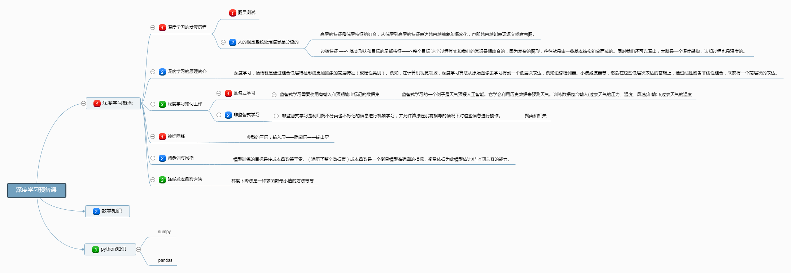
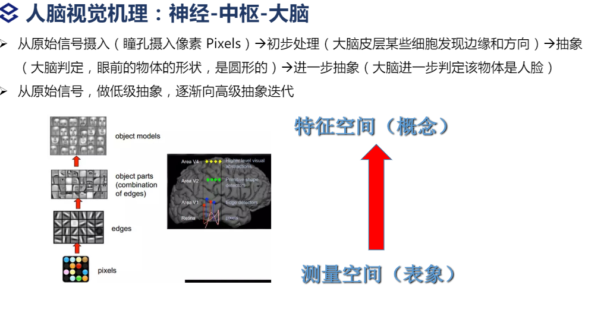
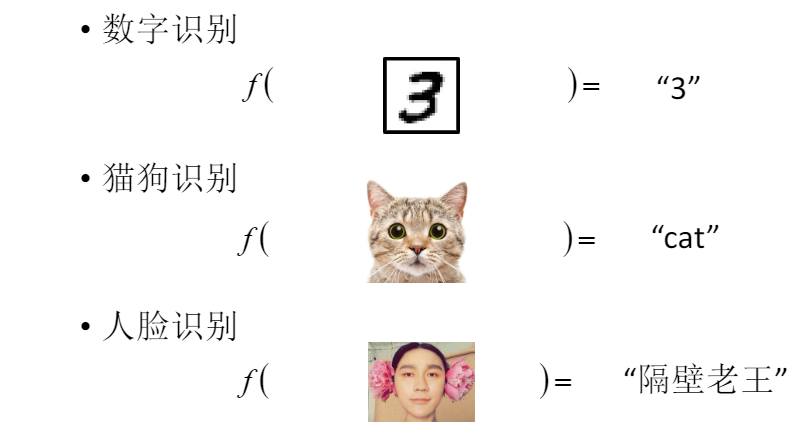
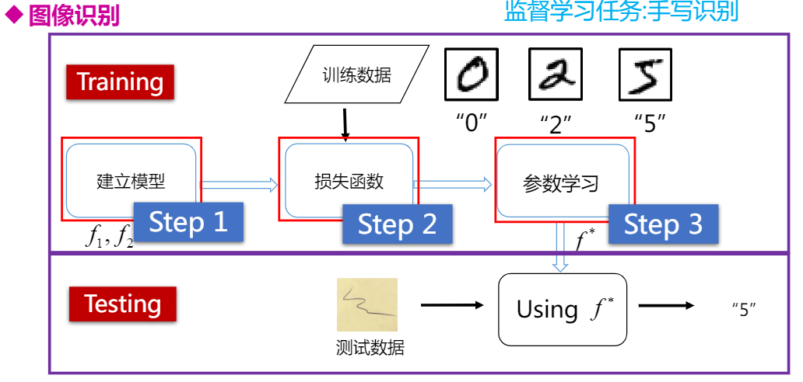
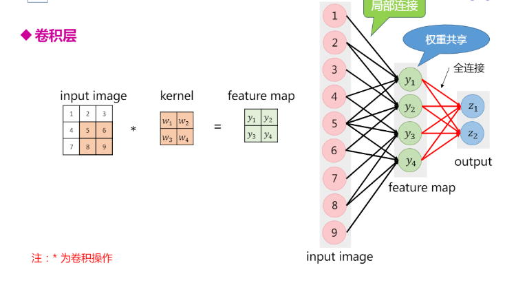
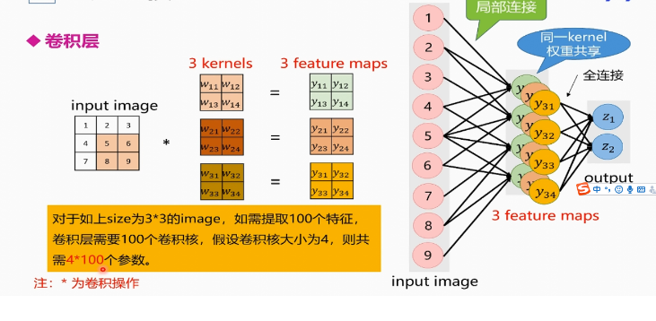
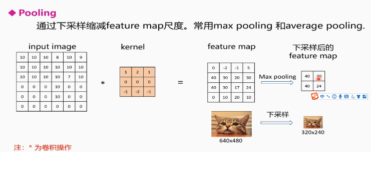
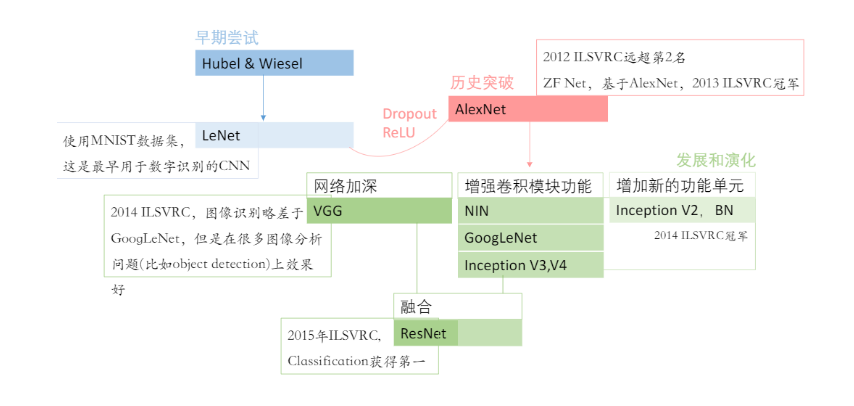
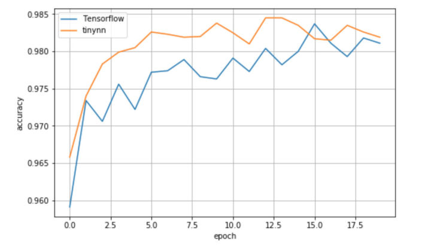

# 深度学习框架实战学习总结1
## 图像识别与人工智能

1、主要介绍图像识别定义和问题

2、传统图像识别方法

3、人工智能发展历程

### 图像识别

1、问题：
语义鸿沟semantic gap。图像的底层视觉特性和高层语义概念之间的鸿沟。相似的视觉特性(color, texture, shape，…) ，不同的语义概念。不相似的视觉特性，相同的语义概念。

2、目标：
人们看到的是图片却看不到后面二维像素 因此将图像用数学矩阵表达的值来替代，更能让人们能够理解

### 传统图像识别方法
1、图像识别基本框架
测量空间————特征空间————类别空间
​

2、传统图像识别技术

1、早期图像识别技术(1990-2003)

流程：

特征提取——————索引技术——————相关反馈——————重排序

具体来讲就是：通过互联网或其他相机设备将采集到的图像存到小型数据库，然后通过计算机相关软件对需要图像处理的图像提取特征，然后进行相似度计算，最后将结果返回。

特征提取方法：

1、全局特征提取：比如颜色、形状、纹理将他们变成特征向量。全局提出忽略了细节。
原图片到向量空间映射再到向量表示。

特征变换：

2、映射为低维空间下的向量表示，常用方法如PCA、MDS、ISOMAP、LLE、Laplacian Eigenmap
空间变换：相似的物体距离近, 不相似的物体距离远

索引技术示例：二进制哈希
相关反馈
Explicit feedback ：反馈正例或者负例
Implicit feedback: 根据可观察的行为推断用户意图

2、中期图像识别技术(2003-2012)

流程：

特征提取——————向量化——————索引技术——————后处理
文本搜索的经典模型：词袋模型（Bag-of-Words ）

特征提取方法：

1、局部特征提取：

特征检测子Feature Detector
检测图像区块中心位置：Harris, DoG,SURF,Harris-Affine

特征描述子Feature Descriptor：
描述区块的视觉内容：SIFT,GLOH,Shape,Context,ORB

### 人工智能发展历程

1、推理期（20世纪50-70年代初） 认为只要给机器赋予逻辑推理能力
2、知识期（20世纪70年代中期） 认为要使机器具有智能，就必须设法使机器拥有知识
3、学科形成（20世纪80年代） 机器学习成为一个独立学科领域
4、繁荣期（20世纪80年代-至今） 20 世纪90 年代后，统计学习方法占主导，代表为SVM 2006 至今，大数据分析的需求，神经网络又被重视，成为深度学习理论的基础.

### 机器学习

1、机器学习模型


2、机器学习一般过程
定义训练数据——————然后通过设计的模型进行训练————————用测试数据进行测试————————最后获得学习结果用来预测

### 深度学习

1、深度学习模型


传统方法与深度学习在特征空间表达方式不同
传统方法：人工特征提取+分类器=设计特征
深度学习：学习特征


### 小结1

传统计算机视觉与深度学习和机器学习在对图像处理中特征空间表达方式不同，深度学习在于学习特征，二传统方法在于设计特征。其中我们需要基本数学知识和python语言知识,熟悉numpy库的操作以及后续需要对各种深度学习算法的了解与复现知识。

# 深度学习框架实战学习总结2
## 深度学习
### 人脑视觉原理

### 使用机器学习（深度学习）的目的：寻找一个合适的函数f(x)


例如：

手写数字识别任务——图像识别

猫狗分类任务——图像分类

都是需要找到合适的函数模型去表征图像。

*整个学习过程中 人确实函数集合 人评价好坏 机器找出最好的函数模型*

监督学习（Supervised Learning）

人————————建立模型 {𝑓(𝑥)=𝑘𝑥|𝑘=1,2,3……}

人————————损失函数 𝑚𝑖𝑛2(𝑦−𝑓(𝑥))

机器——————参数学习 𝑓(𝑥)=2𝑥


### 深度学习步骤
1、建立模型

1）、选择什么样的网络结构

2）、多少层合适 隐藏层越深网络越深

*激活函数：
建立模型需要激活函数，引入激活函数增强网络表达能力，将线性函数->非线性函数 非线性的激活函数需要有连续性。因为连续非线性激活函数可以可导的，所以可以用最优化的方法来求解.*

前馈神经网络

前向传播

2、损失函数

1）、平方差损失函数

2）、交叉熵损失函数

找到一个合适的函数使得损失函数loss越小越好

3、参数学习

1）、梯度下降

2）、反向传播算法

w,b参数找到一组合适的权重和偏置参数使得总损失最小

梯度为负——————增加w

梯度为正——————减小w

𝑤−𝜂𝜕𝐿𝜕𝑤——————𝜂为学习率

局部最优与全局最优


### 全连接神经网络的问题
* 模型结构不灵活
  
对于100100的话比1616的图片手写分类任务使用全连接网络参数
要多好多（增加每层的神经元个数或者增加网络的层数）

* 模型参数太多
  
输入为16 x 16 的图片，输入层为256个神经元，隐藏层每层1000个神经元，输出层10个。假设共5层，则共需要学习（256*103+106+106+104 ）个w再加（1000+1000+1000+10）个b

### 卷积神经网络

1、建立模型

卷积神经网络（CNN）

卷积层

Pooling层

卷积神经网络应用示例

减少网络参数，加快训练速度：

局部连接（roi）、只有第一层是在输入图像上计算，后面是在特征图上计算。

权重共享(神经元权重相同，均为𝑤1,…,𝑤n)、
下采样(对图像像素进行下采样，并不会对物体进行改变虽然下采样之后的图像尺寸变小了，但是并不影响我们对图像中物体的识别)





2、损失函数

分类损失：交叉熵损失函数

回归损失：平方损失函数

3、参数学习

1）、梯度下降

2）、反向传播算法

w,b参数找到一组合适的权重和偏置参数使得总损失最小

梯度为负——————增加w

梯度为正——————减小w

𝑤−𝜂𝜕𝐿𝜕𝑤——————𝜂为学习率

局部最优与全局最优

### 全连接神经网络的问题vs卷积神经网络


*经典CNN


小结2
1、首先是使用何种网络，哪几种网络结合一起，多少层合适并且每一层输入通道 卷积核大小 卷积核个数 输出通道都要会计算

2、其次网络调参方法 学习使用网络调优方法和经验

3、最后要将算法和实际相结合。

# 基于深度学习的MNIST实现
## 组件抽象

首先考虑神经网络运算的流程，神经网络运算主要包含训练 training 和预测 predict （或 inference） 两个阶段，训练的基本流程是：输入数据 -> 网络层前向传播 -> 计算损失 -> 网络层反向传播梯度 -> 更新参数，预测的基本流程是 输入数据 -> 网络层前向传播 -> 输出结果。从运算的角度看，主要可以分为三种类型的计算：

1、数据在网络层之间的流动：前向传播和反向传播可以看做是张量 Tensor（多维数组）在网络层之间的流动（前向传播流动的是输入输出，反向传播流动的是梯度），每个网络层会进行一定的运算，然后将结果输入给下一层。

2、计算损失：衔接前向和反向传播的中间过程，定义了模型的输出与真实值之间的差异，用来后续提供反向传播所需的信息。

3、参数更新：使用计算得到的梯度对网络参数进行更新的一类计算。

基于这个三种类型，我们可以对网络的基本组件做一个抽象

* tensor 张量，这个是神经网络中数据的基本单位
* layers 网络层，负责接收上一层的输入，进行该层的运算，将结果输出给下一层，由于 tensor 的流动有前向和反向两个方向，因此对于每种类型网络层我们都需要同时实现 forward 和 backward 两种运算
* losses 损失，在给定模型预测值与真实值之后，该组件输出损失值以及关于最后一层的梯度（用于梯度回传）
* optimizer 优化器，负责使用梯度更新模型的参数
然后我们还需要一些组件把上面这个 4 种基本组件整合到一起，形成一个 pipeline

* nn 组件负责管理 tensor 在 layers 之间的前向和反向传播，同时能提供获取参数、设置参数、获取梯度的接口
* model 组件负责整合所有组件，形成整个 pipeline。即 nn 组件进行前向传播 -> losses 组件计算损失和梯度 -> nn 组件将梯度反向传播 -> optimizer 组件将梯度更新到参数。
  
基本的框架图如下图


## 组件实现

按照上面的抽象，我们可以写出整个流程代码如下。

```
 # define model
net = Net([layer1, layer2, ...])
model = Model(net, loss_fn, optimizer)
```

```
# training
pred = model.forward(train_X)
loss, grads = model.backward(pred, train_Y)
model.apply_grad(grads)
```

```
# inference
test_pred = model.forward(test_X)
```

首先定义 net，net 的输入是多个网络层，然后将 net、loss、optimizer 一起传给 model。model 实现了 forward、backward 和 apply_grad 三个接口分别对应前向传播、反向传播和参数更新三个功能。接下来我们看这里边各个部分分别如何实现。

* tensor
tensor 张量是神经网络中基本的数据单位，我们这里直接使用 numpy.ndarray 类作为 tensor 类的实现

* layers
上面流程代码中 model 进行 forward 和 backward，其实底层都是网络层在进行实际运算，因此网络层需要有提供 forward 和 backward 接口进行对应的运算。同时还应该将该层的参数和梯度记录下来。先实现一个基类如下

```
# layers.py
class Layer(object):
    def __init__(self, name):
        self.name = name
        self.params, self.grads = None, None

    def forward(self, inputs):
        raise NotImplementedError

    def backward(self, grad):
        raise NotImplementedError
```

最基础的一种网络层是全连接网络层，实现如下。forward 方法接收上层的输入 inputs，实现ωx+b的运算；backward 的方法接收来自上层的梯度，计算关于参数 ω 和 b 输入的梯度，然后返回关于输入的梯度。

```
# layers.py
class Dense(Layer):
    def __init__(self, num_in, num_out,
                 w_init=XavierUniformInit(),
                 b_init=ZerosInit()):
        super().__init__("Linear")

        self.params = {
            "w": w_init([num_in, num_out]),
            "b": b_init([1, num_out])}

        self.inputs = None

    def forward(self, inputs):
        self.inputs = inputs
        return inputs @ self.params["w"] + self.params["b"]

    def backward(self, grad):
        self.grads["w"] = self.inputs.T @ grad
        self.grads["b"] = np.sum(grad, axis=0)
        return grad @ self.params["w"].T
```

同时神经网络中的另一个重要的部分是激活函数。激活函数可以看做是一种网络层，同样需要实现 forward 和 backward 方法。我们通过继承 Layer 类实现激活函数类，这里实现了最常用的 ReLU 激活函数。func 和 derivation_func 方法分别实现对应激活函数的正向计算和梯度计算。

```
# layers.py
class Activation(Layer):
    """Base activation layer"""
    def __init__(self, name):
        super().__init__(name)
        self.inputs = None

    def forward(self, inputs):
        self.inputs = inputs
        return self.func(inputs)

    def backward(self, grad):
        return self.derivative_func(self.inputs) * grad

    def func(self, x):
        raise NotImplementedError

    def derivative_func(self, x):
        raise NotImplementedError


class ReLU(Activation):
    """ReLU activation function"""
    def __init__(self):
        super().__init__("ReLU")

    def func(self, x):
        return np.maximum(x, 0.0)

    def derivative_func(self, x):
        return x > 0.0
```
* nn
  
上文提到 nn 类负责管理 tensor 在 layers 之间的前向和反向传播。forward 方法很简单，按顺序遍历所有层，每层计算的输出作为下一层的输入；backward 则逆序遍历所有层，将每层的梯度作为下一层的输入。这里我们还将每个网络层参数的梯度保存下来返回，后面参数更新需要用到。另外 nn 类还实现了获取参数、设置参数、获取梯度的接口，也是后面参数更新时需要用到

```
# nn.py
class Net(object):
    def __init__(self, layers):
        self.layers = layers

    def forward(self, inputs):
        for layer in self.layers:
            inputs = layer.forward(inputs)
        return inputs

    def backward(self, grad):
        all_grads = []
        for layer in reversed(self.layers):
            grad = layer.backward(grad)
            all_grads.append(layer.grads)
        return all_grads[::-1]

    def get_params_and_grads(self):
        for layer in self.layers:
            yield layer.params, layer.grads

    def get_parameters(self):
        return [layer.params for layer in self.layers]

    def set_parameters(self, params):
        for i, layer in enumerate(self.layers):
            for key in layer.params.keys():
                layer.params[key] = params[i][key]
```
* losses
  
上文我们提到 losses 组件需要做两件事情，给定了预测值和真实值，需要计算损失值和关于预测值的梯度。我们分别实现为 loss 和 grad 两个方法，这里我们实现多分类回归常用的 SoftmaxCrossEntropyLoss 损失。

梯度稍微复杂一点，目标类别和非目标类别的计算公式不同。对于目标类别维度，其梯度为对应维度模型输出概率减一，对于非目标类别维度，其梯度为对应维度输出概率本身。

代码实现如下

```
# losses.py
class BaseLoss(object):
    def loss(self, predicted, actual):
        raise NotImplementedError

    def grad(self, predicted, actual):
        raise NotImplementedError


class CrossEntropyLoss(BaseLoss):
    def loss(self, predicted, actual):
        m = predicted.shape[0]
        exps = np.exp(predicted - np.max(predicted, axis=1, keepdims=True))
        p = exps / np.sum(exps, axis=1, keepdims=True)
        nll = -np.log(np.sum(p * actual, axis=1))
        return np.sum(nll) / m

    def grad(self, predicted, actual):
        m = predicted.shape[0]
        grad = np.copy(predicted)
        grad -= actual
        return grad / m
```
* optimizer
  
optimizer 主要实现一个接口 compute_step，这个方法根据当前的梯度，计算返回实际优化时每个参数改变的步长。我们在这里实现常用的 Adam 优化器。

```
# optimizer.py
class BaseOptimizer(object):
    def __init__(self, lr, weight_decay):
        self.lr = lr
        self.weight_decay = weight_decay

    def compute_step(self, grads, params):
        step = list()
        # flatten all gradients
        flatten_grads = np.concatenate(
            [np.ravel(v) for grad in grads for v in grad.values()])
        # compute step
        flatten_step = self._compute_step(flatten_grads)
        # reshape gradients
        p = 0
        for param in params:
            layer = dict()
            for k, v in param.items():
                block = np.prod(v.shape)
                _step = flatten_step[p:p+block].reshape(v.shape)
                _step -= self.weight_decay * v
                layer[k] = _step
                p += block
            step.append(layer)
        return step

    def _compute_step(self, grad):
        raise NotImplementedError

class Adam(BaseOptimizer):
    def __init__(self, lr=0.001, beta1=0.9, beta2=0.999,
                 eps=1e-8, weight_decay=0.0):
        super().__init__(lr, weight_decay)
        self._b1, self._b2 = beta1, beta2
        self._eps = eps

        self._t = 0
        self._m, self._v = 0, 0

    def _compute_step(self, grad):
        self._t += 1
        self._m = self._b1 * self._m + (1 - self._b1) * grad
        self._v = self._b2 * self._v + (1 - self._b2) * (grad ** 2)
        # bias correction
        _m = self._m / (1 - self._b1 ** self._t)
        _v = self._v / (1 - self._b2 ** self._t)
        return -self.lr * _m / (_v ** 0.5 + self._eps)
```
* model
  
最后 model 类实现了我们一开始设计的三个接口 forward、backward 和 apply_grad ，forward 直接调用 net 的 forward ，backward 中把 net 、loss、optimizer 串起来，先计算损失 loss，然后反向传播得到梯度，然后 optimizer 计算步长，最后由 apply_grad 对参数进行更新

```
# model.py
class Model(object):
    def __init__(self, net, loss, optimizer):
        self.net = net
        self.loss = loss
        self.optimizer = optimizer

    def forward(self, inputs):
        return self.net.forward(inputs)

    def backward(self, preds, targets):
        loss = self.loss.loss(preds, targets)
        grad = self.loss.grad(preds, targets)
        grads = self.net.backward(grad)
        params = self.net.get_parameters()
        step = self.optimizer.compute_step(grads, params)
        return loss, step

    def apply_grad(self, grads):
        for grad, (param, _) in zip(grads, self.net.get_params_and_grads()):
            for k, v in param.items():
                param[k] += grad[k]
```

## 整体结构

最后我们实现出来核心代码部分文件结构如下

```
tinynn
├── core
│   ├── __init__.py
│   ├── evaluator.py
│   ├── initializer.py
│   ├── layers.py
│   ├── losses.py
│   ├── model.py
│   ├── nn.py
│   └── optimizer.py
```
其中 evaluator.py 和 initializer.py 这两个模块由于不是核心的模块，上面没有展开讲，这里简单讲下他们的主要功能。evaluator.py 主要实现了一些常见的评价指标（如均方差、预测准确率等等），initializer.py 主要实现了常见的参数初始化方法（零初始化、Xavier 初始化、He 初始化等），用于给网络层初始化参数。


## MNIST 例子

框架基本搭起来后，我们找一个例子来用 tinynn 这个框架 run 起来。这个例子的基本一些配置如下

* 数据集：MNIST
* 任务类型：多分类
* 网络结构：三层全连接 INPUT(784) -> FC(400) -> FC(100) -> OUTPUT(10)，这个网络接收 (N,784) 的输入，其中 N 是每次输入的样本数，784 是每张 (28,28) 的图像展平后的向量，输出维度为 (N,10) ，其中 N 是样本数，10 是对应图片在 10 个类别上的概率
* 激活函数：ReLU
* 损失函数：SoftmaxCrossEntropy
* optimizer：Adam(lr=1e-3)
* batch_size：128
* Num_epochs：20
  
这里我们忽略数据载入、预处理等一些准备代码，只把核心的网络结构定义和训练的代码贴出来如下

```
# example/mnist/run.py
net = Net([
  Dense(784, 400),
  ReLU(),
  Dense(400, 100),
  ReLU(),
  Dense(100, 10)
])
model = Model(net=net, loss=SoftmaxCrossEntropyLoss(), optimizer=Adam(lr=args.lr))

iterator = BatchIterator(batch_size=args.batch_size)
evaluator = AccEvaluator()
for epoch in range(num_ep):
    for batch in iterator(train_x, train_y):
      	# training
        pred = model.forward(batch.inputs)
        loss, grads = model.backward(pred, batch.targets)
        model.apply_grad(grads)
    # evaluate every epoch
    test_pred = model.forward(test_x)
    test_pred_idx = np.argmax(test_pred, axis=1)
    test_y_idx = np.asarray(test_y)
    res = evaluator.evaluate(test_pred_idx, test_y_idx)
    print(res)
```
运行结果如下

```
# tinynn
Epoch 0 	 {'total_num': 10000, 'hit_num': 9658, 'accuracy': 0.9658}
Epoch 1 	 {'total_num': 10000, 'hit_num': 9740, 'accuracy': 0.974}
Epoch 2 	 {'total_num': 10000, 'hit_num': 9783, 'accuracy': 0.9783}
Epoch 3 	 {'total_num': 10000, 'hit_num': 9799, 'accuracy': 0.9799}
Epoch 4 	 {'total_num': 10000, 'hit_num': 9805, 'accuracy': 0.9805}
Epoch 5 	 {'total_num': 10000, 'hit_num': 9826, 'accuracy': 0.9826}
Epoch 6 	 {'total_num': 10000, 'hit_num': 9823, 'accuracy': 0.9823}
Epoch 7 	 {'total_num': 10000, 'hit_num': 9819, 'accuracy': 0.9819}
Epoch 8 	 {'total_num': 10000, 'hit_num': 9820, 'accuracy': 0.982}
Epoch 9 	 {'total_num': 10000, 'hit_num': 9838, 'accuracy': 0.9838}
Epoch 10 	 {'total_num': 10000, 'hit_num': 9825, 'accuracy': 0.9825}
Epoch 11 	 {'total_num': 10000, 'hit_num': 9810, 'accuracy': 0.981}
Epoch 12 	 {'total_num': 10000, 'hit_num': 9845, 'accuracy': 0.9845}
Epoch 13 	 {'total_num': 10000, 'hit_num': 9845, 'accuracy': 0.9845}
Epoch 14 	 {'total_num': 10000, 'hit_num': 9835, 'accuracy': 0.9835}
Epoch 15 	 {'total_num': 10000, 'hit_num': 9817, 'accuracy': 0.9817}
Epoch 16 	 {'total_num': 10000, 'hit_num': 9815, 'accuracy': 0.9815}
Epoch 17 	 {'total_num': 10000, 'hit_num': 9835, 'accuracy': 0.9835}
Epoch 18 	 {'total_num': 10000, 'hit_num': 9826, 'accuracy': 0.9826}
Epoch 19 	 {'total_num': 10000, 'hit_num': 9819, 'accuracy': 0.9819}
```
可以看到测试集 accuracy 随着训练进行在慢慢提升，这说明数据在框架中确实按照正确的方式进行流动和计算，参数得到正确的更新。为了对比下效果，我用 Tensorflow 1.13 实现了相同的网络结构、采用相同的采数初始化方法、优化器配置等等，得到的结果如下

```
# Tensorflow 1.13.1
Epoch 0 	 {'total_num': 10000, 'hit_num': 9591, 'accuracy': 0.9591}
Epoch 1 	 {'total_num': 10000, 'hit_num': 9734, 'accuracy': 0.9734}
Epoch 2 	 {'total_num': 10000, 'hit_num': 9706, 'accuracy': 0.9706}
Epoch 3 	 {'total_num': 10000, 'hit_num': 9756, 'accuracy': 0.9756}
Epoch 4 	 {'total_num': 10000, 'hit_num': 9722, 'accuracy': 0.9722}
Epoch 5 	 {'total_num': 10000, 'hit_num': 9772, 'accuracy': 0.9772}
Epoch 6 	 {'total_num': 10000, 'hit_num': 9774, 'accuracy': 0.9774}
Epoch 7 	 {'total_num': 10000, 'hit_num': 9789, 'accuracy': 0.9789}
Epoch 8 	 {'total_num': 10000, 'hit_num': 9766, 'accuracy': 0.9766}
Epoch 9 	 {'total_num': 10000, 'hit_num': 9763, 'accuracy': 0.9763}
Epoch 10 	 {'total_num': 10000, 'hit_num': 9791, 'accuracy': 0.9791}
Epoch 11 	 {'total_num': 10000, 'hit_num': 9773, 'accuracy': 0.9773}
Epoch 12 	 {'total_num': 10000, 'hit_num': 9804, 'accuracy': 0.9804}
Epoch 13 	 {'total_num': 10000, 'hit_num': 9782, 'accuracy': 0.9782}
Epoch 14 	 {'total_num': 10000, 'hit_num': 9800, 'accuracy': 0.98}
Epoch 15 	 {'total_num': 10000, 'hit_num': 9837, 'accuracy': 0.9837}
Epoch 16 	 {'total_num': 10000, 'hit_num': 9811, 'accuracy': 0.9811}
Epoch 17 	 {'total_num': 10000, 'hit_num': 9793, 'accuracy': 0.9793}
Epoch 18 	 {'total_num': 10000, 'hit_num': 9818, 'accuracy': 0.9818}
Epoch 19 	 {'total_num': 10000, 'hit_num': 9811, 'accuracy': 0.9811}
```

可以看到两者效果上大差不差，测试集准确率都收敛到 0.982 左右，就单次的实验看比 Tensorflow 稍微好一点点。
# 结语
在设计和实现 tinynn 的过程中个人确实学习到了很多东西，包括如何抽象、如何设计组件接口、如何更效率的实现、算法的具体细节等等。