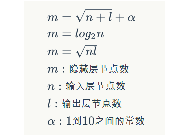
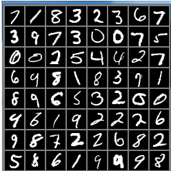

201702075 余敏学
# 深度学习之手写数字识别
具体的过程是：先使用已经提供的训练数据对搭建好的神经网络模型进行训练并完成参数优化，然后使用优化好的模型对测试数据进行预测，对比预测值和真实值之间的损失值，同时计算出结果预测的准确率。
## MNIST数据集
MNIST数据集是机器学习领域中非常经典的一个数据集，由60000个训练样本和10000个测试样本组成，每个样本都是一张28 * 28像素的灰度手写数字图片。
一共4个文件，训练集、训练集标签、测试集、测试集标签。
| 文件名称  | 大小  | 内容 |
| :------------ |:---------------:| -----:|
| train-images-idx3-ubyte.gz | 9,681 kb | 55000张训练集，5000张验证集 |
| train-labels-idx1-ubyte.gz | 29kb | 训练集图片对应的标签   |
| t10k-images-idx3-ubyte.gz | 161kb| 10000张测试集 |
| t10k-labels-idx1-ubyte.gz |  5kb|  测试集图片对应的标签 |
## 手写数字识别
手写数字识别是一个比较简单的任务，数字只可能是0-9中的一个，这是个10分类的问题。MNIST手写数字识别项目因为数据量小，识别任务简单而成为图像识别入门的第一课，MNIST手写数字识别项目有如下特点：
（1） 识别难度低，即使把图片展开为一维数据，且只使用全连接层也能获得超过98%的识别准确度。
（2）计算量小，不需要GPU加速也可以快速训练完成。
（3）数据容易得到，教程容易得到。
### 超参数的确定
首先需要确定网络的层数和每层的节点数。输入层节点数是确定的。因为MNIST数据集每个训练数据是28*28的图片，共784个像素，因此，输入层节点数应该是784，每个像素对应一个输入节点。输出层节点数也是确定的。因为是10分类，可以用10个节点，每个节点对应一个分类。输出层10个节点中，输出最大值的那个节点对应的分类，就是模型的预测结果。隐藏层节点数量是不好确定的，从1到100万都可以。以下是几个经验公式：

可以先根据上面的公式设置一个隐藏层节点数。也可以设置不同的节点数，分别训练，看看哪个效果最好就用哪个。我设的隐藏层节点数为300。对于3层784*300*10的全连接网络，总共有300*（784+1）+10*（300+1）=238510个参数！神经网络之所以强大，是它提供了一种非常简单的方法去实现大量的参数。目前百亿参数、千亿样本的超大规模神经网络也是有的。因为MNIST只有6万个训练样本，参数太多了很容易过拟合，效果反而不好。
### 模型的训练与评估
　MNIST数据集包含10000个测试样本。先用60000个训练样本训练网络，然后再用测试样本对网络进行测试，计算识别错误率：

　　每训练10轮，评估一次准确率。当准确率开始下降时（出现了过拟合）终止训练。
#### 导入相关包
```
import torch
# torchvision包的主要功能是实现数据的处理，导入和预览等
import torchvision
from torchvision import datasets
from torchvision import transforms
from torch.autograd import Variable
```
手写数字识别问题的解决只用到了torchvision中的部分功能，所以这里通过 from torchvision import方法导入其中的两个子包 datasets和transforms。
#### 获取手写数字的训练集和测试集
获取手写数字的训练集和测试集。使用torchvision.datasets可以轻易实现对这些数据集的训练集和测试集的下载，只需要使用 torchvision.datasets再加上需要下载的数据集的名称就可以了，手写数字数据集的名称是MNIST，那么实现下载的代码就是torchvision.datasets.MNIST。其他常用的数据集如COCO、ImageNet、CIFCAR等都可以通过这个方法快速下载和载入。实现数据集下载的代码如下：
```
# 首先获取手写数字的训练集和测试集
# root 用于指定数据集在下载之后的存放路径
# transform 用于指定导入数据集需要对数据进行那种变化操作
# train是指定在数据集下载完成后需要载入那部分数据，
# 如果设置为True 则说明载入的是该数据集的训练集部分
# 如果设置为FALSE 则说明载入的是该数据集的测试集部分
data_train = datasets.MNIST(root="./data/",
                           transform = transform,
                            train = True,
                            download = True)
 
data_test = datasets.MNIST(root="./data/",
                           transform = transform,
                            train = False)
```
其中，root用于指定数据集在下载之后的存放路径，这里存放在根目录下的data文件夹中;transform用于指定导入数据集时需要对数据进行哪种变换操作.
#### 数据预览和数据载装
在数据下载完成后并且载入后，我们还需要对数据进行装载。我们可以将数据的载入理解为对图片的处理，在处理完成后，我们就需要将这些图片打包好送给我们的模型进行训练了，而装载就是这个打包的过程。在装载时通过batch_size的值来确认每个包的大小，通过shuffle的值来确认是否在装载的过程中打乱图片的顺序。装载的代码如下：
```
data_loader_train = torch.utils.data.DataLoader(dataset =data_train,
                                                batch_size = 64,
                                                shuffle = True)
data_loader_test = torch.utils.data.DataLoader(dataset =data_test,
                                                batch_size = 64,
                                                shuffle = True)
```
在装载完成后，选取其中一个批次的数据进行预览，进行数据预览的代码如下：
```
images,labels=next(iter(data_loader_train))
img = torchvision.utils.make_grid(images)
 
img = img.numpy().transpose(1,2,0)
std = [0.5,0.5,0.5]
mean = [0.5,0.5,0.5]
img = img*std +mean
print(labels)
cv2.imshow('win',img)
key_pressed=cv2.waitKey(0)
```
　在完成数据预览的代码中，先打印输出了这个批次中的数据的全部标签，然后才对这个批次中的所有图片数据进行显示，代码如下:
```
tensor([7, 1, 8, 3, 2, 3, 6, 7, 3, 9, 7, 3, 0, 0, 7, 5, 0, 0, 2, 5, 4, 4, 2, 7,
        6, 9, 8, 1, 8, 3, 7, 1, 8, 9, 6, 5, 3, 2, 0, 0, 4, 6, 1, 9, 2, 2, 2, 6,
        9, 8, 7, 2, 2, 6, 8, 2, 5, 8, 6, 1, 9, 9, 9, 8])
```
效果如下，可以看到输出的首先是64张图片对应的标签，然后是64张图片的预览结果:

#### 模型搭建和参数优化
在顺利完成数据装载后，就可以开始编写卷积神经网络模型的搭建和参数优化的代码了，搭建一个包含了卷积层，激活函数，池化层，全连接层的卷积神经网络来解决这个问题，所以模型在结构上会和之前简单的神经网络有所区别，当然，各个部分的功能实现依然是通过torch.nn中的类来完成的，比如卷积层使用torch.nn.Conv2d类方法来搭建，激活层使用torch.nn.ReLU类来搭建；池化层使用torch.nn.MaxPool2d类方法来搭建；全连接层使用torch.nn.Linear类方法来搭建。
```
卷积神经网络CNN的结构一般包含这几层：
 
    输入层：用于数据的输入
 
    卷积层：使用卷积核进行特征提取和特征映射
 
    激励层：由于卷积也是一种线性运算，因此需要增加非线性映射
 
    池化层：进行下采样，对特征图稀疏处理，减少特征信息的损失
 
    输出层：用于输出结果
```
　实现卷积神经网络模型搭建的代码如下：
```
class Model(torch.nn.Module):
    def __init__(self):
        super(Model,self).__init__()
        self.conv1 = torch.nn.Sequential(
            torch.nn.Conv2d(1,64,kernel_size=3,stride=1,padding=1),
            torch.nn.ReLU(),
            torch.nn.Conv2d(64,128,kernel_size=3,stride=1,padding=1),
            torch.nn.ReLU(),
            torch.nn.MaxPool2d(stride=2,kernel_size=2))
 
        self.dense = torch.nn.Sequential(
            torch.nn.Linear(14*14*128,1024),
            torch.nn.ReLU(),
            torch.nn.Dropout(p = 0.5),
            torch.nn.Linear(1024,10)
        )
 
    def forward(self, x):
        x = self.conv1(x)
        x = x.view(-1,14*14*128)
        x = self.dense(x)
        return x
```
搭建一个在结构层次上有所简化的卷积神经网络模型，在结构上使用了两个卷积层：一个最大池化层和两个全连接层。
最后说一下代码中前向传播forward函数中的内容，首先经过self.conv1进行卷积处理，然后进行x.view(-1,14*14*128)，对参数实现扁平化，因为之后紧接着的就是全连接层，所以如果不进行扁平化，则全连接层的实际输出的参数维度和其定义输入的维度将不匹配，程序将会报错，最后通过self.dense定义的全连接层进行最后的分类。
卷积神经网络模型进行模型训练和参数优化的代码如下：
```
n_epochs = 5
 
for epoch in range(n_epochs):
    running_loss = 0.0
    running_corrrect = 0
    print("Epoch  {}/{}".format(epoch, n_epochs))
    print("-"*10)
    for data in data_loader_train:
        X_train , y_train = data
        X_train,y_train = Variable(X_train),Variable(y_train)
        outputs = model(X_train)
        _,pred = torch.max(outputs.data,1)
        optimizer.zero_grad()
        loss = cost(outputs,y_train)
 
        loss.backward()
        optimizer.step()
        running_loss += loss.data[0]
        running_corrrect += torch.sum(pred == y_train.data)
    testing_correct = 0
    for data in data_loader_train:
        X_test,y_test = data
        X_test,y_test = Variable(X_test),Variable(y_test)
        outputs = model(X_test)
        _,pred = torch.max(X_test)
        testing_correct += torch.sum(pred == y_test.data)
 
    print("Loss is {:.4f}, Train Accuracy is:{:.4f}%,Test Accuracy is:{:.4f}"
          .format(running_loss/len(data_train),100*running_corrrect/len(data_train),
                  100*testing_correct/len(data_test)))
```
总的训练次数为5次，训练中的大部分代码和之前的相比较没有大的改动，增加的内容都在原来的基础上加入了更多的打印输出，其目的是更好的显示模型训练过程中的细节，同时，在每轮训练完成后，会使用测试集验证模型的泛化能力并计算准确率。
## 总结
由于是上网课在家的原因，不能和在学校一样，遇到代码错误只能自己百度解决，所以尝试了很多其他方案都没有成功，所以最后才决定做上学期学过的手写数字识别，毕竟上个学期学过，所以再做一次时比较会比较简单，这次利用深度学习的框架，对手写数字识别又有了更深层次的理解，也算是一次进步和收获吧。